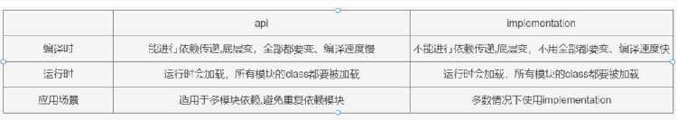
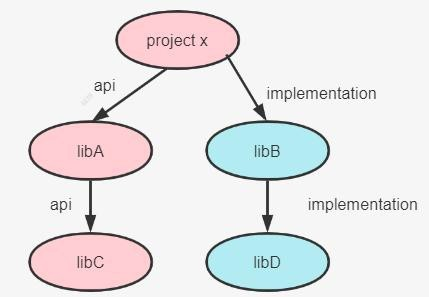
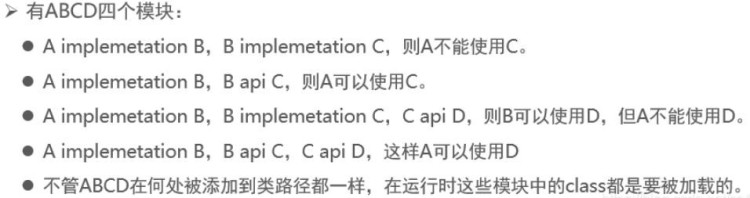

# 依赖的方式

## 本地依赖

依赖本地的某个jar包，具体可以通过 文件集合、文件树的方式指定

## 项目依赖

项目依赖，依赖某个project

## 直接依赖

依赖的类型 依赖的组名 依赖的名称 依赖的版本号

```groovy
dependencies {
//本地依赖，使用文件集合或者文件树的方式实现依赖
//    implementation files("./lib/commons-lang-2.6.jar")
//    implementation fileTree(dir: './lib',includes: ['*.jar'])
//项目依赖
//    implementation project(":projectname")
//直接依赖，就是在maven仓库找到依赖的作保直接放入即可
// https://mvnrepository.com/artifact/com.google.code.gson/gson
    implementation group: 'com.google.code.gson', name: 'gson', version: '2.10'

}
```
## 依赖的类型
|类型|含义|
|-------------|--|
| compileOnly | 由java插件提供，曾短暂的叫provider,后续的版本已经改成了compileOnly,适用于编译期需要而不需要打包的情况 |
|runtimeOnly|由java插件提供，只在运行期有限，编译时不需要，比如mysql驱动包，取代了老版本中被移除的runtime|
|implemention|由java插件提供，针对源码["src/main"]目录下的代码，在编译，运行时都有效，取代老版本中被移除的compile|
|testCompileOnly|由java插件提供，用于编译测试的依赖向，运行时不需要|
|testRuntimeOnly|由java插件提供，只在测试运行时需要，而不是在测试编译时需要，取代老版本中被移除的testRuntime|
|testImplementation|由java插件提供，针对测试代码src/test目录，取代老版本的testCompile|
|providedCompile|war插件提供支持，编译，测试阶段代码需要依赖此类jar包，而运行阶段容器已经提供了相应的支持，所以无需要将这些文件打入到war包中了；例如serlet-api,jsp-api.jar|
|compile|编译范围依赖所有的classpath中可用，同事他们也会被打包。在gradle7.0已经移除|
|runtime|runtime依赖在运行和测试系统的时候需要，在编译的时候不需要，比如mysql驱动包，在gradle7.0已经移除|
|api|java-liberary插件提供支持，这些依赖项可以传递性的导出给使用者，用于编译时和运行时。取代了拉版本中被移除的compile|
|compileOnlyApi|java-library插件提供支持，在声明模块和使用者在编译时需要的依赖项，但是在运行时不需要|

升级和移除https://docs.gradle.org/current/userguide/java_library_plugin.html#java_library_plugin：API 
和implemention 区别https://docs.gradle.org/current/userguide/java_plugin.html#java_plugin: 执行java 命令时都
使用了哪些依赖范围的依赖。提示 1：java 插件提供的功能，java-library 插件都提供。



* api和implementation区别



```text
编译时:如果 libC 的内容发生变化,由于使用的是 api 依赖,依赖会传递,所以 libC、libA、projectX 都要发生变化,都需要重新编译,速度慢,运行时：libC、libA、projectX 中的class 都要被加载。
编译时:如果libD 的内容发生变化,由于使用的是implemetation 依赖,依赖不会传递,只有libD、libB 要变化并重新编译,速度快,运行时：libC、libA、projectX 中的class 都要被加载。

```

拓展 3:api 和implementation 案例分析



```text
api 的适用场景是多module 依赖，moduleA 工程依赖了 module B，同时module B 又需要依赖了 module C，modelA 工程也需要去依赖 module C,这个时候避免重复依赖module,可以使用 module B api  依赖的方式去依赖module C,modelA 工程只需要依赖 moduleB 即可。
总之，除非涉及到多模块依赖，为了避免重复依赖，咱们会使用api,其它情况我们优先选择implementation，拥有大量的api 依赖项会显著增加构建时间。

```

* gradle依赖冲突及解决方案


A、B、C 都是本地子项目 module，log4j 是远程依赖。
编译时： B 用 1.4.2 版本的  log4j，C 用 2.2.4 版本的  log4j,B 和 C 之间没有冲突
打包时： 只能有一个版本的代码最终打包进最终的A对应的jar |war包，对于  Gradle 来说这里就有冲突了

示例：
```groovy
dependencies {
// gradle默认的会使用最新的版本的
//    implementation 'org.hibernate:hibernate-core:3.6.3.Final'
//    implementation 'org.slf4j:slf4j-api:1.4.0'
//强制使用这个版本的
//    implementation 'org.slf4j:slf4j-api:1.4.0!!'
// 使用闭包的方式排除不需要的版本
implementation("org.hibernate:hibernate-core:3.6.3.Final"){
//    排除某一个库(slf4j)依赖:如下三种写法都行
//    exclude(group:'org.slf4j')
//    exclude(module:'slf4j-api')
    exclude group: 'org.slf4j',module: 'slf4j-api'
}
    implementation 'org.slf4j:slf4j-api:1.4.0'
}


dependencies {
    testImplementation 'org.junit.jupiter:junit-jupiter-api:5.8.1' testRuntimeOnly 'org.junit.jupiter:junit-jupiter-engine:5.8.1' implementation('org.hibernate:hibernate-core:3.6.3.Final'){
//不允许依赖传递，一般不用
        transitive(false)
    }
//排除之后,使用手动的引入即可implementation 'org.slf4j:slf4j-api:1.4.0'
}
在添加依赖项时,如果设置 transitive 为false,表示关闭依赖传递。即内部的所有依赖将不会添加到编译和运行时的类路径。
● 强制使用某个版本
dependencies {
    testImplementation 'org.junit.jupiter:junit-jupiter-api:5.8.1' testRuntimeOnly 'org.junit.jupiter:junit-jupiter-engine:5.8.1' implementation('org.hibernate:hibernate-core:3.6.3.Final')
//强制使用某个版本!!【官方建议使用这种方式】
    implementation('org.slf4j:slf4j-api:1.4.0!!')
//这种效果和上面那种一样,强制指定某个版本implementation('org.slf4j:slf4j-api:1.4.0'){
    version{
        strictly("1.4.0")
    }
}
```

* 检测项目冲突的包
```groovy
configurations.all() {
        Configuration configuration ->
//当遇到版本冲突时直接构建失败
 configuration.resolutionStrategy.failOnVersionConflict()
}
```


