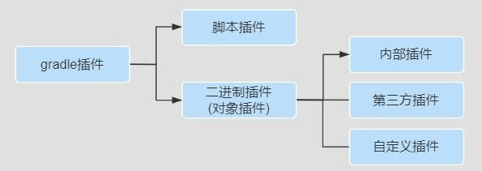
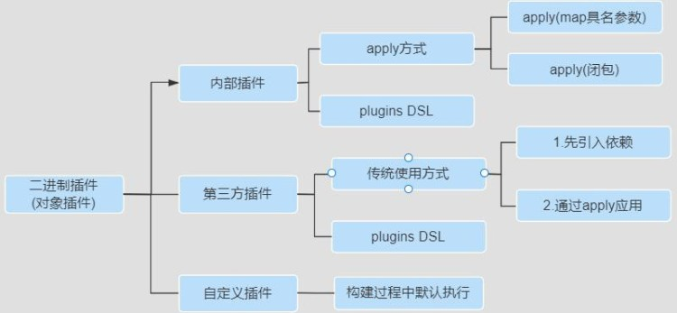

# Gradle插件

* 使用插件的原因
简单的说,通过应用插件我们可以:
1. 促进代码重用、减少功能类似代码编写、提升工作效率
2. 促进项目更高程度的模块化、自动化、便捷化
3. 可插拔式的的扩展项目的功能

* 插件的作用
  在项目构建过程中做很多事情，把插件应用到项目中，通常可以完成:
  1、可以添加任务【task】到项目中，从而帮助完成测试、编译、打包等。
  2、可以添加依赖配置到项目中。
  3、可以向项目中拓展新的扩展属性、方法等。
  4、可以对项目进行一些约定，如应用 Java 插件后，约定src/main/java 目录是我们的源代码存在位置，编译时编译这个目录下的Java 源代码文件。


## 插件的分类和使用



* 脚本插件
  脚本插件的本质就是一个脚本文件，使用脚本插件时通过apply from:将脚本加载进来就可以了，后面的脚本文件可以是本地的也可以是网络上的脚本文件， 
  下面定义一段脚本，我们在 build.gradle 文件中使用它，具体如下：

例子:
```groovy
//config.gradle文件内容如下:
ext{
  company= "尚硅谷"
  cfgs = [
          compileSdkVersion : JavaVersion.VERSION_1_8
  ]
  spring = [
          version : '5.0.0'
  ]
}

//build.gradle引入
apply from:"config.gradle"
//在build.gradle引入之后就相当于在本文将的内容一样可以正常的使用
task taskVersion(){
  doLast {
    println "公司名称为：${company},JDK版本是${cfgs.compileSdkVersion},版本号是${spring.version}"
  }
}

//执行的结果：公司名称为：尚硅谷,JDK版本是1.8,版本号是5.0.0
```


## 对象插件之内部插件[核心插件]
二进制拆建[对象插件]就是实现了org.gradle.api.Plugin接口的插件，每个Java Gradle插件都是由一个plugin id



可通过如下方式使用一个 Java 插件： apply plugin : 'java' //map具名参数方式或者：

//也可以使用闭包作为project.apply方法的一个参数
apply{
plugin 'java'
}
通过上述代码就将 Java  插件应用到我们的项目中了，对于 Gradle 自带的核心插件都有唯一的 plugin id，其中 java  是Java 插件的 plugin id,这个 plugin id 必须是唯一的，可使用应用包名来保证 plugin id 的唯一性。这里的 java  对应的具体类型是 org.gradle.api.plugins.JavaPlugin，所以可以使用如下方式使用 Java 插件：
//使用方式1：Map具名参数,全类名
apply plugin:org.gradle.api.plugins.JavaPlugin
//org.gradle.api.plugins默认导入：使用方式2 apply plugin:JavaPlugin
apply plugin: 'java' //核心插件，无需事先引入，使用方式3:插件的id
Gradle 中提供的二进制插件【核心插件】,可参考: https://docs.gradle.org/current/userguide/plugin_reference.html


通过上述代码就将 Java  插件应用到我们的项目中了，对于 Gradle 自带的核心插件都有唯一的 plugin id，其中 java  是Java 插件的 plugin id,这个 plugin id 必须是唯一的，可使用应用包名来保证 plugin id 的唯一性。这里的 java  对应的具体类型是 org.gradle.api.plugins.JavaPlugin，所以可以使用如下方式使用 Java 插件：
//使用方式1：Map具名参数,全类名
apply plugin:org.gradle.api.plugins.JavaPlugin
//org.gradle.api.plugins默认导入：使用方式2 apply plugin:JavaPlugin
apply plugin: 'java' //核心插件，无需事先引入，使用方式3:插件的id
Gradle 中提供的二进制插件【核心插件】,可参考: https://docs.gradle.org/current/userguide/plugin_reference.html

* 第二种：对象插件之第三方插件
如果是使用第三方发布的二进制插件，一般需要配置对应的仓库和类路径,
  如果是使用第三方发布的二进制插件，一般需要配置对应的仓库和类路径,
  //使用传统的应用方式buildscript {
  ext {
  springBootVersion = "2.3.3.RELEASE"
  }
  repositories {
  mavenLocal()
  maven { url 'http://maven.aliyun.com/nexus/content/groups/public' }
  jcenter()
  }
  // 此处先引入插件
  dependencies {
  classpath("org.springframework.boot:spring-boot-gradle-plugin:${springBootVersion}")
  }
  }
  //再应用插件
  apply plugin: 'org.springframework.boot' //社区插件,需要事先引入，不必写版本号
  但是如果是第三方插件已经被托管在 https://plugins.gradle.org/ 网站上，就可以不用在 buildscript 里配置 classpath
  依赖了，直接使用新出的 plugins DSL 的方式引用，案例如下： 使 用 plugins DSL 方 式
  plugins {
  id 'org.springframework.boot' version '2.4.1'
  }
  注意：
1. 如果使用老式插件方式buildscript{}要放在build.gradle 文件的最前面,而新式plugins{}没有该限制。
2. 托管在网站gradle 插件官网的第三方插件有两种使用方式，一是传统的buildscript 方式，一种是 plugins DSL 方式 。

示例:
```groovy
interface GreetingPluginExtension {
    Property<String> getMessage()
    Property<String> getGreeter()
}

class GreetingPlugin implements Plugin<Project> {
    void apply(Project project) {
        def extension = project.extensions.create('greeting', GreetingPluginExtension)
        project.task('hello2') {
            doLast {
                println "${extension.message.get()} from ${extension.greeter.get()}"
            }
        }
    }
}

apply plugin: GreetingPlugin

// Configure the extension using a DSL block
greeting {
message = 'Hi'
greeter = 'Gradle'
}

```

参考地址：https://docs.gradle.org/current/userguide/custom_plugins.html
我们直接执行 hello 任务./gradle hello 即可,这种方式实现的插件我们一般不使用，因为这种方式局限性太强，只能本
Project，而其他的Project 不能使用。

### buildSrc 项目


