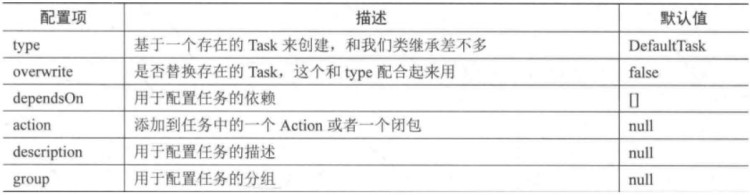

## 创建任务的方式
使用task方法创建
```groovy
task('A',{//任务名称,闭包都作为参数
 println "taskA..."
})
task('B'){//闭包作为最后一个参数可以直接从括号中拿出来
 println "taskB..."
}
task C{//groovy语法支持省略方法括号:上面三种本质是一种
 println "taskC..."
}
def map=new HashMap<String,Object>(); map.put("action",{println "taskD.."}) //action属性可以设置为闭包task(map,"D");
task(map,"D")
//是通过tasks 对象的 create创建任务
tasks.create("E"){
    println "taskE"
}
//注：register执行的是延迟创建。也即只有当task被需要使用的时候才会被创建。
tasks.register("F"){
    println "taskF"
}
```
### 创建任务的同时指定任务的属性



* 示例:
```groovy
task("dp1"){
    doFirst {
        println "dp1"
    }
}
task("dp2"){
    doLast {
        println "dp2"
    }
}
//创建任务的时候指定属性
task dp3(group:"g1",dependsOn:["dp1","dp2"] ,action: { println "doAction"})
```

* 任务类型

| 常见任务类型                   | 该类型任务的作用                   |
|--------------------------|----------------------------|
| Delete                   | 删除文件或者目录                   |
| Copy                     | 将文件赋值到目标目录中 。此任务还可以在赋值时重命名 |
| CreateStartScripts       |创建启动脚本|
| Exec                     |执行命令行进程|
| GenerateMavenPom         |生成 Maven 模块描述符(POM)文件。|
| GradleBuild              |执行 Gradle 构建|
| Jar                      |组装 JAR 归档文件|
| JavaCompile              |编译 Java 源文件|
| Javadoc                  |为 Java 类 生 成 HTML API 文 档|
| PublishToMavenRepository |将 MavenPublication  发布到 mavenartifactrepostal。|
| Tar                      |组装 TAR 存档文件|
| Test                     |执行 JUnit (3.8.x、4.x 或 5.x)或 TestNG 测试。|
| Upload                   |将 Configuration 的构件上传到一组存储库。|
| War                      |组装 WAR 档案。|
| Zip                      |组装 ZIP 归档文件。默认是压缩 ZIP 的内容。|

提示 1：如果想看更详细的gradle 自带Task 类型，请参考官方文档: https://docs.gradle.org/current/dsl/index.html

* 示例:
```groovy
task taskType(type:Delete,group: "myDelete"){
    delete buildDir
}
```


### 动态分配任务
gradle强大功能不仅仅定义任务的功能。
示例：
```groovy
4.times{it->
    tasks.register("task$it"){
        doLast{
            println "I'm task number $it"
        }
    }
}

//构建 4 个任务,但是任务 0 必须依赖于任务 2 和 3,那么代表任务 2 和 3 需要在任务 0 之前优先加载。具体测试如
tasks.named("task0"){dependsOn('task2','task3')}
```

执行结果:
```groovy
Evaluating project ':sub_module3' using build file 'E:\book\gradle_project\multi_module\sub_module3\build.gradle'.
All projects evaluated.
Selected primary task 'task0' from project :
Tasks to be executed: [task ':task2', task ':task3', task ':task0']
Tasks that were excluded: []
:task2 (Thread[Daemon worker Thread 2,5,main]) started.

> Task :task2
Caching disabled for task ':task2' because:
  Build cache is disabled
Task ':task2' is not up-to-date because:
  Task has not declared any outputs despite executing actions.
I'm task number task ':task2'
:task2 (Thread[Daemon worker Thread 2,5,main]) completed. Took 0.004 secs.
:task3 (Thread[Daemon worker Thread 2,5,main]) started.

> Task :task3
Caching disabled for task ':task3' because:
  Build cache is disabled
Task ':task3' is not up-to-date because:
  Task has not declared any outputs despite executing actions.
I'm task number task ':task3'
:task3 (Thread[Daemon worker Thread 2,5,main]) completed. Took 0.0 secs.
:task0 (Thread[Daemon worker Thread 2,5,main]) started.

> Task :task0
Caching disabled for task ':task0' because:
  Build cache is disabled
Task ':task0' is not up-to-date because:
  Task has not declared any outputs despite executing actions.
I'm task number task ':task0'
:task0 (Thread[Daemon worker Thread 2,5,main]) completed. Took 0.001 secs.

```

* 停止任务
```groovy
task tk1(){
    enabled false
    doFirst {
        println "tk1 doFirst"
    }
}
或者
tk1.enabled=false
```


* 任务超时
```groovy
task a() {
    doLast {
        Thread.sleep(1000)
        println "当前任务a执行了"
    }
    timeout = Duration.ofMillis(500)
}
task b() {
    doLast {
        println "当前任务b执行了"
    }
}
//在控制台使用: gradle a b 测试会发现执行a 的时候,由于a 执行超时，抛出异常，所以没有继续往下执行【b 也没执行】。
//然后在控制台使用: gradle a b –continue,测试会发现a 虽然执行失败，但是 b 还是执行了。


```

* 查找任务
```groovy
task itdom(){
    doFirst {
        println "学习使人进步"
    }
}

tasks.findByName("itdom").doFirst({println "尚硅谷校区1：北京	"})
tasks.getByName("itdom").doFirst({println "尚硅谷校区2：深圳	"})
//根据任务路径查找【相对路径】
tasks.findByPath(":itdom").doFirst({println "尚硅谷校区3：上海		"})
tasks.getByPath(":itdom").doFirst({println "尚硅谷校区4：武汉	"})
```

执行结果:
```groovy
> Task :itdom
尚硅谷校区4：武汉
尚硅谷校区3：上海
尚硅谷校区2：深圳
尚硅谷校区1：北京
学习使人进步
```


