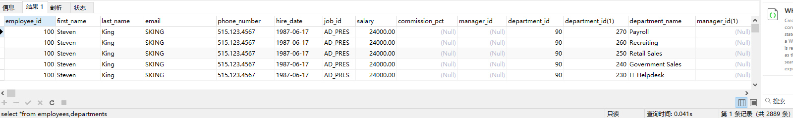
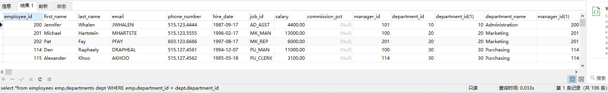
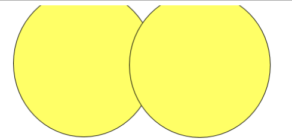
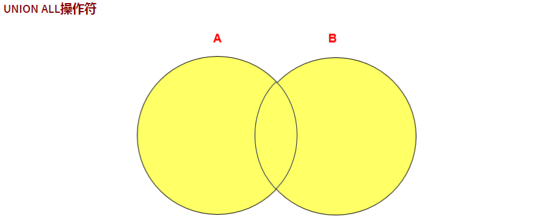
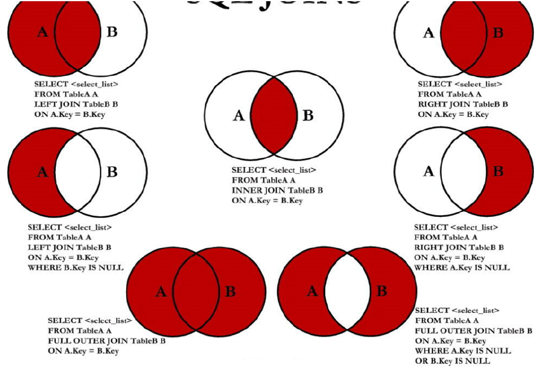

[上一章](./README.MD)

# 多表查询
```text
多表查询，也称为关联查询，值两个或者更多各表一起完成查询操作。前提条件:这些一起拆线呢的表之间是右关系的(一对一，一对多)，
它们之间一定是右关联字段，这个关联字段，可能简历了外键，也可能没有简历外键。比如:员工表和部门表，这两个表依靠"部门编号"
进行关联。
```
* 注意
```text
如果在关联查询的过程中没有写关联条件，那么就会出现查询笛卡尔积的错误，就是将所有可能的关联都查询出来，这不是我们想要的结果。
```
例子:
```sql
select *from employees,departments
```


* 连接查询添加连接条件之后
```sql
SELECT *FROM employees emp,departments dept WHERE emp.department_id = dept.department_id;
```


## 连接分类

### 等值连接和非等值连接
* 等值连接
```sql
SELECT *FROM employees emp,departments dept WHERE emp.department_id = dept.department_id
```
* 非等值连接
```sql
-- 统计每个员工的薪资的级别
SELECT e.employee_id,e.last_name,jg.grade_level FROM employees e, job_grades jg WHERE e.salary BETWEEN jg.lowest_sal AND jg.highest_sal; 
```
### 自连接和非自连接
* 自连接
```sql
SELECT emp.employee_id,emp.manager_id,mgr.last_name FROM employees emp,employees mgr WHERE emp.manager_id = mgr.employee_id;
```
* 非自连接  


### 内连接和外连接
* 内连接：合并具有同一列的两个以上的表的行, 结果集中不包含一个表与另一个表不匹配的行
```sql
FROM employees e,departments d
WHERE e.`department_id` = d.department_id; 
```
* 外连接
合并具有同一列的两个以上的表的行, 结果集中除了包含一个表与另一个表匹配的行之外， 还查询到了左表 或 右表中不匹配的行。
外连接的分类：左外连接、右外连接、满外连接
 左外连接：两个表在连接过程中除了返回满足连接条件的行以外还返回左表中不满足条件的行，这种连接称为左外连接。  
 右外连接：两个表在连接过程中除了返回满足连接条件的行以外还返回右表中不满足条件的行，这种连接称为右外连接。
 
 ```sql
#SQL92语法实现内连接：见上，略
#SQL92语法实现外连接：使用 +  ----------MySQL不支持SQL92语法中外连接的写法！
#不支持：
SELECT employee_id,department_name
FROM employees e,departments d
WHERE e.`department_id` = d.department_id(+);

#SQL99语法中使用 JOIN ...ON 的方式实现多表的查询。这种方式也能解决外连接的问题。MySQL是支持此种方式的。
#SQL99语法如何实现多表的查询。

#SQL99语法实现内连接：
SELECT last_name,department_name
FROM employees e INNER JOIN departments d
ON e.`department_id` = d.`department_id`;

SELECT last_name,department_name,city
FROM employees e JOIN departments d
ON e.`department_id` = d.`department_id`
JOIN locations l
ON d.`location_id` = l.`location_id`;

#SQL99语法实现外连接：

#练习：查询所有的员工的last_name,department_name信息 
# 左外连接：
SELECT last_name,department_name
FROM employees e LEFT JOIN departments d
ON e.`department_id` = d.`department_id`;

#右外连接：
SELECT last_name,department_name
FROM employees e RIGHT OUTER JOIN departments d
ON e.`department_id` = d.`department_id`;


#满外连接：mysql不支持FULL OUTER JOIN
SELECT last_name,department_name
FROM employees e FULL OUTER JOIN departments d
ON e.`department_id` = d.`department_id`;
```
## UNION和UNION ALL
```text
合并查询结果 利用UNION关键字，可以给出多条SELECT语句，并将它们的结果组合成单个结果集。合并
时，两个表对应的列数和数据类型必须相同，并且相互对应。各个SELECT语句之间使用UNION或UNION
ALL关键字分隔。 
```
* **注意点**
UNION 操作符返回两个查询的结果集的并集，去除重复记录。
注意：执行UNION ALL语句时所需要的资源比UNION语句少。如果明确知道合并数据后的结果数据
不存在重复数据，或者不需要去除重复的数据，则尽量使用UNION ALL语句，以提高数据查询的效
率。

    * UNION
    
    
    
    * UNION ALL
    
    


## 7种SQL JOIN操作


* 左上图的实现
```sql
-- 以a表为标准
SELECT 
a.employee_id,
a.last_name,
b.department_name
FROM employees a LEFT JOIN departments b
ON a.department_id = b.department_id
```
* 右上图的实现
```sql
-- 以b表为标准
SELECT 
a.employee_id,
a.last_name,
b.department_name
FROM employees a RIGHT JOIN departments b
ON a.department_id = b.department_id
```

* 左中图的实现 
将b表不存在的记录过滤掉

```sql
SELECT 
a.employee_id,
a.last_name,
b.department_name
FROM employees a LEFT JOIN departments b
ON a.department_id = b.department_id
WHERE b.department_id IS NULL;
```
* 中间图的实现
只要a表和b表交集的部分
```sql
SELECT 
a.employee_id,
a.last_name,
b.department_name
FROM employees a INNER JOIN departments b
ON a.department_id = b.department_id
```

* 右中图的实现
将a表不存在的记录过滤掉
```sql
SELECT 
a.employee_id,
a.last_name,
b.department_name
FROM employees a RIGHT JOIN departments b
ON a.department_id = b.department_id
WHERE a.department_id IS NULL;
```


* 左下图的实现
将左中图和右上图即可实现左下图
```sql
SELECT 
a.employee_id,
a.last_name,
b.department_name
FROM employees a LEFT JOIN departments b
ON a.department_id = b.department_id
WHERE b.department_id IS NULL
UNION ALL
SELECT 
a.employee_id,
a.last_name,
b.department_name
FROM employees a RIGHT JOIN departments b
ON a.department_id = b.department_id;
```

* 右下图的实现
左中图和右中图即可实现右下图
```sql
SELECT 
a.employee_id,
a.last_name,
b.department_name
FROM employees a RIGHT JOIN departments b
ON a.department_id = b.department_id
WHERE a.department_id IS NULL
UNION ALL
SELECT 
a.employee_id,
a.last_name,
b.department_name
FROM employees a LEFT JOIN departments b
ON a.department_id = b.department_id
WHERE a.department_id IS NULL
```


[下一章(子查询)](./SUBQUERY.MD)