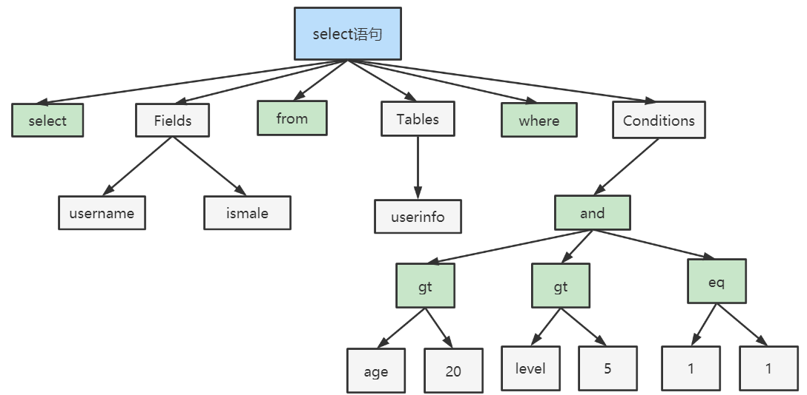

[上一章(账号管理)](./ACCOUNT_MANAGEMENT.MD)
# MySQL逻辑架构
MySQL的逻辑架构如下：

* 连接层
系统访问MySQL服务器前，做的第一建时就是简历TCP 连接。经过三次握手建立连接成功后，MySQL服务器对TCP传输过来的账号密码做身份认证，权限获取
    * 用户名或者密码不对，会收到一个Access denied for user错误，客户端程序结束执行
    * 用户名密码认证通过，会从权限表查找处账号拥有的权限于连接关联，之后的权限判断逻辑，都将依赖于此时读取到的权限。
TCP 连接收到请求后，必须要分配给一个线程专门于这个客户端的交互。所以还会有个线程池，去走后面的流程。每个连接从线程池中获取线程，省去了
线程创建的开销.

* 服务层

    * SQL Interface:SQL接口
        * 接收用户的SQL命令，并且返回用户需要查询的结果。比如SELECT...FROM就是调用SQL Interface
        * MySQL支持DML(数据操作语言)、DDL(数据定义语言)、存储过程、存储过程、视图、触发器、自定义函数等多种SQL语言接口.
    * Parser:解析器
        * 在解析器中对SQL语句进行语法解析，语义分析。将SQL语句分解成数据结构，并将这个结构传递到后续步骤，以后SQL的传递和处理就是
        基于这个结构的。
        * 在SQL命令传递到解析器的时候会被解析器验证和解析，并为其创建语法树，并根据数据字典丰富查询语法树，会验证该客户端是否具有执行该
        查询的权限，创建好语法树后，MySQL还会对SQL 查询进行语法上的优化，进行查询重写。
    * Optimizer:查询优化器
        * SQL语句在语法解析之后，查询之前会使用查询优化器确定SQL语句的执行路径，生成一个执行计划。
        * 这个执行接话表明使用那些索引进行查询(全表检索还是使用索引检索)，表之间的连接顺序如何，最后会按照
        执行计划中的步骤调用存储引擎提高的方法来真正的执行查询。并将查询的结果返回给用户。
        * 它使用"选取-投影-连接"策略进行查询。SELECT id,name FROM student WHERE gender = '女';这个SELECT查询先根据WHERE语句
        进行选取，而不是将表全部查询出来以后再进行gender过滤。 这个SELECT查询先根据id和name进行属性投影，而不是将属性全部取出以后
        再进行过滤，将这两个查询条件连接起来生成最终查询结果。
        
    * Cache&Buffer:查询缓存组件
        * MySQL内部维持这个一些Cache和Buffer，比如Query Cache用来缓存一条SELECT语句的执行结果，如果能够在其中找到对应的查询结果，
        那么不必再进行查询解析,优化和执行整个过程，直接将结果反馈给客户端。
        * 这个缓存级制时由一系列小缓存组成的。比如表缓存，记录缓存，key缓存，权限缓存等。
        * 这个查询缓存可以在不同的客户端之间共享。
        * 从MySQL5.7开始，不推荐使用查询缓存了，并且查询换粗才能在MySQL8.0已经删除。
        


* 引擎层
插件式存储引擎层（ Storage Engines），真正的负责了MySQL中数据的存储和提取，对物理服务器级别
维护的底层数据执行操作，服务器通过API与存储引擎进行通信。不同的存储引擎具有的功能不同，这样
我们可以根据自己的实际需要进行选取。
如下图所示:


* 存储层
所有的数据，数据库、表的定义，表的每一行的内容，索引，都是存在文件系统上，以文件的方式存
在的，并完成与存储引擎的交互。当然有些存储引擎比如InnoDB，也支持不使用文件系统直接管理裸设
备，但现代文件系统的实现使得这样做没有必要了。在文件系统之下，可以使用本地磁盘，可以使用
DAS、NAS、SAN等各种存储系统。


## SQL执行流程.
SQL执行流程

* SQL执行流程
    1. 查询缓存：Server 如果在查询缓存中发现了这条 SQL 语句，就会直接将结果返回给客户端；如果没
    有，就进入到解析器阶段。需要说明的是，因为查询缓存往往效率不高，所以在 MySQL8.0 之后就抛弃
    了这个功能。
    查询缓存是提前把查询结果缓存起来，这样下次不需要执行就可以直接拿到结果。需要说明的是，在
    MySQL 中的查询缓存，不是缓存查询计划，而是查询对应的结果。这就意味着查询匹配的鲁棒性大大降
    低，只有相同的查询操作才会命中查询缓存。两个查询请求在任何字符上的不同（例如：空格、注释、
    大小写），都会导致缓存不会命中。因此 MySQL 的查询缓存命中率不高。
    同时，如果查询请求中包含某些系统函数、用户自定义变量和函数、一些系统表，如 mysql 、
    information_schema、 performance_schema 数据库中的表，那这个请求就不会被缓存。以某些系统函数
    举例，可能同样的函数的两次调用会产生不一样的结果，比如函数NOW ，每次调用都会产生最新的当前
    时间，如果在一个查询请求中调用了这个函数，那即使查询请求的文本信息都一样，那不同时间的两次
    查询也应该得到不同的结果，如果在第一次查询时就缓存了，那第二次查询的时候直接使用第一次查询
    的结果就是错误的！
    此外，既然是缓存，那就有它缓存失效的时候。MySQL的缓存系统会监测涉及到的每张表，只要该表的
    结构或者数据被修改，如对该表使用了INSERT 、 UPDATE 、DELETE 、TRUNCATE TABLE 、ALTER
    TABLE 、DROP TABLE 或 DROP DATABASE 语句，那使用该表的所有高速缓存查询都将变为无效并从高
    速缓存中删除！对于更新压力大的数据库来说，查询缓存的命中率会非常低。
    2. 解析器:在解析器中对 SQL 语句进行语法分析、语义分析。分析器先做“ 词法分析”。你输入的是由多个字符串和空格组成的一条 SQL 语句，MySQL 需要识别出里面
     的字符串分别是什么，代表什么。 MySQL 从你输入的"select"这个关键字识别出来，这是一个查询语句。它也要把字符串“T”识别成“表名 T”，把字符串“ID”识别成“列 ID”。
     接着，要做“ 语法分析”。根据词法分析的结果，语法分析器（比如：Bison）会根据语法规则，判断你输入的这个 SQL 语句是否满足 MySQL 语法。
     select department_id,job_id,avg(salary) from employees group by department_id;
     如果SQL语句正确，则会生成一个这样的语法树：
     
     3. 优化器：在优化器中会确定 SQL 语句的执行路径，比如是根据全表检索，还是根据索引检索等。在查询优化器中，可以分为逻辑查询优化阶段和物理查询优化阶段。
     
     4. 执行器：在执行之前需要判断该用户是否具备权限。如果没有，就会返回权限错误。如果具备权限，就执行 SQL查询并返回结果。在 MySQL8.0 以下的版本，如果设置了查询缓存，这时会将查询结果进行缓存。


## MySQL8中的SQL执行原理
```sql
-- 1. 查看profifling是否开启
select @@profiling;
或者
mysql> show variables like 'profiling'
-- 设置prifiling开启
mysql> set profiling=1;
-- 2. 多次执行select *from employees;
select *from employees;
-- 3. 查看当前会话所产生的所有 profiles：
show profies;
-- 查看指定的查询ID
show profile for queryId
```


### MySQL5.7的执行原理
开启缓存
在my.cnf配置内添加
query_cache_type=1
```sql
-- 查看profiling是否开启
select @@profiling;
show variables like 'profiling';
-- 开启profiling
set profiling=1
-- 多次执行
select *from employees;
-- 查看profile
show profiles;
-- 根据具体的query id查看profile
show profile for query id
```


## SQL语法的顺序


[下一章(存储引擎)](./STORAGE_ENGINE.MD)


