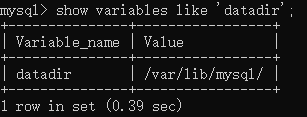
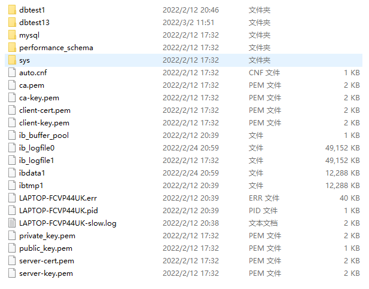
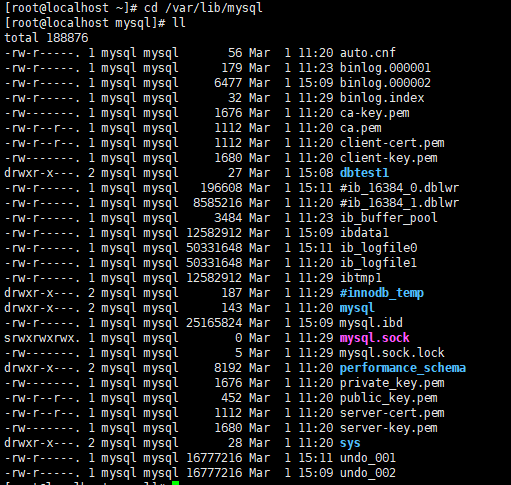
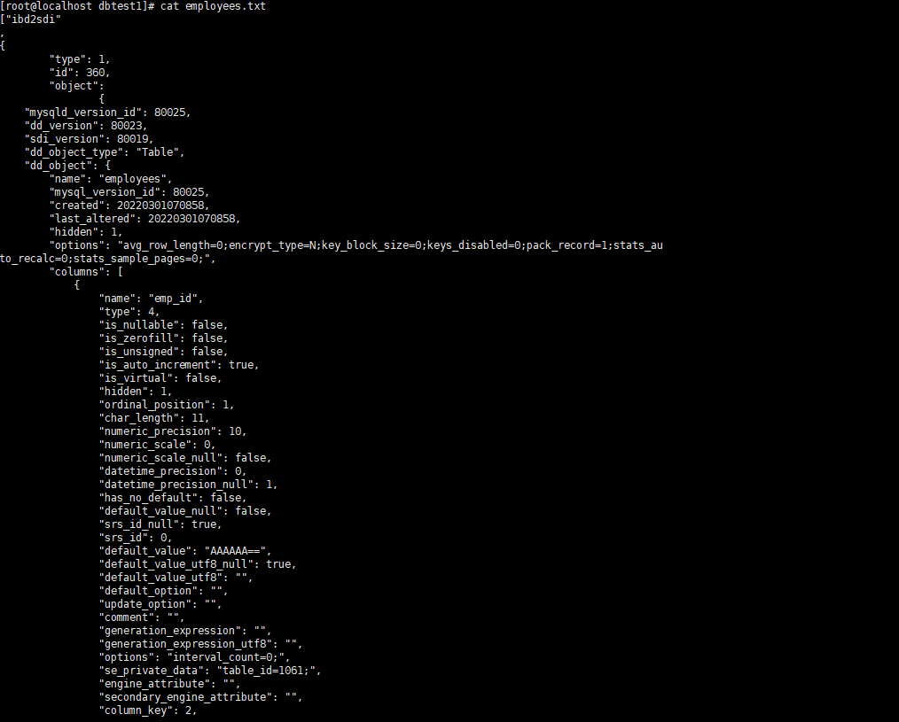

[上一章(触发器)](./Trigger.MD)

# MySQL数据目录
Linux上MySQL安装好之后默认的数据库目录如下:

* 相关的命令目录:
/usr/bin(mysqladmin,mysqlbinlog,mysqldump)和/usr/sbin

* 配置文件
配置文件目录：/usr/share/mysql-8.0（命令及配置文件），/etc/mysql（如my.cnf）

* 系统默认数据库
    * mysql:
    MySQL 系统自带的核心数据库，它存储了MySQL的用户账户和权限信息，一些存储过程、事件的定
    义信息，一些运行过程中产生的日志信息，一些帮助信息以及时区信息等。
    * information_schema:
    MySQL 系统自带的数据库，这个数据库保存着MySQL服务器维护的所有其他数据库的信息，比如有
    哪些表、哪些视图、哪些触发器、哪些列、哪些索引。这些信息并不是真实的用户数据，而是一些
    描述性信息，有时候也称之为元数据。在系统数据库information_schema 中提供了一些以
    innodb_sys 开头的表，用于表示内部系统表。
    * performaance_schema
    MySQL 系统自带的数据库，这个数据库里主要保存MySQL服务器运行过程中的一些状态信息，可以
    用来监控 MySQL 服务的各类性能指标。包括统计最近执行了哪些语句，在执行过程的每个阶段都
    花费了多长时间，内存的使用情况等信息。
    * sys
    MySQL 系统自带的数据库，这个数据库主要是通过视图的形式把information_schema 和
    performance_schema 结合起来，帮助系统管理员和开发人员监控 MySQL 的技术性能。
    
* 数据库在文件系统中的表示
[MySQL5.7的数据目录

db.opt就是数据库相关的信息
*.frm表结构文件、
*.ibd数据文件

MySQL8.0的数据目录

Mysql8.0之后就不需要将数据库的信息，表结构和数据文件分文件存储，这些数据都是存储在了.ibd文件内
Oracle官方将frm文件的信息及更多地下逆袭移动到了叫做序列化字典信息(Serialized Dictionary Information,SDI),SDI被写在了ibd文件内部。
为了能够从ibd文件内提取到sdi数据，官方提高了ibd2sdi程序提取这些数据，操作如下：

* MyISAM存储引擎

    .frm:表结构文件
    
    .MYD:数据文件
    
    .MYI:索引文件
 [下一章(MySQL账户管理)](./ACCOUNT_MANAGEMENT.MD)