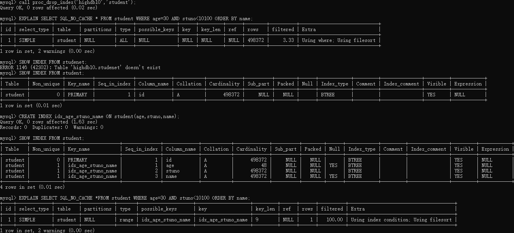

[上一章(性能分析工具的使用)](./USE_OF_PERFORMANCE_ANALYSIS_TOOLS.MD)
# 索引优化和查询优化
1. 主备数据
```sql
CREATE DATABASE IF NOT EXISTS highdb10;

use highdb10;


CREATE TABLE `class` (
`id` INT(11) NOT NULL AUTO_INCREMENT,
`className` VARCHAR(30) DEFAULT NULL,
`address` VARCHAR(40) DEFAULT NULL,
`monitor` INT NULL ,
PRIMARY KEY (`id`)
) ENGINE=INNODB AUTO_INCREMENT=1 DEFAULT CHARSET=utf8;
CREATE TABLE `student` (
`id` INT(11) NOT NULL AUTO_INCREMENT,
`stuno` INT NOT NULL ,
`name` VARCHAR(20) DEFAULT NULL,
`age` INT(3) DEFAULT NULL,
`classId` INT(11) DEFAULT NULL,
PRIMARY KEY (`id`)
#CONSTRAINT `fk_class_id` FOREIGN KEY (`classId`) REFERENCES `t_class` (`id`)
) ENGINE=INNODB AUTO_INCREMENT=1 DEFAULT CHARSET=utf8;


set global log_bin_trust_function_creators=1;


#随机产生字符串
DELIMITER //
CREATE FUNCTION rand_string(n INT) RETURNS VARCHAR(255)
BEGIN
DECLARE chars_str VARCHAR(100) DEFAULT
'abcdefghijklmnopqrstuvwxyzABCDEFJHIJKLMNOPQRSTUVWXYZ';
DECLARE return_str VARCHAR(255) DEFAULT '';
DECLARE i INT DEFAULT 0;
WHILE i < n DO
SET return_str =CONCAT(return_str,SUBSTRING(chars_str,FLOOR(1+RAND()*52),1));
SET i = i + 1;
END WHILE;
RETURN return_str;
END //
DELIMITER ;


#用于随机产生多少到多少的编号
DELIMITER //
CREATE FUNCTION rand_num (from_num INT ,to_num INT) RETURNS INT(11)
BEGIN
DECLARE i INT DEFAULT 0;
SET i = FLOOR(from_num +RAND()*(to_num - from_num+1)) ;
RETURN i;
END //
DELIMITER ;

#创建往stu表中插入数据的存储过程
DELIMITER //
CREATE PROCEDURE insert_stu( START INT , max_num INT )
BEGIN
DECLARE i INT DEFAULT 0;
SET autocommit = 0; #设置手动提交事务
REPEAT #循环
SET i = i + 1; #赋值
INSERT INTO student (stuno, name ,age ,classId ) VALUES
((START+i),rand_string(6),rand_num(1,50),rand_num(1,1000));
UNTIL i = max_num
END REPEAT;
COMMIT; #提交事务
END //
DELIMITER ;


#执行存储过程，往class表添加随机数据
DELIMITER //
CREATE PROCEDURE `insert_class`( max_num INT )
BEGIN
DECLARE i INT DEFAULT 0;
SET autocommit = 0;
REPEAT
SET i = i + 1;
INSERT INTO class ( classname,address,monitor ) VALUES
(rand_string(8),rand_string(10),rand_num(1,100000));
UNTIL i = max_num
END REPEAT;
COMMIT;
END //
DELIMITER ;

CALL insert_class(10000);

CALL insert_stu(100000,500000);
```

## 索引失效的案例

* 全值匹配我最爱
如果表没有创建任何索引，那么就无法使用索引，此时对表的查询就会使用全值匹配的方式进行
例子:
```sql
EXPLAIN SELECT *FROM s1 WHERE age=20;
```

```sql
-- 添加索引
 CREATE INDEX idx_age ON student(age);
```


```sql
EXPLAIN SELECT *FROM student WHERE age=20 AND classId=4;
```

```sql
-- 创建联合索引
CREATE INDEX idx_age_classId ON student(age,classId);
EXPLAIN SELECT *FROM student WHERE age=20 AND classId=4;
```


以上的的几次查询我们可以得出：如果查询的条件超出了索引包含的列， 那么会先按照索引的查找对应的主键索引，然后根据主键索引回表查询，根据回表查询
找出所需要的字段。


* 最左前缀匹配原则
创建联合索引的时候，如果使用WHERE语句进行条件筛选，那么索引左边的字段的需要包含，并且条件要从左到右依次添加才可以生效，否则无法使用索引
```text

mysql> show index from student;
+---------+------------+----------+--------------+-------------+-----------+-------------+----------+--------+------+------------+---------+---------------+---------+------------+
| Table   | Non_unique | Key_name | Seq_in_index | Column_name | Collation | Cardinality | Sub_part | Packed | Null | Index_type | Comment | Index_comment | Visible | Expression |
+---------+------------+----------+--------------+-------------+-----------+-------------+----------+--------+------+------------+---------+---------------+---------+------------+
| student |          0 | PRIMARY  |            1 | id          | A         |      498372 |     NULL |   NULL |      | BTREE      |         |               | YES     | NULL       |
| student |          1 | idx_age  |            1 | age         | A         |          48 |     NULL |   NULL | YES  | BTREE      |         |               | YES     | NULL       |
+---------+------------+----------+--------------+-------------+-----------+-------------+----------+--------+------+------------+---------+---------------+---------+------------+
2 rows in set (0.00 sec)

mysql> EXPLAIN SELECT *FROM student WHERE age=20 AND classId=4;
+----+-------------+---------+------------+------+---------------+---------+---------+-------+------+----------+-------------+
| id | select_type | table   | partitions | type | possible_keys | key     | key_len | ref   | rows | filtered | Extra       |
+----+-------------+---------+------------+------+---------------+---------+---------+-------+------+----------+-------------+
|  1 | SIMPLE      | student | NULL       | ref  | idx_age       | idx_age | 5       | const | 9859 |    10.00 | Using where |
+----+-------------+---------+------------+------+---------------+---------+---------+-------+------+----------+-------------+
1 row in set, 1 warning (0.01 sec)

mysql> CREATE INDEX idx_age_classId ON student(age,classId);
Query OK, 0 rows affected (1.45 sec)
Records: 0  Duplicates: 0  Warnings: 0

mysql> EXPLAIN SELECT *FROM student WHERE age=20 AND classId=4;
+----+-------------+---------+------------+------+-------------------------+-----------------+---------+-------------+------+----------+-------+
| id | select_type | table   | partitions | type | possible_keys           | key             | key_len | ref         | rows | filtered | Extra |
+----+-------------+---------+------------+------+-------------------------+-----------------+---------+-------------+------+----------+-------+
|  1 | SIMPLE      | student | NULL       | ref  | idx_age,idx_age_classId | idx_age_classId | 10      | const,const |    9 |   100.00 | NULL  |
+----+-------------+---------+------------+------+-------------------------+-----------------+---------+-------------+------+----------+-------+
1 row in set, 1 warning (0.00 sec)

mysql> EXPLAIN SELECT *FROM student WHERE age=20 AND classId=4 AND `name`='abc';
+----+-------------+---------+------------+------+-------------------------+-----------------+---------+-------------+------+----------+-------------+
| id | select_type | table   | partitions | type | possible_keys           | key             | key_len | ref         | rows | filtered | Extra       |
+----+-------------+---------+------------+------+-------------------------+-----------------+---------+-------------+------+----------+-------------+
|  1 | SIMPLE      | student | NULL       | ref  | idx_age,idx_age_classId | idx_age_classId | 10      | const,const |    9 |    10.00 | Using where |
+----+-------------+---------+------------+------+-------------------------+-----------------+---------+-------------+------+----------+-------------+
1 row in set, 1 warning (0.00 sec)

mysql> EXPLAIN SELECT SQL_NO_CACHE * FROM student WHERE student.age=30 AND student.name = 'abcd' ;
+----+-------------+---------+------------+------+-------------------------+---------+---------+-------+-------+----------+-------------+
| id | select_type | table   | partitions | type | possible_keys           | key     | key_len | ref   | rows  | filtered | Extra       |
+----+-------------+---------+------------+------+-------------------------+---------+---------+-------+-------+----------+-------------+
|  1 | SIMPLE      | student | NULL       | ref  | idx_age,idx_age_classId | idx_age | 5       | const | 10061 |    10.00 | Using where |
+----+-------------+---------+------------+------+-------------------------+---------+---------+-------+-------+----------+-------------+
1 row in set, 2 warnings (0.01 sec)

mysql> EXPLAIN SELECT SQL_NO_CACHE * FROM student WHERE student.classid=1 AND student.name = 'abcd';
+----+-------------+---------+------------+------+---------------+------+---------+------+--------+----------+-------------+
| id | select_type | table   | partitions | type | possible_keys | key  | key_len | ref  | rows   | filtered | Extra       |
+----+-------------+---------+------------+------+---------------+------+---------+------+--------+----------+-------------+
|  1 | SIMPLE      | student | NULL       | ALL  | NULL          | NULL | NULL    | NULL | 498372 |     1.00 | Using where |
+----+-------------+---------+------------+------+---------------+------+---------+------+--------+----------+-------------+
1 row in set, 2 warnings (0.00 sec)

mysql> EXPLAIN SELECT SQL_NO_CACHE * FROM student
    -> WHERE classid=4 AND student.age=30 AND student.name = 'abcd';
+----+-------------+---------+------------+------+-------------------------+-----------------+---------+-------------+------+----------+-------------+
| id | select_type | table   | partitions | type | possible_keys           | key             | key_len | ref         | rows | filtered | Extra       |
+----+-------------+---------+------------+------+-------------------------+-----------------+---------+-------------+------+----------+-------------+
|  1 | SIMPLE      | student | NULL       | ref  | idx_age,idx_age_classId | idx_age_classId | 10      | const,const |    6 |    10.00 | Using where |
+----+-------------+---------+------------+------+-------------------------+-----------------+---------+-------------+------+----------+-------------+
1 row in set, 2 warnings (0.00 sec)

mysql> CREATE INDEX idx_age_classId_name ON student(age,classId,name);
Query OK, 0 rows affected (1.73 sec)
Records: 0  Duplicates: 0  Warnings: 0

mysql> show index from student;
+---------+------------+----------------------+--------------+-------------+-----------+-------------+----------+--------+------+------------+---------+---------------+---------+------------+
| Table   | Non_unique | Key_name             | Seq_in_index | Column_name | Collation | Cardinality | Sub_part | Packed | Null | Index_type | Comment | Index_comment | Visible | Expression |
+---------+------------+----------------------+--------------+-------------+-----------+-------------+----------+--------+------+------------+---------+---------------+---------+------------+
| student |          0 | PRIMARY              |            1 | id          | A         |      498372 |     NULL |   NULL |      | BTREE      |         |               | YES     | NULL       |
| student |          1 | idx_age              |            1 | age         | A         |          48 |     NULL |   NULL | YES  | BTREE      |         |               | YES     | NULL       |
| student |          1 | idx_age_classId      |            1 | age         | A         |          45 |     NULL |   NULL | YES  | BTREE      |         |               | YES     | NULL       |
| student |          1 | idx_age_classId      |            2 | classId     | A         |       50160 |     NULL |   NULL | YES  | BTREE      |         |               | YES     | NULL       |
| student |          1 | idx_age_classId_name |            1 | age         | A         |          48 |     NULL |   NULL | YES  | BTREE      |         |               | YES     | NULL       |
| student |          1 | idx_age_classId_name |            2 | classId     | A         |       49455 |     NULL |   NULL | YES  | BTREE      |         |               | YES     | NULL       |
| student |          1 | idx_age_classId_name |            3 | name        | A         |      498372 |     NULL |   NULL | YES  | BTREE      |         |               | YES     | NULL       |
+---------+------------+----------------------+--------------+-------------+-----------+-------------+----------+--------+------+------------+---------+---------------+---------+------------+
7 rows in set (0.01 sec)

mysql> EXPLAIN SELECT SQL_NO_CACHE * FROM student WHERE student.classid=1 AND student.name = 'abcd';
+----+-------------+---------+------------+------+---------------+------+---------+------+--------+----------+-------------+
| id | select_type | table   | partitions | type | possible_keys | key  | key_len | ref  | rows   | filtered | Extra       |
+----+-------------+---------+------------+------+---------------+------+---------+------+--------+----------+-------------+
|  1 | SIMPLE      | student | NULL       | ALL  | NULL          | NULL | NULL    | NULL | 498372 |     1.00 | Using where |
+----+-------------+---------+------------+------+---------------+------+---------+------+--------+----------+-------------+
1 row in set, 2 warnings (0.00 sec)

mysql> EXPLAIN SELECT SQL_NO_CACHE * FROM student WHERE student.age=30 AND student.name = 'abcd' ;
+----+-------------+---------+------------+------+----------------------------------------------+---------+---------+-------+-------+----------+-------------+
| id | select_type | table   | partitions | type | possible_keys                                | key     | key_len | ref   | rows  | filtered | Extra       |
+----+-------------+---------+------------+------+----------------------------------------------+---------+---------+-------+-------+----------+-------------+
|  1 | SIMPLE      | student | NULL       | ref  | idx_age,idx_age_classId,idx_age_classId_name | idx_age | 5       | const | 10061 |    10.00 | Using where |
+----+-------------+---------+------------+------+----------------------------------------------+---------+---------+-------+-------+----------+-------------+
1 row in set, 2 warnings (0.01 sec)

mysql> EXPLAIN SELECT SQL_NO_CACHE * FROM student WHERE student.age=30 AND student.classId=4 AND student.name = 'abcd' ;
+----+-------------+---------+------------+------+----------------------------------------------+----------------------+---------+-------------------+------+----------+-------+
| id | select_type | table   | partitions | type | possible_keys                                | key                  | key_len | ref               | rows | filtered | Extra |
+----+-------------+---------+------------+------+----------------------------------------------+----------------------+---------+-------------------+------+----------+-------+
|  1 | SIMPLE      | student | NULL       | ref  | idx_age,idx_age_classId,idx_age_classId_name | idx_age_classId_name | 73      | const,const,const |    1 |   100.00 | NULL  |
+----+-------------+---------+------------+------+----------------------------------------------+----------------------+---------+-------------------+------+----------+-------+
1 row in set, 2 warnings (0.00 sec)
```

* 计算、函数、类型转换(自动或者手动)导致索引失效

1. 使用函数会使得索引失效：
```sql
mysql> EXPLAIN SELECT *FROM student WHERE name like 'abc%';
+----+-------------+---------+------------+------+---------------+------+---------+------+--------+----------+-------------+
| id | select_type | table   | partitions | type | possible_keys | key  | key_len | ref  | rows   | filtered | Extra       |
+----+-------------+---------+------------+------+---------------+------+---------+------+--------+----------+-------------+
|  1 | SIMPLE      | student | NULL       | ALL  | NULL          | NULL | NULL    | NULL | 498372 |    11.11 | Using where |
+----+-------------+---------+------------+------+---------------+------+---------+------+--------+----------+-------------+
1 row in set, 1 warning (0.00 sec)

mysql> CREATE INDEX idx_name ON student(name);
Query OK, 0 rows affected (1.71 sec)
Records: 0  Duplicates: 0  Warnings: 0

mysql> EXPLAIN SELECT *FROM student WHERE name like 'abc%';
+----+-------------+---------+------------+-------+---------------+----------+---------+------+------+----------+-----------------------+
| id | select_type | table   | partitions | type  | possible_keys | key      | key_len | ref  | rows | filtered | Extra                 |
+----+-------------+---------+------------+-------+---------------+----------+---------+------+------+----------+-----------------------+
|  1 | SIMPLE      | student | NULL       | range | idx_name      | idx_name | 63      | NULL |   26 |   100.00 | Using index condition |
+----+-------------+---------+------------+-------+---------------+----------+---------+------+------+----------+-----------------------+
1 row in set, 1 warning (0.00 sec)

mysql> EXPLAIN SELECT SQL_NO_CACHE *FROM student WHERE LEFT(student.name,3)='abc';
+----+-------------+---------+------------+------+---------------+------+---------+------+--------+----------+-------------+
| id | select_type | table   | partitions | type | possible_keys | key  | key_len | ref  | rows   | filtered | Extra       |
+----+-------------+---------+------------+------+---------------+------+---------+------+--------+----------+-------------+
|  1 | SIMPLE      | student | NULL       | ALL  | NULL          | NULL | NULL    | NULL | 498372 |   100.00 | Using where |
+----+-------------+---------+------------+------+---------------+------+---------+------+--------+----------+-------------+
1 row in set, 2 warnings (0.00 sec)
```
2. 查询语句添加计算就会使得索引失效
```sql
mysql> EXPLAIN SELECT *FROM student WHERE stu_no+1=90001;
ERROR 1054 (42S22): Unknown column 'stu_no' in 'where clause'
mysql> EXPLAIN SELECT *FROM student WHERE stu_no+1=90001
    -> ;
ERROR 1054 (42S22): Unknown column 'stu_no' in 'where clause'
mysql> DESC student;
+---------+-------------+------+-----+---------+----------------+
| Field   | Type        | Null | Key | Default | Extra          |
+---------+-------------+------+-----+---------+----------------+
| id      | int         | NO   | PRI | NULL    | auto_increment |
| stuno   | int         | NO   |     | NULL    |                |
| name    | varchar(20) | YES  | MUL | NULL    |                |
| age     | int         | YES  | MUL | NULL    |                |
| classId | int         | YES  |     | NULL    |                |
+---------+-------------+------+-----+---------+----------------+
5 rows in set (0.00 sec)

mysql> EXPLAIN SELECT *FROM student WHERE stuno+1=90001;
+----+-------------+---------+------------+------+---------------+------+---------+------+--------+----------+-------------+
| id | select_type | table   | partitions | type | possible_keys | key  | key_len | ref  | rows   | filtered | Extra       |
+----+-------------+---------+------------+------+---------------+------+---------+------+--------+----------+-------------+
|  1 | SIMPLE      | student | NULL       | ALL  | NULL          | NULL | NULL    | NULL | 498372 |   100.00 | Using where |
+----+-------------+---------+------------+------+---------------+------+---------+------+--------+----------+-------------+
1 row in set, 1 warning (0.00 sec)

mysql> CREATE INDEX idx_stuno ON student(stuno);
Query OK, 0 rows affected (1.22 sec)
Records: 0  Duplicates: 0  Warnings: 0

mysql> EXPLAIN SELECT *FROM student WHERE stuno+1=90001;
+----+-------------+---------+------------+------+---------------+------+---------+------+--------+----------+-------------+
| id | select_type | table   | partitions | type | possible_keys | key  | key_len | ref  | rows   | filtered | Extra       |
+----+-------------+---------+------------+------+---------------+------+---------+------+--------+----------+-------------+
|  1 | SIMPLE      | student | NULL       | ALL  | NULL          | NULL | NULL    | NULL | 498372 |   100.00 | Using where |
+----+-------------+---------+------------+------+---------------+------+---------+------+--------+----------+-------------+
1 row in set, 1 warning (0.00 sec)

mysql> EXPLAIN SELECT *FROM student WHERE stuno=90001;
+----+-------------+---------+------------+------+---------------+-----------+---------+-------+------+----------+-------+
| id | select_type | table   | partitions | type | possible_keys | key       | key_len | ref   | rows | filtered | Extra |
+----+-------------+---------+------------+------+---------------+-----------+---------+-------+------+----------+-------+
|  1 | SIMPLE      | student | NULL       | ref  | idx_stuno     | idx_stuno | 4       | const |    1 |   100.00 | NULL  |
+----+-------------+---------+------------+------+---------------+-----------+---------+-------+------+----------+-------+
1 row in set, 1 warning (0.00 sec)
```
3. 类型转换导致索引失效：
```sql
mysql> EXPLAIN SELECT SQL_NO_CACHE * FROM student WHERE NAME = 123;
+----+-------------+---------+------------+------+---------------+------+---------+------+--------+----------+-------------+
| id | select_type | table   | partitions | type | possible_keys | key  | key_len | ref  | rows   | filtered | Extra       |
+----+-------------+---------+------------+------+---------------+------+---------+------+--------+----------+-------------+
|  1 | SIMPLE      | student | NULL       | ALL  | idx_name      | NULL | NULL    | NULL | 498372 |    10.00 | Using where |
+----+-------------+---------+------------+------+---------------+------+---------+------+--------+----------+-------------+
1 row in set, 5 warnings (0.00 sec)

mysql> EXPLAIN SELECT SQL_NO_CACHE * FROM student WHERE NAME = '123';
+----+-------------+---------+------------+------+---------------+----------+---------+-------+------+----------+-------+
| id | select_type | table   | partitions | type | possible_keys | key      | key_len | ref   | rows | filtered | Extra |
+----+-------------+---------+------------+------+---------------+----------+---------+-------+------+----------+-------+
|  1 | SIMPLE      | student | NULL       | ref  | idx_name      | idx_name | 63      | const |    1 |   100.00 | NULL  |
+----+-------------+---------+------------+------+---------------+----------+---------+-------+------+----------+-------+
1 row in set, 2 warnings (0.00 sec)
```
*　范围条件右边的列索引失效
在联合索引的时候，如果索引左边的字段进行了范围查找，那么索引中该字段的右边的字段就无法使用索引
```sql
mysql> CREATE INDEX idx_age_classId_name ON student(age,classId,name);
Query OK, 0 rows affected (1.77 sec)
Records: 0  Duplicates: 0  Warnings: 0
-- 这个地方可以看到索引的使用长度只有前面的age字段和classId字段(4字节+1字节记录是否空)。
mysql> EXPLAIN SELECT * FROM student WHERE student.age=30 AND student.classId>20 AND student.name='abc';
+----+-------------+---------+------------+-------+----------------------+----------------------+---------+------+-------+----------+----------------------------------+
| id | select_type | table   | partitions | type  | possible_keys        | key                  | key_len | ref  | rows  | filtered | Extra                            |
+----+-------------+---------+------------+-------+----------------------+----------------------+---------+------+-------+----------+----------------------------------+
|  1 | SIMPLE      | student | NULL       | range | idx_age_classId_name | idx_age_classId_name | 10      | NULL | 18054 |    10.00 | Using index condition; Using MRR |
+----+-------------+---------+------------+-------+----------------------+----------------------+---------+------+-------+----------+----------------------------------+
1 row in set, 1 warning (0.01 sec)
```
调整索引字段位置之后
```sql
mysql> CREATE INDEX idx_age_name_classid ON student(age,name,classId);
Query OK, 0 rows affected (1.84 sec)
Records: 0  Duplicates: 0  Warnings: 0

mysql> EXPLAIN SELECT *FROM student WHERE age>30 AND `name`='abc' AND classId>20;
+----+-------------+---------+------------+------+----------------------+------+---------+------+--------+----------+-------------+
| id | select_type | table   | partitions | type | possible_keys        | key  | key_len | ref  | rows   | filtered | Extra       |
+----+-------------+---------+------------+------+----------------------+------+---------+------+--------+----------+-------------+
|  1 | SIMPLE      | student | NULL       | ALL  | idx_age_name_classid | NULL | NULL    | NULL | 498372 |     1.67 | Using where |
+----+-------------+---------+------------+------+----------------------+------+---------+------+--------+----------+-------------+
1 row in set, 1 warning (0.00 sec)

mysql> show index from student;
+---------+------------+----------------------+--------------+-------------+-----------+-------------+----------+--------+------+------------+---------+---------------+---------+------------+
| Table   | Non_unique | Key_name             | Seq_in_index | Column_name | Collation | Cardinality | Sub_part | Packed | Null | Index_type | Comment | Index_comment | Visible | Expression |
+---------+------------+----------------------+--------------+-------------+-----------+-------------+----------+--------+------+------------+---------+---------------+---------+------------+
| student |          0 | PRIMARY              |            1 | id          | A         |      498372 |     NULL |   NULL |      | BTREE      |         |               | YES     | NULL       |
| student |          1 | idx_age_name_classid |            1 | age         | A         |          48 |     NULL |   NULL | YES  | BTREE      |         |               | YES     | NULL       |
| student |          1 | idx_age_name_classid |            2 | name        | A         |      473904 |     NULL |   NULL | YES  | BTREE      |         |               | YES     | NULL       |
| student |          1 | idx_age_name_classid |            3 | classId     | A         |      498372 |     NULL |   NULL | YES  | BTREE      |         |               | YES     | NULL       |
+---------+------------+----------------------+--------------+-------------+-----------+-------------+----------+--------+------+------------+---------+---------------+---------+------------+
4 rows in set (0.01 sec)
--  索引长度为73 age(5字节)+name(60字节记录内容2字节记录内容长度+1字节记录空)+classId(5字节)
mysql> EXPLAIN SELECT *FROM student WHERE age=30 AND `name`='abc' AND classId>20;
+----+-------------+---------+------------+-------+----------------------+----------------------+---------+------+------+----------+-----------------------+
| id | select_type | table   | partitions | type  | possible_keys        | key                  | key_len | ref  | rows | filtered | Extra                 |
+----+-------------+---------+------------+-------+----------------------+----------------------+---------+------+------+----------+-----------------------+
|  1 | SIMPLE      | student | NULL       | range | idx_age_name_classid | idx_age_name_classid | 73      | NULL |    1 |   100.00 | Using index condition |
+----+-------------+---------+------------+-------+----------------------+----------------------+---------+------+------+----------+-----------------------+
1 row in set, 1 warning (0.00 sec)
```

* <>或者!=不等于的使用导致索引失效
```sql
mysql> DROP INDEX idx_age_name_classid ON student;
Query OK, 0 rows affected (0.02 sec)
Records: 0  Duplicates: 0  Warnings: 0

mysql> show index from student;
+---------+------------+----------+--------------+-------------+-----------+-------------+----------+--------+------+------------+---------+---------------+---------+------------+
| Table   | Non_unique | Key_name | Seq_in_index | Column_name | Collation | Cardinality | Sub_part | Packed | Null | Index_type | Comment | Index_comment | Visible | Expression |
+---------+------------+----------+--------------+-------------+-----------+-------------+----------+--------+------+------------+---------+---------------+---------+------------+
| student |          0 | PRIMARY  |            1 | id          | A         |      498372 |     NULL |   NULL |      | BTREE      |         |               | YES     | NULL       |
+---------+------------+----------+--------------+-------------+-----------+-------------+----------+--------+------+------------+---------+---------------+---------+------------+
1 row in set (0.00 sec)

mysql> CREATE INDEX idx_name ON student(name);
Query OK, 0 rows affected (1.71 sec)
Records: 0  Duplicates: 0  Warnings: 0

mysql> EXPLAIN SELECT *FROM student WHERE name <> 'abc';
+----+-------------+---------+------------+------+---------------+------+---------+------+--------+----------+-------------+
| id | select_type | table   | partitions | type | possible_keys | key  | key_len | ref  | rows   | filtered | Extra       |
+----+-------------+---------+------------+------+---------------+------+---------+------+--------+----------+-------------+
|  1 | SIMPLE      | student | NULL       | ALL  | idx_name      | NULL | NULL    | NULL | 498372 |    50.15 | Using where |
+----+-------------+---------+------------+------+---------------+------+---------+------+--------+----------+-------------+
1 row in set, 1 warning (0.00 sec)

mysql> EXPLAIN SELECT *FROM student WHERE name = 'abc';
+----+-------------+---------+------------+------+---------------+----------+---------+-------+------+----------+-------+
| id | select_type | table   | partitions | type | possible_keys | key      | key_len | ref   | rows | filtered | Extra |
+----+-------------+---------+------------+------+---------------+----------+---------+-------+------+----------+-------+
|  1 | SIMPLE      | student | NULL       | ref  | idx_name      | idx_name | 63      | const |    1 |   100.00 | NULL  |
+----+-------------+---------+------------+------+---------------+----------+---------+-------+------+----------+-------+
1 row in set, 1 warning (0.00 sec)

mysql> EXPLAIN SELECT *FROM student WHERE name != 'abc';
+----+-------------+---------+------------+------+---------------+------+---------+------+--------+----------+-------------+
| id | select_type | table   | partitions | type | possible_keys | key  | key_len | ref  | rows   | filtered | Extra       |
+----+-------------+---------+------------+------+---------------+------+---------+------+--------+----------+-------------+
|  1 | SIMPLE      | student | NULL       | ALL  | idx_name      | NULL | NULL    | NULL | 498372 |    50.15 | Using where |
+----+-------------+---------+------------+------+---------------+------+---------+------+--------+----------+-------------+
1 row in set, 1 warning (0.00 sec)
```
* IS NOT NULL 无法使用索引 IS NULL 可以使用索引
```sql
mysql> CREATE INDEX idx_age ON student(age);
Query OK, 0 rows affected (1.27 sec)
Records: 0  Duplicates: 0  Warnings: 0

mysql> show index from student;
+---------+------------+----------+--------------+-------------+-----------+-------------+----------+--------+------+------------+---------+---------------+---------+------------+
| Table   | Non_unique | Key_name | Seq_in_index | Column_name | Collation | Cardinality | Sub_part | Packed | Null | Index_type | Comment | Index_comment | Visible | Expression |
+---------+------------+----------+--------------+-------------+-----------+-------------+----------+--------+------+------------+---------+---------------+---------+------------+
| student |          0 | PRIMARY  |            1 | id          | A         |      498372 |     NULL |   NULL |      | BTREE      |         |               | YES     | NULL       |
| student |          1 | idx_age  |            1 | age         | A         |          48 |     NULL |   NULL | YES  | BTREE      |         |               | YES     | NULL       |
+---------+------------+----------+--------------+-------------+-----------+-------------+----------+--------+------+------------+---------+---------------+---------+------------+
2 rows in set (0.01 sec)
-- 此处的查询因为使用了 IS NOT NULL 无法走索引
mysql> EXPLAIN SELECT *FROM student WHERE age IS NOT NULL;
+----+-------------+---------+------------+------+---------------+------+---------+------+--------+----------+-------------+
| id | select_type | table   | partitions | type | possible_keys | key  | key_len | ref  | rows   | filtered | Extra       |
+----+-------------+---------+------------+------+---------------+------+---------+------+--------+----------+-------------+
|  1 | SIMPLE      | student | NULL       | ALL  | idx_age       | NULL | NULL    | NULL | 498372 |    50.00 | Using where |
+----+-------------+---------+------------+------+---------------+------+---------+------+--------+----------+-------------+
1 row in set, 1 warning (0.01 sec)
-- 此处的所有走索引
mysql> EXPLAIN SELECT *FROM student WHERE age IS NULL;
+----+-------------+---------+------------+------+---------------+---------+---------+-------+------+----------+-----------------------+
| id | select_type | table   | partitions | type | possible_keys | key     | key_len | ref   | rows | filtered | Extra                 |
+----+-------------+---------+------------+------+---------------+---------+---------+-------+------+----------+-----------------------+
|  1 | SIMPLE      | student | NULL       | ref  | idx_age       | idx_age | 5       | const |    1 |   100.00 | Using index condition |
+----+-------------+---------+------------+------+---------------+---------+---------+-------+------+----------+-----------------------+
1 row in set, 1 warning (0.00 sec)
```

* like以通配符%开头索引失效
```sql
mysql> CREATE INDEX idx_name ON student(name);
Query OK, 0 rows affected (1.71 sec)
Records: 0  Duplicates: 0  Warnings: 0

mysql> EXPLAIN SELECT *FROM student WHERE name like '%abc';
+----+-------------+---------+------------+------+---------------+------+---------+------+--------+----------+-------------+
| id | select_type | table   | partitions | type | possible_keys | key  | key_len | ref  | rows   | filtered | Extra       |
+----+-------------+---------+------------+------+---------------+------+---------+------+--------+----------+-------------+
|  1 | SIMPLE      | student | NULL       | ALL  | NULL          | NULL | NULL    | NULL | 498372 |    11.11 | Using where |
+----+-------------+---------+------------+------+---------------+------+---------+------+--------+----------+-------------+
1 row in set, 1 warning (0.00 sec)

mysql> EXPLAIN SELECT *FROM student WHERE name like '%abc%';
+----+-------------+---------+------------+------+---------------+------+---------+------+--------+----------+-------------+
| id | select_type | table   | partitions | type | possible_keys | key  | key_len | ref  | rows   | filtered | Extra       |
+----+-------------+---------+------------+------+---------------+------+---------+------+--------+----------+-------------+
|  1 | SIMPLE      | student | NULL       | ALL  | NULL          | NULL | NULL    | NULL | 498372 |    11.11 | Using where |
+----+-------------+---------+------------+------+---------------+------+---------+------+--------+----------+-------------+
1 row in set, 1 warning (0.00 sec)

mysql> EXPLAIN SELECT *FROM student WHERE name like 'abc%';
+----+-------------+---------+------------+-------+---------------+----------+---------+------+------+----------+-----------------------+
| id | select_type | table   | partitions | type  | possible_keys | key      | key_len | ref  | rows | filtered | Extra                 |
+----+-------------+---------+------------+-------+---------------+----------+---------+------+------+----------+-----------------------+
|  1 | SIMPLE      | student | NULL       | range | idx_name      | idx_name | 63      | NULL |   26 |   100.00 | Using index condition |
+----+-------------+---------+------------+-------+---------------+----------+---------+------+------+----------+-----------------------+
1 row in set, 1 warning (0.00 sec)
```

* OR 前后存在非索引的列，索引失效
```sql
mysql> SHOW INDEX FROM student;
+---------+------------+----------+--------------+-------------+-----------+-------------+----------+--------+------+------------+---------+---------------+---------+------------+
| Table   | Non_unique | Key_name | Seq_in_index | Column_name | Collation | Cardinality | Sub_part | Packed | Null | Index_type | Comment | Index_comment | Visible | Expression |
+---------+------------+----------+--------------+-------------+-----------+-------------+----------+--------+------+------------+---------+---------------+---------+------------+
| student |          0 | PRIMARY  |            1 | id          | A         |      498372 |     NULL |   NULL |      | BTREE      |         |               | YES     | NULL       |
| student |          1 | idx_name |            1 | name        | A         |      346577 |     NULL |   NULL | YES  | BTREE      |         |               | YES     | NULL       |
+---------+------------+----------+--------------+-------------+-----------+-------------+----------+--------+------+------------+---------+---------------+---------+------------+
2 rows in set (0.01 sec)

mysql> CREATE INDEX idx_age ON student(age);
Query OK, 0 rows affected (1.34 sec)
Records: 0  Duplicates: 0  Warnings: 0

mysql> EXPLAIN SELECT * FROM student WHERE age=20 OR name like 'abc%';
+----+-------------+---------+------------+-------------+------------------+------------------+---------+------+------+----------+-------------------------------------------------+
| id | select_type | table   | partitions | type        | possible_keys    | key              | key_len | ref  | rows | filtered | Extra                                           |
+----+-------------+---------+------------+-------------+------------------+------------------+---------+------+------+----------+-------------------------------------------------+
|  1 | SIMPLE      | student | NULL       | index_merge | idx_name,idx_age | idx_age,idx_name | 5,63    | NULL | 9885 |   100.00 | Using sort_union(idx_age,idx_name); Using where |
+----+-------------+---------+------------+-------------+------------------+------------------+---------+------+------+----------+-------------------------------------------------+
1 row in set, 1 warning (0.01 sec)

mysql> EXPLAIN SELECT * FROM student WHERE age=20 OR name like 'abc%' OR classId>20;
+----+-------------+---------+------------+------+------------------+------+---------+------+--------+----------+-------------+
| id | select_type | table   | partitions | type | possible_keys    | key  | key_len | ref  | rows   | filtered | Extra       |
+----+-------------+---------+------------+------+------------------+------+---------+------+--------+----------+-------------+
|  1 | SIMPLE      | student | NULL       | ALL  | idx_name,idx_age | NULL | NULL    | NULL | 498372 |    41.97 | Using where |
+----+-------------+---------+------------+------+------------------+------+---------+------+--------+----------+-------------+
1 row in set, 1 warning (0.00 sec)
```


* 数据库和表的字符集统一使用utf8mb4
统一使用utf8mb4( 5.5.3版本以上支持)兼容性更好，统一字符集可以避免由于字符集转换产生的乱码。不
同的字符集进行比较前需要进行转换会造成索引失效。


## 关联查询优化
```sql
mysql> EXPLAIN SELECT SQL_NO_CACHE * FROM `type` JOIN `book` ON `type`.card=book.card;
+----+-------------+-------+------------+------+---------------+------+---------+------+------+----------+--------------------------------------------+
| id | select_type | table | partitions | type | possible_keys | key  | key_len | ref  | rows | filtered | Extra                                      |
+----+-------------+-------+------------+------+---------------+------+---------+------+------+----------+--------------------------------------------+
|  1 | SIMPLE      | type  | NULL       | ALL  | NULL          | NULL | NULL    | NULL |   20 |   100.00 | NULL                                       |
|  1 | SIMPLE      | book  | NULL       | ALL  | NULL          | NULL | NULL    | NULL |   20 |    10.00 | Using where; Using join buffer (hash join) |
+----+-------------+-------+------------+------+---------------+------+---------+------+------+----------+--------------------------------------------+
2 rows in set, 2 warnings (0.00 sec)

mysql> ALTER TABLE book ADD INDEX Y ( card);
Query OK, 0 rows affected (0.03 sec)
Records: 0  Duplicates: 0  Warnings: 0

mysql> show index from 'book';
ERROR 1064 (42000): You have an error in your SQL syntax; check the manual that corresponds to your MySQL server version for the right syntax to use near ''book'' at line 1
mysql>
mysql> show index from book;
+-------+------------+----------+--------------+-------------+-----------+-------------+----------+--------+------+------------+---------+---------------+---------+------------+
| Table | Non_unique | Key_name | Seq_in_index | Column_name | Collation | Cardinality | Sub_part | Packed | Null | Index_type | Comment | Index_comment | Visible | Expression |
+-------+------------+----------+--------------+-------------+-----------+-------------+----------+--------+------+------------+---------+---------------+---------+------------+
| book  |          0 | PRIMARY  |            1 | bookid      | A         |          20 |     NULL |   NULL |      | BTREE      |         |               | YES     | NULL       |
| book  |          1 | Y        |            1 | card        | A         |          14 |     NULL |   NULL |      | BTREE      |         |               | YES     | NULL       |
+-------+------------+----------+--------------+-------------+-----------+-------------+----------+--------+------+------------+---------+---------------+---------+------------+
2 rows in set (0.00 sec)

mysql> EXPLAIN SELECT SQL_NO_CACHE * FROM `type` LEFT JOIN book ON `type`.card=book.card;
+----+-------------+-------+------------+------+---------------+------+---------+--------------------+------+----------+-------------+
| id | select_type | table | partitions | type | possible_keys | key  | key_len | ref                | rows | filtered | Extra       |
+----+-------------+-------+------------+------+---------------+------+---------+--------------------+------+----------+-------------+
|  1 | SIMPLE      | type  | NULL       | ALL  | NULL          | NULL | NULL    | NULL               |   20 |   100.00 | NULL        |
|  1 | SIMPLE      | book  | NULL       | ref  | Y             | Y    | 4       | highdb10.type.card |    1 |   100.00 | Using index |
+----+-------------+-------+------------+------+---------------+------+---------+--------------------+------+----------+-------------+
2 rows in set, 2 warnings (0.00 sec)

mysql> ALTER TABLE `type` ADD INDEX X(card);
Query OK, 0 rows affected (0.02 sec)
Records: 0  Duplicates: 0  Warnings: 0

mysql> show index from type;
+-------+------------+----------+--------------+-------------+-----------+-------------+----------+--------+------+------------+---------+---------------+---------+------------+
| Table | Non_unique | Key_name | Seq_in_index | Column_name | Collation | Cardinality | Sub_part | Packed | Null | Index_type | Comment | Index_comment | Visible | Expression |
+-------+------------+----------+--------------+-------------+-----------+-------------+----------+--------+------+------------+---------+---------------+---------+------------+
| type  |          0 | PRIMARY  |            1 | id          | A         |          20 |     NULL |   NULL |      | BTREE      |         |               | YES     | NULL       |
| type  |          1 | X        |            1 | card        | A         |          13 |     NULL |   NULL |      | BTREE      |         |               | YES     | NULL       |
+-------+------------+----------+--------------+-------------+-----------+-------------+----------+--------+------+------------+---------+---------------+---------+------------+
2 rows in set (0.01 sec)

mysql> EXPLAIN SELECT SQL_NO_CACHE *FROM type LEFT JOIN book ON type.card=book.card;
+----+-------------+-------+------------+-------+---------------+------+---------+--------------------+------+----------+-------------+
| id | select_type | table | partitions | type  | possible_keys | key  | key_len | ref                | rows | filtered | Extra       |
+----+-------------+-------+------------+-------+---------------+------+---------+--------------------+------+----------+-------------+
|  1 | SIMPLE      | type  | NULL       | index | NULL          | X    | 4       | NULL               |   20 |   100.00 | Using index |
|  1 | SIMPLE      | book  | NULL       | ref   | Y             | Y    | 4       | highdb10.type.card |    1 |   100.00 | Using index |
+----+-------------+-------+------------+-------+---------------+------+---------+--------------------+------+----------+-------------+
2 rows in set, 2 warnings (0.00 sec)
```
由上面的执行结果可以看到左外连接，物理添加那边的索引或者是没添加索引，驱动表和被驱动表都没有变化

内连接
```sql
mysql> EXPLAIN SELECT SQL_NO_CACHE *FROM type JOIN book ON type.card=book.card;
+----+-------------+-------+------------+-------+---------------+------+---------+--------------------+------+----------+-------------+
| id | select_type | table | partitions | type  | possible_keys | key  | key_len | ref                | rows | filtered | Extra       |
+----+-------------+-------+------------+-------+---------------+------+---------+--------------------+------+----------+-------------+
|  1 | SIMPLE      | book  | NULL       | index | Y             | Y    | 4       | NULL               |   20 |   100.00 | Using index |
|  1 | SIMPLE      | type  | NULL       | ref   | X             | X    | 4       | highdb10.book.card |    1 |   100.00 | Using index |
+----+-------------+-------+------------+-------+---------------+------+---------+--------------------+------+----------+-------------+
2 rows in set, 2 warnings (0.00 sec)

mysql> EXPLAIN SELECT SQL_NO_CACHE *FROM type LEFT JOIN book ON type.card=book.card;
+----+-------------+-------+------------+-------+---------------+------+---------+--------------------+------+----------+-------------+
| id | select_type | table | partitions | type  | possible_keys | key  | key_len | ref                | rows | filtered | Extra       |
+----+-------------+-------+------------+-------+---------------+------+---------+--------------------+------+----------+-------------+
|  1 | SIMPLE      | type  | NULL       | index | NULL          | X    | 4       | NULL               |   20 |   100.00 | Using index |
|  1 | SIMPLE      | book  | NULL       | ref   | Y             | Y    | 4       | highdb10.type.card |    1 |   100.00 | Using index |
+----+-------------+-------+------------+-------+---------------+------+---------+--------------------+------+----------+-------------+
2 rows in set, 2 warnings (0.00 sec)

mysql> EXPLAIN SELECT SQL_NO_CACHE *FROM type JOIN book ON type.card=book.card;
+----+-------------+-------+------------+-------+---------------+------+---------+--------------------+------+----------+-------------+
| id | select_type | table | partitions | type  | possible_keys | key  | key_len | ref                | rows | filtered | Extra       |
+----+-------------+-------+------------+-------+---------------+------+---------+--------------------+------+----------+-------------+
|  1 | SIMPLE      | book  | NULL       | index | Y             | Y    | 4       | NULL               |   20 |   100.00 | Using index |
|  1 | SIMPLE      | type  | NULL       | ref   | X             | X    | 4       | highdb10.book.card |    1 |   100.00 | Using index |
+----+-------------+-------+------------+-------+---------------+------+---------+--------------------+------+----------+-------------+
2 rows in set, 2 warnings (0.00 sec)

mysql> EXPLAIN SELECT SQL_NO_CACHE *FROM type JOIN book ON type.card=book.card;
+----+-------------+-------+------------+-------+---------------+------+---------+--------------------+------+----------+-------------+
| id | select_type | table | partitions | type  | possible_keys | key  | key_len | ref                | rows | filtered | Extra       |
+----+-------------+-------+------------+-------+---------------+------+---------+--------------------+------+----------+-------------+
|  1 | SIMPLE      | book  | NULL       | index | Y             | Y    | 4       | NULL               |   20 |   100.00 | Using index |
|  1 | SIMPLE      | type  | NULL       | ref   | X             | X    | 4       | highdb10.book.card |    1 |   100.00 | Using index |
+----+-------------+-------+------------+-------+---------------+------+---------+--------------------+------+----------+-------------+
2 rows in set, 2 warnings (0.00 sec)

mysql> EXPLAIN SELECT SQL_NO_CACHE *FROM type JOIN book ON type.card=book.card;
+----+-------------+-------+------------+-------+---------------+------+---------+--------------------+------+----------+-------------+
| id | select_type | table | partitions | type  | possible_keys | key  | key_len | ref                | rows | filtered | Extra       |
+----+-------------+-------+------------+-------+---------------+------+---------+--------------------+------+----------+-------------+
|  1 | SIMPLE      | book  | NULL       | index | Y             | Y    | 4       | NULL               |   20 |   100.00 | Using index |
|  1 | SIMPLE      | type  | NULL       | ref   | X             | X    | 4       | highdb10.book.card |    1 |   100.00 | Using index |
+----+-------------+-------+------------+-------+---------------+------+---------+--------------------+------+----------+-------------+
2 rows in set, 2 warnings (0.00 sec)
-- 删除type表的索引
mysql> CALL proc_drop_index('highdb10','type');
Query OK, 0 rows affected (0.03 sec)

mysql> EXPLAIN SELECT SQL_NO_CACHE * FROM `type` JOIN `book` ON `type`.card=book.card;
+----+-------------+-------+------------+------+---------------+------+---------+--------------------+------+----------+-------------+
| id | select_type | table | partitions | type | possible_keys | key  | key_len | ref                | rows | filtered | Extra       |
+----+-------------+-------+------------+------+---------------+------+---------+--------------------+------+----------+-------------+
|  1 | SIMPLE      | type  | NULL       | ALL  | NULL          | NULL | NULL    | NULL               |   40 |   100.00 | NULL        |
|  1 | SIMPLE      | book  | NULL       | ref  | Y             | Y    | 4       | highdb10.type.card |    1 |   100.00 | Using index |
+----+-------------+-------+------------+------+---------------+------+---------+--------------------+------+----------+-------------+
2 rows in set, 2 warnings (0.00 sec)
```

结合左外连接和内连接的例子可以看到外连接的驱动表和被驱动表是固定的，但是内连接的在优化器进行处理的饿时候，优化器是右权力对驱动表和被驱动表进行
动态的选择的，总体是小结果集驱动大结果集

### JOIN连接查询的原理
JOIN方式连接多个表，本质就是各个表之间数据的循环匹配。MySQL5.5版本之前，MySQL只支持一种表关联方式，就是嵌套循环(Nested Loop Join)
如果关联表的数据量很庞大，则join关联的执行时间就会很长。在MySQL5.5以后的版本中，MySQL引入了BNLJ算法来优化嵌套循环.


* Simple Nested-Loop Join(简单嵌套循环)
简单嵌套循环的算法相当的简单，从A中取出一条数据1，遍历表B，将匹配到的数据放到result...以此类推，驱动表A的每一条记录与被驱动的表B的记录进行判断。


从上图可以看到这种方式的效率是比较抵消的，以上表A数据100条，表B数据1000条计算，则A*B=10万次。开销统计如下：

| **开销统计** | **SNLJ**|
| ---- | ---- |    
|外表扫描次数(A表真个扫描一遍):|1|    
|内表扫描次数(A表的数据每次都要到B表扫描一遍):|A|    
|读取记录数(A表+B表的访问次数)|A+A*B|    
|JOIN比较次数|A*B|    
|回表记录数|0|    

当让mysql肯定不会这么粗暴的进行表的连接，所以才出现的INLJ和BNLJ

*　Index Nested-Loop Join(索引嵌套循环连接)
Index Nested-Loop Join其优化的思路主要是为了减少内层表数据的匹配次数，所以要求被驱动表上必须有索引才可以。
通过外层表匹配条件直接与内层表索引进行匹配，避免和内层表的每条记录取进行比较，这样极大的减少了对内层表的匹配次数。


驱动表中的每条记录通过被驱动表的索引进行访问，因为索引查询的成本是比较固定的，故mysql优化器都倾向于使用记录数少的表作为驱动表(外表)

| **开销统计** | **SNLJ**| **INLJ**|
| ---- | ---- | ----|   
|外表扫描次数(A表真个扫描一遍):|1|1|   
|内表扫描次数(A表的数据每次都要到B表扫描一遍):|A|0|
|读取记录数(A表+B表的访问次数)|A+A*B|A+B|
|JOIN比较次数|A*B|A*Index(Height)|
|回表记录数|0|B(match)(if possible)|

如果被驱动表加索引，效率是非常高的，但是如果索引不是主键索引，还是需要进行一次回表查询。相比，被驱动表的索引是主键索引，效率更高。


* Block Nested-Loop Join(块嵌套循环连接)
如果存在索引，那么会使用Index的方式进行join，如果join的列没有索引，被驱动表要扫描的次数太多了。每次访问被驱动表，其表中的记录都会被加载
到内存中，然后在从驱动表中取一条与其匹配，匹配结束后清楚内存，然后再从驱动表中加载一条记录，然后再从驱动表中加载一条记录，然后吧驱动表的记
录再加载到内存匹配，这样周而复始，大大增加了IO的次数。为了减少被驱动表的IO次数，就出现了Block Nested-Loop Join的方式.
不再是逐条获取驱动表的数据，而实一块一块的获取，引入了join buffer缓冲区，将驱动表join相关的部分数据列(大小手join buffer的限制)缓存到join
buffer中，然后全表扫描被驱动表，被驱动表的每一条记录一次性和join buffer在的所有驱动表的记录进行匹配(内存操作)，将简单嵌套循环中的多次比
较合并称一次，降低了被驱动表的访问频率。
注意:
```text
这里缓存的不只是关联表的列，select 后面的列也会缓存起来。
在一个有N个join关联的sql中会分配N-1个join buffer。所以查询到饿时候见了不必要的字段，可以让join buffer中可以存放更多的列.
```


| **开销统计** | **SNLJ**| **INLJ**| BNLJ |
| ---- | ---- | ---- | ---- |   
|外表扫描次数(A表真个扫描一遍):|1|1|1|   
|内表扫描次数(A表的数据每次都要到B表扫描一遍):|A|0|A*used_column_size/join_buffer_size+1|
|读取记录数(A表+B表的访问次数)|A+A*B|A+B|A+B*(A*used_column_size/join_buffer_size)|
|JOIN比较次数|A*B|A*Index(Height)|B*A|
|回表记录数|0|B(match)(if possible)|0|

参数设置
    block_nested_loop
通过 show variables like '%optimizer_switch%'查看block_nested_loop状态.默认是开启的.


查看join buffer大小


注意:join_buffer_size的最大值在32位系统可以申请4G,而在64位操作系统下可以申请大于4G的join buffer的空间(64位的Windows除外,
其大值回被截断位4GB并发出警告)


#### Join小结
1. 整体效率比较 INLJ>BNLJ>SNLJ
2. 永远用小结果集驱动大结果集(其本质就是减少外层循环的数据量)(小的度量单位指的的是表行数*每行大小)
3. 为被驱动表的匹配的条件增加索引(减少内层表的循环匹配次数)
4.增大join buffer size的大小(一次缓存的数据越多,那么内层包的扫描表次数就越少)
5. 减少驱动表不必要的字段查询(字段越少,join buffer所缓存的数据就越多.)


## 排序优化

### ORDER BY
1. 在SQL中，可以在WHERE子句和ORDER BY 子句中使用索引，目的是在WHERE子句中避免全表扫描，在ORDER BY子句避免使用FileSort排序。当然，
某些情况下，全表扫描或者FileSort排序不一定比索引慢。但总的来说，我们要避免，以提高查询效率。
2. 尽量使用Index完成ORDER BY排序。如果WHERE 和ORDER BY后面是相同的列就使用单索引列；
如果不相同就使用联合索引。
3. 无法使用Index时，需要对FileSort方式进行调优。

例子:
```sql
mysql> call proc_drop_index('highdb10','student');

EXPLAIN SELECT SQL_NO_CACHE * FROM student WHERE age=30 AND stuno<10100 ORDER BY name;

CREATE INDEX idx_age_stuno_name ON student(age,stuno,name);
-- 虽然创建了三个字段的联合索引，但是只使用了前面两个字段的生效，ORDER BY没有使用上索引
EXPLAIN SELECT SQL_NO_CACHE *FROM student WHERE age=30 AND stuno<10100 ORDER BY name;
```


* filesort算法：双路排序和单路排序
    * 双路排序算法:
        1. MySQL 4.1之前是使用双路排序，字面意思就是两次扫描磁盘，最终得到数据， 读取行指针和
           order by列，对他们进行排序，然后扫描已经排序好的列表，按照列表中的值重新从列表中读取
           对应的数据输出
        2. 从磁盘取排序字段，在buffer进行排序，再从磁盘取其他字段。
    *　单路排序:
        从磁盘读取查询需要的所有列，按照order by列在buffer对它们进行排序，然后扫描排序后的列表进行输
        出， 它的效率更快一些，避免了第二次读取数据。并且把随机IO变成了顺序IO，但是它会使用更多的空
        间， 因为它把每一行都保存在内存中了。
如果是filesort有如下几点优化方法:

1. 尝试提高sort_buffer_size
   不管那种算法，提高这个参数都会提高效率，要根据系统的能力取提高，因为这个参数是针对每个进程(connecyion)的1-8M之间调整。MySQL5.7,InnoDB
   存储引擎默认值是1028576，1MB
```sql
SHOW VARIABLE LIKE '%sort_buffer_size%';
```   


2. 尝试提高max_length_for_sort_data
    提高这个参数，会增加用改进算法的概率
```sql
mysql> SHOW VARIABLES LIKE '%max_length_for_sort_data%';
+--------------------------+-------+
| Variable_name            | Value |
+--------------------------+-------+
| max_length_for_sort_data | 4096  |
+--------------------------+-------+
1 row in set, 1 warning (0.00 sec)
```
虽然可以提高这个参数，但是如果设置的太高，数据总量超出了sort_buffer_size的概率就增大，明显症状是高的磁盘I/O活动和低的处理器使用率。
如果需要返回的列的总长度大于max_length_for_sort_data，使用双路算法，否则使用单路算法。1024-8192字节之间调整。


* Order by 时select * 是一个大忌。最好只Query需要的字段
原因:
    * 当Query的字段大小总和小于max_length_for_data，而且排序字段不是TEXT|BLOB类型时，会使用改进后的算法----单路排序，否则使用老
    算法----多路排序
    *　两种算法的数据都有可能超出sort_buffer_size的容量，超出之后，会创建tmp文件进行综合排序，导致多次I/O，但是用单路跑徐算法的风邪会更大
    ，索引要提高sort_buffer_size.


### GROUP BY 优化
* group by 使用索引的原则几乎跟order by一致，group by及时没有过滤条件用到索引，页可以直接使用索引。

* group by 先排序在分组，遵照索引建的最佳左前缀法。

* 当无法使用索引，增大max_length_for_sort_data和sort_buffer_size参数的设置

* WHERE效率高于having,能写在WHERE限定的条件就不要写在having中。

* 减少使用order by,和业务沟通，能不排序就不排序，或将偶爱徐放到程序端取做。order by、group by、disinct这些语句较为耗费CPU，数据库的
CPU资源是极其宝贵的。

* 包含了order by、group by,distict这些查询的语句，WHERE条件过滤出来的结果集请保持在1000以内，否则SQL会很慢.


### 优化分页查询
思路1:在索引上完成排序分页操作，最后根据主键挂变脸会原表查询所需要的其他列的内容
```sql
`SELECT *FROM student s,(SELECT id FROM student ORDER BY id LIMIT 200000,10)a WHERE t.id = a.id;
```


优化思路2:
    该方案适用于主键自增的表，可以把Limit查询转换成某个位置的查询。
```sql
SELECT *FROM student WHERE id>200000 LIMIT 10;
```


## 覆盖索引
1. 覆盖索引的理解:
理解方式一：索引是高效找到行的一个方法，但是一般数据库也能使用索引找到一个列的数据，因此它
不必读取整个行。毕竟索引叶子节点存储了它们索引的数据；当能通过读取索引就可以得到想要的数
据，那就不需要读取行了。一个索引包含了满足查询结果的数据就叫做覆盖索引。
理解方式二：非聚簇复合索引的一种形式，它包括在查询里的SELECT、JOIN和WHERE子句用到的所有列
（即建索引的字段正好是覆盖查询条件中所涉及的字段）。
简单说就是， 索引列+主键 包含 SELECT 到 FROM之间查询的列
```sql
mysql> call proc_drop_index('highdb10','student');
mysql> show index from student;
mysql> CREATE INDEX idx_age_name ON student(age,name);
-- 使用<>或者!=的情况默认是会使得索引失效的，但是在覆盖索引的时候，优化器可会使继续使用索引，减少回表查找
mysql> EXPLAIN SELECT *FROM student WHERE age<>20;
mysql> EXPLAIN SELECT age,name FROM student WHERE age<>20;
-- 使用like '%abc%'的情况没有使用左侧匹配的原则默认是会使得索引失效的，但是在覆盖索引的时候，优化器可会使继续使用索引，减少回表查找
mysql> EXPLAIN SELECT *FROM student WHERE name LIKE '%abc%';
mysql> EXPLAIN SELECT id,age,name FROM student WHERE name LIKE '%abc%';
```


2. 覆盖索引的利弊
    好处:
        1. 避免了Innodb表进行索引的二次查询
            Innodb是以聚集索引的顺序来存储数据的，对于InnoDB来说，二级索引在叶子结点所保存的是行的主键信息，如果用二级索引查询数据，在查找到
            对应的数据后，需要使用随从的主键进行二次回表查找才可以真正获取到我们真正需要的数据。在覆盖索引中，二级索引的键值中可以获取所需要的数据
            ，避免了对主键的二次查询，减少了IO操作，提升了查询的效率。
               
        2. 可以把随机IO变成顺序IO加快查询效率
            由于覆盖素银是按键值的顺序存储的，对于IO密集型的范围查找来说，对比随机从磁盘读取每一行的数据IO要少的多，因此利用覆盖索引在
            访问的时候可以把磁盘的随机读取的IO转变称为索引查找的顺序IO。
    弊端:
        索引字段的维护总是有代价的。因此，在建立冗余索引来支持覆盖索引时就需要权衡。这是业务DBA，或者称为业务数据结构师的工作。
        
        
        
        
## 索引下推
Index Condition Pushdown(ICP)是MySQL 5.6中新特性，是一种在存储引擎层使用索引过滤数据的一种优化方式。ICP可以减少存储引擎访问基表的
次数以及MySQL服务器访问存储引擎的次数。
使用索引下推的查询语句在EXPLAIN时，Extra会显示Using index condition
例子:
```sql
-- 虽然在key1 like '%abc%'处无法使用索引了，但是仍然可以使用它进行条件过滤，筛选处更少的结果集，然后再回表查找，减少IO。
EXPLAIN SELECT *FROM s1 WHERE key1>'z' AND key1 LIKE '%abc%';
```


* ICP的开启和关闭
默认情况下启用索引条件下推。可以通过设置系统遍历optimizer_switch控制：index_condition_pushdown
```sql
show variables like '%optimizer_switch%';
-- 打开索引下推
set optimizer_switch='index_condition_pushdown=on';
-- 关闭索引下推
set optimizer_switch='index_condition_push=off';
EXPLAIN SELECT *FROM s1 WHERE key1>'z' AND key1 LIKE '%zhsa%';

```


[下一章(数据库的设计原则)](./PRINCIPLES_INDEX_CREATION_DESIGN.MD)


    