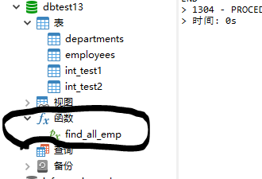

[上一章(视图)](./VIEW.MD)
# 存储过程
MySQL从5.0开始支持存储过程和存储函数。存储过程和存储函数能够将复杂的SQL逻辑封装在一起，应用程序无需关注存储过程和存储函数内部的复杂的
SQL逻辑，而只需要简单的带哦有存储过程和存储函数即可.

* 存储过程Stored Procedure.它思想简单，就是一组警告预先编译的SQL语句的封装。
执行的过程：存储过程预先存储在MySQL服务器上，需要执行的时候，客户端只需要向服务器发出调用存储过程的命令，服务器端就可以把预先存储好的这一
系列的SQL语句全部执行。

## 理解

* 存储过程的好处
    1. 简化操作，提高了sql语句的重用性，减少开发程序员的压力
    2. 减少操作过程中的失误，提高效率
    3. 减少网络传输量(客户端不需要把所有的SQL语句通过网络发送给服务器)
    4. 减少SQL语句暴露在网络上的风险，也提高了数据查询的安全性.

* 视图和存储过程的区别 

存储过程和视图有着同样的优点，清晰，安全，还可以减少网络流量的传输。不过存储过程和视图是不同的，视图是**虚拟表**,通常不对底层数据表直接操作，
而存储过程是程序化的SQL，可以这**直接操作底层的数据表**,相比与面向集合的操作方式,呢个广告实现一些更加复杂的数据处理。
一旦存储过程被创建出来，使用它就像使用函数一样简单，我们直接通过调用存储过程名即可。相较于函数，存储过程没有返回值.

##  分类

* 存储过程的参数类型可以是IN，OUT和INOUT。根据这点可以分类如下:

    1.  没有参数(无参数返回)
    2.  仅仅待IN类型(又参数无返回)
    3. 仅仅带OUT类型(无参数又返回)
    4. 既带IN又带OUT(有参数有返回)
    5. 带INOUT(有参数有返回)
    
    
##  创建存储过程
```sql
CREATE PROCEDURE 存储过程名(IN|OUT|INOUT 参数名 参数类型,...)
[characteristics...]
BEGIN
存储过程体
END
```
* 参数前面的符号的意思
    1. IN ：当前参数为输入参数，也就是表示入参；存储过程只是读取这个参数的值。如果没有定义参数种类， 默认就是 IN ，表示输入参数。
    2. OUT ：当前参数为输出参数，也就是表示出参；执行完成之后，调用这个存储过程的客户端或者应用程序就可以读取这个参数返回的值了。
    3. INOUT ：当前参数既可以为输入参数，也可以为输出参数。

   

*　形参类型可以是 MySQL数据库中的任意类型。

* characteristics表示创建存储过程时指定的对存储过程的约束条件，其取值信息如下
LANGUAGE SQL
|[NOT] DETERMINISTIC
|{ CONTAINS SQL| NO SQL|READS SQL DATA | MODIFIES SQL DATA}
| SQL SECURITY {DEFINER | INVOKER}
| COMMENT 'string'
    1. LANGUAGE SQL:说明存储过程执行体是有SQL语句组成的，当前系统支持的语言为SQL
    2. [NOT]DETERMINISTIC:知名存储过程执行的结果是否确定。DETERMINISTIC表示结果是确定的。每次执行存储过程时，相同的输入会得到相同的输出
    。NOT DETERMINISTIC表示结果时不确定的，相同的输入可能得到不同的输出。如果没有指定任意一个值，默认为NOT DETERMINISTIC.
    3. {CONTAINS SQL | NO SQL | READS SQL DATA | MODIFIES SQL DATA }:指明子程序使用SQL语句的限制
        1. CONTAINS SQL表示当前存储过程的子程序包含SQL语句，但是并不包含读写数据的SQL语句;
        2. NO SQL表示当前存储过程的子程序中不包含任何SQL语句
        3. READ SQL DATA表示当前存储过程的子程序中包含读数据的SQL语句
        4. MODIFIES SQL DATA表示当前存储过程的子程序中包含写数据的SQL语句
        5. 默认情况下，系统会指定为CONTAINS SQL。
    4. SQL SECURITY{DEFINER| INVOKER}:指定当前存储过程的权限,即指明那些用户能够制定和当前存储过程。
        1. DEFINER 表示只有当前存储过程的创建者或者定义者才能执行当前存储过程。
        2. INVOKER 表示拥有当前存储过程的访问权限的用户能够执行当前的存储过程。

    5. COMMENT 'string':注释信息，可以用来描述存储过程。
 
* 注意:
存储过程中可以有多条SQL语句，如果仅仅一条SQL语句，则可以省略BEGIN和END

* 编写存储过程需要注意的规范
    1. BEGIN...END: BEGIN...END中家奴包含多个语句，每个语句都是以;号为结束符。
    2. DECLARE:DECLARE用来声明变量，使用的位置在于BEGIN...END语句中间，而且需要在其他的语句使用之前进行变量的声明。
    3. SET:赋值语句，用于对变量进行赋值
    4. SELECT...INTO:把从数据表中查询的结果存储到变量中，也就是为变量赋值.
    4. 需要设置新的结束符标记
    DELIMITER 新的结束符标记

```sql
DELIMITER $

CREATE PROCEDURE 存储过程名(IN|OUT|INOUT 参数名 参数类型)
[characteristics...]
BEGIN
    sql1;
    sql2;
    sql3;
END $
```
例子:
```sql
DELIMITER $
CREATE PROCEDURE find_all_emp()
BEGIN
		SELECT *FROM employees;
END $
DELIMITER ;
```



