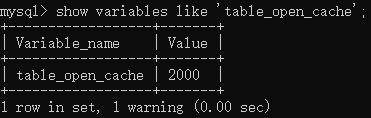

[上一章(数据库设计原则)](./DESIGN_PRINCIPLES_SPECIFICATIONS_DATABASE.MD)
# 数据库调优的措施
* 调优的目标
    * 尽可能的节省系统资源，以便系统可以提高更大负荷的服务(吞吐量更大)
    * 合理的结构设计和参数调整，以提高用户操作响应的速度(响应速度更快)
    * 减少系统的瓶颈，提高MySQL数据库整体的性能
## 定位问题
   随着用户的增加，应用沉痼的复杂度的提升，我们很难用"更快"去定义数据库调优的目标，因为用户在不同的时间段访问服务器遇到的瓶颈不同，比
如双十一促销带来的大规模的并发访问;还有用户在进行不同业务操作的时候，数据库的事务处理和SQL查询都会有所不同。因此我们还需要更加精确的定位
去确定调优的目标。

* 如何确定调优的目标:
    * 用户的反馈(主要)
        用户是我们的服务对象，因此他们的反馈是最直接的。虽然他们不会直接提出技术建议，但是有些问题往往是用户第一时间发现的。我们需要重视用户
        的反馈，找到和数据相关的问题。
    * 日志分析(主要)
        我们可以通过查看数据库日志和操作系统日志等方式找出异常情况，通过他们来定位遇到的问题。
    *　服务器资源的使用监控
        通过监控服务器的CPU、内存、I/O等使用情况，可以实时了解服务器的性能使用，与历史情况进行对比。
    * 数据库内部情况监控
        在书库监控中，活动会话(Active Session)监控是一个重要的指标，通过它，我们可以清楚的了解数据库的当前是否处于非常繁忙的状态，是否存在SQL堆积等
    * 其他
        除了活动监控以外，我们也可以对事务，锁等待等进行监控，这些都可以帮助我们对数据库的运行状态有更加全面的认识。
                         
## 调优的维度和步骤
我们需要调优的对象是整个数据库管理系统，它不仅包括SQL查询，还包括数据库的部署配置、架构等。从这个角度来书，我们思考的维度就不仅仅局限在
SQL优化上了。通过如下的步骤我们进行梳理：
    1. 选择合适DBMS
        如果对事务性处理以及安全性要求高的话，可以选择商业的数据库产品。这些数据库在事务处理和查询性能上都是比较强悍的，比如oracle,
        SQL Server,那么单表存储上亿条数据都是没有问题的。如果数据表设计的很好，及时不采用分库分表的处理方式，查询的效率也是不错的。
        除此之外，我们采用开源的MySQL进行存储，它有很多存储引擎可以选择，如果进行事务处理的话可以选择使用InnoDB,非事务处理可以选择MyISAM
        NoSQL数据库包括键值数据库、文档数据库、搜索引擎、列式存储和如下数据库。这些数据库的优缺点和使用场景各不相同，比如劣势存储数据库
        可以大幅度降低系统的I/O，适合分布式文件细他，但是如果数据需要频繁的增删改，那么列式存储就不太适用了。
        
        
2. 优化表设计   
    选择合适的DBMS之后，我们需要进行表设计了。而数据表的设计方式也直接影响了后续的SQL查询语句。RDBMS中，每个对象都可以定义为一张表，表
    与表之间关系代表了对象之间的关系。如果用的式MySQL,我们还可以根据不同的表的使用需求，选择不太的存储引擎。除此之外，还有一些有的原则
    可以参考:
        1. 表结构要尽量遵循三范式的原则。这样可以让数据结构更加清晰规范，减少冗余字段，同时也减少了在更新，插入和删除数据时等异常情况。
        2. 如果查询应用比价哦多，尤其时需要多表关联查询的时候，可以采用反范式的进行优化。反范式采用空间换时间的方式，通过增加冗余的字段提高查询的效率
        3. 表字段的数据类型选择，关系到查询效率的高低以及存储空间的大小。一般来说，如果字段可以采用数值型就不要采用自读类型；字符长度要尽可能
        的设计的简短一些。针对字符类型来说，当确定字符长度固定时，就采用CHAR类型；当长度不固定时，通常采用VARCHAR类型.
        
        
3. 优化逻辑查询
当我们建立好数据表之后，我们就可以对数据表进行增删该操作了。这时我们首先需要考虑的时逻辑查询优化。SQL查询优化，可以分为**逻辑查询优化**和
**物理查询优化**。逻辑查询优化就是通过改变SQL语句的内容让SQL执行效率更高效，采用的方式时对SQL语句进行等价交换，对查询进行重写。
SQL查询重写包括了查询优化，等价为此重写，视图重写，条件简化，连接消除和嵌套连接消除等。
            
4.优化物理查询

物理查询优化是在确定了逻辑查询优化之后，采用物理优化技术（比如索引等），通过计算代价模型对
各种可能的访问路径进行估算，从而找到执行方式中代价最小的作为执行计划。在这个部分中，我们需
要掌握的重点是对索引的创建和使用。        

5. 使用 Redis 或 Memcached 作为缓存       
除了可以对 SQL 本身进行优化以外，我们还可以请外援提升查询的效率。
因为数据都是存放到数据库中，我们需要从数据库层中取出数据放到内存中进行业务逻辑的操作，当用
户量增大的时候，如果频繁地进行数据查询，会消耗数据库的很多资源。如果我们将常用的数据直接放
到内存中，就会大幅提升查询的效率。
键值存储数据库可以帮我们解决这个问题。
常用的键值存储数据库有 Redis 和 Memcached，它们都可以将数据存放到内存中。     
   
6.库级优化     
库级优化时站在数据库的维度上进行的优化策略，比如控制一个库中的数据表数量。另外，单一的数据库总会遇到各种限制，不如取长补短，利用"外援"的方式。
通过主从架构优化我们的读写策略，通过对数据库进行垂直或者水平切分，突破单以数据库或者数据表的访问限制，提升查询的性能。
   
  1.读写分离      
    如果读和写的业务量很大，并且它们都在同一个数据库服务器中进行操作，那么数据库的性能就会出现性能瓶颈，这是为了提升系统的性能，优化用户体验，
    我们可以采取读写分离的方式江都主数据库的负载，比如主数据库(master)完成写操作，从数据库(slave)完成读操作。   
        
        
        
        
   2.数据分片     
   对数据库分库分表。当数据量达到千万级别以上，有时候我们需要把一个数据库切分成多份，放到不同的数据库服务器上，减少对单以数据库服务器的访问压力
   如果你使用的时MySQL,就可以使用MySQL自带的分区表功能，当然可以考虑自己做垂直拆分(分库)，水平拆分(分表)，垂直+水平拆分(分库分表)。
   
   
        
## 优化MySQL服务器
### 优化服务器硬件
服务器的硬件性能直接决定着MySQL数据库的性能。硬件的性能瓶颈直接决定了MySQL数据库的运行速度和效率。针对性能瓶颈提高硬件配置，可以提高 MySQL
数据库查询，更新的速度
1. 配置较大的内存
2. 配置高速磁盘系统
3. 合理分布磁盘I/O
4. 配置多处理器
### 优化MySQL的参数

* innodb_buffer_pool_size:这个参数时Mysql数据库的最重要的参数之一，标识InnoDB类型的表和索引的最大缓存。它不仅仅缓存索引数据，还会缓存
表的疏忽。这个值越大，查询的速度就会越快，但是这个值太大会影响操作系统的性能。
* key_buffer_size:表示索引缓冲区的大小。索引缓冲区时所有线程共享的。增加索引缓冲区可以得到更好处理的索引(对所有读和多重写)。当然，这个
值不是越大越好，它的大小取决于内存的大小，如果这个值太大，就会导致操作系统频繁的换页，也就会降低系统性能。针对内存在4GB左右的服务器该参数可
设置为256M或384M.
* table_open_cache:表示同时打开的表的个数。这个值越大，能够同时打开的比爱的个数就越多，物理内粗越大没设置就越大。默认时2402,调到512-1024
最佳。这个值不是越大越好，因为同时打开的表太多会影响操作系统的性能。


* query_cache_size:表示查询缓冲区的大小。可以通过在MySQL控制台观察，如果Query_lowmem_prunes的值非常大，则表明经常出现缓冲不够的情况，
就要怎该Query_cache_size


* query_cache_type的值时0时，所有的查询都不适应查询缓存去。但是query_cache_type=0并不会导致MySQL释放query_cache_size所配置的缓存区内存。
    * 当query_cache_type=1时，所有的查询都将使用查询缓存区，除非在拆线呢的语句中指定SQL_NO_CACHE,如SELECT SQL_NO_CACHE * FROM table_name;
    * 当query_cache_type=2时，只有在查询语句中使用SQL_CACHE关键字，查询才会使用查询缓存区。使用查询缓存区可以提高查询的速度，这种方
    式只适用于修改操作少且经常执行相同查询操作的情况。
* sort_buffer_size:表示每个需要排序的线程分配的缓冲区的大小。增加这个参数的值可以提高ORDER BY 或者GROUP BY操作的速度。

* join_buffer_size:表示联合查询操作所能使用的缓冲区大小，和sort_buffer_size一样，该参数对于的分配内存也时每个连接独享的。

* read_buffer_size:表示每个线程连续扫描时为扫描的每个表分配的缓冲区的大小(字节)。当线程从表中连续读取记录时需要用到这个缓冲区。SET SESSION
read_buffer_size=n可以临时设置该参数的值

* innodb_flush_log_at_trx_commit:表示合适将缓冲区的数据写入日志文件，并且将日志文件写入磁盘中。该参数对于innodb存储引擎非常重要。该参数有3个值
分别为0、1和2.该参数的默认值时1
    * 值为0时，表示每秒1次的频率将数据写入日志文件并将日志文件写入磁盘。每个事务的commit并不会触发前面的的任何操作。该模式速度最快，但是不安全，
    mysqlld紧凑的奔溃会导致上一秒中的所有事务数据的丢失。
    * 值为1时，表示每次提交事务时，将数据写入日志文件并将日志文件吸入磁盘进行同步。该模式最安全的，但是也是最慢的一种方式。因为每次事务提交
    或事务外的指令都需要把日志写入磁盘。
    * 值为2时，表示每次提交事务时将数据写入日志文件，每隔1秒将日志文件写入磁盘。该模式速度较快，也是比0安全，只有在操作系统奔溃或者系统断电
    的情况下，上一秒钟所有的事务数据可能丢失。
          
        
* innodb_log_buffer_size:这是innodb存储引擎的事务日志所使用的缓冲区。为了提高性能，也时将信息写入Innodb Log Buffer中，当满足
innodb_flush_log_at_trx_commit参数所设置的相应条件(或者日志缓冲区写满了)之后，才会将日志写到文件(或者同步到磁盘)中.

* max_connections:表示允许连接到MySQL书库的最大数量，默认值时151。如果状态变量connection_errors_max_connections不为0，并且一直增长
则说明不断有请求因数据库连接数已经达到最大值而失败，这时可以考虑增加max_connections的值。在Linux平台下，性能好的服务器，支持500-1000个
连接不是难事，，需要根据服务器性能进行评估设定。这个连接数不是越大 越好，因为这些连接会浪费内存的资源。过多的连接可能会导致MySQL服务器僵死。        


* back_log:用于控制MySQL监听TCP端口时设置的挤压请求栈大小。如果MySQL的链接数达到了max_connections时，新来的请求将会被存在堆栈中，一等待某
一连接释放资源，该堆栈的数量即时back_log，如果等待连接的数量超过了back_log，将不被授予连接资源，将会报错。5.6.6版本之前默认值为50，之后的
版本默认为50+(max_connections/5)，对于Linux系统推荐设置为小于512的整数，但最大不超过900.
如果需要数据库在较短的时间内处理大量连接请求， 可以考虑适当增大back_log 的值。
       
        
* thread_cache_size:线程池缓存线程数量的大小，当客户端断开连接后将当前线程缓存起来当在接到新的连接请求时快速响应无需创建新的线程 。这
尤其对那些使用短连接的应用程序来说可以极大的提高创建连接的效率。那么为了提高性能可以增大该参数的值。默认为60，可以设置为120。        
        
当 Threads_cached 越来越少，但 Threads_connected 始终不降，且 Threads_created 持续升高，可
适当增加 thread_cache_size 的大小

* wait_timeout ：指定一个请求的最大连接时间，对于4GB左右内存的服务器可以设置为5-10。

* interactive_timeout ：表示服务器在关闭连接前等待行动的秒数。        
        
一份my.cnf配置
```text
[mysqld]
port = 3306 
serverid = 1 
socket = /tmp/mysql.sock skip-locking #避免MySQL的外部锁定，减少出错几率增强稳定性。 
skip-name-resolve #禁止MySQL对外部连接进行DNS解析，使用这一选项可以消除MySQL进行DNS解析的时间。但需要注意，如果开启该选项，则所有远程主机连接授权
都要使用IP地址方式，否则MySQL将无法正常处理连接请求！ back_log = 384
key_buffer_size = 256M 
max_allowed_packet = 4M 
thread_stack = 256K
table_cache = 128K 
sort_buffer_size = 6M 
read_buffer_size = 4M
read_rnd_buffer_size=16M 
join_buffer_size = 8M 
myisam_sort_buffer_size =64M 
table_cache = 512 
thread_cache_size = 64 
query_cache_size = 64M
tmp_table_size = 256M 
max_connections = 768 
max_connect_errors = 10000000
wait_timeout = 10 
thread_concurrency = 8 #该参数取值为服务器逻辑CPU数量*2，在本
例中，服务器有2颗物理CPU，而每颗物理CPU又支持H.T超线程，所以实际取值为4*2=8 skipnetworking
#开启该选项可以彻底关闭MySQL的TCP/IP连接方式，如果WEB服务器是以远程连接
的方式访问MySQL数据库服务器则不要开启该选项！否则将无法正常连接！ table_cache=1024
innodb_additional_mem_pool_size=4M #默认为2M innodb_flush_log_at_trx_commit=1
innodb_log_buffer_size=2M #默认为1M innodb_thread_concurrency=8 #你的服务器CPU
有几个就设置为几。建议用默认一般为8 tmp_table_size=64M #默认为16M，调到64-256最挂
thread_cache_size=120 query_cache_size=32M
```        
        
##  优化数据库结构

### 冷热数据分离
* 拆分表
举例子：
会员members表存储会员登录认证信息，该表中有很多字段，如id、姓名、密码、地址、电
话、个人描述字段。其中地址、电话、个人描述等字段并不常用，可以将这些不常用的字段分解出另一
个表。将这个表取名叫members_detail，表中有member_id、address、telephone、description等字段。
这样就把会员表分成了两个表，分别为members表和members_detail表。
```sql
CREATE TABLE members (
id int(11) NOT NULL AUTO_INCREMENT,
username varchar(50) DEFAULT NULL,
password varchar(50) DEFAULT NULL,
last_login_time datetime DEFAULT NULL,
last_login_ip varchar(100) DEFAULT NULL,
PRIMARY KEY(Id)
);
CREATE TABLE members_detail (
Member_id int(11) NOT NULL DEFAULT 0,
address varchar(255) DEFAULT NULL,
telephone varchar(255) DEFAULT NULL,
description text
);
```
如果需要查询会员的基本信息或详细信息，那么可以用会员的id来查询。如果需要将会员的基本信息和
详细信息同时显示，那么可以将members表和members_detail表进行联合查询，查询语句如下：
```sql
SELECT * FROM members LEFT JOIN members_detail on members.id =
members_detail.member_id;
```
通过这种分解可以提高表的查询效率。对于字段很多且有些字段使用不频繁的表，可以通过这种分解的
方式来优化数据库的性能。


* 增加中间表
举例：
学生信息表和班级表的SQL语句如下：
```sql
CREATE TABLE `class` (
`id` INT(11) NOT NULL AUTO_INCREMENT,
`className` VARCHAR(30) DEFAULT NULL,
`address` VARCHAR(40) DEFAULT NULL,
`monitor` INT NULL ,
PRIMARY KEY (`id`)
) ENGINE=INNODB AUTO_INCREMENT=1 DEFAULT CHARSET=utf8;
CREATE TABLE `student` (
`id` INT(11) NOT NULL AUTO_INCREMENT,
`stuno` INT NOT NULL ,
`name` VARCHAR(20) DEFAULT NULL,
`age` INT(3) DEFAULT NULL,
`classId` INT(11) DEFAULT NULL,
PRIMARY KEY (`id`)
) ENGINE=INNODB AUTO_INCREMENT=1 DEFAULT CHARSET=utf8;
```
现在有一个模块需要经常查询带有学生名称（name）、学生所在班级名称（className）、学生班级班
长（monitor）的学生信息。根据这种情况可以创建一个temp_student 表。temp_student表中存储学生
名称（stu_name）、学生所在班级名称（className）和学生班级班长（monitor）信息。创建表的语句
如下：
```sql
CREATE TABLE `temp_student` (
`id` INT(11) NOT NULL AUTO_INCREMENT,
`stu_name` INT NOT NULL ,
`className` VARCHAR(20) DEFAULT NULL,
`monitor` INT(3) DEFAULT NULL,
PRIMARY KEY (`id`)
) ENGINE=INNODB AUTO_INCREMENT=1 DEFAULT CHARSET=utf8;
```
以后，可以直接从temp_student表中查询学生名称、班级名称和班级班长，而不用每次都进行联合查
询。这样可以提高数据库的查询速度。


* 增加冗余字段
设计数据库表时应尽量遵循范式理论的规约，尽可能减少冗余字段，让数据库设计看起来精致、优雅。
但是，合理地加入冗余字段可以提高查询速度。
表的规范化程度越高，表与表之间的关系就越多，需要连接查询的情况也就越多。尤其在数据量大，而
且需要频繁进行连接的时候，为了提升效率，我们也可以考虑增加冗余字段来减少连接
*　优化数据类型

* 优化插入记录的速度
情况1：对整数类型数据进行优化。
遇到整数类型的字段可以用 INT 型。这样做的理由是，INT 型数据有足够大的取值范围，不用担心数
据超出取值范围的问题。刚开始做项目的时候，首先要保证系统的稳定性，这样设计字段类型是可以
的。但在数据量很大的时候，数据类型的定义，在很大程度上会影响到系统整体的执行效率。
对于非负型的数据（如自增ID、整型IP）来说，要优先使用无符号整型UNSIGNED 来存储。因为无符号
相对于有符号，同样的字节数，存储的数值范围更大。如tinyint有符号为-128-127，无符号为0-255，多
出一倍的存储空间。
情况2：既可以使用文本类型也可以使用整数类型的字段，要选择使用整数类型。
跟文本类型数据相比，大整数往往占用更少的存储空间，因此，在存取和比对的时候，可以占用更少的
内存空间。所以，在二者皆可用的情况下，尽量使用整数类型，这样可以提高查询的效率。如：将IP地
址转换成整型数据。
情况3：避免使用TEXT、BLOB数据类型

情况4:避免使用ENUM类型
修改ENUM值需要使用ALTER语句；ENUM类型的ORDER BY 操作效率低，需要额外的操作，使用TINYINT来代替ENUM类型。

情况5:使用TIMESTAMP存储时间
TIMESTAMP存储的时间范围1970-01-01 00:00:01~2038-01-19 03:14:07.TIMESTAMP使用4字节，DATETIME使用8字节，同时TIMESTAM具有自动赋值
以及自动更新的特性

情况6:用DECIMAL代替FLOAT和DOUBLE存储精确浮点数
1.非精确浮点:float,double
2.精确浮点数：decimal
Decimal类型为精确浮点数，在计算时不会丢失精度，尤其时财务相关的金融类数据。占用空间由定义的宽度决定，每4个字节可以存储9位数字，并且
小数点要占用一个字节。可用于存储比bigint更大的整型数据。
遇到数据量大的项目时，一定要在充分了解业务需求的前提下，合理优化数据类型，这样才能充分发挥资源的效率，时系统达到最优。


* 优化插入记录的速度
    * MyISAM引擎的表：
    
        ① 禁用索引
        
        ② 禁用唯一性检查
        
        ③ 使用批量插入
        
        ④ 使用LOAD DATA INFILE 批量导入
    
    * InnoDB引擎的表：
    
        ① 禁用唯一性检查
    
        ② 禁用外键检查
    
        ③ 禁止自动提交


*   使用非空约束

在设计字段的时候，如果业务允许，建议尽量使用非空约束    


* 分析表、检查表与优化表
    1. 分析表
        MySQL中提供了ANALYZE TABLE语句分析表，ANALYZE TABLE语句的基本语法如下：
```sql
 ANALYZE [LOCAL| NOT_WRITE_TO_BINLOG] TABLE tbl_name[,tb1_name]...
```
默认的，MySQL服务会将ANALYZE TABLE语句写到binlog中，以便在主从架构中，从服务能够通过不数据，可以添加参数LOCAL或者NO_WRITE_TO_BINLOG取消语句写道binlog中。

使用ANALYZE  TABLE分析表的过程中，数据库系统会自动堆表加一个只读锁。在分析器间，只能拂去表中的记录，不能更新和插入记录。ANALYZE TABLE 语句
能够分析InnoDB和MyISAM类型的表，但是不能作用于视图。

ANALYZE TABLE分析后的统计结构会反应到cardinality的值，盖值同i了表中某一键所在的列不重复的个数。盖值越接近表中的总行数，则在表连接查询或者
索引查询时，就越先被优化器选择使用。也就是索引列的cardinality的值于表中的数据的总条数差距越大，及时查询的时候使用了该索引作为查询的条件，
存储引擎实际拆线呢的时候使用的改了就越小。cardinality可以通过SHOW INDEX FROM tb_name;查看。

* 检查表
MySQL中可以使用CHECK TABLE语句来检查表，CHECK TABLE语句能够检查InnoDB和MyISAM类型的表是否存在错误，CHECK TABLE语句在执行的过程中
也会给表加上只读锁。

对于MyISAM类型的表，CHECK TABLE语句还会更新关键字统计数据。而且，CHECK TABLE也可以检查视
图是否有错误，比如在视图定义中被引用的表已不存在。该语句的基本语法如下：
```sql
CHECKE TABLE table_name [,table_name2]...[option]...
option={QUICK |FAST | MEDIUM | EXTENDED | CHANGED}
```
其中，tbl_name是表名；option参数有5个取值，分别是QUICK、FAST、MEDIUM、EXTENDED和
CHANGED。各个选项的意义分别是：
1. QUICK ：不扫描行，不检查错误的连接。
2. FAST ：只检查没有被正确关闭的表。
3. CHANGED ：只检查上次检查后被更改的表和没有被正确关闭的表。
4. MEDIUM ：扫描行，以验证被删除的连接是有效的。也可以计算各行的关键字校验和，并使用计算
出的校验和验证这一点。
5. EXTENDED ：对每行的所有关键字进行一个全面的关键字查找。这可以确保表是100%一致的，但
是花的时间较长。

* 优化表 OPTIMIZE TABLE
MySQL中使用OPTIMIZE TABLE 语句来优化表。但是，OPTILMIZE TABLE语句只能优化表中的
VARCHAR 、BLOB 或TEXT 类型的字段。一个表使用了这些字段的数据类型，若已经删除了表的一大部
分数据，或者已经对含有可变长度行的表（含有VARCHAR、BLOB或TEXT列的表）进行了很多更新，则
应使用OPTIMIZE TABLE来重新利用未使用的空间，并整理数据文件的碎片。
OPTIMIZE TABLE 语句对InnoDB和MyISAM类型的表都有效。该语句在执行过程中也会给表加上只读锁。
OPTILMIZE TABLE语句的基本语法如下：
```sql
OPTIMIZE [LOCAL | NO_WRITE_TO_BINLOG] TABLE table_name [, table_name2]...
```
LOCAL | NO_WRITE_TO_BINLOG关键字的意义和分析表相同，都是指定不写入二进制日志。


[下一章(MySQL事务)](./MYSQL_TRANSACTION.MD)