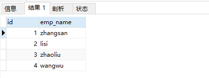

[上一章(变量，过程控制和游标)](./VARIABLE_PROCESS_CONTROL_CURSOR.MD)
# 触发器
MySQL触发器和存储过程一样，都是嵌入到MySQL服务的一段程序。触发器是有时间来出发的某个操作，这些事包括了INSERT,UPDATE,DELETE时间。所谓
时间就是指用户的动作或者出发某项行为，如果定义了触发程序，当数据库执行这些语句的时候，就相当于时间发生了，就会自动触发器执行相应的操作。
当对数据表中的数据执行插入，更新和删除操作，需要自动执行一些数据库逻辑时，可以使用触发器来实现。


## 触发器的创建
```sql
CREATE TRIGGER 触发器名称
{BEFORE|AFTER}{INSERT|UPDATE|DELETE} ON 表名
FOR  EACH ROW
触发器执行的语句块;
```
例子:
```sql
CREATE TABLE trigger_test(id INT PRIMARY KEY AUTO_INCREMENT,emp_name varchar(32));
CREATE TABLE trigger_back_test(id INT PRIMARY KEY AUTO_INCREMENT,emp_name varchar(32));


DELIMITER $
CREATE TRIGGER after_insert
AFTER INSERT ON trigger_test
FOR EACH ROW
BEGIN

INSERT INTO trigger_back_test(emp_name) VALUES (NEW.emp_name);

END $

DELIMITER ;

INSERT INTO trigger_test(emp_name) values('zhangsan');
INSERT INTO trigger_test(emp_name) values('lisi');
INSERT INTO trigger_test(emp_name) values('wangwu');
INSERT INTO trigger_test(emp_name) values('zhaoliu');

SELECT *FROM trigger_back_test;
```


* 触发器的优缺点
    * 优点:1. 触发器可以确保数据的完整性 2.触发器可以帮助我们记录操作日志 3. 触发器可以用在操作数据前，对数据进行合法性校验.
    * 缺点:1. 可读性差 2. 相关的数据的变更，可能导致触发器出错.

* 注意
注意，如果在子表中定义了外键约束，并且外键指定了ON UPDATE/DELETE CASCADE/SET NULL子句，此
时修改父表被引用的键值或删除父表被引用的记录行时，也会引起子表的修改和删除操作，此时基于子
表的UPDATE和DELETE语句定义的触发器并不会被激活。
例如：基于子表员工表（t_employee）的DELETE语句定义了触发器t1，而子表的部门编号（did）字段定
义了外键约束引用了父表部门表（t_department）的主键列部门编号（did），并且该外键加了“ON
DELETE SET NULL”子句，那么如果此时删除父表部门表（t_department）在子表员工表（t_employee）
 


