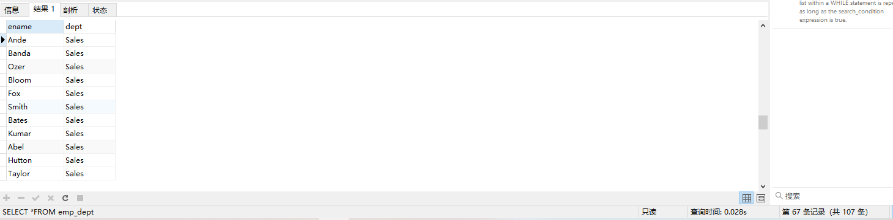
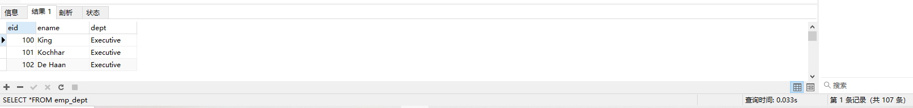
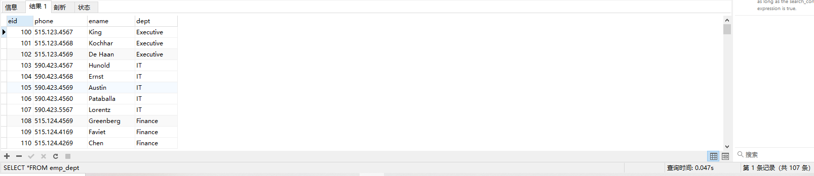

[上一章(约束)](./CONSTRAINT.MD)
# 视图
1. 视图是一种虚拟表，本身不存储数据的，占用很少的内存空间，它是SQL中的一个重要的概念

2. 视图是简历在已有的表的基础上，视图赖以简历的这些表称为基表。


3. 视图的创建和删除只影响视图本省，不影响对应的基表。但是对应视图中的数据进行增加，删除和修改操作时，数据表中的苏剧会相应的发生变化，反之亦然

4. 向视图提高数据内的语句为SELECT语句，可以将视图理解为存储起来的SELECT语句
    * 在数据库中，视图不会保存数据，数据真正保存在数据表中，当对视图中的数据增加，删除和修改操作时，数据表中的苏剧会相应的发生变化，反之亦然。
5. 视图，实现iang用户提供基表数据的另一种表现形式。通常情况下，小型项目的数据库不适应视图，但是在大型项目中，以及数据表比较复杂的情况下，视图
的价值就凸显出来了，它可以帮助我们把经常查询的结果集放到虚拟表中，提升效率.理解和使用起来否非常方便。

语法:
```sql
CREATE [OR REPLACE] 
[ALGORITHM={UNDEFINED|MERGE|TEMPTABLE}]
VIEW 视图名称[(字段列表)]
AS 
[WITH[CASCADED|LOCAL] CHECK OPTION]
-- 精简如下
CREATE VIEW 视图名称
AS 查询语句
```
例子:
```sql
CREATE OR REPLACE VIEW emp_dept(ename,dept)
AS
SELECT 
emp.last_name,dept.department_name
FROM employees emp LEFT JOIN departments dept
ON emp.department_id = dept.department_id;

DESC emp_dept;

SELECT *FROM emp_dept;
```



* 注意
```sql
--  报错The target table emp_dept of the INSERT is not insertable-into
INSERT INTO emp_dept VALUES ('zhangsan','测试部门');
```
## 不可更新视图
要使视图可更新，视图中的行和底层基本表中的行之间必须存在一对一的关系。另外当视图定义出现如下情况，视图不支持更新操作:
* 在定义视图的时候指定了"ALGORITHM=TEMPTABLE",视图将不支持INSERT和DELETE操作。
* 视图中不包含基表中所有被定义为非空又未指定默认值的列，视图将不支持INSERT操作。
* 在dinginess视图的SELECT语句中使用了JOIN联合查询，视图将不支持INSERT和DELETE操作。
*  在定义视图的SELECT语句后的字段列表中使用了数学表达式或者子查询，视图将不支持INSERT,也吃出UPDATE使用了数学表达式，子查询的字段值。
* 在定义视图SELECT语句后的字段中使用了DISTINCT，聚合函数，GROUP BY,HAVING,UION等，视图将不支持INSERT,UPDATE,DELETE。
* 在定义视图的SELECT语句中包含了子查询，而子查询中引用了FROM后面的表，视图将不支持INSER,UPDATE,DELETE。
* 视图定义基于一个不可更新视图
* 常量视图

## 修改视图
```sql
-- 方式1：使用CREATE OR REPLACE VIEW 子句修改视图
CREATE OR REPLACE VIEW emp_dept(eid,ename,dept)
AS
SELECT 
emp.employee_id,emp.last_name,dept.department_name
FROM employees emp LEFT JOIN departments dept
ON emp.department_id = dept.department_id;
-- 方式2
ALTER VIEW emp_dept(eid,phone,ename,dept)
AS
SELECT 
emp.employee_id,emp.phone_number,emp.last_name,dept.department_name
FROM employees emp LEFT JOIN departments dept
ON emp.department_id = dept.department_id;
```




## 删除视图
* 删除是只是删除视图的定义，并不会删除基表的数据
* 删除视图的语法:
```sql
DROP VIEW IF EXISTS 视图的名称;
```
## 视图的优点
1. 操作简单
将经常使用的查询操作定义未视图，可以时开发人员不需要关系视图对应的数据据表的结构，表与表之间的关联关系，也不需要关系数据表之间的业务逻辑和
和查询条件，而只需要简单的操作视图即可，极大的简化了开发人员对数据库的操作。

2. 减少数据冗余
视图跟实际数据表不一样，它存储的是查询语句。所以，在使用的时候，我们要通过定义视图的查询语句来获取结果集。而视图本身不存储数据，不占用存
储的资源每减少了数据冗余。

3. 数据的安全
MySQL将用户的对数据的访问限制在某个数据的结果集上，而这些数据的结果集可以使用视图来实现。用户不必直接查询或者操作数据表。这也可以理解为视图
具有隔离性。视图相当于在用户和实际的数据表之间加了一层虚拟表。同时，MySQL可以根据权限将用户对数据的访问限制在某些视图上，用户不需要查询数据表
，可以直接通过视图获取数据表中的信息。这在一定程度上保障了数据表中数据的安全性。
 
4. 适应灵活多变的需求
当业务系统的需求发生变化后，如果需要改动数据表的结构，则工作量相对较大，可以使用视图来减少改动的工作量。这种方式在实际工作中使用得比较多。

5. 能够分解复杂的查询逻辑
数据库中如果存在复杂的查询逻辑，则可以将问题进行分解，创建多个视图获取数据，再将创建的多个视图结合起来，完成复杂的查询逻辑。


[下一章(存储过程/存储函数)](./STOREDPROCEDURE_STOREDFUNCTION.MD)