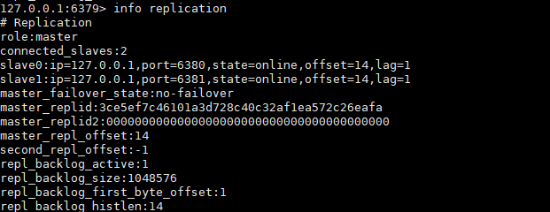
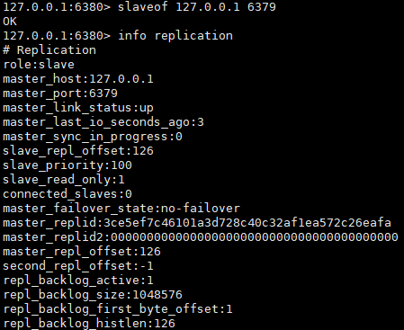
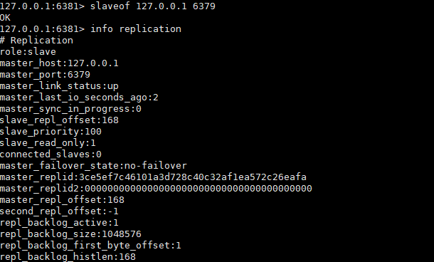

# 主从复制结构的搭建

## 不可自动切换主从的方式

* 新建文件加mkdir -p /usr/local/myredis

* 复制一份配置文件到/usr/local/myredis 
```shell script
cp /etc/redis.conf /usr/local/myredis/redis.conf 
```

* 将redis.conf的配置的aof的文件持久化的方式关闭 appendonly no

* 分别创建配置文件代表不同的实例

```shell script
    touch redis6379.conf
    touch redis6380.conf
    touch redis6381.conf

redis6379.conf

include /usr/local/myredis/redis.conf
pidfile /var/run/redis_6379.pid
port 6379
dbfilename dump6379.rdb
masterauth test@123

redis6380.conf

include /usr/local/myredis/redis.conf
pidfile /var/run/redis_6380.pid
port 6380
dbfilename dump6380.rdb
masterauth test@123

redis6381.conf

include /usr/local/myredis/redis.conf
pidfile /var/run/redis_6381.pid
port 6381
dbfilename dump6381.rdb
masterauth test@123

````

* 分别使用这几分配置文件启动redis服务，代表不同的服务实例
/usr/local/bin/redis-server /usr/local/myredis/redis6379.conf
/usr/local/bin/redis-server /usr/local/myredis/redis6380.conf
/usr/local/bin/redis-server /usr/local/myredis/redis6381.conf


* 客户端连接

    /usr/local/bin/redis-cli -h 127.0.0.1 -p 6379 -a test@123
    /usr/local/bin/redis-cli -h 127.0.0.1 -p 6380 -a test@123
    /usr/local/bin/redis-cli -h 127.0.0.1 -p 6381 -a test@123
    

*　在80和81两台实例分别都执行slaveof 127.0.0.1 6379    slaveof 127.0.0.1 6379

* 执行结果






**情况1：一主两仆**


主机挂掉，执行shutdown
从机info replication还是显示其主机是挂掉的哪个

如果从机挂掉，执行shutdown
主机开始写数据，从机在开启的时候，恢复数据的时候是从主机从头开始追加的

**情况2：薪火相传**

上一个Slave可以是下一个slave的Master，Slave同样可以接收其他 slaves的连接和同步请求，那么该slave作为了链条中下一个的master, 可以有效减轻master的写压力,去中心化降低风险。

从机的大哥是另一台从机的意思
用 slaveof <ip><port> ，中途变更转向:会清除之前的数据，重新建立拷贝最新的
风险是一旦某个slave宕机，后面的slave都没法备份
主机挂了，从机还是从机，无法写数据了

**情况3：反客为主**

当一个master宕机后，后面的slave可以立刻升为master，其后面的slave不用做任何修改
可以使用命令：slaveof no one 将从机变为主机


