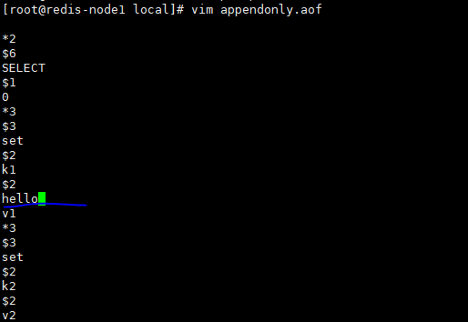
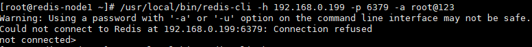
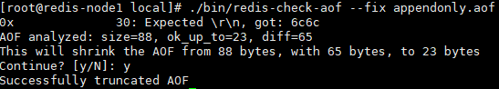

# Redis持久化
* 备份是如何执行的？
Redis会单独创建(fork)一个紫禁城来进行持久化，会先将数据写入到一个临时文件中，待持久化过程都结束了，
再用这个临时文件替换上次持久化好的文件。整个过程中，主进程是不进行任何IO操作的，这就确保了极高的性能，
如果需要进行大规模数据的恢复，且对于数据的恢复的完整性不是非常敏感，那么RDB方式要比AOF方式更加高效。RDB
的缺点是最后一次持久化后的数据不能丢失。


* Fork
fork的作用就是复制一个与当前进程一样的进程。新的进程是所有数据(遍历，环境遍历，程序计数器等)数值都和员进程一直，但是，是一个全新的
进程，并作为原进程的子进程。

在linux程序中,fork()会产生一个和父进程完全相同的子进程，但子进程在此后多次会exec系统调用，处于效率考虑，Linux引入了"写时复制技术"

一般情况下父进程和进程会共用同一段物理内存，只有进程空间的隔断的内容发生变化时，才会将父进程的内容复制一份给子进程。


## RDB
RDB是在指定的时间间隔内将内存中的数据集快照写入磁盘，也就是行话将的Snapshot快照，
它恢复是是将快照文件直接读到内存里。

rdb相关的配置
```shell script
# 硬盘写满了就报错无法写入
stop-writes-on-bgsave-error yes

# RDB压缩
rdbcompression yes
# RDB校验和，如何开启了校验，大约会增加10% 的性能消耗，如果希望获取最大的性能提升，可以关闭此功能。
rdbchecksum yes
# rdb快照文件名字
dbfilename dump.rdb
# 文件存放的为止
dir ./

```

* 优势：
    *　适合大规模的数据恢复
    * 对于数据完整性和一致性要求不搞更适合使用
    *　节省磁盘空间
    * 恢复速度快。
*　劣势
    * fork的时候，内存中的数据被克隆了一份，大致2倍的膨胀性需要考虑。
    * 虽然Redis在fork的时候使用了写时拷贝技术，但是如果数据庞大的时候时比较消耗性能的。
    * 在备份周期在一定时间间隔做一次备份，如果redis服务以为的down了化，就会丢失最后一次的快照后的所有的修改。
        


## AOF
AOF是以日志的形式来记录每个写操作(增量保存)，将Redis执行的所有写指令记录下来(读操作不记录)，
只许追加文件，但不可以改写文件，redis启动指出会读取改文件重新构建数据，换言之，redis重启的话
就根据日志文件的内容将写指令从前到后执行一次以完成数据的恢复工作。

* 注意：如果AOF和RDB都开启了，那么redis会默认的选择AOF优先.

* 配置:

```yaml
# 开启aof
appendonly yes

# The name of the append only file (default: "appendonly.aof")
# 设置文件的名字
appendfilename "appendonly.aof"


```
* 修复aof文件

    * 在aof文件随机添加点文件，破坏它的完整性。

    
    
    * 此时如果再次启动就会出现redis-cli无法连接的情况    
    
     
     
    * 修复aof文件 redis-check-aof --fix appendonly.aof 
        
     
* aof同步频率的设置
    * appendfsync always :始终同步，每次Redis的写入都会立刻记入日志；性能较差，但是，数完整性比较好，
    * appendfsync everysec : 每秒同步，每秒记入日志一次，如果宕机，在宕机的当前秒的数据可能丢失
    * appendfsync no :redis不主动进行同步，把同步的时机交给操作系统。
        
        
        
* Rewrite压缩

1.是什么
```text
AOF采用文件追加的方式，文件会越来越大 ，为了避免出现此种情况，redis新增了重写的机制，当AOFD文件的大小超过了所设定的阈值，Redis就会
启动AOF文件的内容压缩，只保留可以恢复数据的最小指令集，可以使用命令bgrewriteaof
例如我操作了set k1 v1、set k2 v2,经过压缩后就是set k1 v1 k2 v2
```         
2.重写的原理，如何实现重写
```text
AOF文件持续增长而过大，会fork出一条新的进程来将文件重写(也就是先写临时文件最后在rename)。redis4.0版本以后的重写，都是指把rdb
的快照，以二进制的形式附加在aof头部，作为已有的历史数据，替换掉原来的流水操作。
```
**3.no-appendfsync-on-rewrite:**

    1. 如果no-appendfsync-on-rewrite=yes,不写入aof文件俺指写入缓存，用户请求不会阻塞，但是在这段实现如果宕机会丢失这段事件的缓存数据。
    (降低了数据安全性，提高了性能)
    2. 如果no-appendfsync-on-rewrite=no,还是会把数据网磁盘里刷写，但是遇到重写操作没可能会发送阻塞。(数据安全，但是性能降低) 
**4. 触发机制，何时重写**    
```text
# 设置重写的基准值，文件达到 100% 时开始重写（文件是原来重写后文件的 2 倍时触发，也就是128M）
auto-aof-rewrite-percentage 100
# 设置重写的基准值，最小文件 64MB。达到这个值开始重写
auto-aof-rewrite-min-size 64mb

系统载入时或者上次重写完毕时，Redis 会记录此时 AOF 大小，设为 base_size,

如果 Redis 的 AOF 当前大小 >= base_size +base_size*100% (默认) 且当前大小 >=64mb (默认) 的情况下，Redis 会对 AOF 进行重写。

例如：文件达到 70MB 开始重写，降到 50MB，下次什么时候开始重写？100MB
```
**5.重写流程**
```text
1. bgrewriteaof 触发重写，判断是否当前有 bgsave 或 bgrewriteaof 在运行，如果有，则等待该命令结束后再继续执行；

2. 主进程 fork 出子进程执行重写操作，保证主进程不会阻塞；

3. 子进程遍历 redis 内存中数据到临时文件，客户端的写请求同时写入 aof_buf 缓冲区和 aof_rewrite_buf 重写缓冲区，保证原 AOF 文件完整以及新 AOF 文件生成期间的新的数据修改动作不会丢失；

4. 子进程写完新的 AOF 文件后，向主进程发信号，父进程更新统计信息。主进程把 aof_rewrite_buf 中的数据写入到新的 AOF 文件；

5. 使用新的 AOF 文件覆盖旧的 AOF 文件，完成 AOF 重写。

```

## RDB &AOF
* RDB优点：
    * 1.适合大规模的数据恢复

    * 2.对数据完整性和一致性要求不高更适合使用

    * 3.节省磁盘空间

    * 4.恢复速度快 


* RDB缺点：
    * Fork 的时候，内存中的数据被克隆了一份，大致 2 倍的膨胀性需要考虑。

    *　虽然 Redis 在 fork 时使用了写时拷贝技术，但是如果数据庞大时还是比较消耗性能。

    * 在备份周期在一定间隔时间做一次备份，所以如果 Redis 意外 down 掉的话，就会丢失最后一次快照后的所有修改。


* AOF的优点：
    * 备份机制更稳健，丢失数据概率更低。

    * 可读的日志文本，通过操作 AOF 稳健，可以处理误操作。
    
    
* AOF的缺点：
    * 比起 RDB 占用更多的磁盘空间。

    * 恢复备份速度要慢。

    * 每次读写都同步的话，有一定的性能压力。

    * 存在个别 Bug，造成恢复不能。
