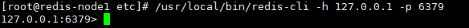

# Redis安装与配置


### 配置好编译环境

需要安装C/C++编译环境
```shell script
yum -y install gcc-c++
```

### 下载源码 
[下载redis-6.2.1](https://github.com/redis/redis/archive/refs/tags/6.2.1.tar.gz)
```shell script
#编译，
make 
# 安装
make install 
# 如果安装的过程中出现了如下的错误 ,只需要执行make distclean命令再次编译即可
make[1]: [persist-settings] Error 2 (ignored)
    CC adlist.o
In file included from adlist.c:34:0:
zmalloc.h:50:31: fatal error: jemalloc/jemalloc.h: No such file or directory
 #include <jemalloc/jemalloc.h>
```

### 修改redis.conf
```shell script
# 后端启动
daemonize yes 
```
* 启动
/usr/local/redis-server /etc/redis.conf




