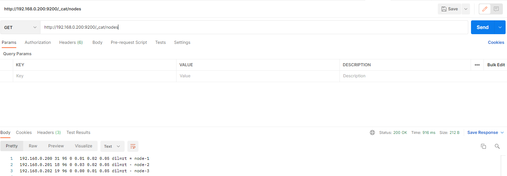

# ELASTICSEARCH的集群安装

## Windows集群安装

[node-1配置](./files/windows/elasticsearch-node-1.yml)

[node-2配置](./files/windows/elasticsearch-node-2.yml)

[node-3配置](./files/windows/elasticsearch-node-3.yml)


* 修改elasticsearch.yml配置文件

```yaml
# 集群名称，每个结点必须相同的集群名称
cluster.name: my-application
# 结点的名字
node.name: node-1
# 表示可以是主结点也可以是数据结点
node.master: true
# 表示可以是数据结点
node.data: true
# 主机名称,ip地址，由于在同一个物理机器内就写localhost就行
network.host: localhost
http.port: 9201
# 集群结点交互的端口
transport.tcp.port: 9301
# 跨域配置
http.cors.enabled: true
http.cors.allow-origin: "*"
# 添加集群发现的配置
discovery.seed_hosts: ["localhost:9301"]
discovery.zen.fd.ping_timeout: 1m
discovery.zen.fd.ping_retries: 5

```

* 分别将elasticsearch的node-1,node-2,node-3启动就可以。


## Linux集群安装

[node-1的配置](./files/linux/elasticsearch-node-1.yml)

[node-2的配置](./files/linux/elasticsearch-node-2.yml)

[node-3的配置](./files/linux/elasticsearch-node-3.yml)


* 下载安装包elasticsearch-7.8.0-linux-x86_64.tar.gz

* 此处需要注意，安装的elaticsearch7.x版本的es需要安装JDK 11 或者以上的版本

* 为eslasticsearch添加专门的用户

        ```
         # 添加es用户   
         useradd es
         # 为es用户添加密码
         passwd es
         # 将elasticsearch目录授权给 es用户和es用户组         
         chown -R es:es /opt/module/elasticsearch-7.8.0
         
        ```
* 修改/opt/module/elasticsearch-7.8.0/config/elasticsearch.yml
        
        ````
        # 加入如下配置
        # #集群名称
        cluster.name: cluster-es
        # #节点名称， 每个节点的名称不能重复
        node.name: node-3
        # #ip 地址， 每个节点的地址不能重复
        network.host: linux3
        # #是不是有资格主节点
        node.master: true
        node.data: true
        http.port: 9200
        # head 插件需要这打开这两个配置
        http.cors.allow-origin: "*"
        http.cors.enabled: true
        http.max_content_length: 200mb
        # #es7.x 之后新增的配置，初始化一个新的集群时需要此配置来选举 master,默认就选node-1就行,也可以定义为node-2或者node-3看自己喜欢
        cluster.initial_master_nodes: ["node-1"]
        # #es7.x 之后新增的配置，节点发现
        discovery.seed_hosts: ["linux1:9300","linux2:9300","linux3:9300"]
        gateway.recover_after_nodes: 2
        network.tcp.keep_alive: true
        network.tcp.no_delay: true
        transport.tcp.compress: true
        # #集群内同时启动的数据任务个数，默认是 2 个
        cluster.routing.allocation.cluster_concurrent_rebalance: 16
        # #添加或删除节点及负载均衡时并发恢复的线程个数，默认 4 个
        cluster.routing.allocation.node_concurrent_recoveries: 16
        # #初始化数据恢复时，并发恢复线程的个数，默认 4 个
        cluster.routing.allocation.node_initial_primaries_recoveries: 16
        ````
        
* 切换到es用户，启动elasticsearch，分别在node-1,node-2,node-3分别启动es

        ```
            ./bin/elasticsearch -d
            
        ```        


* 检测es


```json
GET http://192.168.0.200:9200/_cat/nodes
或者
GET http://192.168.0.200:9200/_cat/health
````