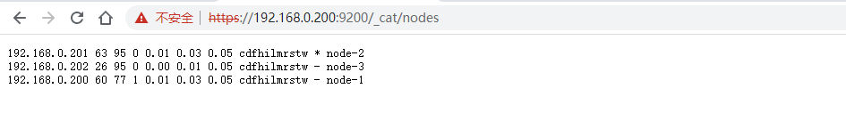
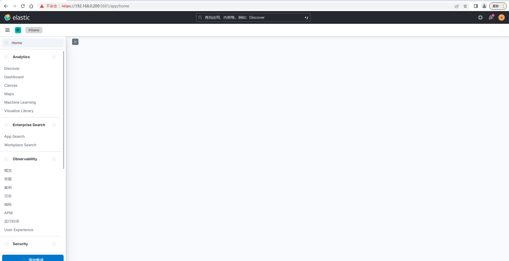

# Elasticsearch安全的集群安装

* 下载elasticsearch 8.x版elasticsearch-8.2.3-linux-x86_64.tar.gz
    * 解压 tar -xzvf elasticsearch-8.2.3-linux-x86_64.tar.gz
* 下载jdk17　jdk-17_linux-x64_bin.tar.gz
    * 解压 tar -xzvf jdk-17_linux-x64_bin.tar.gz
    * 配置环境变量JAVA_HOME=/usr/local/JDK/jdk-17.0.4.1、 PATH=$JAVA_HOME/bin:$PATH、CLASSPATH=$JAVA_HOME/lib、export JAVA_HOME CLASSPATH PATH   
*　创建es用户useradd es、passwd es 

* 分配目录/opt/module/elasticsearch-8.2.3给es用户(需要root权限)chown -R es:es /opt/module/elasticsearch-8.2.3

* 生成CA证书
    ```text
    ./bin/elasticsearch-certutil ca
    warning: ignoring JAVA_HOME=/usr/local/JDK/jdk-17.0.4.1; using bundled JDK
    This tool assists you in the generation of X.509 certificates and certificate
    signing requests for use with SSL/TLS in the Elastic stack.
    
    The 'ca' mode generates a new 'certificate authority'
    This will create a new X.509 certificate and private key that can be used
    to sign certificate when running in 'cert' mode.
    
    Use the 'ca-dn' option if you wish to configure the 'distinguished name'
    of the certificate authority
    
    By default the 'ca' mode produces a single PKCS#12 output file which holds:
        * The CA certificate
        * The CA's private key
    
    If you elect to generate PEM format certificates (the -pem option), then the output will
    be a zip file containing individual files for the CA certificate and private key
    
    Please enter the desired output file [elastic-stack-ca.p12]: 
    Enter password for elastic-stack-ca.p12 : 
  [es@elasticsearch-node1 elasticsearch-8.2.3]$ ./bin/elasticsearch-certutil cert --ca elastic-stack-ca.p12 
  warning: ignoring JAVA_HOME=/usr/local/JDK/jdk-17.0.4.1; using bundled JDK
  This tool assists you in the generation of X.509 certificates and certificate
  signing requests for use with SSL/TLS in the Elastic stack.
  
  The 'cert' mode generates X.509 certificate and private keys.
      * By default, this generates a single certificate and key for use
         on a single instance.
      * The '-multiple' option will prompt you to enter details for multiple
         instances and will generate a certificate and key for each one
      * The '-in' option allows for the certificate generation to be automated by describing
         the details of each instance in a YAML file
  
      * An instance is any piece of the Elastic Stack that requires an SSL certificate.
        Depending on your configuration, Elasticsearch, Logstash, Kibana, and Beats
        may all require a certificate and private key.
      * The minimum required value for each instance is a name. This can simply be the
        hostname, which will be used as the Common Name of the certificate. A full
        distinguished name may also be used.
      * A filename value may be required for each instance. This is necessary when the
        name would result in an invalid file or directory name. The name provided here
        is used as the directory name (within the zip) and the prefix for the key and
        certificate files. The filename is required if you are prompted and the name
        is not displayed in the prompt.
      * IP addresses and DNS names are optional. Multiple values can be specified as a
        comma separated string. If no IP addresses or DNS names are provided, you may
        disable hostname verification in your SSL configuration.
  
  
      * All certificates generated by this tool will be signed by a certificate authority (CA)
        unless the --self-signed command line option is specified.
        The tool can automatically generate a new CA for you, or you can provide your own with
        the --ca or --ca-cert command line options.
  
  
  By default the 'cert' mode produces a single PKCS#12 output file which holds:
      * The instance certificate
      * The private key for the instance certificate
      * The CA certificate
  
  If you specify any of the following options:
      * -pem (PEM formatted output)
      * -multiple (generate multiple certificates)
      * -in (generate certificates from an input file)
  then the output will be be a zip file containing individual certificate/key files
  
  Enter password for CA (elastic-stack-ca.p12) : 
  Please enter the desired output file [elastic-certificates.p12]: 
  Enter password for elastic-certificates.p12 : 
  
  Certificates written to /opt/module/elasticsearch-8.2.3/elastic-certificates.p12
  
  This file should be properly secured as it contains the private key for 
  your instance.
  This file is a self contained file and can be copied and used 'as is'
  For each Elastic product that you wish to configure, you should copy
  this '.p12' file to the relevant configuration directory
  and then follow the SSL configuration instructions in the product guide.
  
  For client applications, you may only need to copy the CA certificate and
  configure the client to trust this certificate.
    ```

* 将生成的elastic-certificates.p12、elastic-stack-ca.p12 移动到 /opt/module/elasticsearch-8.2.3/config/certs

* 生成http证书 ./bin/elasticsearch-certutil http ============>>>>elasticsearch-ssl-http.zip,解压有elasticsearch和kibana
两个目录，将目录里面的elasticsearch-ca.pem、http.p12移动到/opt/module/elasticsearch-8.2.3/config/certs


* 配置/opt/module/elasticsearch-8.2.3/config/elasticsearch.yml
    ```yaml
      # 集群的名字
      cluster.name: es-cluster
      # 节点名称，另外两个是node-2、node-3
      node.name: node-1
      # 存放数据的目录
      path.data: /opt/module/elasticsearch-8.2.3/data
      # 存放日志的目录
      path.logs: /opt/module/elasticsearch-8.2.3/logs
      # 主机ip，node-2的是linux2，node-3 的是linux3
      network.host: linux1
      # 开放端口
      http.port: 9200
      discovery.seed_hosts: ["linux1"]
      # 开启安全认证
      xpack.security.enabled: true
      xpack.security.enrollment.enabled: true
      # 开启https
      xpack.security.http.ssl:
        enabled: true
        keystore.path: /opt/module/elasticsearch-8.2.3/config/certs/http.p12
        truststore.path: /opt/module/elasticsearch-8.2.3/config/certs/http.p12
      xpack.security.transport.ssl:
        enabled: true
        verification_mode: certificate
        keystore.path: /opt/module/elasticsearch-8.2.3/config/certs/elastic-certificates.p12
        truststore.path: /opt/module/elasticsearch-8.2.3/config/certs/elastic-certificates.p12
      # 初始主节点是node-1
      cluster.initial_master_nodes: ["node-1"]
      http.host: [_local_,_site_]
      ingest.geoip.downloader.enabled: false
      xpack.security.http.ssl.client_authentication: none
    ```
* 分别启动node-1 node-2、node-3启动./bin/elasticsearch -d




## 安装kibana

* 下载kibana kibana-8.2.3-linux-x86_64.tar.gz

* 解压 tar -xzvf kibana-8.2.3-linux-x86_64.tar.gz

* 在es的目录下生成kibana的证书 ./bin/elasticsearch-certutil csr -name kibana -dns linux1   ==============>>>>csr-bundle.zip

* 移动证书的位置 mv kibana.csr kibana.key /opt/module/kibana-8.2.3/config/

* 以x509规则生成crt证书 openssl x509 -req -in kibana.csr -signkey kibana.key -out kibana.crt

* 
    ```yaml
      server.port: 5601
      server.host: "linux1"
      i18n.locale: "zh-CN"
      # ES服务主机地址
      elasticsearch.hosts: ["https://linux1:9200"]
      # 访问ES服务的账号密码,es已经内置了kibana的用户，如果不知道密码，可以使用./bin/elasticsearch-reset-password --username kibana重置一个密码
      elasticsearch.username: "kibana"
      elasticsearch.password: "koSQbJ6IB-AbLiuu6uZt"
      
      elasticsearch.ssl.verificationMode: none
      
      elasticsearch.ssl.certificateAuthorities: ["/opt/module/elasticsearch-8.2.3/config/certs/elasticsearch-ca.pem"]
      
      server.ssl.enabled: true
      server.ssl.certificate: /opt/module/kibana-8.2.3/config/kibana.crt
      server.ssl.key: /opt/module/kibana-8.2.3/config/kibana.key

     ```


*　启动kibana ./bin/kibana & 



注意：在这个之前已经使用elastic账号登录
