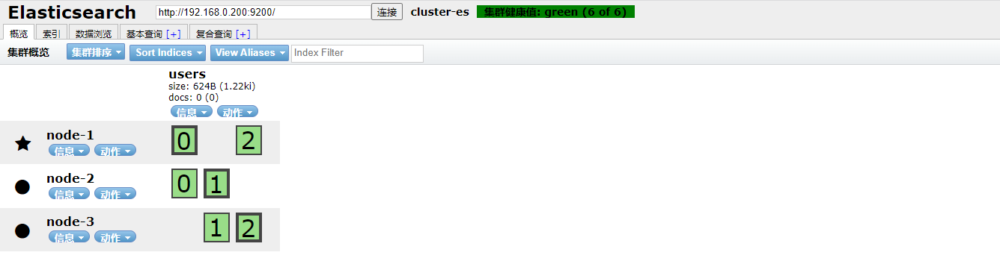
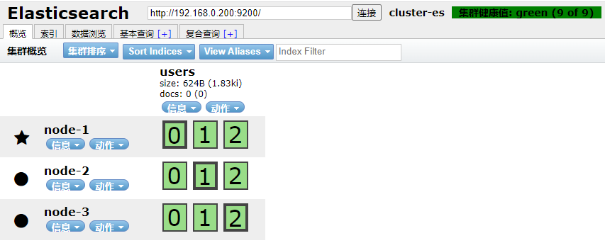
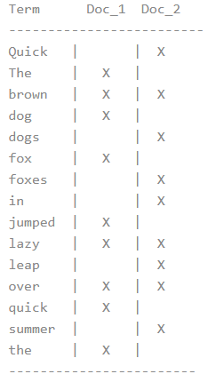
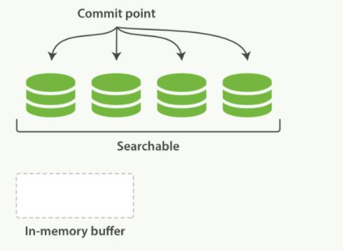

# ELASTICSEARCH的核心概念
索引的功能就类似与我们新华字典前面的目录，目录可以提高查询的效率。

Elasticsearch索引的精髓：一切都是为了提高搜索的性能.


## 映射
```text
    mapping是处理数据的方式和规则方面做了一些限制，如：某个字段的数据类型、默认值、分析器、
是否被索引等等。这些都是映射里面可以设置的，其他的就是处理ES里面的数据的一些使用规则也叫映射，
按着最优规则处理书对性能提高很大，因此才需要建立映射，并且需要思考如何建立映射才能对性能更好。
```
## 分片
```text
   一个索引可以存储超出单个结点硬件限制的大量数据。比如，一个具有10亿文档数据的索引占据1TB的磁盘空间，
而任一节点都可能没有这样大的磁盘空间。或者单个系欸但处理搜索请求，响应太慢。为了解决这个问题，Elastic
search提高了将索引划分为多分的能力，每一份就称之为分片。当你创建一个索引的时候，你可以指定你想要的分片的
数量。每个分片本身也就是一个功能完整并且独立的"索引",这个"索引"可以被防止到集群的任何结点上。
    分片重要的主要原因是：
    1)允许我们水平切割/扩展存储的容量
    2)允许在分片上进行分布式的，并行的操作，进而提高性能/吞吐量

```

## 副本
```text
    在一个网络/云的环境里面，失败随时都可能发生，在某个分片/结点不知道怎么的就处于离线的状态，或者由于任何原因消失了，
这种情况下，有一个故障转移机制是非常有用并且是强烈推荐的。为此目的，ElasticSearch允许我们创建分片的一份或者多份拷贝，
这些拷贝叫做复制分片(副本)
    分片副本的重要的原因：
    1)在分片失败的情况下，提供了高可用性。因为这个原因，注意到复制分片从不与原/主要(original/primary)分片制语同一个结点上是非常重要。
    2)扩展了es的搜索/吞吐量，因为搜索可以在所有的副本上进行并行运行.

```

## 分配(Allocation)
```text
    将分片分配给某个结点的过程，包括分配主分片或者副本。如果是副本，好包括从主分片复制数据的过程。这个过程是有master节点完成的。
```


## 创建分片和副本
```json
PUT http://192.168.0.200:9200/users

{
    "settings": {
        "number_of_shards": 3,
        "number_of_replicas": 1
    }
}
```


* 从图片可以知道所有节点上的都是绿色，表名主分片和副本都可用，如果是黄色，表示主分片可用，副本不可用的状态或者是和主分片一个服务内，
副本无法实现对主分片的高可用。

*　修改副本
```json
PUT http://192.168.0.200:9200/users/_settings
//参数
{
    "number_of_replicas":2
}
//返回结果
{
    "acknowledged": true
}
```
执行后的结果如下：


## 路由计算和分片控制
路由计算：hash(id)%主分片数量=[0,1,2]

* 分片控制
用户可以访问任何一个节点获取数据，这个节点称之为协调节点。


## 数据的写入流程

[流程图](https://app.diagrams.net/#Hchenanddom%2FCharts%2Fmain%2Frepo%2Felasticsearch%E7%9A%84%E5%86%99%E5%85%A5%E6%B5%81%E7%A8%8B.drawio)


* 数据写入流程
    * 1.客户端请求集群节点(任意节点)-协调节点
    * 2.协调节点将请求转换到知道的节点
    * 3.主分片需要将疏忽保存
    * 4.主分片需要将数据发生搭配副本
    * 5.副本保存后，进行反馈
    * 6.主分片进行反馈
    * 7.客户端获取反馈
*　数据的读取流程
    * 1.客户端发送查询请求到协调节点
    * 2.协调节点计算数据所在的分片以及全部的副本位置
    * 3.为了能够负载均衡，可以轮询所有的节点
    * 4.将请求转发给具体的节点
    * 5.节点返回查询结果，将结果反馈给客户端 

* 数据更新流程 
    * 客户端想Node1节点发送更新请求    
    *　它将请求转发到主分片所在的Node3
    * Node3从主分片检索文档，修改_source字段中的JSON，并且尝试重新索引主分片的文档。如果文档已经被另一个经常修改，它会重试步骤3，超过
    retry_on_conflict次后放弃
    * 如果Node3成功地更新文档，它将新版本地文档并行转发到Node1和Node2上地副本分片上，重新建立索引。一旦所有地副本分片都返回成功，
    Node3 向协调节点返回成功，协调节点向客户端返回成功。
    
注意：
    当主分片把更改转发到副本分片时， 它不会转发更新请求。 相反，它转发完整文档的新版本。请记住，这些更改将会异步转发到副本分片，
    并且不能保证它们以发送它们相同的顺序到达。 如果 Elasticsearch 仅转发更改请求，则可能以错误的顺序应用更改，导致得到损坏的文档。


## 倒排索引
```text
Elasticsearch使用一种称为倒排索引的结构，它适用于快速的全文搜索。
见其名，知其意，有倒排索引，肯定会对应有正向索引。正向索引（forward index），反向索引（inverted index）更熟悉的名字是倒排索引。

所谓的正向索引，就是搜索引擎会将待搜索的文件都对应一个文件ID，搜索时将这个ID和搜索关键字进行对应，形成K-V对，然后对关键字进行统计计数。
（统计？？下文有解释）

但是互联网上收录在搜索引擎中的文档的数目是个天文数字，这样的索引结构根本无法满足实时返回排名结果的要求。所以，搜索引擎会将正向索引重新构
建为倒排索引，即把文件ID对应到关键词的映射转换为关键词到文件ID的映射，每个关键词都对应着一系列的文件，这些文件中都出现这个关键词。
```
* 例子:
一个倒排索引由文档中所有不重复词的列表构成，对于其中每个词，有一个包含它的文档列表。例如，假设我们有两个文档，每个文档的content域包含如下内容：
```text

The quick brown fox jumped over the lazy dog
Quick brown foxes leap over lazy dogs in summer
```
为了创建倒排索引，我们首先将每个文档的content域拆分成单独的词（我们称它为词条或tokens )，创建一个包含所有不重复词条的排序列表，
然后列出每个词条出现在哪个文档。结果如下所示：



现在，如果我们想搜索 quick brown ，我们只需要查找包含每个词条的文档：
    


两个文档都匹配，但是第一个文档比第二个匹配度更高。如果我们使用仅计算匹配词条数量的简单相似性算法，那么我们可以说，
对于我们查询的相关性来讲，第一个文档比第二个文档更佳。
但是，我们目前的倒排索引有一些问题：

* Quick和quick以独立的词条出现，然而用户可能认为它们是相同的词。
* fox和foxes非常相似，就像dog和dogs；他们有相同的词根。
* jumped和leap，尽管没有相同的词根，但他们的意思很相近。他们是同义词。

这还远远不够。我们搜索+Quick +fox 仍然会失败，因为在我们的索引中，已经没有Quick了。
但是，如果我们对搜索的字符串使用与content域相同的标准化规则，会变成查询+quick +fox，
这样两个文档都会匹配！分词和标准化的过程称为分析，这非常重要。你只能搜索在索引中出现
的词条,所以索引文本和查询字符串必须标准化为相同的格式。


分词器：

词条：索引中最小存储进和查询单元
词典：字典，词条的集合，B+Tree,HashMap
倒排表：关键词出现的位置和出现的频率。


## 不可变的倒排索引
```text
早期的全文检索会为整个文档集合建立一个很大的倒排索引并将其写入到磁盘。 一旦新的索引就绪，旧的就会被其替换，
这样最近的变化便可以被检索到。倒排索引被写入磁盘后是不可改变的：它永远不会修改。
                1. 不需要锁。如果你从来不更新索引，你就不需要担心进程同时修改数据的问题。
                2. 一旦索引被读入内核的文件系统缓存，便会留在那里，由于其的不可变性。只要文件系统缓存的空间足够大，那么大部分请求都直接走内存，
                    而不需要走磁盘，这样提高了读取的性能
                3. 其它缓存(像filter缓存)，在索引的生命周期内始终有效。它们并不需要在每次数据改变的时候被重建，因为数据不会变化
                4. 写入单个大的倒排索引允许数据被压缩，减少磁盘IO和需要被缓存到内存的索引的使用量。


当然，一个不变的索引也有不好的地方。主要事实是它是不可变的! 你不能修改它。如果你需要让一个新的文档可被搜索，你需要重建整个索引。
这要么对一个索引所能包含的数据量造成了很大的限制，要么对索引可被更新的频率造成了很大的限制。


```

## 动态更新索引

如何在保留不变性的前提下实现倒排索引的更新？

答案是：用更多的索引。通过增加新的补充索引来反映新近的修改，而不是直接重写整个倒排索引。每一个倒排索引都会被轮流查询到,
从最早的开始查询完后再对结果进行合并。

Elasticsearch基于Lucene，这个java库引入了按段搜索的概念。每一段本身都是一个倒排索引，但索引在 Lucene 中除表示所有段的集合外，
还增加了提交点的概念—一个列出了所有已知段的文件。


按段搜索会以如下流程执行：

一、新文档被收集到内存索引缓存。


二、不时地, 缓存被提交。

    1.一个新的段，一个追加的倒排索引，被写入磁盘。
    2.一个新的包含新段名字的提交点被写入磁盘。
    3.磁盘进行同步，所有在文件系统缓存中等待的写入都刷新到磁盘，以确保它们被写入物理文件


三、新的段被开启，让它包含的文档可见以被搜索。

四、内存缓存被清空，等待接收新的文档。



当一个查询被触发，所有已知的段按顺序被查询。词项统计会对所有段的结果进行聚合，以保证每个词和每个文档的关联都被准确计算。这种方式可以用相对较低的成本将新文档添加到索引。

段是不可改变的，所以既不能从把文档从旧的段中移除，也不能修改旧的段来进行反映文档的更新。取而代之的是，每个提交点会包含一个.del 文件，文件中会列出这些被删除文档的段信息。

当一个**文档被“删除”**时，它实际上只是在 .del 文件中被标记删除。一个被标记删除的文档仍然可以被查询匹配到，但它会在最终结果被返回前从结果集中移除。
