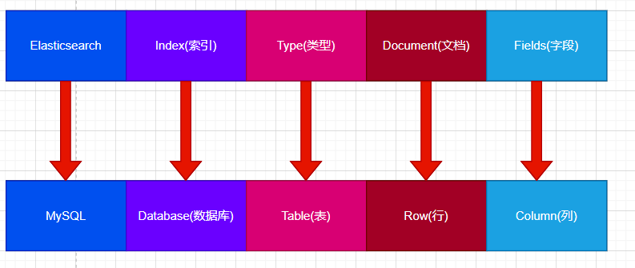

# ELASTICSAEARCH

Elastic里面存储的数据记录就是对应文档和关系型的数据库MySQL存储数据的概念进行类比，
ES里面的Indez可以看作是一个库，而Type就相当于表，Document则相当于MySQL的记录。这里的
Type的概念已经村健弱化了，Elaticseach 6.X中，一个index下已经只能包含一个type，
ElasticSearch 7.X中，Type的概念已经被删除了。





## 创建索引
```json
# 请求
PUT http://127.0.0.1:9200/shopping
# 响应
{
    "acknowledged": true,
    "shards_acknowledged": true,
    "index": "shopping"
}

```
如果重复请求：
```json
{
    "error": {
        "root_cause": [
            {
                "type": "resource_already_exists_exception",
                "reason": "index [shopping/ofVIccNVRp6BF4sYj8VkoQ] already exists",
                "index_uuid": "ofVIccNVRp6BF4sYj8VkoQ",
                "index": "shopping"
            }
        ],
        "type": "resource_already_exists_exception",
        "reason": "index [shopping/ofVIccNVRp6BF4sYj8VkoQ] already exists",
        "index_uuid": "ofVIccNVRp6BF4sYj8VkoQ",
        "index": "shopping"
    },
    "status": 400
}
```

如果使用了POST请求会出现
```json
{
    "error": "Incorrect HTTP method for uri [/shopping] and method [POST], allowed: [PUT, GET, HEAD, DELETE]",
    "status": 405
}
```
## 查看索引
```json
# 请求

GET http://127.0.0.1:9200/shopping

# 响应数据
{
    "shopping": {
        "aliases": {},
        "mappings": {},
        "settings": {
            "index": {
                "creation_date": "1663147488206",
                "number_of_shards": "1",
                "number_of_replicas": "1",
                "uuid": "ofVIccNVRp6BF4sYj8VkoQ",
                "version": {
                    "created": "7080099"
                },
                "provided_name": "shopping"
            }
        }
    }
}
```
* 获取所有索引的
```json
GET http://127.0.0.1:9200/_cat/indices?v

health status index    uuid                   pri rep docs.count docs.deleted store.size pri.store.size
yellow open   shopping ofVIccNVRp6BF4sYj8VkoQ   1   1          0            0       208b           208b

```


## 删除索引
```json
# 请求
DELETE http://127.0.0.1:9200/shopping
# 响应
{
    "acknowledged": true
}


```

## 添加数据到索引
```json
# 请求，如果需要自定义ID就可以在url后面添加id即可
POST http://127.0.0.1:9200/shopping/_doc/1001
# 响应
{
    "_index": "shopping",
    "_type": "_doc",
    "_id": "1001",
    "_version": 1,
    "result": "created",
    "_shards": {
        "total": 2,
        "successful": 1,
        "failed": 0
    },
    "_seq_no": 1,
    "_primary_term": 1
}


```


## 查询数据
```json
# 查询指定的一条数据
GET http://127.0.0.1:9200/shopping/_doc/1001
# 返回结果
{
    "_index": "shopping",
    "_type": "_doc",
    "_id": "1001",
    "_version": 1,
    "_seq_no": 1,
    "_primary_term": 1,
    "found": true,
    "_source": {
        "title": "小米12",
        "category": "手机",
        "images": "https://www.elastic.co/cn/downloads/past-releases/elasticsearch-7-8-0",
        "price": 3999
    }
}
#查询所有的数据
GET http://127.0.0.1:9200/shopping/_search
{
    "took": 1,
    "timed_out": false,
    "_shards": {
        "total": 1,
        "successful": 1,
        "skipped": 0,
        "failed": 0
    },
    "hits": {
        "total": {
            "value": 3,
            "relation": "eq"
        },
        "max_score": 1.0,
        "hits": [
            {
                "_index": "shopping",
                "_type": "_doc",
                "_id": "4edcO4MBRQQU3MLj_keB",
                "_score": 1.0,
                "_source": {
                    "title": "小米12",
                    "category": "手机",
                    "images": "https://www.elastic.co/cn/downloads/past-releases/elasticsearch-7-8-0",
                    "price": 3999
                }
            },
            {
                "_index": "shopping",
                "_type": "_doc",
                "_id": "1001",
                "_score": 1.0,
                "_source": {
                    "title": "小米12",
                    "category": "手机",
                    "images": "https://www.elastic.co/cn/downloads/past-releases/elasticsearch-7-8-0",
                    "price": 3999
                }
            },
            {
                "_index": "shopping",
                "_type": "_doc",
                "_id": "1002",
                "_score": 1.0,
                "_source": {
                    "title": "小米12",
                    "category": "手机",
                    "images": "https://www.elastic.co/cn/downloads/past-releases/elasticsearch-7-8-0",
                    "price": 3999
                }
            }
        ]
    }
}
```
*　按条件查找
```json
GET http://127.0.0.1:9200/shopping/_search
//# 参数
{     //# 查找
    "query": {
        "match": {
            "title": "华为"
        }
    },
//# 分页参数
    "from": 0,
    "size": 2,
    # 设置返回的字段
    "_source":["title","price"],
//# 排序
    "sort":{
        "price":{
            "order":"desc"
        }
    }
}

# 如果查询所有，可以在query的条件里面写match_all{}

```
* 多条件查询
```json
# 请求参数
{
    "query": {
       //# 表示多个条件符合给定的指
        "bool": {
             //# must必须完全匹配条件,should表示或的意思
            "should": [
                {
                    "match": {
                        "title": "小米"
                    }
                },
                {
                    "match": {
                        "title": "华为"
                    }
                }
            ],
            //# 范围的查找需要使用filter进行过滤
            "filter":{
                //# 范围
                "range":{
                    //# 需要过滤范围的字段
                    "price":{
                        //# 过滤指的匹配规则      
                        "gt":3999
                    }
                }
            }
        }
    }
}
```
注意：
上面的的查询的操作并没有完全对值进行匹配，但是我们的却可以取出来，如果需要全值匹配就需要使用match_phrase;


* 统计
```json
{
    "aggs":{
      // 进行统计，此处是对本次统计计算一个名字
        "price_min":{
            // 可以是max,min,avg.
            "min":{
                // 进行统计行数的字段
                "field":"price"
            }
        }
    },
    "size":0
}
```


## 数据的修改

### 真个文档的替换的修改
```json
PUT http://127.0.0.1:9200/shopping/_doc/1001
#参数
{
    "doc": {
        "price": 5999
    }
}

# 响应
{
    "_index": "shopping",
    "_type": "_doc",
    "_id": "1001",
    "_version": 2,
    "result": "updated",
    "_shards": {
        "total": 2,
        "successful": 1,
        "failed": 0
    },
    "_seq_no": 3,
    "_primary_term": 1
}
```


### 局部的修改
```json
POST http://127.0.0.1:9200/shopping/_update/1001
#参数
{
    "doc": {
        "price": 5999
    }
}
# 响应
{
    "_index": "shopping",
    "_type": "_doc",
    "_id": "1001",
    "_version": 3,
    "result": "updated",
    "_shards": {
        "total": 2,
        "successful": 1,
        "failed": 0
    },
    "_seq_no": 4,
    "_primary_term": 1
}

```

## Mapping 映射的创建
````json
{
    "properties":{
            "name":{
                "type":"text",
                "index":true
            },
            "age":{
                "type":"integer",
//表示可以检索
                "index":true
            },
            "sex":{
//表示关键字，不可以分词查找，只能全值匹配
                "type":"keyword",
//表示可以检索
                "index":true
            },
            "telePhone":{
//表示关键字，不可以分词查找，只能全值匹配
                "type":"keyword",
                //表示不可以检索
                "index":false
            }
    }
}
````


