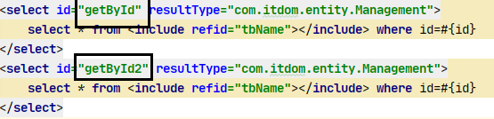

# MyBatis


## MyBatis缓存
```text
为了提高服务的并发性能，所有引入了缓存，也许说到缓存象到的是redis，但是，
实际的项目开发中需要有多级缓存。因为多级缓存的存在，可以减少了数据库的网络
IO和磁盘IO，减少了在IO上的消耗，增加了系统的并发性能.MyBatis也作为一个出
色的ORM框架也是拥有了出色的缓存机制，主要包括了一级缓存和二级缓存。MyBatis的
一级缓存默认是打开的，而且mybatis的一级缓存解决了DBMS的脏读和不可重复读的问题。
mybatis的以及缓存主要与sqlsession相关联。如果sqlSession关闭了缓存会清空，如果
做了update操作(不是xml的文件的标签)也会清除缓存，在提交事务commit和回滚事务 
rollback都会轻触缓存
```


### MyBatis命中缓存的规则
条件一:要求查询的StatementId必须相同，否则无法命中缓存，及时两个拆线呢语句，参数都完全一样。

```java
ManagementMapper mapper = sqlSession.getMapper(ManagementMapper.class);
List<Management> managementList = mapper.getById(1);
List<Management> managementList2 = mapper.getById2(1);
```

条件二:要求传递给SQL的查询参数必须相同，否则无法命中缓存
```xml
    <select id="getById4" parameterType="java.util.Map" resultType="com.itdom.entity.Management">
        select * from <include refid="tbName"></include> where id=#{id}
    </select>
```

```java
        ManagementMapper mapper = sqlSession.getMapper(ManagementMapper.class);

        Map<String, Object> map = new HashMap<String, Object>();
        map.put("id",1);
        map.put("test",2);
        List<Management> managementList = mapper.getById4(map);
        Map<String, Object> map2 = new HashMap<String, Object>();
        map2.put("id",1);
        map2.put("test",2);
        List<Management> managementList2 = mapper.getById4(map2);
```
执行结果如下:
```text
21:59:26.146 [main] DEBUG org.apache.ibatis.transaction.jdbc.JdbcTransaction - Setting autocommit to false on JDBC Connection [com.mysql.cj.jdbc.ConnectionImpl@41a0aa7d]
21:59:26.161 [main] DEBUG com.itdom.mapper.ManagementMapper.getById4 - ==>  Preparing: select * from management where id=?
21:59:26.210 [main] DEBUG com.itdom.mapper.ManagementMapper.getById4 - ==> Parameters: 1(Integer)
21:59:26.245 [main] DEBUG com.itdom.mapper.ManagementMapper.getById4 - <==      Total: 1
```


