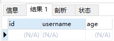
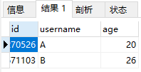
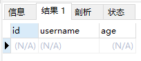
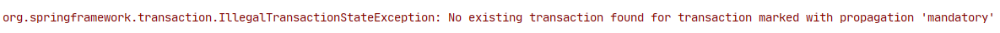
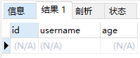
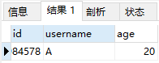
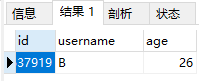
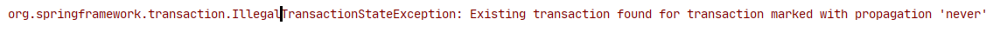
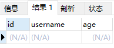

# Spring事务的传播级别

## PROPAGATION_REQUIRED
Spring事务默认使用的的事务传播级别是required，从@Transactional注解我们就可以知道了
```java
	Propagation propagation() default Propagation.REQUIRED;
```
使用该级别的特点是，如果上下文以及存在事务，那么就加入到事务中执行，如果当前上下文中不存在事务，则新建事务执行，索引这个级别通常能够
满足处理大多数的业务场景。
* 例子：
```java
@Service
public class IUserService /*extends IService<User> */{
    Propagation
    @Autowired
    private UserMapper userMapper;

    public void insertA(){
        User user = new User();
        user.setAge(20);
        user.setUsername("A");
        int count = userMapper.insert(user);
    }
    @Transactional
    public void insertTest(){
        insertA();
        insertBC();
    }

    public void insertBC(){
        insertB();
        double i = 10/0;
        insertC();
    }
    public void insertB(){
        User user = new User();
        user.setAge(26);
        user.setUsername("B");
        int count = userMapper.insert(user);
    }
    public void insertC(){
        User user = new User();
        user.setAge(28);
        user.setUsername("C");
        int count = userMapper.insert(user);
    }
}

```
执行的结果入下图：



* 结论：

PROPAGATION_REQUIRED传播级别是可以在上下级别的调用方法中实现对数据的同一事务操作的。


## PROPAGATION_SUPPORTS
该级别事务的特点是：如果存在事务，那么就加入该事务，如果不存在，就使用非事务的方式执行
例子：
```java
    public void insertTest(){
        insertA();
        insertBC();
    }
    @Transactional(propagation = Propagation.SUPPORTS)
    public void insertBC(){
        insertB();
        double i = 10/0;
        insertC();
    }
```

```java
 @Transactional(propagation = Propagation.REQUIRED)
    public void insertTest(){
        insertA();
        insertBC();
    }
    @Transactional(propagation = Propagation.SUPPORTS)
    public void insertBC(){
        insertB();
        double i = 10/0;
        insertC();
    }
```


* 结论:

PROPAGATION_SUPPORTS ，从字面意思就知道，supports，支持，该传播级别的特点是，如果上下文存在事务，则支持事务加入事务，如果没有事务，
则使用非事务的方式执行。所以说，并非所有的包在transactionTemplate.execute中的代码都会有事务支持。这个通常是用来处理那些并非原子性的
非核心业务逻辑操作。应用场景较少。


## PROPAGATION_MANDATORY

示例：
[TransactionPropagationTest](./src/test/java/com/itdom/TransactionPropagationTest.java)
```java
    @Test
//    @Transactional
    public void propagationRequiredTest() {
        userService.insertBC();

    }
```
执行结果1：



```java
    @Test
    @Transactional
    public void propagationRequiredTest() {
        userService.insertBC();
    }
```
执行结果2：




## PROPAGATION_REQUIRES_NEW

例子：
```java
    public void propagationRequiredTest() {
        userService.insertA();
        userService.insertBC();

    }
 @Transactional(propagation = Propagation.REQUIRES_NEW)
    public void insertBC() {
        insertB();
        double i = 10 / 0;
        insertC();
    }
```
执行结果：



* 结论：
由上面的结果可以知道，A插入了，但是B回滚了，说明A和B不在同一个事务里面

## PROPAGATION_NOT_SUPPORTED


例子：
```java
    @Test
    @Transactional
    public void propagationRequiredTest() {
        userService.insertA();
        userService.insertBC();

    }
    @Transactional(propagation = Propagation.NOT_SUPPORTED)
    public void insertBC() {
        insertB();
        double i = 10 / 0;
        insertC();
    }
```
执行结果：



* 结论：
只有B数据入库了，说明insertBC方法中没有事务来做回滚，而A数据没有入库，是因为test方法有自己的事务，因为insertBC方法中出现异常，
所以回滚了，这说明了insertBC方法根本没有用到test方法的事务。
综上测试，可以得出传播级别为NOT_SUPPORTED时，即使当前有事务，也会把事务挂起，自己不使用事务去运行数据库操作，查询数据的操作用
这种传播级别就比较合适。

## PROPAGATION_NEVER

```java
    @Test
    @Transactional
    public void propagationRequiredTest() {
        userService.insertA();
        userService.insertBC();

    }
    public void insertA() {
        User user = new User();
        user.setAge(20);
        user.setUsername("A");
        int count = userMapper.insert(user);
    }

    @Transactional(propagation = Propagation.NEVER)
    public void insertBC() {
        insertB();
        double i = 10 / 0;
        insertC();
    }
```
执行结果：



## PROPAGATION_NESTED


例子：
```java
    @Test
    @Transactional
    public void propagationRequiredTest() {
        userService.insertA();
        userService.insertBC();

    }
    public void insertA() {
        User user = new User();
        user.setAge(20);
        user.setUsername("A");
        int count = userMapper.insert(user);
    }

    @Transactional(propagation = Propagation.NESTED)
    public void insertBC() {
        insertB();
        double i = 10 / 0;
        insertC();
    }
```
执行结果：



* 结论：
通过上面的执行结果可以知道，A和B都没有插入，说明都进行了事务回滚，但是它们不是在同一个事务进行的回滚
标注了nested的事务是以单独的子事务执行的回滚。