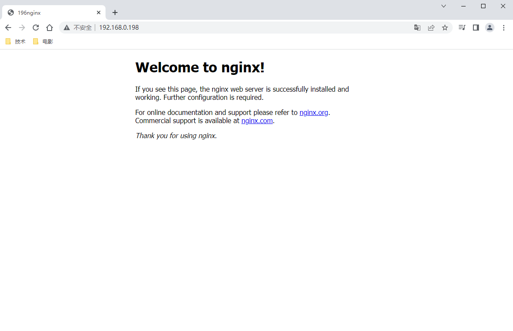

# Keepalived
```text
    keepalived是一个类似于layer3, 4 & 5交换机制的软件，也就是我们平时说的第3层、第4层和第5层交换。Keepalived是自动完成，不需人工干涉。
    Keepalived的作用是检测服务器的状态，如果有一台web服务器宕机，或工作出现故障，Keepalived将检测到，并将有故障的服务器从系统中剔除，
同时使用其他服务器代替该服务器的工作，当服务器工作正常后Keepalived自动将服务器加入到服务器群中，这些工作全部自动完成，不需要人工干涉，
需要人工做的只是修复故障的服务器。
```
* keepalived的运行原理
```text
Layer3,4,5工作在IP/TCP协议栈的IP层，TCP层，及应用层,原理分别如下：

Layer3：Keepalived使用Layer3的方式工作式时，Keepalived会定期向服务器群中的服务器发送一个ICMP的数据包（即我们平时用的Ping程序）,
如果发现某台服务的IP地址没有激活，Keepalived便报告这台服务器失效，并将它从服务器群中剔除，这种情况的典型例子是某台服务器被非法关机。
Layer3的方式是以服务器的IP地址是否有效作为服务器工作正常与否的标准。

Layer4:如果您理解了Layer3的方式，Layer4就容易了。Layer4主要以TCP端口的状态来决定服务器工作正常与否。如web server的服务端口一般是80，
如果Keepalived检测到80端口没有启动，则Keepalived将把这台服务器从服务器群中剔除。

Layer5：Layer5对指定的URL执行HTTP GET。然后使用MD5算法对HTTP GET结果进行求和。如果这个总数与预期值不符，那么测试是错误的，服务器将
从服务器池中移除。该模块对同一服务实施多URL获取检查。如果您使用承载多个应用程序服务器的服务器，则此功能很有用。此功能使您能够检查应用程
序服务器是否正常工作。MD5摘要是使用genhash实用程序（包含在keepalived软件包中）生成的。

SSL_GET与HTTP_GET相同，但使用SSL连接到远程Web服务器。
MISC_CHECK：此检查允许用户定义的脚本作为运行状况检查程序运行。结果必须是0或1.该脚本在导演盒上运行，这是测试内部应用程序的理想方式。可以
使用完整路径（即/path_to_script/script.sh）调用可以不带参数运行的脚本。那些需要参数的需要用双引号括起来
（即“/path_to_script/script.sh arg 1 ... arg n”）
```
总结:为了使用keepalived实现高可用，keepalive使用的是主备的方式，主服务(高优先级)，备服务(低优先级)。只要主服务还是启动，那么备用服务
会一直运行，但是不对外服务，一旦主服务当即，备用服务就升级为主服务对外进行服务，如果，主服务恢复，那么就备用服务就继续恢复到备用服务的状态


## 搭建示例

### 安装nginx

[nginx代码](./files/nginx-1.22.0.tar.gz)

```shell script
# 解压nginx压缩包
tar -xzvf nginx-1.22.0.tar.gz 
#配置安装路径
./configure --prefix=/usr/local/nginx
# 此时可能缺少相关的依赖，此时就需要安装相关的依赖
 yum install gcc‐c++
 yum install ‐y pcre pcre‐devel
 yum install ‐y zlib zlib‐devel
 yum install ‐y openssl openssl‐devel
#编译安装
make & make install

```


### 安装keepalived
```shell script
# 安装keeepalived
yum -y install keepalived
# 可能提示缺少依赖，此处是我安装的是提示缺少依赖时需要下载的rpm包
 wget https://repo.mysql.com/yum/mysql-5.7-community/el/7/x86_64/mysql-community-libs-compat-5.7.34-1.el7.x86_64.rpm
# 安装rpm包
rpm -ivh mysql-community-libs-compat-5.7.34-1.el7.x86_64.rpm
```


#### 配置keepalived.conf
修改/etc/keepalived/keepalived.conf配置文件
[keepalived.conf](./files/keepalived.conf)
```shell script
[root@nginx-keepalive-node1 nginx]# vim /etc/keepalived/keepalived.conf 

! Configuration File for keepalived

global_defs {
   router_id LVS_DEVEL
}

vrrp_script check_nginx {
  #脚本存放的位置
  script "/root/nginx_check.sh"
  # 间隔2秒调用一次检测脚本
  interval 2
  # 如果检测时报优先级就-5
  weight -5
  # 执行脚本的用户和用户组
  user root root
}


vrrp_instance VI_1 {
    # 标识当前keepalived的状态，如果时主服务器就是MASTER，如果时备用服务器就是BACKUP
    state MASTER
    #网卡
    interface ens33
    # 虚拟路由id，要唯一
    virtual_router_id 51
    # 优先级，主服务的优先级最大
    priority 100
    advert_int 1
    authentication {
        auth_type PASS
        auth_pass 1111
    }
    #虚拟ip
    virtual_ipaddress {
        192.168.0.198
    }
    #检测脚本的方法，此处可以写多个
    track_script {
       check_nginx

   }
}
```
nginx_check.sh
```shell script
#!/bin/bash
A=`ps -C nginx --no-header |wc -l`
if [ $A -eq 0 ];then
 /usr/local/nginx/sbin/nginx

 if [ `ps -C nginx --no-header |wc -l` -eq 0 ];then
    killall keepalived
 fi
fi
```
### 试用

执行脚本
```shell script
systemctl stop keepalived.service
```

从上面可以看到，keepalived在关闭之前，主服务一直在对外服务，所以只看到196的nginx对外服务
关闭了keepalived服务之后197升级为对外服务的服务器，所以页面就编程197的


