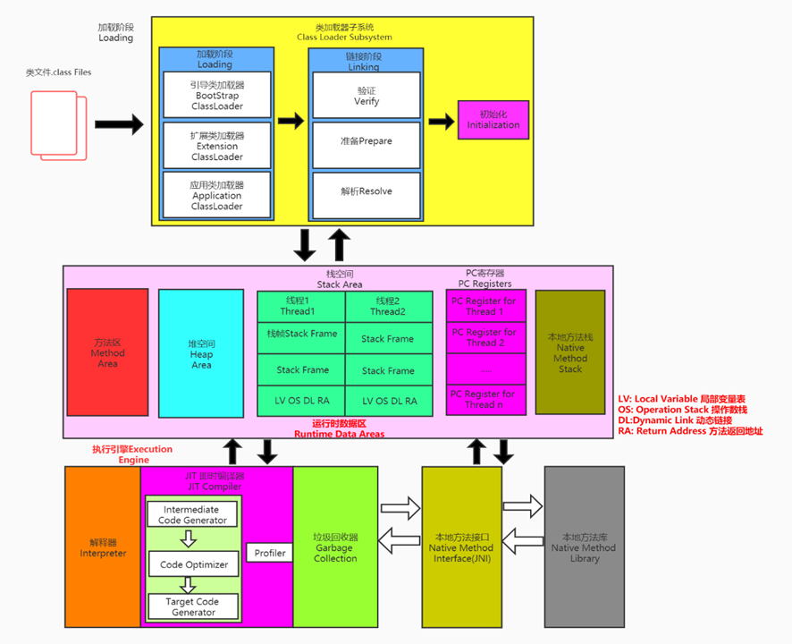
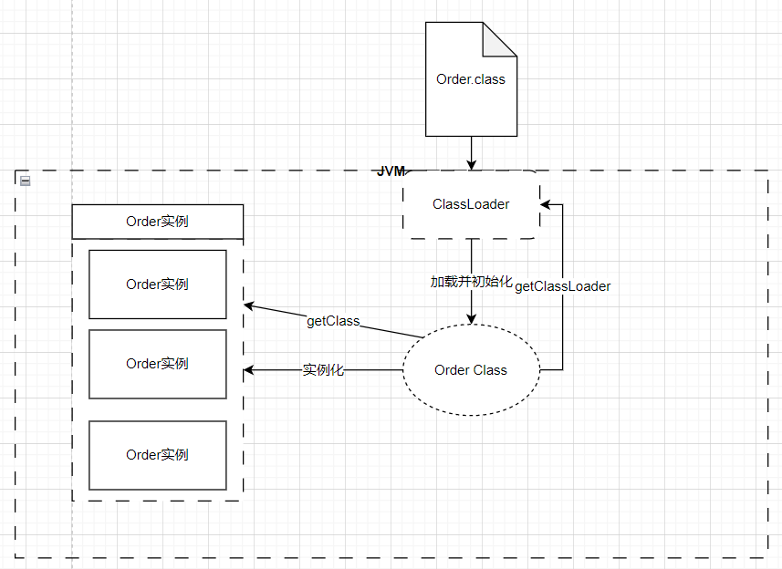

# 类加载子系统


* 类加载器的相关概念
  * 类加载器子系统负责从文件系统或者网络加载Class文件，Class文件在文件开头有特定的饿文件标识。
  * ClassLoader只负责class文件的加载，制语它是否可以运行，则有Execution Engine决定
  * 加载的类信息存放于一块称为方法去的内存空间。除了类的信息外，方法区中还会存放运行时的常量池信息，可能包括字符串字面量和数字常量(这部分常量信息
    是Class文件中常量池部分的内存映射)
* 类加载器ClassLoader角色
  * class file存在于本地硬盘上，可以理解未设计师在之上的模板，而最终在这个模板在执行的时候要加载到JVM当中来根据这个文件实例化出n个一模一样的实例
  * class file加载到JVM中，被称为DNA元数据模板，放在方法区
  * 在.class文件->JVM->最终为元数据模板，此过程就要一个运输工具(类加载其 Class Loader)扮演一个快递元的角色
  



* 类的加载过程
    * 验证(Verify) 
       * 目的在于确保Class文件的字节流中包含信息符合当前虚拟机要求，保障被加载的类的正确性，不会危害虚拟机自身的安全。
       * 主要包括四种验证，文件格式验证，元数据验证，字节码验证，符号引用验证。
    * 准备(Prepare)
       * 为类变量分配内存并且设置该类变量的默认初始化值，即零值
       * 这里不包含使用final修饰的static，因为final在编译的时候会分配了，准备阶段会显示的初始化
       * 在理不会为实例变量分配初始化，类变量会分配在方法区中，而实例变量是会随着对象一起分配到Java堆中
    * 解析(Resolve)
       * 将常量池内的符号引用转换为直接引用的过程
       * 事实上，戒心操作王五会伴随这JVM在执行完成之后在执行
       * 符号引用就是一组符号来表述所引用的目标，符号引用的字面量形式明确定义在《java虚拟机规范》的Class文件格式中。直接引用就是直接指向目标
          的指针、相对偏移量或者一个建姐定位到目标的句柄
       * 戒心动作主要针对类或者接口、字段、类方法、接口方法，方法类型等，对应常量池中的CONSTANT_Class_info、CONSTANT_Fieldref_info、
         CONSTANT_Methodref_info等


```java
public class CustomerClazz {
    public static int n=1;//prepare环节只会赋值为0值--->initing(初始化阶段)才将n=1
    static {
        n=20;
    }


    public static void main(String[] args) {
        System.out.println(n);
    }
}
```


## 类加载器分类
* 虚拟机自带的加载器
    * 启动类加载其(引导类加载器，Bootstrap ClassLoader)
        * 这个类加载使用C/C++语言实现的，嵌套在JVM内部
        * 它用来加载Java的核心库(JAVA_HOME/jre/lib/rt.jar、resources.jar或者sun.boot.class.path路径下的内容)，用于提供JVM自身需要
        的类
        * 并不继承子java.lang.ClassLoader，没有父加载器
        * 加载扩展类和应用程序类加载其，并指定为他们的父类加载器
        * 处于安全考虑，Bootstap启动类加载器只加载包名为java、javax、sun等开头的类
    * 扩展类加载器(Extension ClassLoader)
        * Java语言编写，由sun.misc.Launcher$ExtClassLoader.
        * 派生于ClassLoader类
        * 父类加载器为启动类加载器
        * 从java.ext.dirs系统属性所指定的目录中加载类库，或者从JDK的安装目录下的jre/lib/ext子目录(扩展目录)下加载类库。如果用户创建的JAR
          放在此目录下，也会自带由扩展类加载器加载。
    * 应用程序类加载器(系统类加载器，AppClassLoader)
        * java语言编写，由sun.misc.Launcher$AppClassLoader实现
        * 派生于ClassLoader类
        * 父类加载器为扩展类加载器
        * 它负责加载环境变量classpath或者系统属性 java.class.path指定路径下的类库
        * 该类加载是程序中默认的类加载器，一般来说，Java应用的类都是由它来完成加载的
        * 通过ClassLoader#getSystemClassLoader()方法可以获取该类加载器.


* 示例代码1
```java
public class ClassLoaderTest {
    public static void main(String[] args) {
        //获取系统类加载器
        ClassLoader systemClassLoader = ClassLoader.getSystemClassLoader();
//        两次获取系统类加载器的值都相同：sun.misc.Launcher$AppClassLoader@18b4aac2 ，这说明系统类加载器是全局唯一的
        System.out.println(systemClassLoader);//sun.misc.Launcher$AppClassLoader@18b4aac2
        //获取其上层:扩展类加载器
        ClassLoader extClassLoader = systemClassLoader.getParent();
        System.out.println(extClassLoader);//sun.misc.Launcher$ExtClassLoader@38af3868
        //获取其上层：获取不到引导类加载器
        ClassLoader bootStrapClassLoader = extClassLoader.getParent();
//        我们尝试获取引导类加载器，获取到的值为 null ，这并不代表引导类加载器不存在，因为引导类加载器右 C/C++ 语言，我们获取不到
        System.out.println(bootStrapClassLoader);//null
        //对于用户自定义类来说:默认使用系统类加载其进行加载
        ClassLoader classLoader = ClassLoaderTest.class.getClassLoader();
//        两次获取系统类加载器的值都相同：sun.misc.Launcher$AppClassLoader@18b4aac2 ，这说明系统类加载器是全局唯一的
        System.out.println(classLoader);//sun.misc.Launcher$AppClassLoader@18b4aac2
        //String类使用引导类加载器进行加载的，
        ClassLoader classLoader1 = String.class.getClassLoader();
        System.out.println(classLoader1);//null
    }
}
```
* 示例代码2
```java
public class ClazzLoaderTest2 {
    public static void main(String[] args) {

        System.out.println("--------------启动类加载器--------------------");
        //获取BootstrapClassLoader能够加载的api路径
        URL[] urLs = Launcher.getBootstrapClassPath().getURLs();
        for (URL urL : urLs) {
            System.out.println(urL.toString());
        }
        /**
         * 执行结果:
         * --------------启动类加载器--------------------
         * file:/D:/develop_software/JDK/install_package/jdk-8u311/jre/lib/resources.jar
         * file:/D:/develop_software/JDK/install_package/jdk-8u311/jre/lib/rt.jar
         * file:/D:/develop_software/JDK/install_package/jdk-8u311/jre/lib/sunrsasign.jar
         * file:/D:/develop_software/JDK/install_package/jdk-8u311/jre/lib/jsse.jar
         * file:/D:/develop_software/JDK/install_package/jdk-8u311/jre/lib/jce.jar
         * file:/D:/develop_software/JDK/install_package/jdk-8u311/jre/lib/charsets.jar
         * file:/D:/develop_software/JDK/install_package/jdk-8u311/jre/lib/jfr.jar
         * file:/D:/develop_software/JDK/install_package/jdk-8u311/jre/classes
         */
        System.out.println("--------------------扩展类加载器-------------------------------");
        String extDirs = System.getProperty("java.ext.dirs");
        for (String path : extDirs.split(";")) {
            System.out.println(path);
        }
        /**
         * 执行结果:
         * D:\develop_software\JDK\install_package\jdk-8u311\jre\lib\ext
         * C:\WINDOWS\Sun\Java\lib\ext
         */
    }
}
```


  

