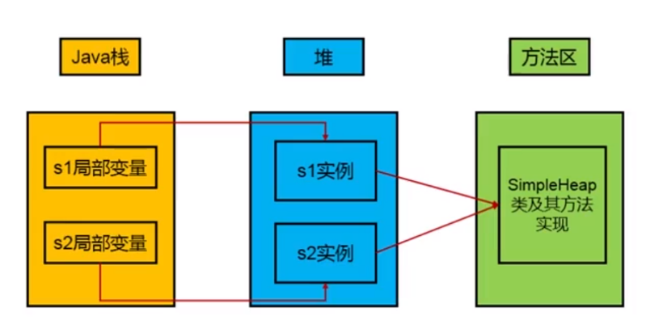

# 堆
```text
    根据<<Java虚拟机规范>>中对Java堆的描述,所有Java对象实例和数据对象都应该在运行时分配在堆上。从实际的角度上看，"几乎"所有的对象实例都分配在
堆内存。对象和数组可能永远不会保存在栈中，因为栈帧中保存了引用，这个引用指向对象或者数组在堆中的位置。方法在执行完毕之后，堆中的对象不会马上回收，
需要在后期垃圾收集器进行垃圾回收的时候进行对象的回收，堆也是垃圾收集器进行垃圾收集的重点区域。
```
## 堆的核心概述

```markdown
* Java7及之前对内存逻辑分为三个部分:新生代+年老代+永久区
    * Young Generation Space新生代 Youn/New
        * 又被划分位Eden区和Survivor区
    * Tenure generation space 年老区 Old/Tenure
    * Permanet Space  永久区
* Java8及之后对内存逻辑分为三个部分:新生代+年老代+元数据区
    * Young Generation Space新生代 Youn/New
        * 又被划分位Eden区和Survivor区
    * Tenure generation space 年老区 Old/Tenure
    * Meta Space  元空间
```


