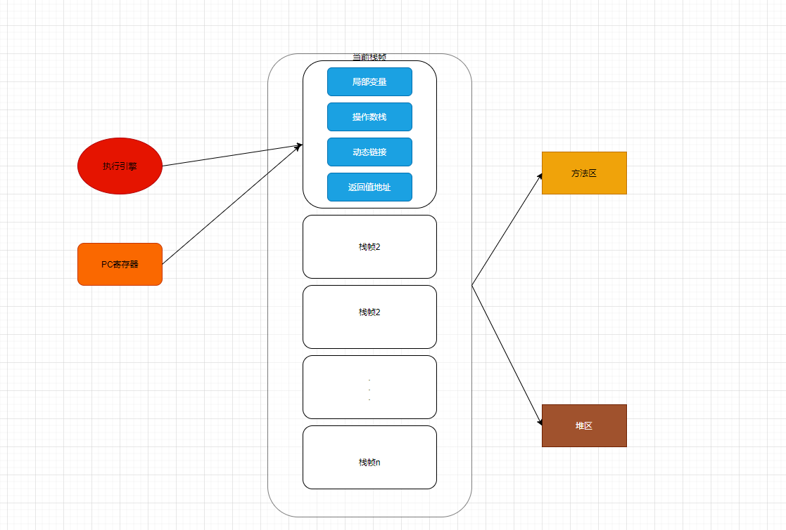

## PC寄存器
```markdown
JVM中的程序计数器(Program Counter Register)中，Register的命名源于CPU的寄存器，寄存器存储之类相关的现场信息，
CPU只有把数据装在到寄存器才能够运行。(这里的PC寄存器只是对实际的物理寄存器的一个抽象，也称为程序钩子)

```
* 作用:用来存储指向下一天指令的地址，也即将要执行的指令diamagnetic。有执行引擎读取下一条指令。

[PC寄存器](https://app.diagrams.net/#Hchenanddom%2FCharts%2Fmain%2Frepo%2FJVM%E8%BF%90%E8%A1%8C%E6%97%B6%E6%95%B0%E6%8D%AE%E5%8C%BA.drawio)



PC寄存器的解释：

```markdown
* PC寄存器时一小块不起眼的内存，但是，它的执行速度时非常的快的，它是线程私有的，每个线程都有自己的PC寄存器，任何线程都有且只有一个方法在执行，也就是
栈里面的当前方法，程序计数器会存储线程执行的方法的地址，但是，如果是native方法，则是未指定值(undefined)
* PC寄存器是程序控制流的指示器，分支，循环，跳转，异常处理，线程恢复等基础过年都需要依赖这个计数器来完成
* 字节码解释器工作时就是通过改变这个计数器的值来选取下一天需要执行的字节码指令
* PC寄存器时唯一一个在Java虚拟机规范中没有规定任何OutOfMemoryError情况的发区域。
```


## 常见的问题
1. 使用PC寄存器存储的字节码指令地址有什么作用？为什么使用PC寄存器记录当前线程执行的地址呢？
```text
单核CPU高速的运转，要实现多程序类似同时运行的效果就需要不断的切换各个程序的线程，达到切换运行的效果，如果切换会原来的线程知道从哪里开始执行.
JVM的字节码解释器就需要改变PC寄存器的值来明确下一条应该执行什么样的字节码指令。
```
2. PC寄存器为什么会被设定为线程私有的呢？
```text
在单核CPU的情况下，一个时间内只能执行一个线程的方法，CPU不断的切换线程，这样到自己经常的中断或者恢复，如何保证不会出差错？最好的办法就是准确的
记录各个线程正在执行的当前字节码指令的地址，最好的办法自然就是为每一个线程分配一个PC寄存器，这样依赖各个线程之间便可以进行独立计算，不会干扰其他线程。
```


* 涉及的概念：
  * cpu时间片：
```markdown
* 时间片即CPU分配给各个程序的时间，每个进程被分配一个时间段，称作它的时间片，即该进程允许运行的时间，使各个程序从表面上看是同时进行的。
如果在时间片结束时进程还在运行，则CPU将被剥夺并分配给另一个进程。如果进程在时间片结束前阻塞或结束，则CPU当即进行切换。而不会造成CPU资源浪费。
* 在宏观上：我们可以同时打开多个应用程序，每个程序并行不悖，同时运行。
* 微观上：由于只有一个CPU，一次只能处理程序要求的一部分，如何处理公平，一种方法就是引入时间片，每个程序轮流执行。

```


