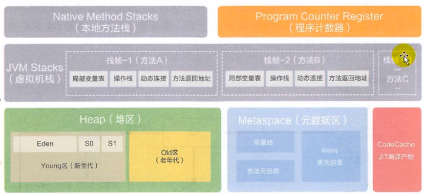

# 运行时数据区
```text
    内存时非常重要的系统资源，是硬盘和CPU的中间仓库及桥梁，承载着操作系统和应用程序的实时运行。
JVM内存布局规定了Java在运行过程中内存申请、分配、管理的策略,保证了JVM的高效稳定运行。不同的JVM
对于内存的划分方式和管理机制存在着部分差异。结合JVM虚拟机规范，来探讨一下经典的JVM内存布局.
```



```text
Java虚拟机定义了若干程序运行期间会使用到的运行时数据区，气质有一些会随着虚拟机启动二创建，随着虚拟机的推出而销毁。
另外一些则时与线程一一对应的，这些与线程对应的数据区域会随着线程开始和结束而创建和销毁。
每个线程都有的：独立包括程序计数器、栈、本地栈。
线程间共享的:堆、对外内存(永久代或者元控件、代码缓存)
```

## JVM系统线程
```markdown
* 使用Jconsole或者时任何一个调试工具，都能够看到后台的许多线程在运行。这些后台线程不包括public static void main(String[] args)的
main线程以及所有这个main线程自己创建的线程。
* 这些主要的后台系统线程在Hotspot JVM里主要时一下几个
    * 虚拟机线程:这种线程的操作时需要JVM达到安全点才会出现。这些操作必须要在不同的线程中发生的原因时他们都需要JVM达到安全点，这样堆才不会变化。
      这种线程的执行类型包括“stop-the-world”的垃圾手机，线程栈手机，线程挂起以及偏向锁的撤销。
    * 周期任务线程:这种线程事时间周期时间的体现(比如中断)，他们一般用于周期性的任务掉地执行。
    * GC线程:这种线程对在JVM里不同的中了额垃圾搜集行为提供了支持。
    * 编译线程:这线程在运行事会将字节码编译成到本地代码。
    * 信号调度线程:这种线程接受信号并发给JVM，在他内部通过调用适当的方法进行处理。
```


