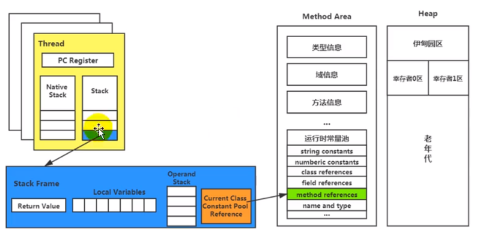

# 虚拟机栈
```text
为了涉及跨平台，JAVA的指令集都是根据栈来设计实现的。不同的CPU架构不同。所以不能设计为基于寄存器的。
基于栈的架构的优点：跨平台，指令集小，编译实现起来容易，缺点是性能下降，实现同样的过年需要更多的指令。
```

* 问题：
  * 有不少Java开发人员一提到Java内存结构，就会非常粗粒度地将JVM中的内存区理解为仅有Java堆（heap）和Java栈（stack）？为什么？
    ```text
    受到C/C++的影响，这两种高级语言是将内存管理分为堆和栈的，同时也体现出了堆区和栈区在VM内存管理的重要性。首先栈是运行时的单位，而堆是存储的单位
    栈解决程序的运行问题，即程序如何执行，或者说如何处理数据。 堆解决的是数据存储的问题，即数据怎么放，放哪里
    ```
  * Java虚拟机栈是什么？
    ```text
    Java虚拟机栈也叫Java栈。每个线程创建的时候都会创建一个虚拟机栈，其内部保存了一个个栈帧，对应着一次次的Java方法调用。是线程私有的，生命周期和
    线程的生命周期是一致的，它的主要作用主要是保存方法的局部变量、部分结果，并参与方法的调用与结果的返回    
    ```
  * 栈的特点
    ```text
    栈是一种快速有效的分配存储的方式，访问速度仅次于寄存器的速度，每次方法的访问伴随着压栈和出栈，程序执行结束就会出栈，栈不存在垃圾手机的问题
    ```


示例：
```text
/**
 * 测试栈设置栈大小-Xss256k
 * 默认情况打印到11421
 * 设置了虚拟机器参数之后打印数据就到了2462，说明虚拟机参数设置生效了.
 */
public class StackTest {
    public static int num=1;
    public static void main(String[] args) {
        System.out.println(num);
        num++;
        main(args);
    }
}
出现错误：
Exception in thread "main" java.lang.StackOverflowError

```

* 关于Slot的理解
  * JVM会为局部变量表中的每个Slot都分配一个访问索引，通过这个索引即可访问到局部变量表中知道的局部变量值。
  * 一个方法被调用的时候，它的的方法参数和方法内定义的局部变量都会被按顺序复制到局部变量表的Slot
  * 如果需要访问局部变量表中一个64bit的局部变量值时，只需要使用前一个索引即可。(比如：访问long或者double类型变量)
  * 如果当前帧是由构造方法或者示例方法创建的，那么盖对象引用this将会存放在index为0的slot处，其余的参数按照参数表顺序继续排列。


* Slot的重复利用
  * 栈帧中的局部变量表中的槽位是可以重复用的，如果一个局部变量过了其作用域，那么在其作用域之后生命的新的局部变量就很有可能会复用国企局部变量的槽位，达到节约资源的目的。
    ```java
         public class ReuseSlotTest {
         public void method1(){
             int a=0;
             System.out.println(a);
             int b=0;
         }
         public void method2(){
             {
                 int a=0;
                 System.out.println(a);
             }
             int b=0;
         }
               
         public static void main(String[] args) {
             new ReuseSlotTest().method2();
         }
       }

    ```
* 静态变量与局部变量的对比
```markdown
* 参数分配完毕之后，再恩据方法体内定义的变量的顺序和作用域分配
* 我们知道类变量表有两次初始化的机会，一次是在加载后的"准备"阶段，这个阶段主要进行零值的初始化操作，第二个阶段主要是"初始化"阶段，这个阶段才是正在的
  将我们想赋的值进行赋给了变量。
* 和类变量不同的是局部变量一旦定义了就必须人为的去进行初始化操作，否则无法正常的使用。
```
示例
```java
public class LocalVariableTest {
public void localVariableMethod(){
    int a = 0;//此处不赋值无法正常使用。
    System.out.println(a);//此处使用会报错
}
}

```

## 操作数栈
```markdown
* 每一个独立的栈帧中除了包含局部变量意外，还包含了后进先出的操作数栈，或者叫表达式栈。
* 操作数栈，在方法的执行过程中，根据字节码指令，往栈中写入数据或者提取数据，即入栈(push)/出栈(pop)
    * 某些字节码指令将值压入操作数栈，其余的字节码指令将操作数取出栈。使用他们后再把结果压入栈。
    * 比如：执行复制、交换、求和等操作。
```
* 操作数栈
  * 操作数栈，主要用于保存计算过程的中间结果，同时作为计算过程中变量临时的存储控件
  * 操作数栈就是JVM执行引擎的一个工作区，当一个方法刚开始执行的时候，一个新的栈帧也会随之被创建出来，这个方法的操作数栈就是空的
  * 每一个操作数栈都会拥有一个明确的栈深度用于存储数值，其所需要的最大深度在编译器就是定义好的，保存在方法的Code属性中，为max_stack的值。
  * 栈中的任何一个元素都是可以任意的Java数据类型
    * 32bit的类型占用一个栈单位深度
    * 64bit的类型栈两个栈单位升读
操作数栈并非以访问索引的方式来进行数据访问的，二十只能通过标准的入栈(push)和出栈(pop)操作来完成一次数据访问。


* 如果被调用的方法带有返回值的话，其返回值将会被压入当前栈帧的操作数栈中，并更新PC寄存器中下一条需要执行的字节码指令。
* 操作数栈中元素的数据类型必须要与字节码治理的序列严格的匹配，这是由编译器在编译期间进行验证，同时在类加载的过程中的
  类检验阶段华发数据分析阶段要再次验证
* Java虚拟机的解释引擎是基于栈执行引擎，其中的栈指的就是操作数栈。
  


## 栈顶缓存技术
```text
JVM是基于栈架构的虚拟机，所使用的架构是零地址指令，更加的紧凑，但是完成一项操作需要使用更多的入栈和出栈指令，这同时也就意味着将需要更多的指令
分派(instruction dispatch)次数和内存读/写次数
由于操作数是存储在内存中的，因此频繁的执行读/写操作会影响执行的速度。为了解决这个问题，HotSpot JVM的设计者们提出了栈顶缓存(TOP,top-of-stack 
caching)技术，将栈顶全部缓存在物理CPU的寄存器中，以此降低堆内粗的读/写次数，提升执行引擎的执行效率.
```

## 动态链接
```markdown
* 每个栈帧内部都包含一个执行运行时常量池中该栈帧所属方法的引用。包含这个引用的目的就是为了支持当前方法的代码能实现动态链接(Dynamic Linking).
  比如:involkedynamic指令
* 在Java源文件被编译到字节码文件中时，所有的变量和方法的引用都是作为符号引用(Symbolic Reference)保存到class文件的常量池里。比如，描述一个方法
   调用了另外的其他方法时，就是通过常量池中只想方法的符号引用老表示的，那么动态链接的作用就是为了将这些符号引用转换为调用的方法的直接引用。
```



* 常量池的作用？
  * 提供一些符合和常量，便于指令的识别。


### 方法调用
```markdown

对应的方法的绑定机制为：早期绑定(Early Binding)和晚期绑定(Late Binding)。绑定是一个字段、方法或者类在符号引用被替换为直接引用的过程，
这仅仅发生一次。
* 早期绑定:
  早期绑定是指被调用的目标方法如果在编译期可知，且运行期保持不变时，即可将这个方法与所属的类型进行绑定，这样一来，由于明确了被调用的目标方法究竟是
  哪一个，因此也就可以使用静态链接的方式将符号引用转换为直接引用。
* 晚期绑定：
  如果被调用的方法在编译期间无法被确定下来，只能够在程序运行期间根据实际的类型绑定相关的方法，这种绑定方式也称为晚期绑定。

```

#### 虚方法与非虚方法
* 非虚方法：
```markdown
* 如果方法在编译器就确定了具体的调用版本，这个版本在运行时是不可变的。这样的方法称为非虚方法。
* 静态方法、私有方法、final方法、实例构造器、父类方法都是非虚方法
* 其他方法称为虚方法
```

* 方法调用的指令
  * 普通方法的调用指令
      * invokestatic：调用静态方法，解析阶段确定唯一方法版本。
      * invokespecial：调用<init>方法、私有及父类方法，解析阶段确定唯一方法版本
      * invokevirtual：调用所有虚方法
      * invokeinterface:调用接口方法
  * 动态调用指令：
      * invokedynamic:动态解析出需要调用的方法，然后执行。

前面的四条指令是固化在虚拟机里面的，方法的调用不可以认为的干预，而invokedynamic指令则允许用户确定指定的版本。invokestatic、invokespecial
指令调用的方法称之为非虚方法，其他(final修饰的除外)都是虚方法

* 方法调用:方法重写的本质
     * Java语言中方法重写的本质：
          * 找到操作数栈顶的第一个元素所执行的对象实际类型，记作C。
          * 如果在类型C中找到与常量中的描述符合简单名称都相符的方法，则进行访问权限校验，如果通过则返回这个方法的直接引用，查找过程结束；如果不通过，
            则返回java.lang.IllegalAccessError异常。
          * 如果始终没有找到合适的方法，则抛出java.lang.AbsreactMethodError异常。
IllegalAccessError：程序试图访问或者修改一个属性或者调用一个方法，这个方法或者属性，没有权限访问，一般的，这个会引起编译器异常。这错误如果发生
在运行时，就说明一个类发生了不兼容的改变。

* 方法调用：虚方法表
```text
1. 在面向对象的编程中，会频繁的使用到动态分派，如果每次在使用动态分派的过程中都要重新的在类的元数据中搜索目标的话就可能影响到执行的效率。因此，
为了提供性能，JVM才艺了在类的方法区建立一个虚方法表(Virtual method table)(非虚方法不会出现在表中)来实现。使用索引表来代替查找。
2. 每个类都有一个虚方法表，表中存放了各个方法的实际入口。
3. 那么虚方法表说明时候会被创建？
    虚方法表会在类加载的链接阶段被创建并初始化，类的变量初始化准备完成之后，JVM把该类的方法表也初始化完毕
```


## 地址返回值
* 存放调用该方法的PC寄存器的值
* 一个方法的结束又两种方式:
  * 正常执行完成。
  * 出现为处理的异常，非正常退出。

* 无论通过那种方式退出，在方法退出后都回到该方法被调用的位置。方法正常退出时，调用者的PC计数器的值作为返回值，即调用该方法的指令的下一条指令的地址。
* 而通过异常退出的，返回地址要通过异常表来确定，栈帧种一般不会保存这部分信息。


