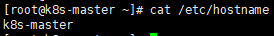
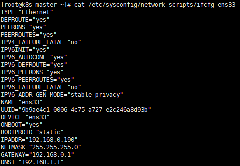
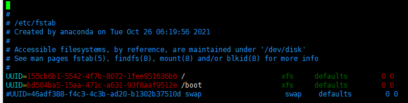
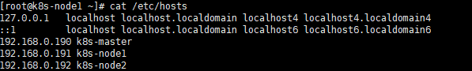
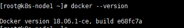

# Kubeadm搭建Kubenetes搭建集群

## 准备工作
* 关闭防火墙
```shell script
# 停止防火墙
systemctl stop firewalld
# 停止系统启动开启防火墙
systemctl disable firewalld
#其他的两个工作节点也执行同样的命令
```
* 改变主机的名称
```shell script
vim /etc/hostname
# 将修改hostname生效
systemctl restart systemd-hostnamed
#其他的两个工作节点也执行同样的命令分别改成k8s-node1和k8s-node2
```

* 将dhcp改成静态的ip
```shell script
k8s-master
[root@k8s-master ~]# cat /etc/sysconfig/network-scripts/ifcfg-ens33 
TYPE="Ethernet"
DEFROUTE="yes"
PEERDNS="yes"
PEERROUTES="yes"
IPV4_FAILURE_FATAL="no"
IPV6INIT="yes"
IPV6_AUTOCONF="yes"
IPV6_DEFROUTE="yes"
IPV6_PEERDNS="yes"
IPV6_PEERROUTES="yes"
IPV6_FAILURE_FATAL="no"
IPV6_ADDR_GEN_MODE="stable-privacy"
NAME="ens33"
UUID="9b9ae4c1-0006-4c75-a727-e2c246a8d93b"
DEVICE="ens33"
ONBOOT="yes"
BOOTPROTO="static"
IPADDR="192.168.0.190"   
NETMASK="255.255.255.0"  
GATEWAY="192.168.0.1"    
DNS1="192.168.1.1"  
#其他的两个工作节点也做同样的操作
```


* 关闭selinux
```shell script
sed -i 's/enforcing/disabled/' /etc/selinux/config
```

* 关闭swap分区
```shell script
#临时关闭swap分区
swapoff -a
#永久关闭swap分区
sed -ri 's/.*swap.*/#&/g' /etc/fstab
```



* 添加host映射,使得根据主机名可以互相查找到各自的ip
```shell script
  cat >> /etc/hosts << EOF
  192.168.0.190 k8s-master
  192.168.0.191 k8s-node1
  192.168.0.192 k8s-node2
  EOF
```



* 将IPV4的桥接的流量传播到iptable链
将桥接的IPv4流量传递到iptables的链【有一些ipv4的流量不能走iptables链【linux内核的一个过滤器，
每个流量都会经过他，然后再匹配是否可进入当前应用进程去处理】，导致流量丢失】：
```shell script
cat > /etc/sysctl.d/k8s.conf << EOF
net.bridge.bridge-nf-call-ip6tables=1
net.bridge.bridge-nf-call-iptables=1
EOF
# 是得修改生效
  sysctl --system
```


* 同步k8-master,k8s-node1,k8s-node2三个节点得时间
```shell script
yum install ntpdate -y
ntpdate time.windows.com
```

## 所有节点安装 Docker/kubeadm/kubelet
Kubernetes 默认 CRI（容器运行时）为 Docker，因此先安装 Docker，并设置阿里云仓库地址：
```shell script
wget https://mirrors.aliyun.com/docker-ce/linux/centos/docker-ce.repo -O /etc/yum.repos.d/docker-ce.repo
yum -y install docker-ce-18.06.1.ce-3.el7
systemctl enable docker && systemctl start docker
cat > /etc/docker/daemon.json << EOF
  {
  "registry-mirrors": ["https://b9pmyelo.mirror.aliyuncs.com"]
  }
 EOF
systemctl restart docker
docker --version
```


* 添加k8s的yum源
```shell script
 cat > /etc/yum.repos.d/kubernetes.repo << EOF
  [kubernetes]
  name=Kubernetes
  baseurl=https://mirrors.aliyun.com/kubernetes/yum/repos/kubernetes-el7-x86_64
  enabled=1
  gpgcheck=0
  repo_gpgcheck=0
  gpgkey=https://mirrors.aliyun.com/kubernetes/yum/doc/yum-key.gpg
  https://mirrors.aliyun.com/kubernetes/yum/doc/rpm-package-key.gpg
  EOF
```
* 安装 kubeadm，kubelet 和 kubectl，版本指定1.18.0：
```shell script
yum install -y kubelet-1.18.0 kubeadm-1.18.0 kubectl-1.18.0
# 設置kubelet开机启动
systemctl enable kubelet
```

* 部署 Kubernetes Master
在master（192.168.0.190）执行kubeadm init：
```shell script
kubeadm init --apiserver-advertise-address=192.168.0.190 --image-repository registry.aliyuncs.com/google_containers --kubernetes-version v1.18.0 --service-cidr=10.96.0.0/12 --pod-network-cidr=10.244.0.0/16
该命令各个参数得意思
--apiserver-advertise-address string         设置 apiserver 绑定的 IP.
      --apiserver-bind-port int32            设置apiserver 监听的端口. (默认 6443)
      --apiserver-cert-extra-sans strings    api证书中指定额外的Subject Alternative Names (SANs) 可以是IP 也可以是DNS名称。 证书是和SAN绑定的。
      --cert-dir string                      证书存放的目录 (默认 "/etc/kubernetes/pki")
      --certificate-key string               kubeadm-cert secret 中 用于加密 control-plane 证书的key
      --config string                        kubeadm 配置文件的路径.
      --cri-socket string                    CRI socket 文件路径，如果为空 kubeadm 将自动发现相关的socket文件; 只有当机器中存在多个CRI socket或者存在非标准CRI socket时才指定.
      --dry-run                              测试，并不真正执行;输出运行后的结果，强烈推荐！
      --feature-gates string                 指定启用哪些额外的feature 使用 key=value 对的形式。
  -h, --help                                 帮助文档
      --ignore-preflight-errors strings      忽略前置检查错误，被忽略的错误将被显示为警告. 例子: 'IsPrivilegedUser,Swap'. Value 'all' ignores errors from all checks.
      --image-repository string              选择拉取 control plane images 的镜像repo (default "k8s.gcr.io")，一般改为阿里云的国内repo。
      --kubernetes-version string            选择K8S版本. (default "stable-1")
      --node-name string                     指定node的名称，默认使用 node 的 hostname.
      --pod-network-cidr string              指定 pod 网络的IP地址网段，control plane会自动给每个节点设置CIDRs（无类别域间路由，Classless Inter-Domain Routing），                                             将网络发布到其他节点的node，让其上启动的容器使用此网络。
      --service-cidr string                  设置service的CIDRs，即IP范围. (default "10.96.0.0/12")
      --service-dns-domain string            指定 service 的 dns 后缀, e.g. "myorg.internal". (default "cluster.local")
      --skip-certificate-key-print           不打印 control-plane 用于加密证书的key.
      --skip-phases strings                  跳过指定的阶段（phase）
      --skip-token-print                     不打印 kubeadm init 生成的 default bootstrap token 
      --token string                         指定 node 和control plane 之间，简历双向认证的token ，格式为 [a-z0-9]{6}\.[a-z0-9]{16} - e.g. abcdef.0123456789abcdef
      --token-ttl duration                   token 自动删除的时间间隔。 (e.g. 1s, 2m, 3h). 如果设置为 '0', token 永不过期 (default 24h0m0s)
      --upload-certs                         上传 control-plane 证书到 kubeadm-certs Secret.
```
此时如果出现下面得提示就说明成功了
```shell script
W0317 01:38:49.970644    8398 configset.go:202] WARNING: kubeadm cannot validate component configs for API groups [kubelet.config.k8s.io kubeproxy.config.k8s.io]
[init] Using Kubernetes version: v1.18.0
[preflight] Running pre-flight checks
        [WARNING IsDockerSystemdCheck]: detected "cgroupfs" as the Docker cgroup driver. The recommended driver is "systemd". Please follow the guide at https://kubernetes.io/docs/setup/cri/
[preflight] Pulling images required for setting up a Kubernetes cluster
[preflight] This might take a minute or two, depending on the speed of your internet connection
[preflight] You can also perform this action in beforehand using 'kubeadm config images pull'
[kubelet-start] Writing kubelet environment file with flags to file "/var/lib/kubelet/kubeadm-flags.env"
[kubelet-start] Writing kubelet configuration to file "/var/lib/kubelet/config.yaml"
[kubelet-start] Starting the kubelet
[certs] Using certificateDir folder "/etc/kubernetes/pki"
[certs] Generating "ca" certificate and key
[certs] Generating "apiserver" certificate and key
[certs] apiserver serving cert is signed for DNS names [master kubernetes kubernetes.default kubernetes.default.svc kubernetes.default.svc.cluster.local] and IPs [10.96.0.1 172.31.93.200]
[certs] Generating "apiserver-kubelet-client" certificate and key
[certs] Generating "front-proxy-ca" certificate and key
[certs] Generating "front-proxy-client" certificate and key
[certs] Generating "etcd/ca" certificate and key
[certs] Generating "etcd/server" certificate and key
[certs] etcd/server serving cert is signed for DNS names [master localhost] and IPs [172.31.93.200 127.0.0.1 ::1]
[certs] Generating "etcd/peer" certificate and key
[certs] etcd/peer serving cert is signed for DNS names [master localhost] and IPs [172.31.93.200 127.0.0.1 ::1]
[certs] Generating "etcd/healthcheck-client" certificate and key
[certs] Generating "apiserver-etcd-client" certificate and key
[certs] Generating "sa" key and public key
[kubeconfig] Using kubeconfig folder "/etc/kubernetes"
[kubeconfig] Writing "admin.conf" kubeconfig file
[kubeconfig] Writing "kubelet.conf" kubeconfig file
[kubeconfig] Writing "controller-manager.conf" kubeconfig file
[kubeconfig] Writing "scheduler.conf" kubeconfig file
[control-plane] Using manifest folder "/etc/kubernetes/manifests"
[control-plane] Creating static Pod manifest for "kube-apiserver"
[control-plane] Creating static Pod manifest for "kube-controller-manager"
W0317 01:39:30.033217    8398 manifests.go:225] the default kube-apiserver authorization-mode is "Node,RBAC"; using "Node,RBAC"
[control-plane] Creating static Pod manifest for "kube-scheduler"
W0317 01:39:30.033878    8398 manifests.go:225] the default kube-apiserver authorization-mode is "Node,RBAC"; using "Node,RBAC"
[etcd] Creating static Pod manifest for local etcd in "/etc/kubernetes/manifests"
[wait-control-plane] Waiting for the kubelet to boot up the control plane as static Pods from directory "/etc/kubernetes/manifests". This can take up to 4m0s
[apiclient] All control plane components are healthy after 21.002271 seconds
[upload-config] Storing the configuration used in ConfigMap "kubeadm-config" in the "kube-system" Namespace
[kubelet] Creating a ConfigMap "kubelet-config-1.18" in namespace kube-system with the configuration for the kubelets in the cluster
[upload-certs] Skipping phase. Please see --upload-certs
[mark-control-plane] Marking the node master as control-plane by adding the label "node-role.kubernetes.io/master=''"
[mark-control-plane] Marking the node master as control-plane by adding the taints [node-role.kubernetes.io/master:NoSchedule]
[bootstrap-token] Using token: 9ugph9.2o4ohggaoaymuk12
[bootstrap-token] Configuring bootstrap tokens, cluster-info ConfigMap, RBAC Roles
[bootstrap-token] configured RBAC rules to allow Node Bootstrap tokens to get nodes
[bootstrap-token] configured RBAC rules to allow Node Bootstrap tokens to post CSRs in order for nodes to get long term certificate credentials
[bootstrap-token] configured RBAC rules to allow the csrapprover controller automatically approve CSRs from a Node Bootstrap Token
[bootstrap-token] configured RBAC rules to allow certificate rotation for all node client certificates in the cluster
[bootstrap-token] Creating the "cluster-info" ConfigMap in the "kube-public" namespace
[kubelet-finalize] Updating "/etc/kubernetes/kubelet.conf" to point to a rotatable kubelet client certificate and key
[addons] Applied essential addon: CoreDNS
[addons] Applied essential addon: kube-proxy
Your Kubernetes control-plane has initialized successfully!

To start using your cluster, you need to run the following as a regular user:

  mkdir -p $HOME/.kube
  sudo cp -i /etc/kubernetes/admin.conf $HOME/.kube/config
  sudo chown $(id -u):$(id -g) $HOME/.kube/config

You should now deploy a pod network to the cluster.
Run "kubectl apply -f [podnetwork].yaml" with one of the options listed at:
  https://kubernetes.io/docs/concepts/cluster-administration/addons/

Then you can join any number of worker nodes by running the following on each as root:

kubeadm join 192.168.0.182:6443 --token sig039.bmzmyjv3rgmodq4s \
    --discovery-token-ca-cert-hash sha256:04e1f026df94aeb0f4d0116319b9d64fb5f8319abb9201937c2ee7d2a5c9acf4 

```
在master执行
```shell script
  mkdir -p $HOME/.kube
  sudo cp -i /etc/kubernetes/admin.conf $HOME/.kube/config
  sudo chown $(id -u):$(id -g) $HOME/.kube/config
```
再在其他两个工作节点执行如下得方法就可以将其他两个工作节点加入到集群中
```shell script
kubeadm join 192.168.0.182:6443 --token sig039.bmzmyjv3rgmodq4s \
    --discovery-token-ca-cert-hash sha256:04e1f026df94aeb0f4d0116319b9d64fb5f8319abb9201937c2ee7d2a5c9acf4 
# 这个加入集群命令的token时效是24小时如果失效了可以使用这个命令重新获取
kubeadm token create --print-join-command
```


在运行kubeadm init 整个过程中，都进行了那些操作？官方文档的说明如下:

1. 首先会运行一系列预检代码来检查系统的状态；大部分的检查只会抛出一个警告，也有一部分会抛出错误直接导致工作流推出（比如硬件配置不够，比如没有关闭swap，或者没有安装docker），除非问题得到解决或者用户指定了 --ignore-preflight-errors=<list-of-errors> 参数，表示忽略错误。
2. 生成一个用来认证k8s组件间调用的自签名CA（Certificate Authority，证书授权），为集群中的每一个组件建立身份标识；这个证书也可以通过–cert-dir（默认是/etc/kubernetets/pki）的方式自行提供。
3. 把kubelet、controller-manager和scheduler等组件的配置文件写到/etc/kubernetes/目录，这几个组件会使用这些配置文件来连接API-server的服务；除了上面几个配置文件，还会生成一个名为 admin.conf 的独立的 kubeconfig 文件，用于管理操作。
4. 接下来就是创建一些静态pod 的yaml配置文件了，包括API-server、controller-manager和scheduler。假如没有提供外部etcd，还会另外生成一个etcd的静态Pod配置文件。这些静态pod会被写入/etc/kubernetes/manifests，kubelet 会监视这个目录以便在系统启动的时候创建 Pod。
5. 假如第四步比较顺利，这个时候k8s的控制面进程（api-server、controller-manager、scheduler）就全都起来了。
6. 给当前的节点（Master节点）打label和taints，从而防止其他的负载在这个节点运行。
7. 生成token，其他节点如果想加入当前节点（Master）所在的k8s集群，会用到这个token。
8. 进行一些允许节点以 Bootstrap Tokens) 和 TLS bootstrapping 方式加入集群的必要的操作：
    *　创建一个用于节点加入集群的ConfigMap（包含了加入集群需要的所有信息），并为该 ConfigMap 设置相关的 RBAC 访问规则。
    * 让Bootstrap Tokens可以访问CSR签名的API。
    * 给新的CSR请求配置自动认证机制。
9.通过API-server安装DNS服务器（1.11版本后默认为CoreDNS，早期版本默认为kube-dns）和kube-proxy插件。这里需要注意的是，DNS服务器只有在安装了CNI（flannel或calico）之后才会被真正调度，否则会处于挂起（pending）状态。
10.到这里基本上就告一段落了，如上会提示：Your Kubernetes control-plane has initialized successfully!

就这样，把kubeadm init命令具体的操作流程过了一遍，其实完全可以使用–dry-run参数，通过观察输出来提前看看到底包含哪些流程。

此时集群已经搭建完了，但是各个节点还是显示的状态还是NotReady,是因为还缺少CNI网络插件。
```shell script
[root@k8s-master ~]# kubectl get nodes
NAME         STATUS     ROLES    AGE    VERSION
k8s-master   NotReady   master   2d3h   v1.18.0
k8s-node1    NotReady   <none>   2d3h   v1.18.0
k8s-node2    NotReady   <none>   2d3h   v1.18.0

```


* master安装 Pod 网络插件（CNI）
```shell script
kubectl apply –f https://raw.githubusercontent.com/coreos/flannel/master/Documentation/kube-flannel.yml
#因为国外网络的原因，也可以先wget下载，再kubectl apply -f 指定文件：
wget https://raw.githubusercontent.com/coreos/flannel/master/Documentation/kube-flannel.yml
kubectl apply -f kube-flannel.yml
podsecuritypolicy.policy/psp.flannel.unprivileged created
clusterrole.rbac.authorization.k8s.io/flannel created
clusterrolebinding.rbac.authorization.k8s.io/flannel created
serviceaccount/flannel created
configmap/kube-flannel-cfg created
daemonset.apps/kube-flannel-ds created

```
此时各个节点的状态就是ready的了
```shell script
[root@k8s-master ~]# kubectl get nodes
NAME     STATUS   ROLES    AGE   VERSION
master   Ready    master   46h   v1.18.0
node1    Ready    <none>   39m   v1.18.0
node2    Ready    <none>   39m   v1.18.0
```
* 测试 kubernetes 集群
```shell script
kubectl create deployment nginx --image=nginx
kubectl get pod
[root@k8s-master ~]# kubectl get pod svc
Error from server (NotFound): pods "svc" not found
[root@k8s-master ~]# kubectl get pod,svc
NAME                        READY   STATUS        RESTARTS   AGE
pod/nginx-f89759699-46mxg   1/1     Running       0          31h
pod/nginx-f89759699-68hjt   1/1     Terminating   0          2d3h

NAME                 TYPE        CLUSTER-IP    EXTERNAL-IP   PORT(S)        AGE
service/kubernetes   ClusterIP   10.96.0.1     <none>        443/TCP        2d4h
service/nginx        NodePort    10.100.5.33   <none>        80:32466/TCP   2d3h
#此时端口32466是对外服务的
```


