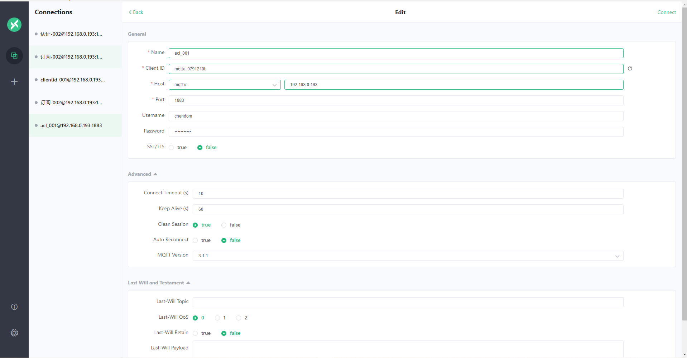

# EMQX的ACL插件
EMQX支持使用配置文件，外部组合六书库和自定义的HTTP API作为ACL数据源

连接数据源，进行访问控制功能是通过插件实现的，使用前需要启用相应的插件。

客户端订阅主题、发布消息是插件通过检查目标主题(TOPIC)是否在指定数据源
允许/禁止列表内来实现对客户端的发布，订阅管权限管理。


* ACL配置的类型
    * 配置文件
        * 内置ACL
    * 外部数据库
        * MySQL ACL
        * PostgreSQL ACL
        * Redis ACL
        * MongoDB ACL
        外部数据库可以存储大量数据、动态管理 ACL，方便与外部设备管理系统集成。
    
    * 其他
        * HTTP ACL
        
            HTTP ACL能够实现复杂的ACL管理。      
            
            
* ACL规则详解
ACL 是允许与拒绝条件的集合，EMQ X 中使用以下元素描述 ACL 规则：
```shell script
## Allow-Deny Who Pub-Sub Topic
"允许(Allow)/拒绝(Deny)" "谁(Who)" "订阅(Subscribe)/发布(Publish)" "主题列表(Topics)"
```              

同时具有多条ACL规则时，EMQX讲按照规则排序进行合并，以ACL文件中的默认ACL为例，ACL文件中配置了默认的ACL规则明规则
规则从下至上的加载:
    1. 第一条规则允许客户端发布订阅所有的主题
    2. 第二条规则禁止全部客户端订阅$SYS/#与#主题
    3. 第三条规则允许ip地址为127.0.0.1的客户端发布订阅$SYS/#与#主题，为第二条开了特里
    4. 第四条规则允许用户为dashboard的客户端订阅$SYS/#主题，为第二条开了特例。

* 授权结果
任何一次ACL授权最终都会返回一个结果
    * 允许:经过检查允许客户端进行操作
    * 禁止:经过检查禁止客户端操作
    * 忽略(ignore):尾插找到ACL权限信息(no match)，无法显式判断结果时允许还是禁止，交友下一个ACL插件或者默认ACL规则来判断。
      
      
 
### ACL全局配置
/etc/emqx/emqx.conf
```shell script
## Allow or deny if no ACL rules matched.
##
## Value: allow | deny
#如果不匹配规则，默认是是让通过的，
acl_nomatch = allow

## Value: File Name
#ACL默认配置规则
acl_file = /etc/emqx/acl.conf
## Whether to enable ACL cache.
##
## If enabled, ACLs roles for each client will be cached in the memory
##
## Value: on | off
#开启acl校验的缓冲区，提高emqx服务器的性能
enable_acl_cache = on

## The maximum count of ACL entries can be cached for a client.
##
## Value: Integer greater than 0
## Default: 32
#最大的缓冲acl规则的条数
acl_cache_max_size = 32

## The time after which an ACL cache entry will be deleted
##
## Value: Duration
## Default: 1 minute
# 缓存acl规则的时长
acl_cache_ttl = 1m

## The action when acl check reject current operation
##
## Value: ignore | disconnect
## Default: ignore
#如果规则不匹配，那么mqtt服务会做出的反映，mqtt3.1是忽略(此处是缺陷)，但是mqtt5.0会做出错误的提示
acl_deny_action = ignore


``` 
acl规则的配置文件
/etc/emqx/acl.conf
```shell script
[root@kafka-node4 emqx]# vim acl.conf 

%%--------------------------------------------------------------------
%% [ACL](https://docs.emqx.io/broker/v3/en/config.html)
%%
%% -type(who() :: all | binary() |
%%                {ipaddr, esockd_access:cidr()} |
%%                {client, binary()} |
%%                {user, binary()}).
%%
%% -type(access() :: subscribe | publish | pubsub).
%%
%% -type(topic() :: binary()).
%%
%% -type(rule() :: {allow, all} |
%%                 {allow, who(), access(), list(topic())} |
%%                 {deny, all} |
%%                 {deny, who(), access(), list(topic())}).
%%--------------------------------------------------------------------

{allow, {user, "dashboard"}, subscribe, ["$SYS/#"]}.

{allow, {ipaddr, "127.0.0.1"}, pubsub, ["$SYS/#", "#"]}.

{deny, all, subscribe, ["$SYS/#", {eq, "#"}]}.

{allow, all}.

```
 
* 清除acl缓存
在更新ACL规则之后，某些客户端由于已经存在缓存，则无法立即生效。若要立即生效，则需要手动清除所有的ACL缓存，清除缓存需要使用EMQ X Broker
提供的监控管理的HTTP API
```http request
##############查询指定客户端的 ACL 缓存####################
GET http://{{hostname}}:{{port}}/api/v4/clients/emq-client1/acl_cache HTTP/1.1
Content-Type: {{contentType}}
Authorization: Basic {{userName}}:{{password}}
##############清除指定客户端的 ACL 缓存####################
DELETE http://{{hostname}}:{{port}}/api/v4/clients/emq-client1/acl_cache HTTP/1.1
Content-Type: {{contentType}}
Authorization: Basic {{userName}}:{{password}}
```

### ACL鉴权链
* 当同时启用多个ACL插件时，EMQX将按照插件开启的先后顺序进行链式鉴权:
    * 一旦通过授权，终止链并允许客户端通过验证。
    * 一旦授权失败，终止链并九年制客户端通过验证
    * 直到最后一个ACL插件仍未通过，根据默认授权配置判定
        *　默认授权为允许时，允许客户端通过验证
        *  默认授权为禁止时，禁止客户端通过验证 

[ACL校验链](https://app.diagrams.net/#Hchenanddom%2FCharts%2Fmain%2Frepo%2FACL%E6%A0%A1%E9%AA%8C%E9%93%BE.drawio)
 
 
### acl编写规则
文件中的规则按书写顺序从上往下匹配，但是，匹配是从上往下，规则加载是从下往上加载
* acl.conf的语法解释：
    * 以%%表示行注释
    * 每条规则由四元组组成，以.结束
    * 元组第一位:表示规则命中成功后，执行权限控制操作，可以取值为:
        * allow:表示允许
        * deny:表示拒绝
    * 元组的第二位:表示规则所生效的用户，可以使用的格式为:
        *　{user,"dashboard"}：表明规则仅对用户名(username)为dashbord用户生效
        * {clientid,"dashboard"}:表明规则仅对客户端标识(clientid)为dashboard的用户生效
        * {ipaddr,"127.0.0.1"}:表明规则仅对源地址为"127.0.0.1"的用户生效
        * all:表明规则对所有的用户生效
            
    * 元组第三位:表示规则所控制的操作，可取的值为:
        * publish:表明规则应用的在PUBLISH操作上
        * subscribe:表示规则应用在SUBSCRIBE操作上
        * pubsub:表明规则对应PUBLISH和SUBSCRIBE操作都有效
    * 元组第四位:表示规则所限制的主题列表，内容以数组的格式给出:
        * "$SYS/#":为一个主题过滤器(Topic Filter),表示规则可命中与$SYS/#匹配的主题;如:可命中$SYS/#,也可以命中$SYS/a/b/c
        * {eq,"#"}:表示字符的全等，规则仅可命中主题为#的字符串，不能命中的/a/b/c等
    * 除此之外还存在两条特殊的规则：
        * {allow, all} ：允许所有操作
        * {deny, all} ：拒绝所有操作    
 
 
在 acl.conf 修改完成后，并不会自动加载至 EMQ X 系统。需要手动执行：
```shell script
./bin/emqx_ctl acl reload
``` 
 
 
### HTTP ACL
    HTTP认证使用外部自建HTTP应用认证书券数据源，根据HTTP API返回的数据判定授权结果，能够实现复杂的ACL校验逻辑。
```shell script
emqx_auth_http
```
注意:emq_auth_http插件同时具备认证功能，除此之外需要把emqx_auth_username、emqx_auth_clientid之前启用的这两个插件停止。


* EMQ X 在设备发布、订阅事件中使用当前客户端相关信息作为参数，向用户自定义的认证服务发起请求权
  限，通过返回的 HTTP 响应状态码 (HTTP statusCode) 来处理 ACL 授权请求。
    * 无权限：API 返回 4xx 状态码
    * 授权成功：API 返回 200 状态码
    * 忽略授权：API 返回 200 状态码且消息体 ignore

 
按照配置文件 
/etc/emqx/plugins/emqx_auth_http.conf 
```shell script
## Value: URL
# 校验当前的用户是否时超级用户，如果时超级用户就直接跳出acl校验链。
auth.http.super_req = http://127.0.0.1:8991/mqtt/superuser
## Value: post | get | put
auth.http.super_req.method = post
## Value: Params
auth.http.super_req.params = clientid=%c,username=%u

##--------------------------------------------------------------------
## ACL request.
##
## Variables:
##  - %A: 1 | 2, 1 = sub, 2 = pub
##  - %u: username
##  - %c: clientid
##  - %a: ipaddress
##  - %r: protocol
##  - %m: mountpoint
##  - %t: topic
##
## Value: URL
# 对非超级用户的用户进行acl校验
auth.http.acl_req = http://127.0.0.1:8991/mqtt/acl
## Value: post | get | put
auth.http.acl_req.method = get
## Value: Params
auth.http.acl_req.params = access=%A,username=%u,clientid=%c,ipaddr=%a,topic=%t,mountpoint=%m


## Re-send http reuqest times
##
## Value: integer
##
## Default: 3
# 失败重试的次数
auth.http.request.retry_times = 3

## The interval for re-sending the http request
##
## Value: Duration
##
## Default: 1s
# 重试的间隔
auth.http.request.retry_interval = 1s

## The 'Exponential Backoff' mechanism for re-sending request. The actually
## re-send time interval is `interval * backoff ^ times`
##
## Value: float
##
## Default: 2.0
# 重试退避机制
auth.http.request.retry_backoff = 2.0

``` 
在管理后台启动emqx_auth_htt插件，
 
* 开发判断是否时超管和acl的两个接口
    * 判断超管的接口
        ```java
           @PostMapping("/superuser")
              public ResponseEntity superUser(@RequestParam("clientid") String clientid,
                                                 @RequestParam("username") String username) {
                  return authService.superUser(clientid, username);
              }
      
      // authService.superUser方法如下:
       public ResponseEntity superUser(String clientid, String username) {
              logger.info("emqx 查询是否是超级用户,clientid={},username={}", clientid, username);
              if (clientid.contains("admin") || username.contains("admin")) {
                  logger.info("用户{}是超级用户", username);
                  //是超级用户
                  return new ResponseEntity<Object>(HttpStatus.OK);
              } else {
                  logger.info("用户{}不是超级用户", username);
                  //不是超级用户
                  return new ResponseEntity<Object>(HttpStatus.UNAUTHORIZED);
              }
          }
       ```
    * acl校验
        ```java
              @PostMapping("/acl")
              public ResponseEntity acl(@RequestParam("access") int access,
                                        @RequestParam("username") String username,
                                        @RequestParam("clientid") String clientid,
                                        @RequestParam("ipaddr") String ipaddr,
                                        @RequestParam("topic") String topic,
                                        @RequestParam("mountpoint") String mountpoint) {
                  logger.info("EMQX发起客户端操作授权查询请求,access={},username={},clientid={},ipaddr= {},topic={},mountpoint={}",
                          access, username, clientid, ipaddr, topic, mountpoint);
                  //chendom用户具有对应testtopic/#主题订阅的权限
                  if (username.equals("chendom") && topic.equals("testtopic/#") && access == 1) {
                      logger.info("客户端{}有权限订阅{}", username, topic);
                      return new ResponseEntity(HttpStatus.OK);
                  }
                  // emq-client-id-001具有对testtopic/123主题发布的的权限
                  if (username.equals("emq-client-id-001") && topic.equals("testtopic/123") && access == 2) {
                      logger.info("客户端{}有权限向{}发布消息", username, topic);
                      return new ResponseEntity(null, HttpStatus.OK);
                  }
                  logger.info("客户端{},username={},没有权限对主题{}进行{}操作", clientid, username, topic, access == 1 ? "订阅" : "发布");
                  return new ResponseEntity(HttpStatus.UNAUTHORIZED);//无权限
              }
        ```
* 如果是超级管理员就不回进行acl校验      
 
 
    
* 如果是非超级管理员chendom用户只有订阅功能，  emq-client-id-001用户只有发布的功能
 
 
 
 从上面的操作可以看出chendom发布的消息到testtopic主题，但是它成功订阅的testtopic却收不到
  
    
    
   
 
 
 
 
 
 
 
 
 
 
 
 
 
 
 
 
 
 
 
 
 
 
 
 
 
 
 
 
 
 
 
 
 
 
 
 
 
 
 
 
 
 
 
 
 
 
 
 
 
 
 
 
 
 
 
 
 
 
 
 
 
 
 
 
 
 
 
 
 
 
 
 
 
 
       
    
    
    
    
