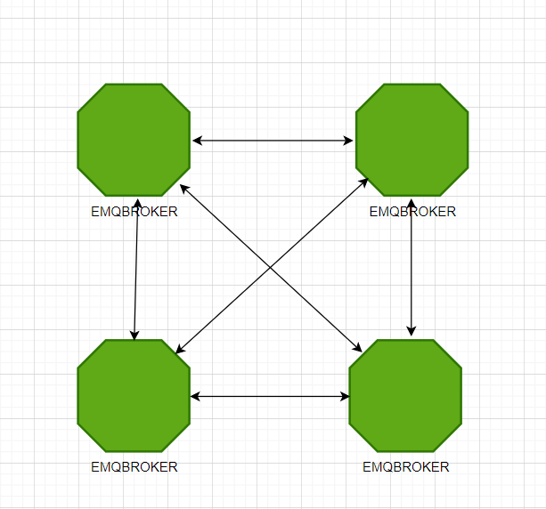
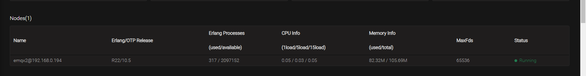
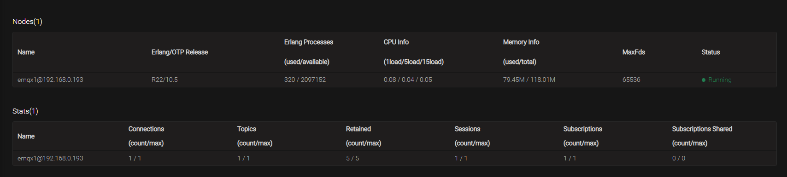
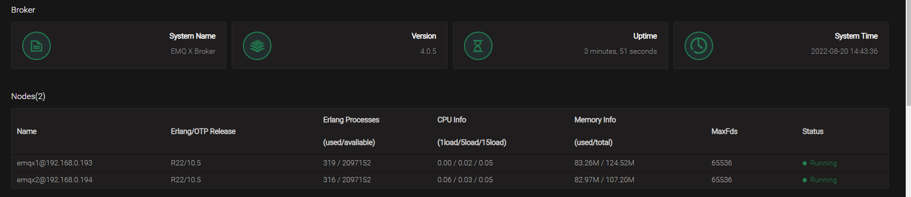

# EMQ X集群搭建

EMQ X是由Erlang语言编写的，Erlang/OTP最初是爱立信为开发电信设备系统设计的编程语言平台。Erlang分布式的定义为:由分布互联网
的Erlang运行时系统组成，每个Erlang运行时系统被称为结点(Node)，结点通过TCP两两互联，组成一个网状结构。
    
Erlang结点有者唯一的结点名称标识，结点名称由@分隔的两个部分组成
```shell script
<name> @ <ip-address>
``` 
结点间通过界定啊名称进行通信寻址，所有的结点组成一个集群后，每个结点都会与其他结点建立一个TCP连接，每当一个新的结点假如集群时，它也会
与集群中所有结点建立一个TCP连接，最终构成一个网状结构如下：

[emqx集群](https://app.diagrams.net/#Hchenanddom%2FCharts%2Fmain%2Frepo%2Femqx%E9%9B%86%E7%BE%A4%E6%90%AD%E5%BB%BA.drawio)
   


Erlang结点间通过cookie进行互连认证。cookie时一个字符串，只有cookie相同的两个结点才能建立连接cookie的配置载etc/emqx/emqx.conf
```shell script
# node1
# 标识结点的结点名称
node.name=emqx1@192.168.0.193

# emqx使用的cookie，建立集群使用默认的就好
node.cookie = emqxsecretcookie

# node2
node.name = emqx2@192.168.0.194

## Cookie for distributed node communication.
##
## Value: String
node.cookie = emqxsecretcookie


```
注意：在进行上述配置修改之前要先将emqx的broker服务先关掉，配置号之后在重启,否则,就会出错。





* EMQ X集群协议设置
 Erlang集群中各个界定啊都可以通过TCPv4、TCPv6或者TLS方式连接，可以在/etc/emqx/emqx.conf中配置连接的方式
 
 |配置名称|类型|默认值|描述|
 | ---- | ---- | ---- | ---- |
 |cluster.proto_dist|enum|inet_tcp|分布式协议，可选值: inet_tcp:使用TCP IPv4 inet4_tcp:使用TCP IPv6 inet_tls:使用TLS|
 |node.ssl_dist_optfile|文件|/etc/ssl_dist.conf|当cluster.proto_dist选定为inet_tls时，需要配置/etc/emqx/ssl_dist.conf，指定TLS整数|


```shell script
## vm.args: -proto_dist inet_tcp
cluster.proto_dist = inet_tcp

## Cluster auto-discovery strategy.
##
## Value: Enum
## - manual: Manual join command
## - static: Static node list
## - mcast:  IP Multicast
## - dns:    DNS A Record
## - etcd:   etcd
## - k8s:    Kubernetes
##
## Default: manual
# 手动创建集群
cluster.discovery = manual

```

* 加入集群
```shell script
# 在node1上执行下面的shell脚本，就可以将node2加入进集群
[root@kafka-node4 ~]# emqx_ctl cluster join emqx2@192.168.0.194

=CRITICAL REPORT==== 20-Aug-2022::14:42:43.683362 ===
[EMQ X] emqx shutdown for join
Join the cluster successfully.
Cluster status: #{running_nodes =>
                      ['emqx1@192.168.0.193','emqx2@192.168.0.194'],
                  stopped_nodes => []}

```




