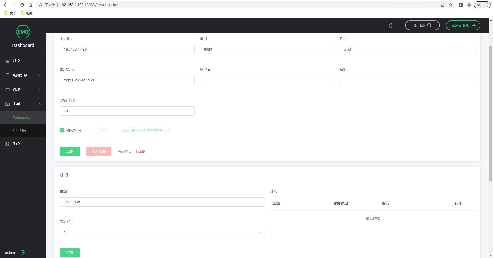
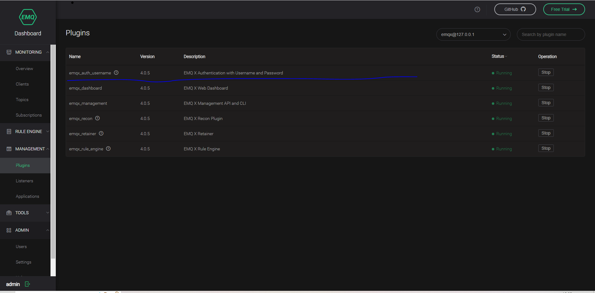
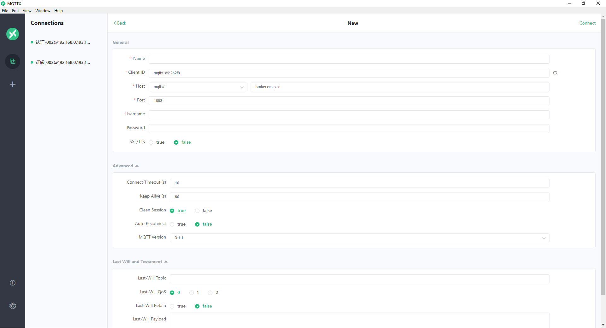
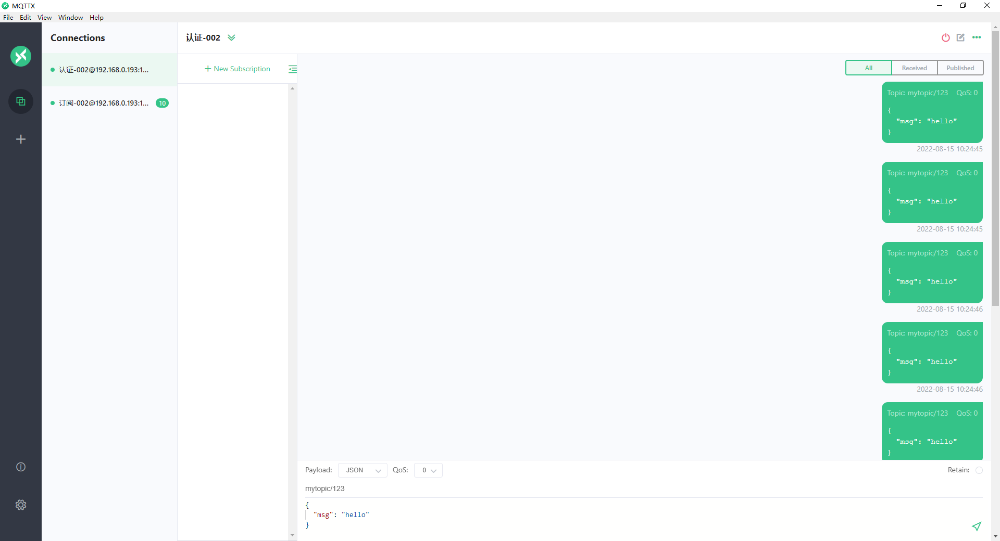
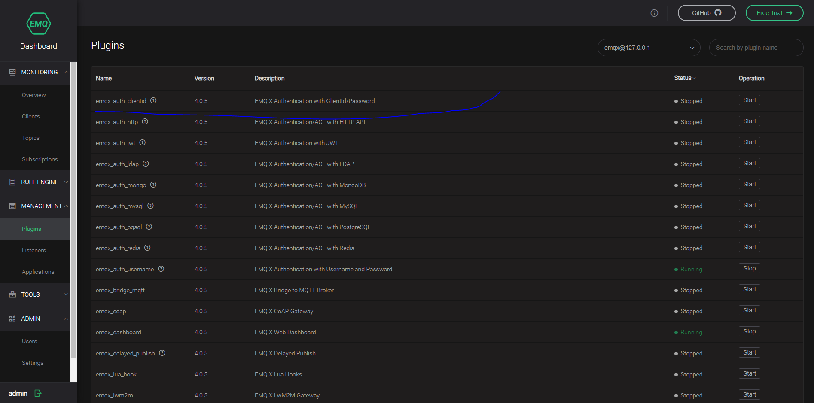
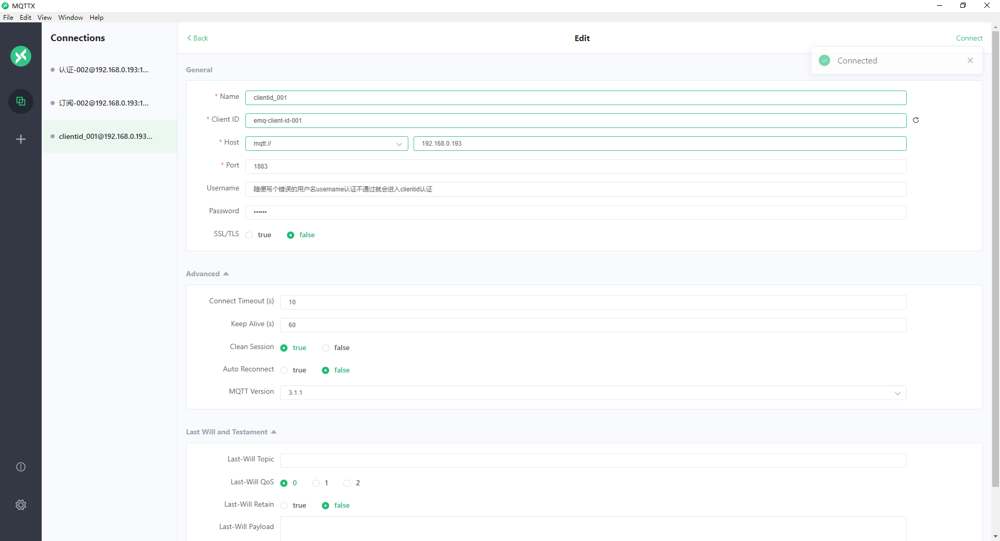
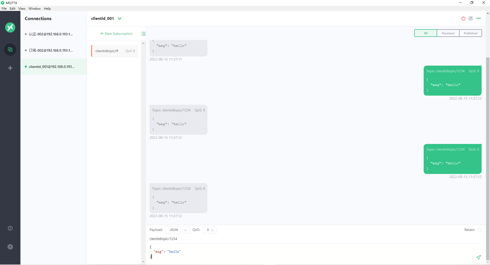

# EMQX的安装和配置
rpm安装
准备rpm安装包

```shell script
# 安装的时候由于确认openssl的依赖库，所以报错
[root@kafka-node4 emqx]# rpm -ivh emqx-centos7-v4.0.5.x86_64.rpm 
error: Failed dependencies:
	libcrypto.so.10(OPENSSL_1.0.2)(64bit) is needed by emqx-4.0.5-1.el7.x86_64
[root@kafka-node4 emqx]# yum install http://mirror.centos.org/centos/7/updates/x86_64/Packages/openssl-libs-1.0.2k-25.el7_9.x86_64.rpm
[root@kafka-node4 emqx]# rpm -ivh emqx-centos7-v4.0.5.x86_64.rpm 
Preparing...                          ################################# [100%]
Updating / installing...
   1:emqx-4.0.5-1.el7                 ################################# [100%]
Created symlink from /etc/systemd/system/multi-user.target.wants/emqx.service to /usr/lib/systemd/system/emqx.service.
[root@kafka-node4 emqx]# emqx start
EMQ X Broker v4.0.5 is started successfully!

```



## 配置

### 启用emqx-auth-username-plugin
/etc/emqx/emqx.conf
```shell script
#是否允许匿名登录，默认true是允许的,false就表示不允许，此时就需要输入用户名和密码方可登录连接
allow_anonymous = false
```


* 使用Emqx客户端连接 broker需要用户名密码



### 启用emqx_auth_clientid插件
在界面上启动emqx_auth_clientid插件，此时如果username认证不通过就会进入到client_id认证的流程!



* 添加clientid
可以选择在/etc/emqx/plugins/emqx_auth_clientid.conf里面配置clientid和密码，但是这种方式是明文的，不安全，不建议使用
所以还是需要使用api的方式添加
[api添加clientid](./files/emqx-clientid.http)

* emqx客户端连接broker





* http认证服务开发
    需要修改/etc/emqx/plugins/emqx_auth_http.conf
```shell script
#此处修改成自己开发的认证服务的ip地址
auth.http.auth_req = http://192.168.0.102:8991/mqtt/auth
## Value: post | get | put
auth.http.auth_req.method = post
## Value: Params
auth.http.auth_req.params = clientid=%c,username=%u,password=%P
```   
修改完成之后就需要重复emqx服务 emqx restart

[http认证服务代码](./mqtt-http-auth)

核心代码
```shell script
@RestController
@RequestMapping("/mqtt")
public class AuthController {

    private static final Logger logger = LoggerFactory.getLogger(AuthController.class);

    @Autowired
    private AuthService authService;

    @PostMapping("/auth")
    public ResponseEntity authUser(@RequestParam("clientid") String clientid,
                                   @RequestParam("username") String username,
                                   @RequestParam("password") String password) {
        logger.debug("开始认证clientid:{},username:{},password:{}", clientid, username, password);

        return authService.authUser(clientid,username,password);
    }

}


@Service
public class AuthService {
    private static final Map<String, String> map = new ConcurrentHashMap<String, String>(16) {{
        put("chendom", "chendom@123");
        put("admin", "public");
        put("emq-client-id-001", "123456");
    }};


    public ResponseEntity authUser(String clientid, String username, String password) {
        if (!map.containsKey(username)) {
            return new ResponseEntity(HttpStatus.BAD_REQUEST);
        }
        String pswd = map.get(username);
        if (!password.equals(pswd)) {
            return new ResponseEntity(HttpStatus.BAD_REQUEST);
        }
        return new ResponseEntity(HttpStatus.OK);
    }
}
```


