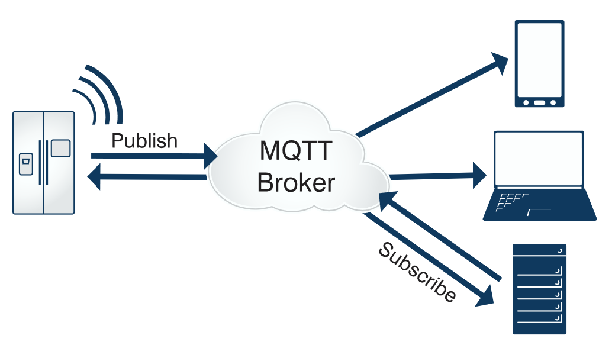
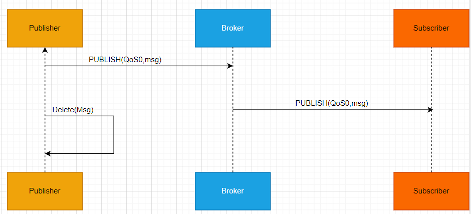
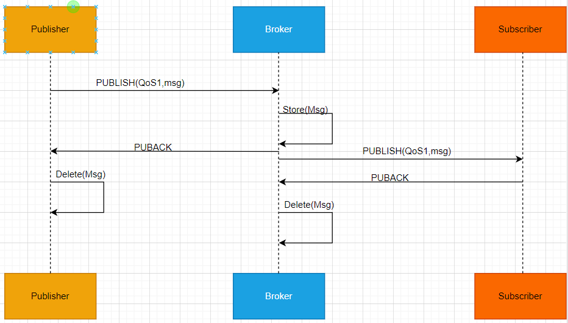
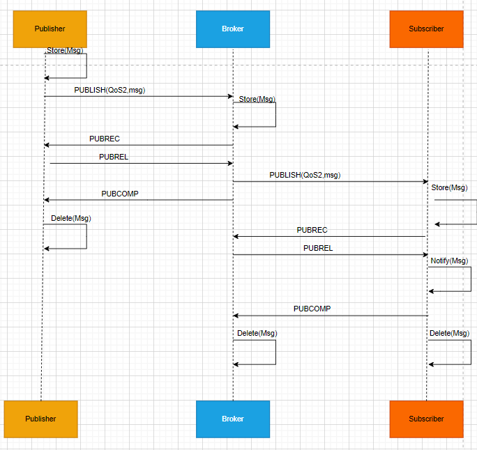
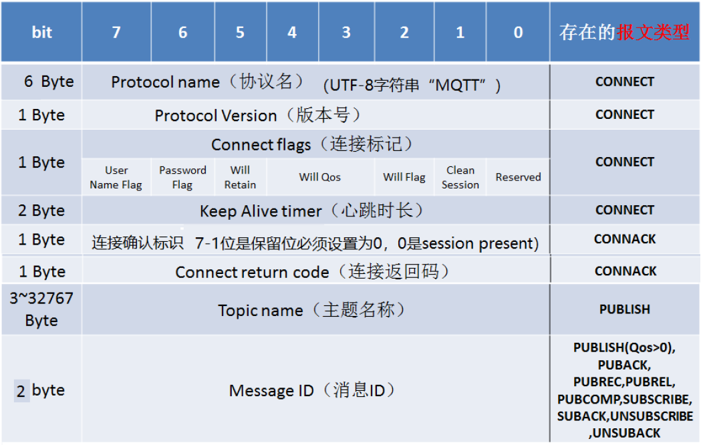

#MQTT

    MQTT(Message Queuing Telemetry Transport,消息队列遥测传输协议)，是一种基于发布/定于(publish/subscribr)模式的"轻量即"通讯协议，
该协议构建于TCP/IP协议上，由IBM在19999年发布。MQTT最大的优点在于，可以以极少的代码和有限的带宽，为连接远程设备提供实时可靠的消息服务。
作为一种低开下，低带宽占用的即时通讯协议，使其在物联网，小型设备，移动应用等方面有较广泛的应用。
    
    MQTT是一个基于客户端-服务器的消息发布/订阅传输协议。MQTT协议是轻量、简单、开放和易于实现的，这些特点使它适用范围非常广泛在很多情况下，
包括受限的环境中，如：机器与机器（M2M）通信和物联网IoT）。其在，通过卫星链路通信传感器、偶尔拨号的医疗设备、智能家居、及一些小型化设备
中已广泛使用。

由于物联网的环境是非常特别的，所以MQTT遵循以下设计原则：
* MQTT协议设计规范
    * 精简，不添加可有可无的功能
    * 基于发布/订阅的模式，方便消息在传感器之间的传递，解耦Client/Server模式，带来的好处就是不必预先直到对方的ip:port,不必同时在线都
    可以实现消息的推送
    * 允许用户动态的创建主题，而不需要提前创建主题，零成本运维。
    * 把传输量降到最低提高传输的效率；
    * 把低带宽，高延时，不稳定等因素考虑在内了
    * 支持连续的会话保持和控制(心跳)
    * 理解客户端的控制能力可能很低;
    * 提高服务质量(Quality of service level:QOS)管理；
    * 不强求传输数据的类型与格式，保持灵活(指的是应用层业务数据)
    
MQTT协议工作在低带宽、不可靠的网络的远程传感器和控制设备通讯而设计的协议，它具有以下主要的几项特性:
    
* MQTT协议的主要特性
    * 开放消息协议，简单易实现。
    * 使用发布/订阅的消息模式，提高一对多的消息发布，接触应用程序耦合。
    * 对负载(协议携带的应用数据)内容屏蔽的消息传输
    * 基于TCP/IO网络连接，提高了有序，无损，双向连接。(主流的MQTT是基于TCP连接进行数据推送的，但是同样有基于UDP的版本，叫做MQTT-SN。这两种版
     本由于基于不同的连接方式，优缺点自然也就各有不同了。)
    *  消息服务质量(QoS)支持，可靠传输保证；有三种消息发布服务质量:
        * QoS0:至多一次，消息发布完全依赖底层TCP/IP网络。会发送消息丢失或者重复。这一级别可用于如下的情况，环境传感器数据，丢失一次读
            记录无所谓，因为不久后还会有第二次发送。这种方式主要用于普通的APP推送，倘若你的只能设备在消息推送的时候未联网，推送过去没有
            收到，再次联网也就收不到了。
        * QoS1:至少一次，确保消息到达，但消息重复可能发生。
        * QoS2:只有一次，确保消息达到一次。在一些要求比较严格的计费系统中，可以使用此级别。在计费系统中，消息的重复或者丢失会导致不正确
           的结果。这种最该质量的消息发布服务还可以用于即时通讯类的APP的推送，确保用户收到且只会收到一次。
    *  1字节固定报头，2字节心跳报文，最小化传输开销和协议交换，有小减少网络流量。(这就是为什么在介绍里说它非常适合"在物联网领域，传感器
       与服务器的通信，信息的收集，要知道嵌入式设备的运算能力和带宽都相对薄弱，使用这种协议来传递消息再适合不过了。)       
       
    * 在线状态感知:使用Last Will和Testament特性通知有关各方客户端异常终端的机制。
        Last Will：即遗言机制，用于通知同一主题下的其他设备，发送遗言的设备已经断开了连接。
        Testament：遗嘱机制，功能类似于Last Will。 
        
        
## MQTT协议中的方法
    MQTT协议中定义了一些方法(也被称为动作)，用于表示对确定饿资源所进行操作。这个资源可以代表预先存在的数据或者动态生产数据，
这个取决于服务器的实现。通常来说，资源指服务器上的文件或者输出，主要的方法如下:
* 
    * CONNECT:客户端连接到服务器
    * CONNECTACK:连接确认
    * PUBLISH:发布下消息
    * PUBACK:发布确认
    * PUBREC:发布的消息已接收
    * PUBREL:发布的消息已释放
    * PUBCOMP:发布完成
    * SUBSCRIBE:订阅请求
    * SUBACK:订阅确认
    * UNSUBSCRIBR:取消订阅
    * UNSUBACK:取消订阅确认
    * PINGREQ:客户端发送心跳
    * PINGRESP:服务端心跳响应
    * DISCONNECT:断开连接
    * AUTH:认证.       
    
## MQTT协议数据包结构
    在MQTT协议中，一个MQTT数据包由:固定头(Fixed header),可变头(Variable header)、消息体(payload)三部分构成。MQTT数据包结构如下:

[结构图地址](https://app.diagrams.net/#Hchenanddom%2FCharts%2Fmain%2Frepo%2FMQTT%E6%B6%88%E6%81%AF%E5%A4%B4%E5%89%96%E6%9E%90.drawio)     

1. 固定头(Fixed header):存在于所有MQTT数据包中，表示数据包类型及数据包的分组标识，如连接，发布，订阅，心跳等。其中固定头是必须的，所有
类型的MQTT协议中，都必须包含固定头。
2. 可变头(Variable header):存在于部分MQTT数据包中，数据包类型决定了可表头是否存在及其具体内容。可变头部不是可选的意思，而实指这部分
在有些协议类型中存在，在有些协议中存在，在有些协议中不存在。
3. 消息体(PayLoad):存在于部分MQTT数据包中，标识客户端收到的具体内容。与可变头一样，在有些协议类型中由消息内容，
有些协议类型中没有消息内容

[结构图地址](https://app.diagrams.net/#Hchenanddom%2FCharts%2Fmain%2Frepo%2FMQTT%E6%B6%88%E6%81%AF%E5%A4%B4%E5%89%96%E6%9E%90.drawio)     

### 第一个字节的剖析

* 数据包类型
  位置：第一个字节(Byte 1)中的7~4个bit位(Bit[7-4]),表示4位无符号值
  通过第一个字节的高4位确定消息报文的类型，4个bit位能确定16种类型，其中0000和1111是保留字段。
  MQTT消息报文类型如下：

|报文类型|字段值|数据方向|描述|7-4bit值|
| ---- | ---- | ---- | ---- | ---- |
|保留|0|禁用|保留|0000|
|CONNECT|1|Client--->Server|客户端连接到服务器|0001|
|CONNECTACK|2|Server--->Client|连接确认|0010|
|PUBLISH|3|Client<--->Server|发布消息|0011|
|PUBACK|4|Client<--->Server|发布确认(QoS1)|0100|
|PUBREC|5|Client<--->|消息已接收(QoS2第一阶段)|0101|
|PUBREL|6|Client<--->Server|消息释放(QoS2第二阶段)|0110|
|PUBCOMP|7|Client<--->Server|发布结束(QoS2第三阶段)|0111|
|SUBSCRIBE|8|Client--->Server|客户端订阅请求|1000|
|SUBACK|9|Server--->Client|服务端订阅确认|1001|
|UNSUBSCRIBE|10|Client--->Server|客户端取消订阅|1010|
|UNSUBACK|11|Server--->Client|服务端取消订阅确认|1011|
|PINGREQ|12|Client--->Server|客户端发送心跳|1100|
|PINGRESP|13|Server--->Client|服务端恢复心跳|1101|
|DISCONNECT|14|Client--->Server|客户端断开连接|1110|
|AUTH(V5.0使用)|15|Client<--->Server|认证数据交换|1111|

  
    

* 标志位
位置：第一个字节中的0-3个bit位(Bit[3-0]).意思是字节位Bit[3-0]用顾总报文的标识
首字节的第四位(bit3-bit0)用来表示某些报文类型的控制字段，实际傻瓜只有少数报文类型由控制位，如下图所示:
    1. 其中Bit[3]为DUP字段，如果该值为1，表明这个数据包是一条重复的消息；否则该数据包就是第一次发布的消息
    2. Bit[2-1]为QoS字段
        如果Bit1和Bit2都为0，表示QoS0:至多一次
        如果Bit1为1，表示QoS1:至少一次；
        如果Bit2为1，表示QoS:只有一次；
        如果Bit1和Bit2都设置1，那么客户端或者服务器人为这事一条非法的消息，会关闭当前的连接
    3. Bit[0]为RETAIN字段，发布保留标识，标识服务器要保留这次推送的消息，如果由新的订阅者出现，就把这条
        消息推送给它，否则就推送个当前的订阅者后释放。    
    
|报文类型|固定头标记|Bit3|Bit2|Bit1|Bit0|
| ---- | ---- | ---- | ---- | ---- | ----|
|CONNECT|保留|0|0|0|0|
|CONNECTACK|保留|0|0|0|0|
|PUBLISH|Used in MQTT3.1.1(V5.0可从官网查看)|DUP|QoS|QoS|RETAIN|
|PUBACK|保留|0|0|0|0|
|PUBREC|保留|0|0|0|0|
|PUBREL|保留|0|0|1|0|
|PUBCOMP|保留|0|0|0|0|
|SUBSCRIBE|保留|0|0|1|0|
|SUBACK|保留|0|0|0|0|
|UNSUBSCRIBE|保留|0|0|1|0|
|UNSUBACK|保留|0|0|0|0|
|PINGREQ|保留|0|0|0|0|
|PINGRESP|保留|0|0|0|0|
|DISCONNECT|保留|0|0|0|0|

   
目前Bit[3-0]只在PUBLISH协议中使用有效，并且表中指明了是MQTT 3.1.1版本。对于其它MQTT协议版
本，内容可能不同。所有固定头标记为"保留"的协议类型，Bit[3-0]必须保持与表中保持一致，如SUBSCRIBE
协议，其Bit 1必须为1。如果接收方接收到非法的消息，会强行关闭当前连接。

* MQTT消息QoS
    MQTT发布消息服务质量保证（QoS）不是端到端的，是客户端与服务器之间的。订阅者收到MQTT消息的
    QoS级别，最终取决于发布消息的QoS和主题订阅的QoS

|发布消息的QoS|主题订阅的QoS|接收消息的QoS|
|---- | ---- | ---- |
| 0 | 0 | 0 |
|0|1|0|
|0|2|0|
|1|0|0|
|1|1|1|
|1|2|1|
|2|0|0|
|2|1|1|
|2|2|2|

*  
     [QoS0-2消息发布订阅的流程图](https://app.diagrams.net/#Hchenanddom%2FCharts%2Fmain%2Frepo%2FMQTT%E6%B6%88%E6%81%AF%E7%9A%84QoS.drawio)        

    * QoS0消息发布订阅
        

    *　QoS1消息发布订阅
        
    
    * QoS2消息发布订阅
        

## 可变头详解
    可变头的意思是可变阿华的消息头部。有些报文类型包含可变头部，有些报文则不包含可变消息头部。可变头部在固定头部和
 消息内容之间，其内容根据报文类型不同而不同。
 

* 
    * 协议名
        协议名是标识协议名MQTT的UTF-8编码的字符串。MQTT规范的后续版本不回改变这个字都喜欢的便宜和长度
        
        |--|说明|76543210|
        | ---- | ---- | ---- |
        |byte1|长度MSB(0)|00000000|
        |byte2|长度LSB(4)|00000100|
        |byte3|'M'|01001101|
        |byte4|'Q'|01010001|
        |byte5|'T'|01010100|
        |byte6|'T'|01010100|

    * 协议版本
        为无符号值表示客户端的版本等级。3.1.1版本的协议等级为4，MQTTV5.0的协议版本字段为5(0x05)
    * MQTT会话(Clean Session)
        MQTT客户端向服务器发器的CONNECT请求，可以通过Clean Session标志设置会话
        Clean Session设置为0，表示创建一个持久会话，在客户端断开连接时，会话仍然保持并保存离线消息，直到会话超时注销。
        Clean Session设置为1，表示创建一个新的临时会话，在客户端断开时，会话自动销毁。
    * Will Flag/Will QoS/Will Retain
        如果Will Flag被设置为1，这意味着如果连接请求被接受，服务端必须存储一个Will Message,并和网络连接关联起来。之后
        在网络断开连接的的时候必须要发布Will Message,除非服务端收到DISCONNECT包删掉了Will Message.
       * Will Message会在某些情况下发布，包括但不限于：
            * 服务端发生I\O错误或者网络失败。
            * 客户端在Keep Alive时间内通信失败
            * 客户端没与发生DISCONNECT句就关闭了网络连接
            * 服务端因协议错误关闭了网络连接
            
       如果Will Flag被设置为1，连接表示中的Will QoS和Will Retain字段将会被服务端用到
       Will QoS这两个bit表示发布Will Message时使用的QoS等级。
       Will Retain这个bit表示Will Message在发布之后是否需要保留。
       如果Will Flag设置为0，那么Will Retain必须是0
       * 如果Will Flag 设置为1：
            * 如果Will Retain设置为0，那么服务端必须发布Will Message,不必保存
            * 如果Will Retain设置为1，那么服务端必须发布Will Message,并保存
           
    * User Name Flag
        如果User Name Flag设置为0，那么用户名不必出现在载荷中。
        如果User Name Flag设置为1，那么用户名必须出现在载荷中。

    *　Password Flag
        如果Password Flag设置为0，那么密码不必出现在载荷中
        如果Password Flag设置为1，那么密码必须出现在载荷中
        如果User Name Flag设置为0，那么Password Flag必须设置为0
        
    * MQTT连接保活心跳
       PINGREQ包从客户端发往服务端，可以用来：
       1：在没有其他控制包从客户端发送给服务端的时候，告知服务端客户端的存活状态。
       2：请求服务端响应，来确认服务端是否存活。
       3：确认网络连接的有效性。
       PINGRESP包从服务端发送给客户端来响应PINGREQ包。它代表服务端是存活的。
       MQTT客户端向服务器发起CONNECT请求时，通过KeepAlive参数设置保活周期。
       Keep Alive是以秒为单位的时间间隔。用2字节表示，它指的是客户端从发送完成一个控制包到开始发送
       下一个的最大时间间隔。客户端有责任确保两个控制包发送的间隔不能超过Keep Alive的值。如果没有其他
       控制包可发，客户端必须发送PINGREQ包
       客户端可以在任何时间发送PINGREQ包，不用关心Keep Alive的值，用PINGRESP来判断与服务端的网
       络连接是否正常。
       如果Keep Alive的值非0，而且服务端在一个半Keep Alive的周期内没有收到客户端的控制包，服务端必
       须作为网络故障断开网络连接
       如果客户端在发送了PINGREQ后，在一个合理的时间都没有收到PINGRESP包，客户端应该关闭和服务
       端的网络连接。
       Keep Alive的值为0，就关闭了维持的机制。这意味着，在这种情况下，服务端不会断开静默的客户端。
    
    * MQTT遗愿消息(Last Will)        
        MQTT客户端向服务器端CONNECT请求时，可以设置是否发生遗愿消息(Will Message)标志，和遗愿消息主题(Topic)与内容(Payload)
        MQTT客户端异常下线时(客户端断开前未向服务器发送DISCONNECT消息)，MQTT消息服务器会发布遗愿消息。

## 消息体(Payload)\
    有些报文类型是包含Payload的，Payload意思是消息载体的意思
    如PUBLISH的Payload就是值消息内容(应用程序发布的消息内容)。而CONNECT的Payload则包含Client Identifier,Will Topic，
    Will Message,Username,Password等信息
    包含payload的报文类型如下：
    
|报文的类型|是否需要payload|
|----|----|
|CONNECT|Required|
|CONNACK|None|
|PUBLISH|Optional|
|PUBACK|None|
|PUBREC|None|
|PUBREL|None|
|PUBCOMP|None|
|SUBSCRIBE|Required|
|SUBACK|Required|
|UNSUBSCRIBE|Required|
|UNSUBACK|Required|
|PINGREQ|None|
|PINGRESP|None|
|DICONNECT|None|

## emqx安装和相关的配置使用

[emqx安装和相关的配置使用](./EMQX_INSTALL_CONFIGURE.MD)

## 基于Paho开发emqx客户端

[基于Paho开发emqx客户端](./PAHO_CLIENT.MD)

   