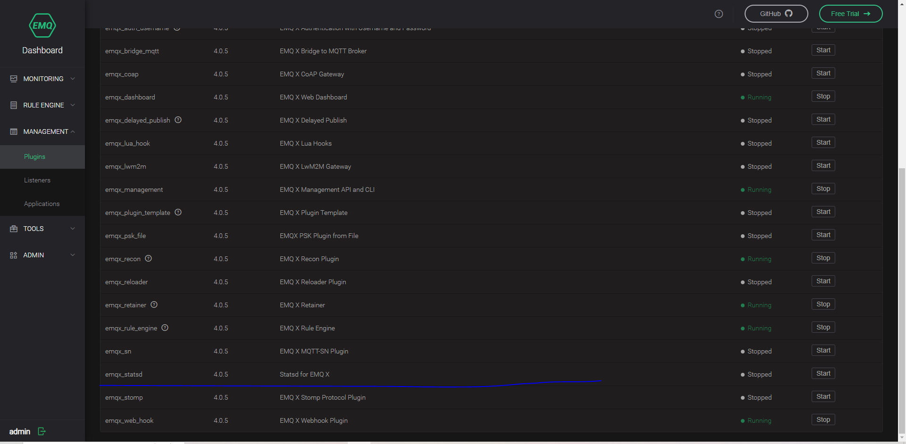
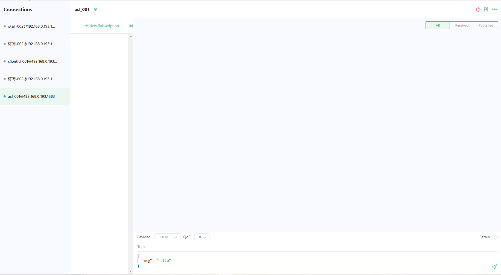
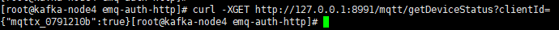
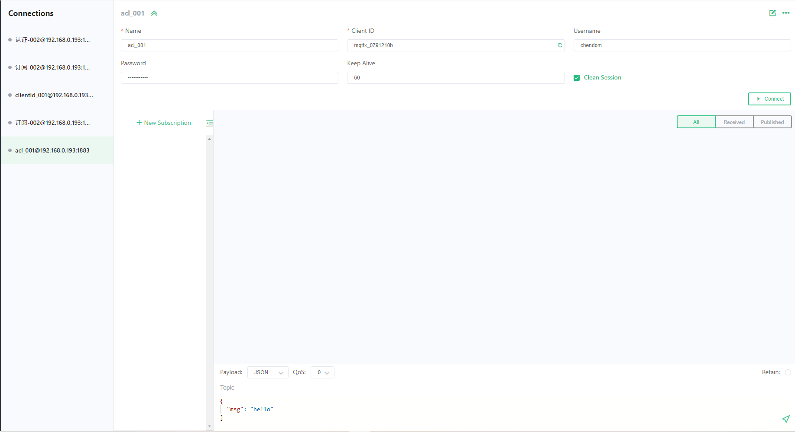
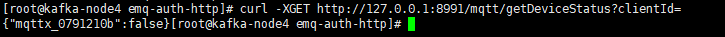

# WebHook
WebHook是由emqx_web_hook插件提供的将EMQX中的狗子时间通知到某个web服务的功能
钩子(Hooks) 是 EMQ X 提供的一种机制，它通过拦截模块间的函数调用、消息传递、事件传递来修改
或扩展系统功能。
简单来讲，该机制目的在于增强软件系统的扩展性、方便与其他三方系统的集成、或者改变其系统原有
的默认行为。如下图：


[webhook的工作原理](https://app.diagrams.net/#Hchenanddom%2FCharts%2Fmain%2Frepo%2Femqx_webhook.drawio)


当系统中不存在 钩子 (Hooks) 机制时，整个事件处理流程 从 事件 (Event) 的输入，到 处理 (Handler)，
再到完成后的返回 结果 (Result) 对于系统外部而讲，都是不可见、且无法修改的。
而在这个过程中加入一个可挂载函数的点 (HookPoint)，允许外部插件挂载多个回调函数，形成一个调
用链。达到对内部事件处理过程的扩展和修改。系统中常用到的认证插件则是按照该逻辑进行实现的。
因此，在 EMQ X 中，钩子 (Hooks) 这种机制极大地方便了系统的扩展。我们不需要修改 emqx 核心代
码，仅需要在特定的位置埋下 挂载点 (HookPoint) ，便能允许外部插件扩展 EMQ X 的各种行为。


* 对于实现者来说仅需要关注:
    * 挂载点(HookPoint)的位置:包括其作用，执行的实际，和如何挂载和取消挂载。
    * 回调函数的实现:包括回调函数的入参个数、作用、数据结构等，以及返回值代表的含义。
    * 了解回调函数载链上执行的机制:包括回调函数的执行顺序，以及如何提前终止链的执行
WebHook 对于事件的处理是单向的，它仅支持将 EMQ X 中的事件推送给 Web 服务，并不关心 Web 服务的
返回。 借助 Webhook 可以完成设备在线、上下线记录，订阅与消息存储、消息送达确认等诸多业务    


## webhook的配置
/etc/emqx/plugins/emqx_web_hook.conf是webhook的主要配置
```shell script
#事件转发的目的服务器地址
web.hook.api.url = http://127.0.0.1:8080

## Encode message payload field
# 对消息类事件中的 Payload 字段进行编码，注释或其他则表示不编码
## Value: base64 | base62
##
## Default: undefined
## web.hook.encode_payload = base64
# 可配置触发规则，其配置的格式如下
web.hook.rule.client.connect.1       = {"action": "on_client_connect"}
web.hook.rule.client.connack.1       = {"action": "on_client_connack"}
web.hook.rule.client.connected.1     = {"action": "on_client_connected"}
web.hook.rule.client.disconnected.1  = {"action": "on_client_disconnected"}
web.hook.rule.client.subscribe.1     = {"action": "on_client_subscribe"}
web.hook.rule.client.unsubscribe.1   = {"action": "on_client_unsubscribe"}
web.hook.rule.session.subscribed.1   = {"action": "on_session_subscribed"}
web.hook.rule.session.unsubscribed.1 = {"action": "on_session_unsubscribed"}
web.hook.rule.session.terminated.1   = {"action": "on_session_terminated"}
web.hook.rule.message.publish.1      = {"action": "on_message_publish"}
web.hook.rule.message.delivered.1    = {"action": "on_message_delivered"}
web.hook.rule.message.acked.1        = {"action": "on_message_acked"}

```
### Event触发事件

|名称|说明|执行时机|
| ---- | ---- | ---- |
|client.connect|处理连接报文|服务端收到客户端的连接报文时触发|
|client.connack|下发连接应答|服务端准备下发连接应答报文时触发|
|client.connected|成功接入|客户端认证完成并成功接入系统后|
|client.disconnected|连接断开|客户端子链接层载准备关闭时触发|
|client.subscribe|订阅主题|收到订阅报文后，执行client.check_acl鉴权前|
|client.unsubscribe|取消订阅|收到订阅操作后触发|
|session.subscribed|会话订阅主题|完成订阅后操作后触发|
|session.unsubscribed|会话取消订阅|完成取消订阅操作后|
|message.publish|消息发布|服务端载发布(路由)消息前触发|
|message.delivered|消息投递|消息准备投递到客户端前|
|message.acked|消息回执|服务端载收到客户端发回的消息ack之后触发|
|message.dropped|消息丢弃|发布出的消息被丢弃后触发|

## Webhook事件参数
事件触发时webhook会按照配置将每个事件组成一个HTTP请求发送到api.url所配置的Web服务器上，。其请求格式为:
```shell script
URL:<api.url> #来自于配置中的`api.url`字段
Method:POST   #固定为POST方法

Body:<JSON>   #Body为JSON格式字符串
```

*　client.connect

|Key|类型|说明|
| ---- | ---- | ---- |
|action|string|事件名称 固定为:"client_connect"|
|clientid|string|客户端ClientId|
|username|string|客户端Username,不存在时该值为"undefined"|
|ipaddress|string|客户端源IP地址|
|keepalive|integer|客户端申请的心跳保活时间|
|proto_ver|integer|协议版本号|

* client.connack

|Key|类型|说明|
| ---- | ---- | ---- |
|action|string|事件名称 固定为:"client_connect"|
|clientid|string|客户端ClientId|
|username|string|客户端Username,不存在时该值为"undefined"|
|ipaddress|string|客户端源IP地址|
|keepalive|integer|客户端申请的心跳保活时间|
|proto_ver|integer|协议版本号|
|conn_ack|string|"success"表示成功，其他表示失败的原因|
||||

* client.connected

|Key|类型|说明|
| ---- | ---- | ---- |
|action|string|事件名称 固定为:"client_connect"|
|clientid|string|客户端ClientId|
|username|string|客户端Username,不存在时该值为"undefined"|
|ipaddress|string|客户端源IP地址|
|keepalive|integer|客户端申请的心跳保活时间|
|proto_ver|integer|协议版本号|
|connected_at|integer|时间戳|
||||

* client.disconnected

|Key|类型|说明|
| ---- | ---- | ---- |
|action|string|事件名称 固定为:"client_connect"|
|clientid|string|客户端ClientId|
|username|string|客户端Username,不存在时该值为"undefined"|
|reason|string|错误原因|
||||

* client.subscribe
        
        |Key|类型|说明|
        | ---- | ---- | ---- |
        |action|string|事件名称 固定为:"client_connect"|
        |clientid|string|客户端ClientId|
        |username|string|客户端Username,不存在时该值为"undefined"|
        |topic|string|将要订阅的主题|
        |opts|json|订阅参数|
        ||||
    * opts 
    
        |Key|类型|说明|
        | ---- | ---- | ---- |
        |qos|enum|Qos等级，可取0，1，2|
        
* client.unsubscribe

|Key|类型|说明|
| ---- | ---- | ---- |
|action|string|事件名称 固定为:"client_connect"|
|clientid|string|客户端ClientId|
|username|string|客户端Username,不存在时该值为"undefined"|
|topic|string|将要订阅的主题|


* message.publish


|Key|类型|说明|
| ---- | ---- | ---- |
|action|string|事件名称 固定为:"client_connect"|
|from_client_id|string|发布端的Client_id|
|from_username|string|发布端Username,不存在时该值为"undefined"|
|topic|string|取消订阅的主题|
|qos|enum|QoS等级，可取0、1、2|
|retain|bool|是否为retain消息|
|payload|string|消息payload|
|ts|integer|消息的时间戳(毫秒)|


* message.delivered


|Key|类型|说明|
| ---- | ---- | ---- |
|action|string|事件名称 固定为:"client_connect"|
|from_client_id|string|发布端的Client_id|
|from_username|string|发布端Username,不存在时该值为"undefined"|
|topic|string|取消订阅的主题|
|qos|enum|QoS等级，可取0、1、2|
|retain|bool|是否为retain消息|
|payload|string|消息payload|
|ts|integer|消息的时间戳(毫秒)|


## Webhook实例

```java

    /**
     * 使用webhook监督客户端的状态变化
     *
     * @param body
     */
    @PostMapping("/webhook")
    public void webhook(@RequestBody Map<String, Object> body) {
        authService.webhook(body);
    }

    @GetMapping("/getDeviceStatus")
    public Map getDeviceStatus(@RequestParam("clientId")String clientId){
        return authService.getDeviceStatus(clientId);
    }

    public void webhook(Map<String, Object> body) {
        String action = (String) body.get("action");
        String clientId = (String) body.get("clientid");
        if (action.equals("client_connected")) {
            //客户端成功接入
            clientStatusMap.put(clientId, true);
        }
        if (action.equals("client_disconnected")) {
            //客户端断开连接
            clientStatusMap.put(clientId, false);
        }
    }

    public Map getDeviceStatus(String clientId) {
        if (StringUtils.isEmpty(clientId)){
            return clientStatusMap;
        }
        final String cid = clientId;
        return new HashMap<String,Boolean>(){{put(cid,clientStatusMap.get(cid));}};
    }


```
/etc/emqx/plugins/emqx_web_hook.conf
```shell script
web.hook.api.url = http://127.0.0.1:8991/mqtt/webhook
# webhook监控连接事件
web.hook.rule.client.connected.1     = {"action": "on_client_connected"}
# webhook监控断开连接事件
web.hook.rule.client.disconnected.1  = {"action": "on_client_disconnected"}
```
* 后端管理界面开启webhook插件











