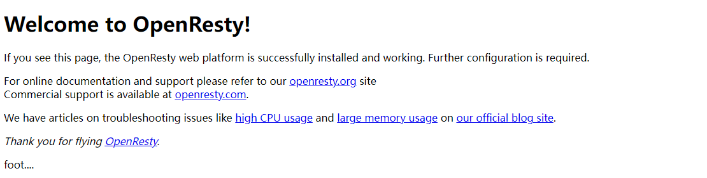

# NGINX
## Nginx的架构体系

　
```text
    nginx使用一个master,协调多个worker进程的方式进行服务
```

## Nginx配置详解
```shell script
# 处理进程数
worker_processes  1;
events {
    #一个进程能处理的链接数
    worker_connections  1024;
}


http {
    # 将另外的配置文件引到当前的配置文件中
    include       mime.types;
    # 默认使用数据流传输数据
    default_type  application/octet-stream;
    #标识打开零拷贝
    sendfile        on;
    #tcp_nopush     on;

    #keepalive_timeout  0;
    keepalive_timeout  65;
    # 虚拟主机
    server {
        # 监听的端口号
        listen       80;
        # 主机名 ，域名
        server_name  localhost;
        # uri,例如http://www.baidu.com/xx/xxx/aa.txt,是http://www.baidu.com后面的资源位置
        location / {
            root   html;
            index  index.html index.htm;
        }
        # 错误码
        error_page   500 502 503 504  /50x.html;
        # 如果访问/50x.html就会跳转到 html
        location = /50x.html {
            root   html;
        }

    }
}

```

### 负载均衡的策略
```text
1. ip_hash:根据客户端的ip地址转发到同一台服务器，可以保持会话，但是不适合移动互联网，因为在网络动态变化的状态下，
ip是时常变化的，无法正确的保持会话
2. least_conn:最少联机的的机器，如果使用权重的方式，那么权重低的自然连接少，就无法实现按比分配
3. url_hash:根据用户访问的url定向转发请求,可以实现流量的定向，但是无法实现用户定向
4. fair:根据服务器响应实践转发请求，如果是网络延迟导致的时间响应慢，就会判断错误

```
配置：
```shell script

#user  nobody;
worker_processes  1;

#error_log  logs/error.log;
#error_log  logs/error.log  notice;
#error_log  logs/error.log  info;

#pid        logs/nginx.pid;


events {
    worker_connections  1024;
}


http {
    include       mime.types;
    default_type  application/octet-stream;
    sendfile        on;
    #tcp_nopush     on;

    #keepalive_timeout  0;
    keepalive_timeout  65;

    #gzip  on;
	upstream javaServers{
		# down代表服务已经下线，不在服务的列表内，weight代表的是结点的服务的权重，backup代表的是服务的副本备用
	   #server 172.20.0.1:10001 weight=8 down;
	   server 172.20.0.1:10001 weight=8 down;
	   server 172.20.0.1:10002 weight=2 backup;
	}	
       
    server {
        listen       80;
        server_name  localhost;

	 location / {
	 	proxy_pass http://javaServers;
			#proxy_pass http://qq.com;
		
            #root   html;
            #index  index.html index.htm;
        }

        error_page   500 502 503 504  /50x.html;
        location = /50x.html {
            root   html;
        }

    }

}

```

* url 重写
rewrite是实现URL重写的关键指令，根据regex(正则表达式)部分内容，重定型到replacement，结尾是flag标记
格式: rewrite <regex> <replacement> [flag]
       关键字   正则     替代的内容     flag标记
       
flag标记:
    1. last 本条规则完成后，继续向下匹配新的location uri规则
    2. break 本条规则匹配完成即终止，不再匹配后面的任何规则
    3. redirect 返回302临时重定向，浏览器会显示跳转后的URL地址
    4. permanent 返回301永久重定向，浏览器会显示跳转后的URL地址       
    
rewrite url的语法
```shell script
# 重启防火墙
systemctl restart firewalld
# 重载规则
firewall-cm --reload
# 查看规则
firewalld-cmd --list-all
# 指定端口和ip访问
firewalld-cmd --permanent --add-rich-rule="rule family=ipv4" source address="192.168.0.1" port protocol="tcp"  port="8088"  accept
# 移除规则
firewalld-cmd --permanent --remove-rich-rule="rule family=ipv4" source address="192.168.0.1" port protocol="tcp" port="tcp" accept
```    
示例:要实现访问http://xx.xx.xx.xx/nginx/1.html就转到http://xx.xx.xx.xx/nginx/get的方法上
```shell script
 location ^~/nginx {
		default_type application/json;
		# break 标识只匹配带第一条就返回，不会继续往下执行匹配
		rewrite  ^/nginx/([0-9]+).html$  /nginx/get  redirect;
		#last 标识执行完当前指令后会继续往下执行下面的匹配
		#rewrite  ^/nginx/([0-9]+).html$  /nginx/get  last;
		# 302 临时重定向
		#rewrite  ^/nginx/([0-9]+).html$  /nginx/get  redirect;
		# 301永久重定向
		#rewrite  ^/nginx/([0-9]+).html$  /nginx/get  permanent;
	 	proxy_pass http://javaServers;
			#proxy_pass http://qq.com;
		
            #root   html;
            #index  index.html index.htm;
        }
	location ~*/(js|img|files) {
			root html;
		}	
```
* 防盗链
```shell script
location ~*/(js|img|files) {
        # 校验是否带referer头，如果没有就无法访问
		valid_referers none 47.105.103.82;
		if ($invalid_referer){
		return 403;
		}
		root html;
		}
		}	
```
验证防盗链可以使用curl来验证
```shell script
# 加上-I就可以实现查看请求头的信息
curl -I http://xx.xx.xx/img/docker.PNG
# -e referer消息
curl -e "http://www.baidu.com"  http://xx.xx.xx/img/docker.PNG
```

* keepalive
对客户端进行配置的keepalive参数

```shell script
http {
    include       mime.types;
    default_type  application/octet-stream;

    #keepalive_timeout  0;
	# 表示建立一个连接，超过65s就会超时，设置为０就让keepalive失效
    keepalive_timeout  65 65;
	#
	keepalive_time 1h; # 表示建立TCP连接，如果超过1个小时没有任何活动就关闭连接
	#默认60，系统中弱有耗时操作，如果超过了send_timeout,就强制断开
	#send_timeout 60;
	# 一个TCP复用中可以支持并发接受的请求个数，1000就比较够用了，太多太少都不好
	keepalive_requests 1000;
```

对上游服务器配置的keepalive的参数
向上游服务器保留链接数
keepalive 100;
连接保留时间
keepalive_timeout;
一个tcp复用可以并发接收的请求个数
keepalive_requests
server中的配置
proxy_http_version 1.1;#配置http的版本号，默认使用http1.0协议，需要在request中添加"Connection:keepalive" header才能够支持，而http1.1默认支持开启keepalive
proxy_set_header Connection "";# 清除close信息
```shell script
upstream javaServers{
        # 负载均衡策略要放在第一行
		hash $request_uri;
		#设置和上游服务器的连接
		keepalive 100;
		#保留服务器连接的时间
		keepalive_timeout 65;
		# 一个连接可以接收的请求的个数
		keepalive_requests 1000;

	   server 172.20.0.1:10001;
	   server 172.20.0.1:10002;
	   
	}	
 location ^~/nginx {
		# 配置http的版本号，默认使用http1.0协议，需要在request中添加"Connection:keepalive" header才能够支持，而http1.1默认支持开启keepalive
		proxy_http_version 1.1;
		## 清除close信息
		proxy_set_header Connection "";
		default_type application/json;
		# break 标识只匹配带第一条就返回，不会继续往下执行匹配
		rewrite  ^/nginx/([0-9]+).html$  /nginx/get  redirect;
	 	proxy_pass http://javaServers;
			#proxy_pass http://qq.com;
		
        }
```

* 响应数据压缩
需要在location块进行配置
```text

# 表示打开gzip压缩算法，除此之外还有deflate(给比较老的浏览器使用),br(谷歌专业的压缩算法)
gzip on;
# 此处表示16个缓冲块，每个缓冲块8k,此处需要根据操作系统来配置，如果是32为的操作系统就配32 4k，如果是64位的就配置16 8k.
gzip_buffers 16 8k;
#压缩等级,压缩等级有1-9个，数字越大压缩比越高。
gzip_comp_level 
# 使用gzip的最小版本
gzip_http_version 1.1;
# 设置被gzip压缩的响应的最小长度。长度仅由"Content-Length"响应包头字段确定
gzip_min_length 256;
# 添加一个header，适配来的浏览器 Vary:Accept-Encoding
gzip_vary on;
# 压缩的数据类型
gzip_types application/xhtml+xml application/xml image/avif image/webp image/apng */* application/signed-exchange text/plain text/css application/x-javascript
# 作为反向代理时，需要针对上游的服务器返回的头信息进行压缩，‘
# any无条件启用压缩;off为不做限制;expired 启用压缩，如果header头中包含"Expires"头信息
# no-cache 启用压缩，如果header头中包含"Cache-Control:no-cache"头信息
# no-store 启用压缩，如果header头中包含"Cache-Control:no-store"头信息
#private 启用压缩，如果header头中包含"Cache-Control:private"头信息
#no_last_modified 启用压缩，如果header头中不包含"Last-Modified"头信息
#no_etag 启用压缩，如果header头中不包含"ETag"头信息
#auth 启用压缩，如果header头中包含"Authorization"头信息
gzip_proxied any;
```
示例:

```shell script
 location ^~/nginx {
		gzip on;
		# 此处表示16个缓冲块，每个缓冲块8k,此处需要根据操作系统来配置，如果是32为的操作系统就配32 4k，如果是64位的就配置16 8k.
		gzip_buffers 16 8k;
		#压缩等级,压缩等级有1-9个，数字越大压缩比越高。
		gzip_comp_level 6;
		# 使用gzip的最小版本
		gzip_http_version 1.1;
		# 设置被gzip压缩的响应的最小长度。长度仅由"Content-Length"响应包头字段确定
		gzip_min_length 1;
		# 添加一个header，适配来的浏览器 Vary:Accept-Encoding
		gzip_vary on;
		# 压缩的数据类型
		gzip_types application/xhtml+xml application/xml image/avif image/webp image/apng */* application/signed-exchange text/plain text/css application/x-javascript			  
		# 配置http的版本号，默认使用http1.0协议，需要在request中添加"Connection:keepalive" header才能够支持，而http1.1默认支持开启keepalive
		proxy_http_version 1.1;
		## 清除close信息
		proxy_set_header Connection "";
		default_type application/json;
		# break 标识只匹配带第一条就返回，不会继续往下执行匹配
		rewrite  ^/nginx/([0-9]+).html$  /nginx/get  redirect;
	 	proxy_pass http://javaServers;
        }
```
结果:
Connection: keep-alive
Content-Encoding: gzip
Content-Type: text/html;charset=UTF-8
Date: Wed, 27 Jul 2022 10:06:17 GMT
Keep-Alive: timeout=65
Server: openresty/1.21.4.1
Transfer-Encoding: chunked
Vary: Accept-Encoding

## 提高Nginx性能的相关模块
* brotli

*　SSI


### 合并文件SSI
ssi时nginx默认包含的模块，只需要在nginx配置文件开启就可以使用
示例：
```shell script
     location / {
		# 开启SSI文件合并
		ssi on;
		# 关闭了SSI错误信息的输出
		ssi_silent_errors on;
		root   html;
        index  index.html index.htm;
	 }
```
效果


### 同步文件Rsync
可以实现多个nginx的文件同步
* 客户端从服务端拉去数据实现同步
```shell script
安装rysnc
yum install -y rsync
修改/etc/rsyncd.conf配置文件
# 添加校验的账户名称
auth users=chendom
# 密钥的位置
secrets file=/etc/rsyncd.pwd
# 同步的模块
 [ftp]
# 同步的目录的位置
     path = /usr/local/openresty/nginx/html
#        comment = ftp export area

# 查看远程的rsync指定的文件目录
[root@node2 /]# rsync --list-only chendom@192.168.0.189::ftp/
Password: 
drwxr-xr-x            110 2022/07/28 21:51:30 .
-rw-r--r--            982 2022/07/21 13:24:08 50x.html
-rw-r--r--              0 2022/07/28 21:07:17 bottom.html
-rw-r--r--          1,097 2022/07/21 13:24:08 index.html
-rw-r--r--          2,771 2022/07/28 21:51:00 rsync.html
-rw-r--r--             11 2022/07/28 21:53:42 test.html
-rw-r--r--              0 2022/07/28 21:07:02 top.html

#同步文件
[root@node2 /]# rsync -avz chendom@192.168.0.189::ftp/  /usr/local/openresty/nginx/html/
Password: 
receiving incremental file list
./
rsync.html
test.html

sent 65 bytes  received 1,179 bytes  355.43 bytes/sec
total size is 4,861  speedup is 3.91
# 删除文件
[root@node2 /]# rsync -avz --delete  --password-file=/etc/remote_rsync.pwd chendom@192.168.0.189::ftp/ /usr/local/openresty/nginx/html/
Password: 
receiving incremental file list
deleting rsync.html
./

sent 27 bytes  received 166 bytes  42.89 bytes/sec
total size is 2,090  speedup is 10.83

```
* 服务端将数据推送到客户端
```shell script
[root@node2 ~]# rsync -avz --delete --password-file=/etc/rsync.pwd.client /usr/local/openresty/nginx/html chendom@192.168.0.189::ftp/
sending incremental file list
rsync: recv_generator: mkdir "/html" (in ftp) failed: Permission denied (13)
*** Skipping any contents from this failed directory ***
html/

sent 182 bytes  received 162 bytes  688.00 bytes/sec
total size is 2,090  speedup is 6.08
rsync error: some files/attrs were not transferred (see previous errors) (code 23) at main.c(1179) [sender=3.1.2]

```
* 注意
上面的配置文件/etc/rsyncd.conf,存在客户端的服务器的密码文件/etc/rsyncd.pwd,存在服务器的客户端的密码文件/etc/rsyncd.pwd.client都需
修改权限chmod 600 /etc/rsyncd.conf  /etc/rsyncd.pwd /etc/rsyncd.pwd.client
除此之外，如果服务器向推送数据到客户端实现同步，需要在客户端的rsyncd.conf上配置 read only=no ,否则无法实现推送

到此已经完成rsync的文件同步，但是每次手动比较麻烦


* Inotify监控文件的变化
[Inotify监控文件的变化](./files/inotify-tools-3.14.tar.gz)
```shell script
# inotifywait
# 选项：
#    -r：递归，对目录中的子目录也进行监控
#    -q：仅仅打印少量信息（仅仅打印监控的事件）
#    -m：一直处于监控状态
#    -d：和-m一样，区别是-d是后台运行
#    -o file:将监控到的事件输出到一个文件中（默认输出到终端） 
#    -s：将错苏信息输出到系统日志中（默认输出到终端）
#    --excludei：忽略文件名的大小写
#    -e <event>：监控指定的事件
#        access：访问事件
#        modify：编辑事件
#        attrib：修改文件属性事件（修改文件元数据）
#        close_write：当文件从写模式下关闭的时候，会触发该事件
#        close_nowrite：当文件从读模式下关闭的时候，会触发该事件
#        close：无论以什么方式打开的文件，在关闭的时候都会触发该事件
#        open：当文件被打开时，都会触发该事件
#        moved_to：当一个文件移动到被监控的目录下，就会触发该事件
#        moved_from：当一个文件从被监控目录下移走的时候，就会触发该事件
#        moved_sekf：在监控目录下执行移操作，就会触发该事件
#        create：创建文件的时候触发
#        delete：删除文件的时候触发
        
#    --timefmt <fmt>：指定时间显示的格式（和date格式一样）
#    --format <fmt>：
#        %f：输出发生事件的名称
#        %w：输出繁盛事件的文件所在目录的绝对路劲
#        %e:输出发生时间的名称（多个事件以空格隔开）
#        %Xe：和%e唯一区别是多个事件以X隔开
#        %T：输出发生事件的时间(时间格式由--timefmt指定)
监控目录的脚本

#!/bin/bash
./inotify/bin/inotifywait -mrq --timefmt '%Y-%m-%d %H%M%S' --format '%T %w%f%e' -e close_write,modify,create,delete,attrib,move ///usr/local/openresty/nginx/html/ | while read file 
do
         rsync -avz --delete --password-file=/etc/rsync.pwd.client /usr/local/openresty/nginx/html/ chendom@192.168.0.189::ftp/
done
```
注意:
需要将/usr/local/openresty/nginx/html/目录进行权限的修改，除此之外还需要将客户端的的/etc/rsyncd.conf配置文件的用户和用户的id修改
```shell script
  chmod 777 /usr/local/openresty/nginx/html/  


# /etc/rsyncd: configuration file for rsync daemon mode

# See rsyncd.conf man page for more options.

# configuration example:
#rsync操作文件时使用的时root用户和root用户组的权限
 uid =root
 gid = root
# use chroot = yes
# max connections = 4
# pid file = /var/run/rsyncd.pid
# exclude = lost+found/
# transfer logging = yes
# timeout = 900
# ignore nonreadable = yes
# dont compress   = *.gz *.tgz *.zip *.z *.Z *.rpm *.deb *.bz2

auth users=chendom
secrets file=/etc/rsyncd.pwd
read only=no

 [ftp]
     path = /usr/local/openresty/nginx/html
#        comment = ftp export area
~                                       


```
监控目录的脚本
[监控目录的脚本](./files/monitor.sh)


