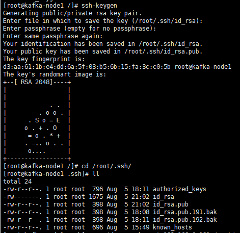
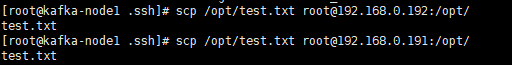

# Kafka安装
## 配置SSH免密登录
为了便于集群的操作，最好要配置一个ssh免密登录
* 操作的步骤:

1. 在这之前我已经有了三台机器，这个三台机器分别为kafka-node1、kafka-node2、kafka-node3
它们的IP分别为192.168.0.190,192.168.0.191,192.168.0.192
2. 生成公私密钥,如果需要免密登录那台机器就将本机的公钥放到对应的机器的/root/.ssh/目录下即可。

3. 因为一般都在kafka-node1结点操作，然后将操作的指令都到kafka-node2和kafka-node3结点都分别执行
```shell script
[root@kafka-node1 .ssh]# scp id_rsa.pub root@192.168.0.191:/root/.ssh/id_rsa.pub.190
root@192.168.0.191's password: 
id_rsa.pub                                                                                                                                                                                                     100%  398     0.4KB/s   00:00    
[root@kafka-node1 .ssh]# scp id_rsa.pub root@192.168.0.192:/root/.ssh/id_rsa.pub.190
root@192.168.0.192's password: 
id_rsa.pub     
```
4. 配置免密登录
```shell script
[root@kafka-node2 .ssh]# cat id_rsa.pub.190 > authorized_keys
[root@kafka-node3 .ssh]# cat id_rsa.pub.190 >> authorized_keys
```
此时在kafka-node1就可以免密登录操作kafka-node2、kafka-node3


## 安装zookeeper
```shell script

# 1. 解压apache-zookeeper-3.8.0-bin.tar.gz 到/opt/module/apache-zookeeper 
tar -xzvf apache-zookeeper-3.8.0-bin.tar.gz
# 2.修改配置文件/opt/module/apache-zookeeper/conf/zoo-sample.cfg
mv zoo-sample.cfg zoo.cfg
# 修改配置文件zoo.cfg
vim zoo.cfg
    # The number of milliseconds of each tick
    tickTime=2000
    # The number of ticks that the initial 
    # synchronization phase can take
    initLimit=10
    # The number of ticks that can pass between 
    # sending a request and getting an acknowledgement
    syncLimit=5
    # the directory where the snapshot is stored.
    # do not use /tmp for storage, /tmp here is just 
    # example sakes.
    #对应了服务myid的目录
    dataDir=/opt/module/apache-zookeeper/conf/data
    # the port at which the clients will connect
    clientPort=2181
    # the maximum number of client connections.
    # increase this if you need to handle more clients
    #maxClientCnxns=60
    #
    # Be sure to read the maintenance section of the 
    # administrator guide before turning on autopurge.
    #
    # https://zookeeper.apache.org/doc/current/zookeeperAdmin.html#sc_maintenance
    #
    # The number of snapshots to retain in dataDir
    #autopurge.snapRetainCount=3
    # Purge task interval in hours
    # Set to "0" to disable auto purge feature
    #autopurge.purgeInterval=1
    
    ## Metrics Providers
    #
    # https://prometheus.io Metrics Exporter
    #metricsProvider.className=org.apache.zookeeper.metrics.prometheus.PrometheusMetricsProvider
    #metrics Provider.httpHost=0.0.0.0
    #metricsProvider.httpPort=7000
    #metricsProvider.exportJvmInfo=true
    # 分别对应三台服务器主机
    server.1=kafka-node1:2188:2888
    server.2=kafka-node2:2188:2888
    server.3=kafka-node3:2188:2888

# 在 /opt/module/apache-zookeeper/conf/目录下创建data目录并创建myid文件，分别在kafka-node1 kafka-node2 kafka-node3结点
# 将myid追加服务id,对应上面的zoo.cfg配置文件的dataDir
echo "1" > myid
echo "2" > myid
echo "3" > myid
# 启动zookeeper
./bin/zkServer.sh start
ZooKeeper JMX enabled by default
Using config: /opt/module/apache-zookeeper/bin/../conf/zoo.cfg
Starting zookeeper ... STARTED
[root@kafka-node2 apache-zookeeper]# ps -ef |grep zoopkeeper
[root@kafka-node2 apache-zookeeper]# ps -ef |grep zookeeper
root       5520      1  6 16:56 pts/0    00:00:02 /usr/local/JDK/jdk1.8.0_144/bin/java -Dzookeeper.log.dir=/opt/module/apache-zookeeper/bin/../logs -Dzookeeper.log.file=zookeeper-root-server-kafka-node2.log -XX:+HeapDumpOnOutOfMemoryError -XX:OnOutOfMemoryError=kill -9 %p -cp /opt/module/apache-zookeeper/bin/../zookeeper-server/target/classes:/opt/module/apache-zookeeper/bin/../build/classes:/opt/module/apache-zookeeper/bin/../zookeeper-server/target/lib/*.jar:/opt/module/apache-zookeeper/bin/../build/lib/*.jar:/opt/module/apache-zookeeper/bin/../lib/zookeeper-prometheus-metrics-3.8.0.jar:/opt/module/apache-zookeeper/bin/../lib/zookeeper-jute-3.8.0.jar:/opt/module/apache-zookeeper/bin/../lib/zookeeper-3.8.0.jar:/opt/module/apache-zookeeper/bin/../lib/snappy-java-1.1.7.7.jar:/opt/module/apache-zookeeper/bin/../lib/slf4j-api-1.7.30.jar:/opt/module/apache-zookeeper/bin/../lib/simpleclient_servlet-0.9.0.jar:/opt/module/apache-zookeeper/bin/../lib/simpleclient_hotspot-0.9.0.jar:/opt/module/apache-zookeeper/bin/../lib/simpleclient_common-0.9.0.jar:/opt/module/apache-zookeeper/bin/../lib/simpleclient-0.9.0.jar:/opt/module/apache-zookeeper/bin/../lib/netty-transport-native-unix-common-4.1.73.Final.jar:/opt/module/apache-zookeeper/bin/../lib/netty-transport-native-epoll-4.1.73.Final.jar:/opt/module/apache-zookeeper/bin/../lib/netty-transport-classes-epoll-4.1.73.Final.jar:/opt/module/apache-zookeeper/bin/../lib/netty-transport-4.1.73.Final.jar:/opt/module/apache-zookeeper/bin/../lib/netty-tcnative-classes-2.0.48.Final.jar:/opt/module/apache-zookeeper/bin/../lib/netty-tcnative-2.0.48.Final.jar:/opt/module/apache-zookeeper/bin/../lib/netty-resolver-4.1.73.Final.jar:/opt/module/apache-zookeeper/bin/../lib/netty-handler-4.1.73.Final.jar:/opt/module/apache-zookeeper/bin/../lib/netty-common-4.1.73.Final.jar:/opt/module/apache-zookeeper/bin/../lib/netty-codec-4.1.73.Final.jar:/opt/module/apache-zookeeper/bin/../lib/netty-buffer-4.1.73.Final.jar:/opt/module/apache-zookeeper/bin/../lib/metrics-core-4.1.12.1.jar:/opt/module/apache-zookeeper/bin/../lib/logback-core-1.2.10.jar:/opt/module/apache-zookeeper/bin/../lib/logback-classic-1.2.10.jar:/opt/module/apache-zookeeper/bin/../lib/jline-2.14.6.jar:/opt/module/apache-zookeeper/bin/../lib/jetty-util-ajax-9.4.43.v20210629.jar:/opt/module/apache-zookeeper/bin/../lib/jetty-util-9.4.43.v20210629.jar:/opt/module/apache-zookeeper/bin/../lib/jetty-servlet-9.4.43.v20210629.jar:/opt/module/apache-zookeeper/bin/../lib/jetty-server-9.4.43.v20210629.jar:/opt/module/apache-zookeeper/bin/../lib/jetty-security-9.4.43.v20210629.jar:/opt/module/apache-zookeeper/bin/../lib/jetty-io-9.4.43.v20210629.jar:/opt/module/apache-zookeeper/bin/../lib/jetty-http-9.4.43.v20210629.jar:/opt/module/apache-zookeeper/bin/../lib/javax.servlet-api-3.1.0.jar:/opt/module/apache-zookeeper/bin/../lib/jackson-databind-2.13.1.jar:/opt/module/apache-zookeeper/bin/../lib/jackson-core-2.13.1.jar:/opt/module/apache-zookeeper/bin/../lib/jackson-annotations-2.13.1.jar:/opt/module/apache-zookeeper/bin/../lib/commons-io-2.11.0.jar:/opt/module/apache-zookeeper/bin/../lib/commons-cli-1.4.jar:/opt/module/apache-zookeeper/bin/../lib/audience-annotations-0.12.0.jar:/opt/module/apache-zookeeper/bin/../zookeeper-*.jar:/opt/module/apache-zookeeper/bin/../zookeeper-server/src/main/resources/lib/*.jar:/opt/module/apache-zookeeper/bin/../conf:.:/usr/local/JDK/jdk1.8.0_144/jre/lib/rt.jar:/usr/local/JDK/jdk1.8.0_144/lib/dt.jar:/usr/local/JDK/jdk1.8.0_144/lib/tools.jar -Xmx1000m -Dcom.sun.management.jmxremote -Dcom.sun.management.jmxremote.local.only=false org.apache.zookeeper.server.quorum.QuorumPeerMain /opt/module/apache-zookeeper/bin/../conf/zoo.cfg

```


## 安装kafka


