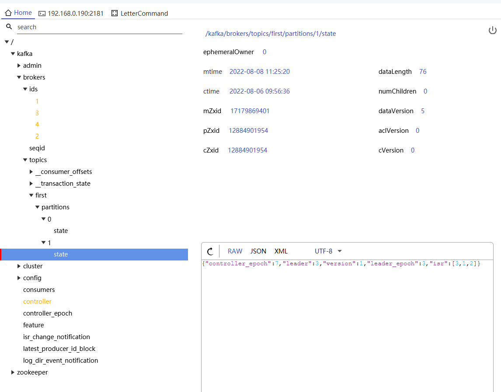

# Kafka服役退役结点
## Kafka服役结点
服役结点就是在现有的集群上增加结点，提高集群的请求效率和存储的效率
添加服役结点的步骤
1. 将kafka-node3的结点关闭并克隆一个新的结点，修改mac地址，修改ip地址，修改server.properties配置文件的broker.id=4

2. 删除 kafka-node4中kafka下的 datas 和logs 。
```shell script
 rm rf datas/* logs/*
```
3. 启动kafka-node1,kafka-node2,kafka-node3结点上的zookeeper和kafka集群
```shell script
sh zk.sh start
```
4. 启动kafka-node4结点上的kafka
```shell script
./bin/kafka-server-start.sh -daemon ./config/server.properties 
```

5. 创建一个要均衡的主题
```shell script
vim topics-to-move.json 

{
	"topics":[
		{"topic":"first"}
	],
	"version":1
}

```
6.生成一个负载均衡的计划
```shell script
[root@kafka-node1 kafka]# sh ./bin/kafka-reassign-partitions.sh --bootstrap-server kafka-node1:9092,kafka-node2:9092,kafka-node3:9092 --topics-to-move-json-file topics-to-move.json --broker-list "1,2,3,4" --generate
Current partition replica assignment
{"version":1,"partitions":[{"topic":"first","partition":0,"replicas":[1,3,2],"log_dirs":["any","any","any"]},{"topic":"first","partition":1,"replicas":[2,3,1],"log_dirs":["any","any","any"]}]}

Proposed partition reassignment configuration
{"version":1,"partitions":[{"topic":"first","partition":0,"replicas":[2,4,1],"log_dirs":["any","any","any"]},{"topic":"first","partition":1,"replicas":[3,1,2],"log_dirs":["any","any","any"]}]}

```

7.创建副本存储计划(所有副本存储在 broker1 、 broker2 、 broker3 、 broker4 中)
```shell script
echo '{"version":1,"partitions":[{"topic":"first","partition":0,"replicas":[2,4,1],"log_dirs":["any","any","any"]},{"topic":"first","partition":1,"replicas":[3,1,2],"log_dirs":["any","any","any"]}]}'>> increase-replication-factor.json
```
8.执行副本存储计划
```shell script
[root@kafka-node1 kafka]# sh ./bin/kafka-reassign-partitions.sh --bootstrap-server kafka-node1:9092,kafka-node2:9092,kafka-node3:9092 --reassignment-json-file increase-replication-factor.json --execute
Current partition replica assignment

{"version":1,"partitions":[{"topic":"first","partition":0,"replicas":[1,3,2],"log_dirs":["any","any","any"]},{"topic":"first","partition":1,"replicas":[2,3,1],"log_dirs":["any","any","any"]}]}

Save this to use as the --reassignment-json-file option during rollback
Successfully started partition reassignments for first-0,first-1
[root@kafka-node1 kafka]# sh ./bin/kafka-reassign-partitions.sh --bootstrap-server kafka-node1:9092,kafka-node2:9092,kafka-node3:9092 --reassignment-json-file increase-replication-factor.json --verify
Status of partition reassignment:
Reassignment of partition first-0 is still in progress.
Reassignment of partition first-1 is complete.
```

9. 验证副本存储中心
```shell script
[root@kafka-node1 kafka]# sh ./bin/kafka-reassign-partitions.sh --bootstrap-server kafka-node1:9092,kafka-node2:9092,kafka-node3:9092 --reassignment-json-file increase-replication-factor.json --verify
Status of partition reassignment:
Reassignment of partition first-0 is complete.
Reassignment of partition first-1 is complete.

Clearing broker-level throttles on brokers 1,2,3,4
Clearing topic-level throttles on topic first

```



## Kafka退役结点