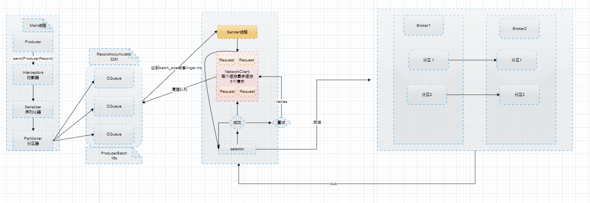

#Kafka原理剖析
## 生产者的发送原理

```text
在消息发送的过程中，涉及到了两个线程——main 线程和Sender 线程。在main 线程
中创建了一个双端队列RecordAccumulator。main 线程将消息发送给RecordAccumulator，
Sender 线程不断从RecordAccumulator 中拉取消息发送到Kafka Broker。

Sender线程最大可以缓冲5个请求，如果broker在这五个请求过去之后还没有任何响应，
就会拒收第五个请求之后的所有请求。

如果broker接收消息成功了，那么就会反馈状态给Sender，如果成功，就会将RecordAccumulate线程的DQueue
RecordAccumulate的大小是32M，每个producer Batch有16k，没满16k就作为一批发送给broker，如果一直没有满，在
达到了linger time之后就也会发送，默认情况linger time是0，就是一有消息就接收，但是这样效率不高。

```

## Kafka发送消息
[异步发送消息和同步发送消息](./kafka-async-send/src/main/java/com/itdom/kafka/CustomProducer.java)

## Kafka消息回调
[Kafka发送消息回调](./kafka-async-send/src/main/java/com/itdom/kafka/CustomProducerCallback.java)


## Kafka分区的好处
1. 便于合理的使用存储资源，每个partition在Broker上存储，可以把海量的数据按照分区切割成一块一块的数存储在多个Broker上。
合理的控制分区的任务，可以实现负载均衡的效果
2. 提高并行度，生产者可以亿分区为单位发送数据，消费者可以以分区为单位进行消费数据

## Kafka的优化增加吞吐量
* 
    * batch.size:批次大小，默认16k
    * linger.ms 等待实践，修改为5~10ms
    
    * compression.type:压缩snappy
    
    * RecordAccumulator:缓冲区大小，修改为64M
    
    
## Kafka的应答原理

ACK应答级别:
1. 0:生产者发送过来的数据，不需要等待数据落盘应答

2. 1:生产者发送过来的数据，Leader收到数据后应答
    
3. -1(all):生产者发送过来的数据，Leader和ISR队列里面所有的结点收齐数据后应答    

思考：Leader收到数据，所有Follower都开始同步数据，但有一
个Follower，因为某种故障，迟迟不能与Leader进行同步，那这个问
题怎么解决呢？

Leader维护了一个动态的in-sync replica set（ISR），意为和
Leader保持同步的Follower+Leader集合(leader：0，isr:0,1,2)。
如果Follower长时间未向Leader发送通信请求或同步数据，则
该Follower将被踢出ISR。该时间阈值由replica.lag.time.max.ms参
数设定，默认30s。例如2超时，(leader:0, isr:0,1)。
这样就不用等长期联系不上或者已经故障的节点。

数据可靠性分析：
如果分区副本设置为1个，或者ISR里应答的最小副本数量
（ min.insync.replicas 默认为1）设置为1，和ack=1的效果是一
样的，仍然有丢数的风险（leader：0，isr:0）
数据完全可靠条件= ACK级别设置为-1 + 分区副本大于等于2 + ISR里应答的最小副本数量大于等于2

[以上broker响应ack存在的问题](https://app.diagrams.net/#Hchenanddom%2FCharts%2Fmain%2Frepo%2Fkafka%E7%9A%84ack%E5%8E%9F%E7%90%86%E5%89%96%E6%9E%90.drawio)

可靠性总结：
acks=0，生产者发送过来数据就不管了，可靠性差，效率高；
acks=1，生产者发送过来数据Leader应答，可靠性中等，效率中等；
acks=-1，生产者发送过来数据Leader和ISR队列里面所有Follwer应答，可靠性高，效率低；
在生产环境中，acks=0很少使用；acks=1，一般用于传输普通日志，允许丢个别数据；acks=-1，一般用于传输和钱相关的数据，
对可靠性要求比较高的场景

## Kafka消息重复的问题`
数据传递的语义
* 至少一次(At least One)=ACK级别设置为-1+分区副本大于等于2+ISR里应答副本大于等于2
*　最多一次(At Most One)=ACK级别设置为0
* 总结：
    At Least Once可以保证数据不丢失，但是不能保证数据不重复；
    At Most Once可以保证数据不重复，但是不能保证数据不丢失。

* 精确一次（Exactly Once）：对于一些非常重要的信息，比如和钱相关的数据，要求数据既不能重复也不丢失。

Kafka 0.11版本以后，引入了一项重大特性：幂等性和事务。

### Kafka幂等性
幂等性的原理
```text
幂等性就是指Producer不论向Broker发送多少次重复数据，Broker端都只会持久化一条，保证了不重复。
精确一次（Exactly Once） = 幂等性+ 至少一次（ ack=-1 + 分区副本数>=2 + ISR最小副本数量>=2） 。
重复数据的判断标准：具有<PID, Partition, SeqNumber>相同主键的消息提交时，Broker只会持久化一条。其
中PID是Kafka每次重启都会分配一个新的；Partition 表示分区号；Sequence Number是单调自增的。
所以幂等性只能保证的是在单分区单会话内不重复。

开启幂等性只需要将参数 enable.idempotence设置为true,默认为true，false关闭
```
幂等性存在的问题：
```text
因为幂等性需要使用到PID,Partition,sequenceid,在同一会话和同一个分区中的同一个序列号的消息是不可能重复的，但是如果broker重启了，
就会出现重复数据的可能，如果要实现不重复数据就需要使用到kafka的事务
```
###  Kafka的事务
说明：开启事务，必须开启幂等性。

[Kafka的事务](https://app.diagrams.net/#Hchenanddom%2FCharts%2Fmain%2Frepo%2FKafka%E4%BA%8B%E5%8A%A1.drawio)

具体的代码实现
[CustomerProducerParameter.java](./kafka-async-send/src/main/java/com/itdom/kafka/CustomerProducerParameter.java)

关键代码
```java
          // 指定事务id(一定要指定)
        properties.put(ProducerConfig.TRANSACTIONAL_ID_CONFIG, "kafka_transaction_001");
        //初始化事务
        kafkaProducer.initTransactions();
        //开启事务
        kafkaProducer.beginTransaction();
        try {
            for (int i = 0; i < 10; i++) {

                kafkaProducer.send(new ProducerRecord<String, String>("first", "transaction-00"+i), new Callback() {
                    @Override
                    public void onCompletion(RecordMetadata metadata, Exception exception) {
                        if (metadata != null) {
                            logger.info("topic:{},partition:{}", metadata.topic(), metadata.partition());
                        }
                    }
                });
            }
            //提交事务
            kafkaProducer.commitTransaction();
        } catch (Exception e) {
            //丢弃事务
            kafkaProducer.abortTransaction();
        } finally {
            kafkaProducer.close();
        }
```