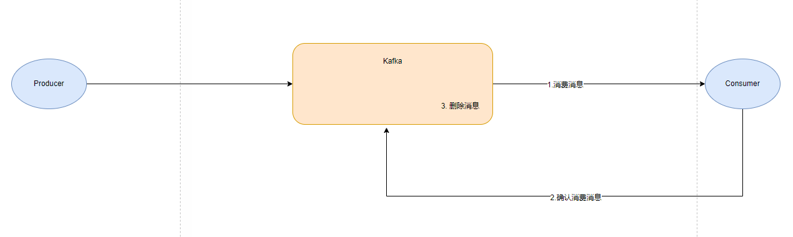
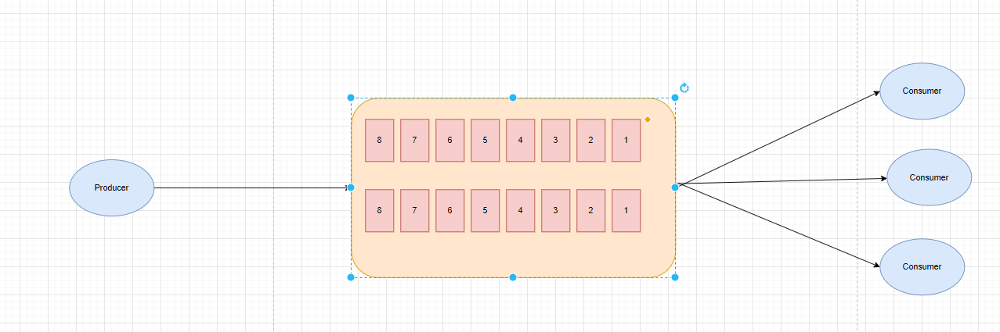

# kafka
传统的定义:kafka是基于分布式的发布订阅的消息队列.

现代:Apache Kafka 是一个开源分布式事件流平台，被数千家公司用于高性能数据管道、流分析、数据集成和任务关键型应用程序.

## 消息队列的两种模式
* 点对点:
    * 消费者主动拉去数据，消息收到后清除消息

* 发布/订阅模式:
    * 可以有多个topic主题(比如浏览、订阅、收藏、评论等)
    * 消费者消费数据之后，不删除数据
    * 每个消费者相互独立，都可以消费到数据
    
    
    
## Kafka基础架构
1. 为了方便扩展，并提高吞吐量，一个topic分为多个partition
2. 配合分区的涉及，提高小组的概念，组内每个消费者并行消费
3. 为了提高可用性，未每个partition增加若干副本，类似NameNode HA
4. ZK中记录谁是leader，Kafka2.8.0以后可以配置不采用ZK

## KAFKA安装
[KAFKA安装笔记](./KAFKA-INSTALL.MD)

    

