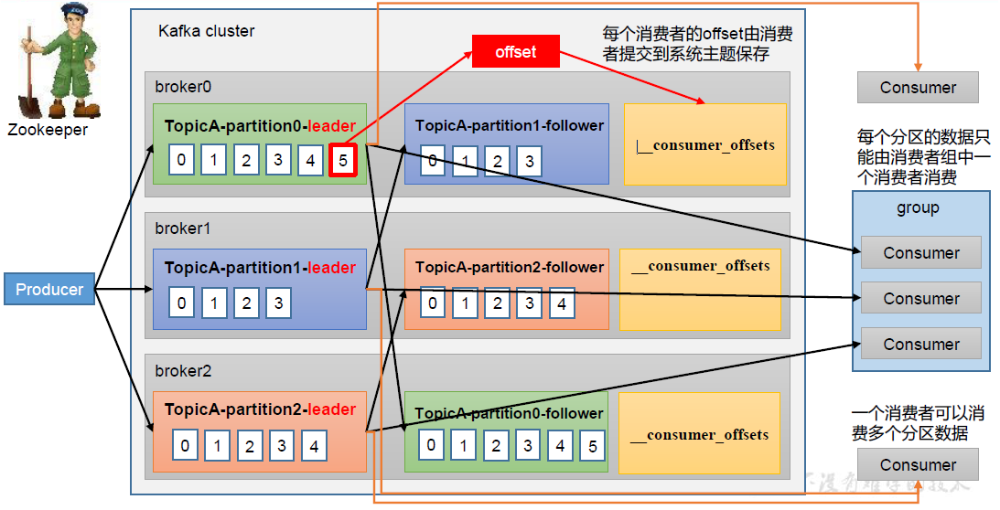

# kafka
传统的定义:kafka是基于分布式的发布订阅的消息队列.

现代:Apache Kafka 是一个开源分布式事件流平台，被数千家公司用于高性能数据管道、流分析、数据集成和任务关键型应用程序.

## 消息队列的两种模式
* 点对点:
    * 消费者主动拉去数据，消息收到后清除消息


* 发布/订阅模式:
    * 可以有多个topic主题(比如浏览、订阅、收藏、评论等)
    * 消费者消费数据之后，不删除数据
    * 每个消费者相互独立，都可以消费到数据
    
    
    
## Kafka基础架构
1. 为了方便扩展，并提高吞吐量，一个topic分为多个partition
2. 配合分区的涉及，提高小组的概念，组内每个消费者并行消费
3. 为了提高可用性，未每个partition增加若干副本，类似NameNode HA
4. ZK中记录谁是leader，Kafka2.8.0以后可以配置不采用ZK


## KAFKA安装
[KAFKA安装笔记](./KAFKA-INSTALL.MD)


## Kafka的相关操作

|参数|描述|
| ---- | ---- |
|--bootstrap-server<String:server toconnect to>|连接的Kafka Broker主机名称和端口号|
|--topic<String:topic>|操作的topic名称|
|--create|创建主题|
|--delete|删除主题|
|--alter|修改主题|
|--list|查看所有主题|
|--describe|查看主题详细描述|
|--partitions<Integer:# of partitions>|设置分区数|
|--replication-factor<Integer:replication factor>|设置分区副本|
|--config<String:name=value>|更新系统默认的配置|

```shell script
# 创建分区
[root@kafka-node1 kafka]# ./bin/kafka-topics.sh --bootstrap-server kafka-node1:9092,kafka-node2:9092,kafka-node3:9092 --topic first --create --partitions 1 --replication-factor 3
Created topic first.
#罗列分区
[root@kafka-node1 kafka]# ./bin/kafka-topics.sh --bootstrap-server kafka-node1:9092,kafka-node2:9092,kafka-node3:9092 --list
first
# 查看分区 PartitionCount 分区数 ReplicationFactor 分区副本的数量 Configs: segment.bytes分区一个块的大小，默认是1GB  Topic:first分区的名称  Partition:表示分区从0开始  Leader:1 说明1是leader机器          Replicas: 1,3,2(副本所在的服务实例)
[root@kafka-node1 kafka]# ./bin/kafka-topics.sh --bootstrap-server kafka-node1:9092,kafka-node2:9092,kafka-node3:9092 --topic first --describe
Topic: first	TopicId: ny8JJE15Ra2KhFO3dSDVeQ	PartitionCount: 1	ReplicationFactor: 3	Configs: segment.bytes=1073741824
	Topic: first	Partition: 0	Leader: 1	Replicas: 1,3,2	Isr: 1,3,2
# 修改副本
[root@kafka-node1 kafka]# ./bin/kafka-topics.sh --bootstrap-server kafka-node1:9092,kafka-node2:9092,kafka-node3:9092 --topic first --alter --partitions 2
[root@kafka-node1 kafka]# ./bin/kafka-topics.sh --bootstrap-server kafka-node1:9092,kafka-node2:9092,kafka-node3:9092 --list
first
# 查看topic
[root@kafka-node1 kafka]# ./bin/kafka-topics.sh --bootstrap-server kafka-node1:9092,kafka-node2:9092,kafka-node3:9092 --topic first --describe
Topic: first	TopicId: ny8JJE15Ra2KhFO3dSDVeQ	PartitionCount: 2	ReplicationFactor: 3	Configs: segment.bytes=1073741824
	Topic: first	Partition: 0	Leader: 1	Replicas: 1,3,2	Isr: 1,3,2
	Topic: first	Partition: 1	Leader: 2	Replicas: 2,3,1	Isr: 2,3,1
# 将分区设置小是不允许的
[root@kafka-node1 kafka]# ./bin/kafka-topics.sh --bootstrap-server kafka-node1:9092,kafka-node2:9092,kafka-node3:9092 --topic first --alter --partitions 1
Error while executing topic command : Topic currently has 2 partitions, which is higher than the requested 1.
[2022-08-06 10:04:15,090] ERROR org.apache.kafka.common.errors.InvalidPartitionsException: Topic currently has 2 partitions, which is higher than the requested 1.
 (kafka.admin.TopicCommand$)
```

注意：
1. 分区只能增加不能减少,如果执意操作会报错

```shell script
[root@kafka-node1 kafka]# ./bin/kafka-topics.sh --bootstrap-server kafka-node1:9092,kafka-node2:9092,kafka-node3:9092 --topic first --alter --partitions 1
Error while executing topic command : Topic currently has 2 partitions, which is higher than the requested 1.
[2022-08-06 10:04:15,090] ERROR org.apache.kafka.common.errors.InvalidPartitionsException: Topic currently has 2 partitions, which is higher than the requested 1.
 (kafka.admin.TopicCommand$)
```
2. 副本数不能修改直接使用 --replication-factor 修改


## KAFKA原理剖析
[KAFKA原理剖析](./PRINCIPLE_ANALYSIS.MD)


## Kafka结点的服役和退役
[Kafka结点的服役和退役](./KAFKA_SERVICE_RETIRE_NODES.MD)


## Kafka消费者
➢ pull（拉）模式：
consumer采用从broker中主动拉取数据。
Kafka采用这种方式。

➢ push（推）模式：

Kafka没有采用这种方式，因为由broker
决定消息发送速率，很难适应所有消费者的
消费速率。例如推送的速度是50m/s，
Consumer1、Consumer2就来不及处理消息。
pull模式不足之处是，如果Kafka没有数
据，消费者可能会陷入循环中，一直返回
空数据。

* Kafka的消费流程



* 消费者组的原理 ，消费者组，由多个consumer组成。形成一个消费者组的条件，是所有消费者的groupid相同。
    * 消费者组内的每个消费者负责消费主题的不同分区，一个分区只能由消费者组内的消费者消费。
    * 消费者组之间互不影响。所有的消费者都属于某个消费者组，即消费者组是逻辑上的一个订阅者。


注意：
在消费者 API 代码中必须配置消费者组 id 。 命令行启动消费者不填写消费者组
i d 会被自动填写随机的消费者组 id
例子:

[消费者必须带上组ID](./kafka-async-send/src/main/java/com/itdom/kafka/consumer/CustomerConsumer.java)

核心的代
```java
 //配置消费者组
        properties.put(ConsumerConfig.GROUP_ID_CONFIG, "Kafka-group-1");
        //配置分区策略
        properties.put(ConsumerConfig.PARTITION_ASSIGNMENT_STRATEGY_CONFIG, "org.apache.kafka.clients.consumer.RangeAssignor");

        KafkaConsumer<String, String> kafkaConsumer = new KafkaConsumer<>(properties);
        //订阅kafka消息队列的主题
        kafkaConsumer.subscribe(new ArrayList<String>() {{
            add("first");
        }});

        // 3 消费数据
        while (true) {
            ConsumerRecords<String, String> consumerRecords = kafkaConsumer.poll(Duration.ofSeconds(1));
            for (ConsumerRecord<String, String> consumerRecord : consumerRecords) {
                System.out.println(consumerRecord);
            }
            kafkaConsumer.commitAsync();
        }
```


* 指定主题和分区消费

[指定主题和分区消费](./kafka-async-send/src/main/java/com/itdom/kafka/consumer/CustomerConsumerForSpecialPartition.java)

```java
        KafkaConsumer<String, String> kafkaConsumer = new KafkaConsumer<>(properties);
        kafkaConsumer.assign(new ArrayList<TopicPartition>(){{add(new TopicPartition("first",1));}});
        // 3 消费数据
        while (true) {
            ConsumerRecords<String, String> consumerRecords = kafkaConsumer.poll(Duration.ofSeconds(1));
            for (ConsumerRecord<String, String> consumerRecord : consumerRecords) {
                System.out.println(consumerRecord);
            }
            kafkaConsumer.commitAsync();
        }
```


## 分区的分配以及再平衡

* Range分区策略原理
```text
 
Range是堆每个topic而言的。首先堆同一个topic里面的分区按照序号进行排序，并堆消费者按照字母顺序进行拍寻

假如有7个分区，3个消费者，排序后的分区将会是0，1，2，3，4，5，6；消费者排序完之后将会是C0,C1,C2. 
 
通过partitions数/consumer数来决定每个消费者应该消费几个分区，如果除不尽，那么前面的结果而消费者将会多消费1个分区

例如，7/3=2余1,除不尽，那么消费者C0便会多消费1个分区。8/3=2余2，那么前面的结果消费者C0、C1
```
注意：如果只是针对1 个topic 而言，C0消费者多消费1
个分区影响不是很大。但是如果有N 多个topic，那么针对每
个topic，消费者C0都将多消费1 个分区，topic越多，C0消
费的分区会比其他消费者明显多消费N 个分区。
容易产生数据倾斜
```java
        
//       org.apache.kafka.clients.consumer.RangeAssignor //Range
//       org.apache.kafka.clients.consumer.RoundRobinAssignor //轮询的方式
//       org.apache.kafka.clients.consumer.StickyAssignor //粘性
        properties.put(ConsumerConfig.PARTITION_ASSIGNMENT_STRATEGY_CONFIG, "org.apache.kafka.clients.consumer.RangeAssignor");

```


## Offset

从0.9版本开始，consumer默认将offset保存在Kafka一个内置的topic中，该topic为__consumer_offsets,如果存在zookeeper中，
消费者就需要频繁的和zookeeper交互，会给zookeeper带来很大的压力。__consumer_offsets主题里面采用 key 和 value 的方式
存储数据。 key 是 group.id+topic+分区号， value 就是当前 offset 的值。每隔一段时间, kafka 内部会对这个topic 进
行compact,也就是每个 group.id+topic+分区号就保留最新数据。


    


