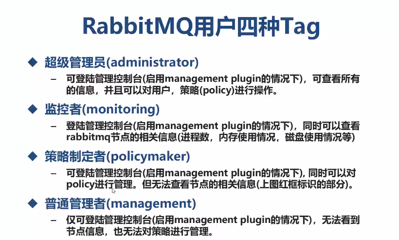

# RABBITMQ
## Rabbitmq的相关命令
```shell script
    rabbitmq-server #显示启动rabbitmq
    rabbitmq-server -detached #后台启动rabbitmq
    rabbitmqctl stop # 停止rabbitmq-server服务
#############################################################
    rabbitmqctl start_app # 启动应用
    rabbitmqctl stop_app #终止应用 
###########################用户管理###############################
    rabbitmqctl add_user {username} {password} #创建用户
    rabbitmqctl delete_user {username} #删除用户
    rabbitmqctl change_password {username} {newpassword} #修改用户密码
    rabbitmqctl set_user_tags {username} {tag} #授权用户角色
    rabbitmqctl set_permissions --vhost / itdom '.*' '.*' '.*' #设置权限，标识对于user_admin这个用户可以进行配置，读和写的操作
    
      


```


## 消息状态

* Ready 消息已被送入队列，等待被消费

* Unacked 
    - 消息已经被消费者认领，但是未被确认"已被消费"
    - Unacked状态下，消费者断开链接则回到 "Ready"
    - 没有确认,客户端没有断开链接，则一直处于Uncked
    
* Finished
    - 调用basicAck()方法后，表示消息已经被消费，从队列中移除.    
    
    
    
## RabbitMQ六种工作模式

* 1. Hello Word

* 2. Work queues 
    * 在多消息的情况下，Work Queue会将i奥西分派给不同的消费者，每个消费者都会接收到不同的消息，并且可以根据处理消息的速度来
    接收消息的数量，进而让消费者程序发挥最大的性能。
    * Work Queue特别适合在集群环境中做异步处理，能最大发挥每一台服务器的性能.
    

* 3.Publish/Subscribe
    
    * 发布/订阅模式中，生成者不再直接与队列绑定，而实将数据发送至"交换机Exchange"
    
    * 交换机Exchange用于将数据按照某种规则宋玉与之绑定的队列中，进而供消费者使用
    
    * 发布/订阅模式中，交换机将无差别的将所有的i罅隙送入与之绑定的队列，所有消费者拿到的消息完成相痛，交换机类型被成为fanout

* 4. Routing
    * 路由(Routing)模式是在腹部订阅模式的基础上的变种
    * 发布订阅是无条件的将所有的消息发送给所所有的消费者队列。
    * 路由模式则是交换机根据Routing Key有条件的将数据筛选还后发送给对于的消费者队列
    * 路由模式下交换机的类型被成为direct
* 5.Topics
    * 主题Topic模式是在Routing模式的基础上，提供对RouteKey模糊匹配的给你，可以简化程序的编写。
    * 主题模式下，模糊匹配表达式规则为 1. * 匹配单个关键字。2. #匹配所有关键字。
    * 主题模式下交换机的类型成为topic
* 6. RPC    