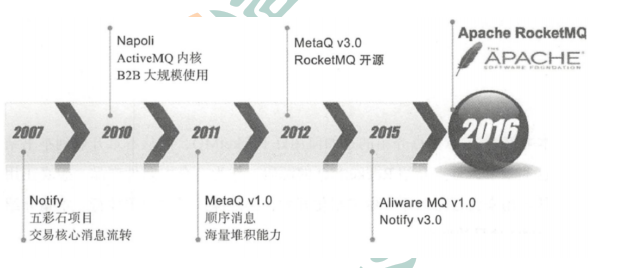

# Rocket
```text
    RocketMQ是一个统一消息引擎、轻量级数据处理平台。RocketMQ是一款阿里巴巴开源的消息中间件。
2016 年 11 月 28 日，阿里巴巴向 Apache 软件基金会捐赠RocketMQ，成为 Apache 孵化项目。
2017 年 9 月 25 日，Apache 宣布 RocketMQ孵化成为 Apache 顶级项目（TLP ），成为国内首
个互联网中间件在 Apache 上的顶级项目。

```
* RocketMQ发展历程



```text
2007 年，阿里开始五彩石项目，Notify作为项目中交易核心消息流转系统，应运而生。Notify系统是RocketMQ的雏形。
2010 年，B2B大规模使用ActiveMQ作为阿里的消息内核。阿里急需一个具有海量堆积能力的消息系统。
2011 年初，Kafka开源。淘宝中间件团队在对Kafka进行了深入研究后，开发了一款新的MQ，MetaQ。
2012 年，MetaQ发展到了v3.0版本，在它基础上进行了进一步的抽象，形成了RocketMQ，然后就将其进行了开源。
2015 年，阿里在RocketMQ的基础上，又推出了一款专门针对阿里云上用户的消息系统Aliware MQ。
2016 年双十一，RocketMQ承载了万亿级消息的流转，跨越了一个新的里程碑。 11 月 28 日，阿里巴巴向 Apache 软件基金会捐赠 RocketMQ，成为 Apache 孵化项目。
2017 年 9 月 25 日，Apache 宣布 RocketMQ孵化成为 Apache 顶级项目（TLP ），成为国内首个互联网中间件在 Apache 上的顶级项目。
```

## [ROCKETMQ的基本概念](./ROCKETMQ-BASIC-CONCEPT.MD)

## [ROCKETMQ安装](./ROCKETMQ-INSTALL.MD)

## [ROCKETMQ的工作原理](./ROCKETMQ_WORK_PRINCIPLE.MD)