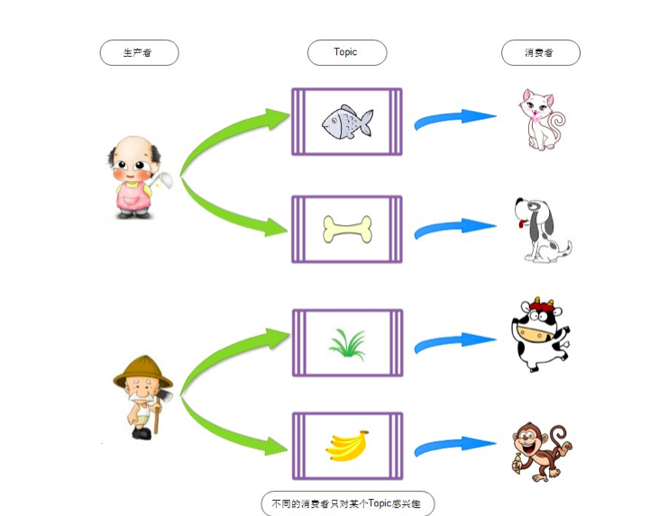
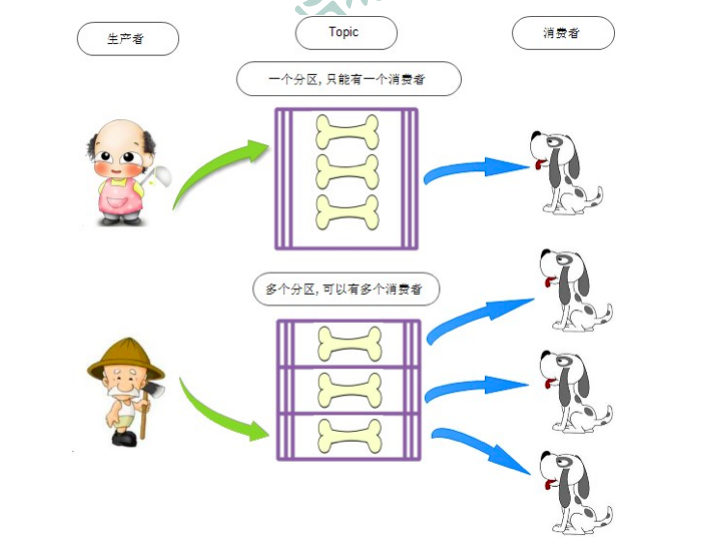
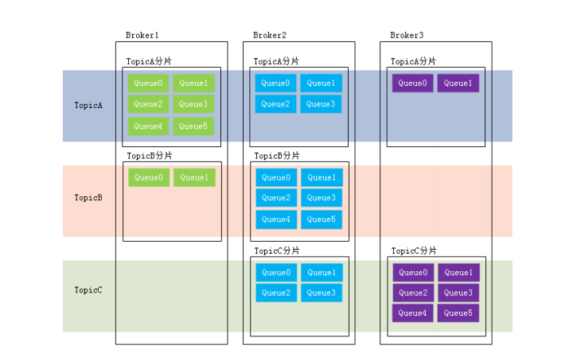
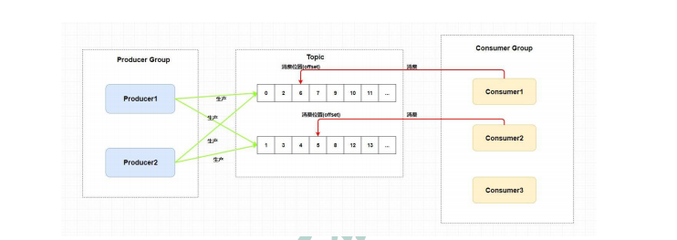
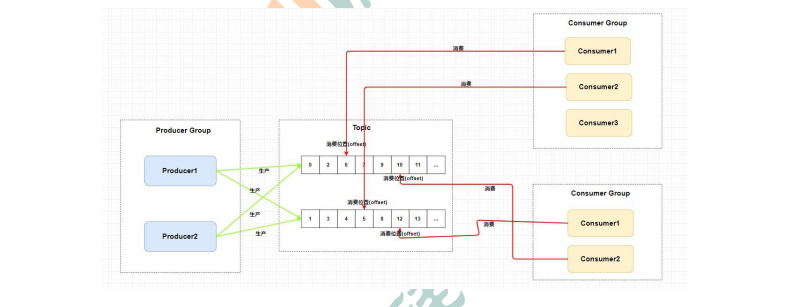
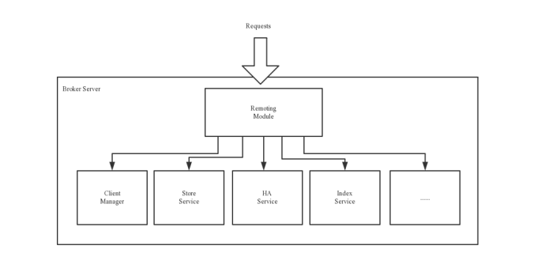

# Rocket的基本概念
## Rocket的基本概念
### topic主题



```text
topic表示一类消息的集合，每个主题包含若干条消息，每条消息只能属于一个主题，是rocketmq进行消息订阅的基本单位。
topic:message 1:n message:topic 1:1 一个生产者可以同时发送多种topic的消息；而每个消息只能对某种特点topic
感兴趣，即只可以订阅和消费一种topic的消息。producer:topic 1:n consumer:topic 1:!
```
### 标签(Tag)
```text
为消息设置的标签，用于同一主题下区分不同类型的消息。来自同一业务单元的消息，可以根据不同的业务目的在同一主题下设置不同
的标签，标签能够有效的保持代码的清晰度和连贯性，并优化RocketMQ提供的查询系统。消费者可以根据tag实现对不同子追的不同消费逻辑
实现更好的扩展性。

```
* Topic是消息的一级分类，Tag是消息的二级分类。
    * Topic：货物
        * tag=上海
        * tag=江苏
        * tag=浙江
* ------- 消费者 -----
   * topic=货物 tag = 上海
   * topic=货物 tag = 上海|浙江
   * topic=货物 tag = *
   
### 队列(Queue)
```text
存储消息的物理实体。一个Topic中可以包含多个Queue。每个Queue中存放的就是该Topic的Queue也被称为一个Topic中的消息的分区(Partition).
一个Topic的Queue中的消息只能被一个消费者组中的一个消费者消费。一个Queue中的消息不允许同一个消费者者组中的多个消费者同时消费。
```   


在学习参考其它相关资料时，还会看到一个概念：分片（Sharding）。分片不同于分区。在RocketMQ中，分片指的是存放相应Topic的Broker。
每个分片中会创建出相应数量的分区，即Queue，每个Queue的大小都是相同的。



* 消息标识(MessageId/Key)
```text
RocketMQ中每个消息拥有唯一的MessageId,且可以携带具有业务标识的key,仪表对消息查询，不过需要注意的是，MessageId有两个：
一个在生产者send()消息的时候会自动生产一个messageId(msgId),当消息到达Broker后，Broker也会自动生产一个MessageId(offsetMsgId)。
msgId,offsetMsgId与key都称为消息标识。

1. msgId:由producer端生产，其生成规则为:producerIp+进程pid+MessageClientIDSetter类的ClassLoader的hashCode+当前时间+
AutomicInteger自增计数器。

2. offsetMsgId:由broker端生成，其生成规则为brokerIp+物理分区的offset(Queue中的偏移量)。

3. key：由用户指定的业务相关的唯一标识。
```

## 系统架构


Apache RocketMQ 部署架构上主要分为四部分:
### 生成者Producer

发布消息的角色。Producer通过 MQ 的负载均衡模块选择相应的 Broker 集群队列进行消息投递，投递的过程支持快速失败和重试。

RocketMQ中的消息生成者都是以生成者组(Producer Group) 的形式出现的。生成者组是同一类生产者的集合，这列Producer发送相同的Topic
类型的消息。一个生产者发送可以同时发送多个主题的消息。

### 消费者Consumer
消费者就是从broker服务实例中获取消息(消费消息)的一个角色
* 消息消费的角色。
    * 支持以推（push），拉（pull）两种模式对消息进行消费。
    * 同时也支持集群方式和广播方式的消费。
    * 提供实时消息订阅机制，可以满足大多数用户的需求。

* 注意

1. RocketMQ中的消息消费都是以消费者组(Consumer Group)的形式出现的。消费者组是同一类消费者的集合，这类Consumer消费的是同一个
Topic类型的消息。消费者组使得在消息消费方面实现负载均衡(将一个Topic中的不同的Queue平均分配给同一个Consumer Group的不同
Consumer,注意，并不是将消息负载均衡)和容错(一个Consumer挂了，该ConsumerGroup中的其它Consumer可以接着消费原Consumer消费的Queue)
的目标边得非常容易。
2. 消费者组只能消费一个Topic的消息，不能同时消费多个Topic消息
3. 一个消费者组中的消费者必须订阅完全相同的Topic



* 消费者组中Consumer的数量应该小于等于订阅Topic的Queue数量。如果超出Queue数量，则多出的Consumer将不能消费消息。



* 不过，一个Topic类型的消息可以被多个消费者组同时消费。

### 名字服务器NameServer
NameServer是一个Broker与Topic路由的注册中心，支持Broker的动态注册与发现。
RocketMQ的思想来自于Kafka，而Kafka是依赖了Zookeeper的。所以，在RocketMQ的早期版本，即在MetaQ v1.0与v2.0版本中，也是依赖于Zookeeper的。
从MetaQ v3.0，即RocketMQ开始去掉了Zookeeper依赖，使用了自己的NameServer。
* 主要包括两个功能：
    * Broker的管理:接收Broker集群的注册信息并且保存下来作为路由信息的基本数据，提供心跳检测机制，检查Broker是否还存活着。
    * 路由信息的管理:每个NameServer中都 保存着Broker集群的整个路由信息和用户客户端查询到饿队列信息。Producer和Consumer通过NameServer可以
    
#### 路由注册
NameServer通常是以集群的方式部署的，不过NameServer是无状态的，即NameServer集群的各个系欸但是无差异的，各个节点互相不进行信息的通信。
那么集群中的各个节点是如何实现数据的同步的呢？在Broker系欸但那启动时，轮询NameSever列表，与每个NameServer节点建立长连接，发起注册请求，
在NameServer内部维护着一个Broker列表，用来动态存储Broker的信息。
* 注意：
```text
这个NameServer与zk,Eureka,Nacos等注册中心不同，NameServer是无状态的：
优点：NameServer集群搭建简单，扩容简单
缺点：对于Broker，必须明确指出所有NameServer地址。否则未指出的将不会去注册。也正因为如此，NameServer并不能随便扩容。
因为，若Broker不重新配置，新增的NameServer对于Broker来说是不可见的，其不会向这个NameServer进行注册。
```   

```text
Broker节点为了证明自己是活着的，为了维护与NameServer间的长连接，会将最新的信息以心跳包的方式上报给NameServer，每 30 秒发送一次心跳。
心跳包中包含 BrokerId、Broker地址(IP+Port)、Broker名称、Broker所属集群名称等等。NameServer在接收到心跳包后，会更新心跳时间戳，
记录这个Broker的最新存活时间。
``` 
#### 路由剔除
```text
由于Broker关机，宕机或者网络抖动等原因，NameServer没有收到Broker的心跳，NameServer可能从Broker列表中删除
NameServer中由一个定实任务，每个10秒就会扫描一次Broker列表，查看每个Broker的最新心跳时间戳是否超过120秒，如果
超过，则会判定Broker失效，然后将其从Broker列表中剔除。
```        
* 注意：
```text
扩展：对于RocketMQ日常运维工作，例如Broker升级，需要停掉Broker的工作。OP需要怎么做？
OP需要将Broker的读写权限禁掉。一旦client(Consumer或Producer)向broker发送请求，都会收到broker的NO_PERMISSION响应，
然后client会进行对其它Broker的重试。当OP观察到这个Broker没有流量后，再关闭它，实现Broker从NameServer的移除。
OP：运维工程师
SRE：Site Reliability Engineer，现场可靠性工程师
```
#### 路由发现
RocketMQ的路由发现采用的是Pull模型。当Topic路由信息出现变化的时候，NameServer不会主动推送给客户端，而实客户端定实的拉去主题最新的路由。
默认的客户端每30秒会拉去一次最新的路由
```text
扩展：
1 ）Push模型：推送模型。其实时性较好，是一个“发布-订阅”模型，需要维护一个长连接。而长连接的维护是需要资源成本的。该模型适合于的场景：
* 实时性要求较高
* Client数量不多，Server数据变化较频繁
2 ）Pull模型：拉取模型。存在的问题是，实时性较差。
3 ）Long Polling模型：长轮询模型。其是对Push与Pull模型的整合，充分利用了这两种模型的优势，屏蔽了它们的劣势。
```   

#### 客户端的NameServer的选择策略
这里的客户端主要是指的Producer和Consumer
客户端在配置是必须要协商NameServer集群的地址，那么客户端到底连接的是哪个NameServer系欸但呢？客户端首先会生产一个随机数，然后与NameServer
节点数量取模，此时得到的就是所有要连接的节点的索引，然后就会进行连接。如果连接失败，则会采用round-robin策略，逐个尝试区来凝结其他节点
首先采用的是随机策略进行的选择，失败后采用的是轮询策略。

扩展
```text
扩展：Zookeeper Client是如何选择Zookeeper Server的？

简单来说就是，经过两次shuffle，然后选择第一台Zookeeper Server。

详细说就是，将配置文件中的zk server地址进行第一次shuffle，然后随机选择一个。这个选择出的一般都是一个hostname。然后获取到该hostname
对应的所有ip，再对这些ip进行第二次shuffle，从shuffle过的结果中取第一个server地址进行连接。
```


### 代理服务器Broker
```text
Broker充当着消息中转角色，负责存储消息、转发消息。Broker在RocketMQ系统中负责接收并存储从生产者发送来的消息，
同时为消费者的拉取请求作准备。Broker同时也存储着消息相关的元数据，包括消费者组消费进度偏移offset、主题、队列等。
Kafka 0.8版本之后，offset是存放在Broker中的，之前版本是存放在Zookeeper中的。
```

#### Broker的模块构成

* Remoting Module:整个Broker的实体，负责处理来自clients端的请求。而这个BroKer实体则由以下的模块构成
* Client Manager:客户端管理器。负责接收，解析客户端(Producer/Consumer)请求，管理客户端。例如，维护Consumer的Topic订阅信息
* Store Service:存储服务，提供方便简单的API接口，处理消息存储到物理硬盘和消息查询功能。
* HA Service:高可用服务，提供Master Broker 和Slave Broker之间的数据同步功能。
* Index Service:索引服务。根据特定的Message key，对投递到Broker的消息进行索引服务，同时也提供根据Message Key对消息进行快速查询的功能.

```text
为了增强Broker性能与吞吐量，Broker一般都是以集群形式出现的。各集群节点中可能存放着相同Topic的不同Queue。不过，这里有个问题，
如果某Broker节点宕机，如何保证数据不丢失呢？其解决方案是，将每个Broker集群节点进行横向扩展，即将Broker节点再建为一个HA集群，解决单点问题。

Broker节点集群是一个主从集群，即集群中具有Master与Slave两种角色。Master负责处理读写操作请求，Slave负责对Master中的数据进行备份。
当Master挂掉了，Slave则会自动切换为Master去工作。所以这个Broker集群是主备集群。一个Master可以包含多个Slave，但一个Slave只能隶属
于一个Master。Master与Slave 的对应关系是通过指定相同的BrokerName、不同的BrokerId 来确定的。BrokerId为 0 表示Master，非 0 表示
Slave。每个Broker与NameServer集群中的所有节点建立长连接，定时注册Topic信息到所有NameServer。
```


## RocketMQ集群工作流程
* 具体流程
    * 启动NameServer，NameServer启动后开始监听端口，等待Broker、Producer、Consumer连接。

    * 启动Broker时，Broker会与所有的NameServer建立并保持长连接，然后每 30 秒向NameServer定时发送心跳包。

    * 发送消息前，可以先创建Topic，创建Topic时需要指定该Topic要存储在哪些Broker上，当然，在创建Topic时也会将
      Topic与Broker的关系写入到NameServer中。不过，这步是可选的，也可以在发送消息时自动创建Topic。

    * Producer发送消息，启动时先跟NameServer集群中的其中一台建立长连接，并从NameServer中获取路由信息，即当前发送
      的Topic消息的Queue与Broker的地址（IP+Port）的映射关系。然后根据算法策略从队选择一个Queue，与队列所在的Broker
      建立长连接从而向Broker发消息。当然，在获取到路由信息后，Producer会首先将路由信息缓存到本地，再每 30 秒从NameServer
      更新一次路由信息。

    * Consumer跟Producer类似，跟其中一台NameServer建立长连接，获取其所订阅Topic的路由信息，然后根据算法策略从路由信息中
    获取到其所要消费的Queue，然后直接跟Broker建立长连接，开始消费其中的消息。Consumer在获取到路由信息后，同样也会每 30 秒
    从NameServer更新一次路由信息。不过不同于Producer的是，Consumer还会向Broker发送心跳，以确保Broker的存活状态。
    
### Topic的创建模式
* 手动创建Topic时，有两种模式：
    * 集群模式：该模式下创建的Topic在该集群中，所有的Broker中的Queue数量时相同的。
    * Broker模式，该模式下创建的Topic在该集群中，每个Broker中的Queue数量可以不同。
    
* 自动创建Topic时，默认采用的是Broker模式，会为每个Broker默认创建 4 个Queue。
  
### 读/写队列
```text
从物理上来讲，读/写队列是同一个队列。所以，不存在读/写队列数据同步问题。读/写队列是逻辑上进行区分的概念。一般情况下，读/写队列数量是相同的。
例如，创建Topic时设置的写队列数量为 8 ，读队列数量为 4 ，此时系统会创建 8 个Queue，分别是0 1 2 3 4 5 6 7。Producer会将消息写入到这 8 个队列，但Consumer只会消费0 1 2 3这 4 个队列中的消息，4 5 6 7 中的消息是不会被消费到的。
再如，创建Topic时设置的写队列数量为 4 ，读队列数量为 8 ，此时系统会创建 8 个Queue，分别是0 1 2 3 4 5 6 7。Producer会将消息写入到0 1 2 3 这 4 个队列，但Consumer只会消费0 1 2 3 4 5 6 7这 8 个队列中的消息，但是4 5 6 7中是没有消息的。此时假设Consumer Group中包含两个Consumer，Consumer1消费0 1 2 3，而Consumer2消费4 5 6 7。但实际情况是，Consumer2是没有消息可消费的。
也就是说，当读/写队列数量设置不同时，总是有问题的。那么，为什么要这样设计呢？
其这样设计的目的是为了，方便Topic的Queue的缩容。
例如，原来创建的Topic中包含 16 个Queue，如何能够使其Queue缩容为 8 个，还不会丢失消息？可以动态修改写队列数量为 8 ，读队列数量不变。此时新的消息只能写入到前 8 个队列，而消费都消费的却是16 个队列中的数据。当发现后 8 个Queue中的消息消费完毕后，就可以再将读队列数量动态设置为 8 。整个缩容过程，没有丢失任何消息。
perm用于设置对当前创建Topic的操作权限： 2 表示只写， 4 表示只读， 6 表示读写。      
```
