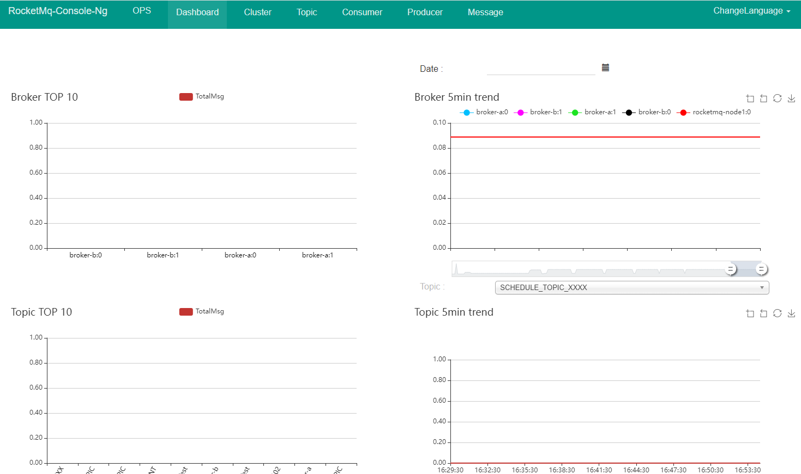
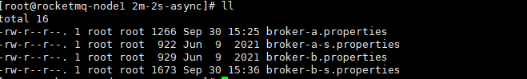
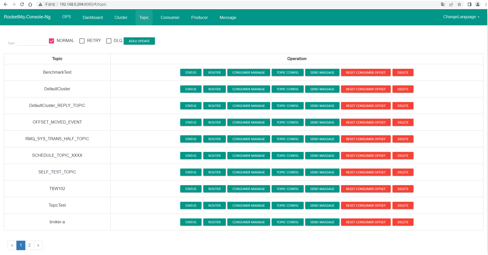

# RocketMQ的安装

## 单机安装

* 下载rocketmq-all-4.9.0-bin-release.zip 

* 解压rocketmq-all-4.9.0-bin-release.zip
    ```shell script
     unzip rocketmq-all-4.9.0-bin-release.zip 
    ```
* 修改启动的内存参数，使得参数适配当前的服务器
runServer.sh
```shell script
JAVA_OPT="${JAVA_OPT} -server -Xms256m -Xmx256m -Xmn128m -XX:MetaspaceSize=128m -XX:MaxMetaspaceSize=320m"
```
runBroker.sh
```shell script
JAVA_OPT="${JAVA_OPT} -server -Xms256m -Xmx256m -Xmn128m"
```
* 启动nameServer
```shell script
  nohup sh bin/mqnamesrv &
```
* 启动broker

```shell script
  nohup sh bin/mqbroker -n 192.168.0.203:9876 &
```
* 安装rocketmq-console管理台
    * 下载rocketmq-externals-rocketmq-console-1.0.0.zip
    * 修改配置文件
        ```shell script
          server.contextPath=
          server.port=8080
          #spring.application.index=true
          spring.application.name=rocketmq-console
          spring.http.encoding.charset=UTF-8
          spring.http.encoding.enabled=true
          spring.http.encoding.force=true
          logging.config=classpath:logback.xml
          # 配置名字服务的IP端口
          #if this value is empty,use env value rocketmq.config.namesrvAddr  NAMESRV_ADDR | now, you can set it in ops page.default localhost:9876
          rocketmq.config.namesrvAddr=192.168.0.203:9876
          #if you use rocketmq version < 3.5.8, rocketmq.config.isVIPChannel should be false.default true
          rocketmq.config.isVIPChannel=
          #rocketmq-console's data path:dashboard/monitor
          rocketmq.config.dataPath=/tmp/rocketmq-console/data
          #set it false if you don't want use dashboard.default true
          rocketmq.config.enableDashBoardCollect=true
        ```
    * 编译打包rocketmq-console
        ```shell script
          mvn clean package -Dmaven.test.skip=true
        ```
    * 启动jar包
        ```shell script
            java -jar rocketmq-console-ng-1.0.0.jar
        ```  
      
      
    * 生产者生产数据
    ```shell script
        export NAMESRV_ADDR=192.168.0.203:9876
        sh ./bin/tools.sh org.apache.rocketmq.example.quickstart.Producer
     ```  
    * 消费数据
      ```shell script
        sh ./bin/tools.sh org.apache.rocketmq.example.quickstart.Consumer
      ```
## 集群安装

* 下载rocketmq-all-4.9.0-bin-release.zip 

* 解压rocketmq-all-4.9.0-bin-release.zip
    ```shell script
     unzip rocketmq-all-4.9.0-bin-release.zip 
    ```
* 修改启动的内存参数，使得参数适配当前的服务器
runServer.sh
```shell script
JAVA_OPT="${JAVA_OPT} -server -Xms256m -Xmx256m -Xmn128m -XX:MetaspaceSize=128m -XX:MaxMetaspaceSize=320m"
```
runBroker.sh
```shell script
JAVA_OPT="${JAVA_OPT} -server -Xms256m -Xmx256m -Xmn128m"
```
* 在192.168.0.203和192.168.0.204分别启动nameServer
```shell script
  nohup sh bin/mqnamesrv &
```  

* 集群配置文件配置


  *  在192.168.0.203的机器上配置 broker-a.properties和broker-b-s.properties，在192.168.0.204配置 broker-b.properties、
     broker-a-s.properties。
     broker-a.properties
     ```properties
        # 整个大集群的名称
        brokerClusterName=DefaultCluster
         # 主从小集群的名称
        brokerName=broker-a
        # master的brokerId为0
        brokerId=0
        # 指定删除消息存储过期文件的时间为凌晨4点
        deleteWhen=04
        # 指定为发送更新的消息存储文件的保留时长为48小时，48小时后过期，将会被删除
        fileReservedTime=48
        # 指定当前broker为异步复制master
        brokerRole=ASYNC_MASTER
        # 指定刷盘策略为异步刷盘
        flushDiskType=ASYNC_FLUSH
        # 名字服务
        namesrvAddr=192.168.0.203:9876;192.168.0.204:9876
     ```
        broker-b-s.properties:
     ```properties
        brokerClusterName=DefaultCluster
        brokerName=broker-b
        brokerId=1
        deleteWhen=04
        fileReservedTime=48
        brokerRole=SLAVE
        flushDiskType=ASYNC_FLUSH
        namesrvAddr=192.168.0.203:9876;192.168.0.204:9876
        # 指定Broker对外提供服务的端口，即Broker与producer与consumer通信的端口。默认10911 。由于当前主机同时充当着master1与slave2，而前面的master1使用的是默认端口。这里需要将这两个端口加以区分，以区分出master1与slave2
        listenPort= 11911
        # 指定消息存储相关的路径。默认路径为~/store目录。由于当前主机同时充当着master1与slave2，master1使用的是默认路径，这里就需要再指定一个不同路径
        storePathRootDir=~/store-s
        storePathCommitLog=~/store-s/commitlog
        storePathConsumeQueue=~/store-s/consumequeue
        storePathIndex=~/store-s/index
        storeCheckpoint=~/store-s/checkpoint
        abortFile=~/store-s/abort

     ```
     broker-b.properties:
     
     ```properties
        brokerClusterName=DefaultCluster
        brokerName=broker-b
        brokerId=0
        deleteWhen=04
        fileReservedTime=48
        brokerRole=ASYNC_MASTER
        flushDiskType=ASYNC_FLUSH
        namesrvAddr=192.168.0.203:9876;192.168.0.204:9876
     ```
     broker-a-s.properties:
     
     ```properties
         brokerClusterName=DefaultCluster
         brokerName=broker-a
         brokerId=1
         deleteWhen=04
         fileReservedTime=48
         brokerRole=SLAVE
         flushDiskType=ASYNC_FLUSH
         namesrvAddr=192.168.0.203:9876;192.168.0.204:9876
         # 指定Broker对外提供服务的端口，即Broker与producer与consumer通信的端口。默认10911 。由于当前主机>同时充当着master1与slave2，而前面的master1使用的是默认端口。这里需要将这两个端口加以区分，以区分>出master1与slave2
         listenPort= 11911
         # 指定消息存储相关的路径。默认路径为~/store目录。由于当前主机同时充当着master1与slave2，master1使
         #用的是默认路径，这里就需要再指定一个不同路径
         storePathRootDir=~/store-s
         storePathCommitLog=~/store-s/commitlog
         storePathConsumeQueue=~/store-s/consumequeue
         storePathIndex=~/store-s/index
         storeCheckpoint=~/store-s/checkpoint
         abortFile=~/store-s/abort

     ```
     其他相关的配置：
     ```properties
        #指定整个broker集群的名称，或者说是RocketMQ集群的名称
        brokerClusterName=rocket-MS
        #指定master-slave集群的名称。一个RocketMQ集群可以包含多个master-slave集群
        brokerName=broker-a
        #0 表示 Master，>0 表示 Slave
        brokerId=0
        #nameServer地址，分号分割
        namesrvAddr=nameserver1:9876;nameserver2:9876
        #默认为新建Topic所创建的队列数
        defaultTopicQueueNums=4
        #是否允许 Broker 自动创建Topic，建议生产环境中关闭
        autoCreateTopicEnable=true
        #是否允许 Broker 自动创建订阅组，建议生产环境中关闭
        autoCreateSubscriptionGroup=true
        #Broker对外提供服务的端口，即Broker与producer与consumer通信的端口
        listenPort=10911
        #HA高可用监听端口，即Master与Slave间通信的端口，默认值为listenPort+1
        haListenPort=10912
        #指定删除消息存储过期文件的时间为凌晨 4 点
        deleteWhen=04
        #指定未发生更新的消息存储文件的保留时长为 48 小时， 48 小时后过期，将会被删除
        fileReservedTime=48
        #指定commitLog目录中每个文件的大小，默认1G
        mapedFileSizeCommitLog=1073741824
        #指定ConsumeQueue的每个Topic的每个Queue文件中可以存放的消息数量，默认30w条
        mapedFileSizeConsumeQueue=300000
        #在清除过期文件时，如果该文件被其他线程所占用（引用数大于 0 ，比如读取消息），此时会阻止此次删除任务，同时在第一次试图删除该文件时记录当前时间戳。该属性则表示从第一次拒绝删除后开始计时，该文件最多可以保留的时长。在此时间内若引用数仍不为 0 ，则删除仍会被拒绝。不过时间到后，文件将被强制删除
        destroyMapedFileIntervalForcibly=120000
        #指定commitlog、consumequeue所在磁盘分区的最大使用率，超过该值，则需立即清除过期文件
        diskMaxUsedSpaceRatio=88
        #指定store目录的路径，默认在当前用户主目录中
        storePathRootDir=/usr/local/rocketmq-all-4.5.0/store
        #commitLog目录路径
        storePathCommitLog=/usr/local/rocketmq-all-4.5.0/store/commitlog
        #consumeueue目录路径
        storePathConsumeQueue=/usr/local/rocketmq-all-4.5.0/store/consumequeue
        #index目录路径
        storePathIndex=/usr/local/rocketmq-all-4.5.0/store/index
        #checkpoint文件路径
        storeCheckpoint=/usr/local/rocketmq-all-4.5.0/store/checkpoint
        #abort文件路径
        abortFile=/usr/local/rocketmq-all-4.5.0/store/abort
        #指定消息的最大大小
        maxMessageSize= 65536
        #Broker的角色
        # - ASYNC_MASTER 异步复制Master
        # - SYNC_MASTER 同步双写Master
        # - SLAVE
        brokerRole=SYNC_MASTER
        #刷盘策略
        # - ASYNC_FLUSH 异步刷盘
        # - SYNC_FLUSH 同步刷盘
        flushDiskType=SYNC_FLUSH
        #发消息线程池数量
        sendMessageThreadPoolNums=128
        #拉消息线程池数量
        pullMessageThreadPoolNums=128
        #强制指定本机IP，需要根据每台机器进行修改。官方介绍可为空，系统默认自动识别，但多网卡时IP地址可能读取错误
        brokerIP1=192.168.3.105
     ```
     
* 启动broker服务实例
  ```shell script
    # 启动a主机实例
    nohup sh bin/mqbroker -c conf/2m-2s-async/broker-a.properties &
    # 启动b主机实例
    nohup sh bin/mqbroker -c conf/2m-2s-async/broker-b.properties &
    #启动a从机服务实例
    nohup sh bin/mqbroker -c conf/2m-2s-async/broker-a-s.properties &
    #启动b从机
    nohup sh bin/mqbroker -c conf/2m-2s-async/broker-b-s.properties &
  ```   

* 配置rocketmq-console
    ```properties
      server.contextPath=
      server.port=8080
      #spring.application.index=true
      spring.application.name=rocketmq-console
      spring.http.encoding.charset=UTF-8
      spring.http.encoding.enabled=true
      spring.http.encoding.force=true
      logging.config=classpath:logback.xml
      #if this value is empty,use env value rocketmq.config.namesrvAddr  NAMESRV_ADDR | now, you can set it in ops page.default localhost:9876
      rocketmq.config.namesrvAddr=192.168.0.203:9876;192.168.0.204:9876
      #if you use rocketmq version < 3.5.8, rocketmq.config.isVIPChannel should be false.default true
      rocketmq.config.isVIPChannel=
      #rocketmq-console's data path:dashboard/monitor
      rocketmq.config.dataPath=/tmp/rocketmq-console/data
      #set it false if you don't want use dashboard.default true
      rocketmq.config.enableDashBoardCollect=true
    ```    


* 编译打包
```shell script
mvn clean package -Dmaven.test.skip=true
```
* 启动rocketmq-console
```shell script
java -jar rocketmq-console-ng-1.0.0.jar
```
访问192.168.0.204:8080:



* 生产数据、消费数据
```shell script
export NAMESRV_ADDR='192.168.0.203:9876;192.168.0.204:9976'
sh bin/tools.sh org.apache.rocketmq.example.quickstart.Producer
sh bin/tools.sh org.apache.rocketmq.example.quickstart.Consumer

```


