# RocketMQ的工作原理
## 消息的生产
Producer可以将消息写入到某个Broker中的Queue中，其经历如下的过程：
* 消息的生产过程
    * Producer发送消息之前，会先想NameServer发出获取消息Topic的路由信息的请求
    * NameServer返回该Topic的`路由表`及Broker的列表
    * Producer根据代码中指定的Queue选择策略，从Queue列表中选出一个队列，用于后续的存储消息
    * Producer对消息做一些特殊的处理，例如，消息本身超过4M，则会对其进行压缩。
    * Producer向出的Queue所在的Broker法出RPC请求，将消息发送到选择的Queue。
> 路由表：实际是一个Map，key为Topic名称，value是一个QueueData实例列表。QueueData并不是一个Queue对应一个QueueData，
> 而是一个Broker中该Topic的所有Queue对应一个QueueData。即，只要涉及到该Topic的Broker，一个Broker对应一个QueueData。
> QueueData中包含brokerName。简单来说，路由表的key为Topic名称，value则为所有涉及该Topic的BrokerName列表。    


> Broker列表：其实际也是一个Map。key为brokerName，value为BrokerData。一个Broker对应一个BrokerData实例，对吗？不对。
> 一套BrokerName名称相同的Master-Slave小集群对应一个BrokerData。BrokerData中包含brokername以及一个Map.该Map的key为
> brokerId,value为该broker的对应的地址。brokerId为0标识broker为Master,非0标识Slave。


## Queue的选择算法
对于无序消息，其Queue选择算法，也称为消息投递算法，常见的有两种：

* 轮询算法
默认选择算法。该算法保证了每个Queue中可以均匀的获取到消息。
> 该算法存在一个问题:由于某些原因，在某些Broker上的Queue可能投递延迟比较严重。从而导致Producer的缓存队列中出现较大的消息积压，
>影响到了消息的投递性能。

* 最小投递延迟算法
该算法会统计消息投递的时间延迟，然后根据统计出结果将消息投递到时间延迟最新小的Queue。如果延迟相同，则采用轮询算法投递。
该算法可以有效提升消息的投递性能 
> 该算法存在一个问题：消息在Queue上的分配不均匀。投递延迟小的Queue其可能会存在大量的消息。而对该Queue的消费者压力会增大，
>降低消息的消费能力，可能会导致MQ中的消息堆积

  

## 消息的存储
RocketMQ中的消息存储在本地文件系统中，这些相关文件默认在当前用户主目录下的store目录中。

* store目录里文件的含义
    * abort:该文件在Broker启动的之后会自动创建，正常关闭Broker，该文件会自动小时。若在没有启动的Broker的情况下，
    发现这个文件是存在的，说明之前Broker的关闭是非正常关闭的
    * checkpoint:其中存储者commitlog,cosumerqueue,index文件的最后刷盘时间戳。
    * commitlog:其中存储在commitlog文件，而消息就是写在commitlog文件中的
    * config:存放者Broker允许器间的一些配置数据
    * consumerqueue：其中存放者consumerqueue文件，队列就存放在这个文件中
    * index:其中存放者消息索引文件indexFile
    * lock:运行器间使用到的全局资源锁。
 

### 1.commitlog文件
>说明：在很多资料中commitlog目录中的文件简单就称为commitlog文件。但在源码中，该文件被命名为mappedFile。
 
```text
commitlog目录中存放着很多的mappedFile文件，当前Broker中的所有消息都是落盘到这些mappedFile文件中的。
mappedFile文件大小为1G（小于等于1G），文件名由 20 位十进制数构成，表示当前文件的第一条消息的起始位移偏移量。
```

>第一个文件名一定是 20 位 0 构成的。因为第一个文件的第一条消息的偏移量commitlog offset为 0 当第一个文件放满时，
>则会自动生成第二个文件继续存放消息。假设第一个文件大小是 1073741820 字节（1G = 1073741824字节），则第二个文件
>名就是 00000000001073741824。 以此类推，第n个文件名应该是前n-1个文件大小之和。一个Broker中所有mappedFile文件
>的commitlog offset是连续的

```text
需要注意的是，一个Broker中仅包含一个commitlog目录，所有的mappedFile文件都是存放在该目录中的。即无论当前Broker
中存放着多少Topic的消息，这些消息都是被顺序写入到了mappedFile文件中的。也就是说，这些消息在Broker中存放时并没
有被按照Topic进行分类存放。
```
> mappedFile文件是顺序读写的文件，所有其访问效率很高无论是SSD磁盘还是SATA磁盘，通常情况下，顺序存取效率都会高于随机存取。

#### 消息单元
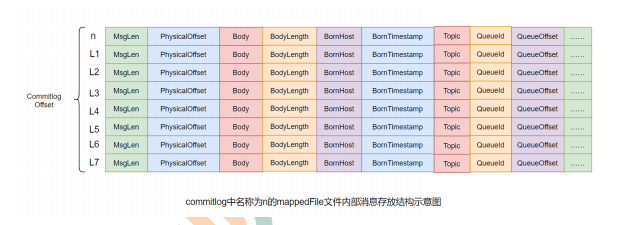

```text

mappedFile文件内容由一个个的消息单元构成。每个消息单元中包含消息总长度MsgLen、消息的物理位置physicalOffset、
消息体内容Body、消息体长度BodyLength、消息主题Topic、Topic长度 TopicLength、消息生产者BornHost、消息发送时
间戳BornTimestamp、消息所在的队列QueueId、消息在Queue中存储的偏移量QueueOffset等近 20 余项消息相关属性。    


```
 
>需要注意到，消息单元中是包含Queue相关属 性的。所以，我们在后续的学习中，就需要十分留意commitlog与queue间的关系是什么？ 
 一个mappedFile文件中第m+1个消息单元的commitlog offset偏移量 L(m+1) = L(m) + MsgLen(m) (m >= 0)

### consumequeue

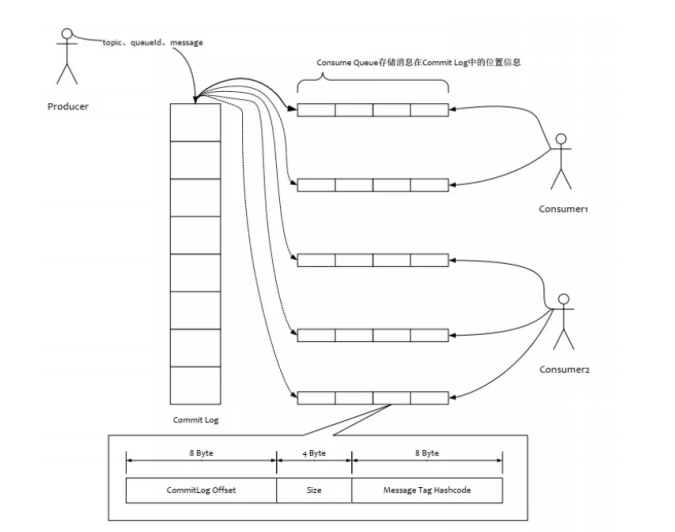

为了提高效率，会为每个Topic在~/store/consumequeue中创建一个目录，目录的名称为Topic名称。在该Topic目录下，会再为每个Topic的Queue
创建一个墓库，目录名为queueId。每个目录中存放者若干的consumequeue文件，consumequeue文件是commitlog的索引文件，可以根据consumequeue
定位到具体的消息

consumequeue文件名也有20为数字构成，标识当前文件的第一个索引条目的其实唯一偏移量。与mappedFile文件名不同的是，其后续文件名是固定的。
因为consumequeue文件大小是固定不变的。

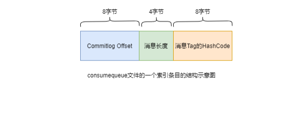

```text
每个consumequeue文件可以包含30w个索引条目，每个索引条目包含三个消息的重要属性:消息再mappedFile文件中的偏移量CommitLog Offset，
消息的长度，消息Tag的hashcode值。这三个属性占用20个字节，索引每个文件的大小是固定的30w*20字节
```
> 一个consumequeue文件中所有消息的Topic一旦是相同的。但是每条消息的Tag可能是不同的。

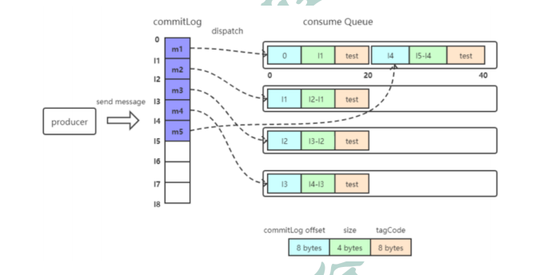
* 消息写入
    * Broker根据queueId，获取到该消息对应索引条目要在consumequeue目录中的写入偏移量，即QueueOffset
    * 将queueId,queueOffset等数据，与消息一起封装为消息单元。
    * 将消息单元写入到commitlog
    * 同时，形成消息索引条目
    * 将消息索引条目分到到响应的consumequeue. 
* 消息拉取
    * Consumer获取其要消费消息的所在Queue的消息偏移量offset,计算出其要消费消息的消息offset
    > 消费offset即消费进度，consumer对某个Queue的消费offset,即消费到了该Queue的第几条消息offset=消费offset+1
    * Consumer向Broker发送拉去请求，其中会包含其要拉趣消息的Queue,消息offset及消息Tag
    * Broker计算在consumerqueue中的queueOffset
    > queueOffset=消息offset*20字节
    * 从该queueOffset出开始向后从查找第一个指定tag的索引条目。
    * 解析该索引条目的前8个字节，即可定位到该消息在commitlog中的commitlog offset
    * 从对应commitlog offset中读取消息单元，并发送给Consumer
                                                                                                                                                                                                                                                                                                                                      
### 性能的提升
```text
RocketMQ中，无论是消息本身还是消息索引，都是存储在磁盘上的。其不会影响消息的消费吗？当然不会。
其实RocketMQ的性能在目前的MQ产品中性能是非常高的。因为系统通过一系列相关机制大大提升了性能。
首先，RocketMQ对文件的读写操作是通过mmap零拷贝进行的，将对文件的操作转化为直接对内存地址进行操作，
从而极大地提高了文件的读写效率。
其次，consumequeue中的数据是顺序存放的，还引入了PageCache的预读取机制，使得对consumequeue文件的
读取几乎接近于内存读取，即使在有消息堆积情况下也不会影响性能。
```
>PageCache机制，页缓存机制，是OS对文件的缓存机制，用于加速对文件的读写操作。一般来说，程序对文件进行
>顺序读写的速度几乎接近于内存读写速度，主要原因是由于OS使用PageCache机制对读写访问操作进行性能优化，将一部分的内存用作PageCache。
 1)写操作：OS会先将数据写入到PageCache中，随后会以异步方式由pdPush（page dirty Push)内核线程将Cache中的数据刷盘到物理磁盘
 2)读操作：若用户要读取数据，其首先会从PageCache中读取，若没有命中，则OS在从物理磁盘上加载该数据到PageCache的同时，也会顺序 对其相邻数据块中的数据进行预读取。

RocketMQ中可能会影响性能的是对commitlog文件的读取。因为对commitlog文件来说，读取消息时会产生大量的随机访问，而随机访问会严重影响性能。不过，如果选择合适的系统IO调度算法，比如设置调度算法为Deadline（采用SSD固态硬盘的话），随机读的性能也会有所提升。

### 与kafka对比
RocketMQ的很多思想来源于Kafka，其中commitlog与consumequeue就是。
RocketMQ中的commitlog目录与consumequeue的结合就类似于Kafka中的partition分区目录。mappedFile文件就类似于Kafka中的segment段。

>Kafka中的Topic的消息被分割为一个或多个partition。partition是一个物理概念，对应到系统上就是topic目录下的一个或多个目录。每个partition中包含的文件称为segment，是具体存放消息的文件。
 Kafka中消息存放的目录结构是：topic目录下有partition目录，partition目录下有segment文件
 Kafka中没有二级分类标签Tag这个概念
 Kafka中无需索引文件。因为生产者是将消息直接写在了partition中的，消费者也是直接从partition中读取数据的


### indexFile
除了通过通常的指定Topic进行消息消费外，RocketMQ还提供了根据key进行消息查询的功能。该查询是通过store目录中的index子目录中
的indexFile进行索引实现的快速查询。当然，这个indexFile中的索引数据是在包含了key的消息被发送到Broker时写入的。如果消息中没
有包含key，则不会写入。

#### 索引条目结构
```text
'每个Broker中会包含一组indexFile，每个indexFile都是以一个时间戳命名的（这个indexFile被创建时的时间戳）。每个indexFile文件
由三部分构成：indexHeader，slots槽位，indexes索引数据。每个 indexFile文件中包含500w个slot槽。而每个slot槽又可能会挂载很多
的index索引单元。
```

indexHeader固定40个字节，其中存放如下数：
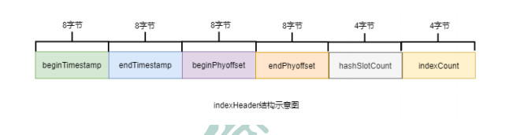
* beginTimestamp：该indexFile中第一条消息的存储时间
* endTimestamp：该indexFile中最后一条消息存储时间
* beginPhyoffset：该indexFile中第一条消息在commitlog中的偏移量commitlog offset
* endPhyoffset：该indexFile中最后一条消息在commitlog中的偏移量commitlog offset
* hashSlotCount：已经填充有index的slot数量（并不是每个slot槽下都挂载有index索引单元，这里统计的是所有挂载了index索引单元的slot槽的数量）
* indexCount：该indexFile中包含的索引单元个数（统计出当前indexFile中所有slot槽下挂载的所有index索引单元的数量之和）

indexFile中最复杂的是Slots与Indexes间的关系。在实际存储时，Indexes是在Slots后面的，但为了便于理解，将它们的关系展示为如下形式：

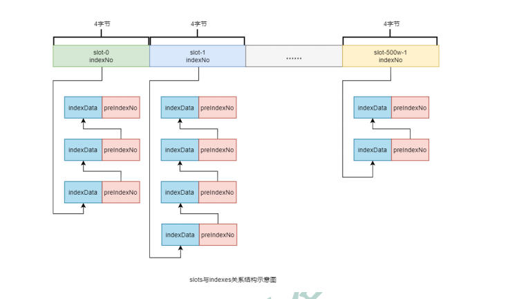

```text
key的hash值 % 500w的结果即为slot槽位，然后将该slot值修改为该index索引单元的indexNo，根据这个indexNo可以计算出该index单元
在indexFile中的位置。不过，该取模结果的重复率是很高的，为了解决该问题，在每个index索引单元中增加了preIndexNo，用于指定该slot
中当前index索引单元的前一个index索引单元。而slot中始终存放的是其下最新的index索引单元的indexNo，这样的话，只要找到了slot就可
以找到其最新的index索引单元，而通过这个index索引单元就可以找到其之前的所有index索引单元。
```

>indexNo是一个在indexFile中的流水号，从 0 开始依次递增。即在一个indexFile中所有indexNo是以此递增的。indexNo在index索引单元中是没有体现的，其是通过indexes中依次数出来的。

index索引单元默写 20 个字节，其中存放着以下四个属性：
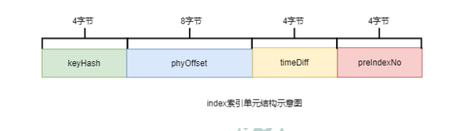
* keyHash：消息中指定的业务key的hash值
* phyOffset：当前key对应的消息在commitlog中的偏移量commitlog offset
* timeDiff：当前key对应消息的存储时间与当前indexFile创建时间的时间差
* preIndexNo：当前slot下当前index索引单元的前一个index索引单元的indexNo

####indexFile的创建
indexFile的文件名为当前文件被创建时的时间戳。这个时间戳有什么用处呢？

根据业务key进行查询时，查询条件除了key之外，还需要指定一个要查询的时间戳，表示要查询不大于该时间戳的最新的消息，即查询指定时间戳之前存储的最新消息。这个时间戳文件名可以简化查询，提高查询效率。具体后面会详细讲解。

indexFile文件是何时创建的？其创建的条件（时机）有两个：
当第一条带key的消息发送来后，系统发现没有indexFile，此时会创建第一个indexFile文件
当一个indexFile中挂载的index索引单元数量超出2000w个时，会创建新的indexFile。当带key的消息发送到来后，系统会找到最新的indexFile，并从其indexHeader的最后 4 字节中读取到indexCount。若indexCount >= 2000w时，会创建新的indexFile。

>由于可以推算出，一个indexFile的最大大小是：(40 + 500w * 4 + 2000w * 20)字节
 
#### 查询流程
当消费者通过业务key来查询相应的消息时，其需要经过一个相对较复杂的查询流程。不过，在分析查询流程之前，首先要清楚几个定位计算式子：

>计算指定消息key的slot槽位序号：
>slot槽位序号 = key的hash % 500w (式子1)


>计算槽位序号为n的slot在indexFile中的起始位置：
>slot(n)位置 = 40 + (n - 1) * 4 (式子2)

>计算indexNo为m的index在indexFile中的位置：
>index(m)位置 = 40 + 500w * 4 + (m - 1) * 20 (式子3)

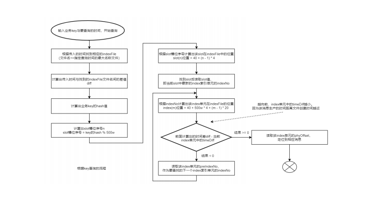

## 消息消费
消费者从Broker中获取消息的方式有两种：pull拉取方式和push推动方式。消费者组对于消息消费的模式又分为两种：集群消费Clustering和广播消费Broadcasting。

### 消费类型

#### 拉取式消费
```text
Consumer主动从Broker中拉取消息，主动权由Consumer控制。一旦获取了批量消息，就会启动消费过程。不过，该方式的实时性较弱，
即Broker中有了新的消息时消费者并不能及时发现并消费。
```

>由于拉取时间间隔是由用户指定的，所以在设置该间隔时需要注意平稳：间隔太短，空请求比例会增加；间隔太长，消息的实时性太差
 
#### 推送式消费
```text
该模式下Broker收到数据后会主动推送给Consumer。该获取方式一般实时性较高。

该获取方式是典型的发布-订阅模式，即Consumer向其关联的Queue注册了监听器，
一旦发现有新的消息到来就会触发回调的执行，回调方法是Consumer去Queue中拉取
消息。而这些都是基于Consumer与Broker间的长连接的。长连接的维护是需要消耗系统资源的。
```


* 对比
    * pull：需要应用去实现对关联Queue的遍历，实时性差；但便于应用控制消息的拉取
    * push：封装了对关联Queue的遍历，实时性强，但会占用较多的系统资源


###消费模式
* 广播消费
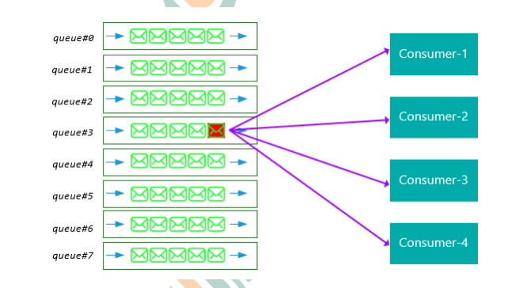

> 广播消费模式下，相同的Consumer Group的每个Consumer实例都接收相同的一个Topic的全量消息。即每条消息都会被发送到Consumer Group中的每
>个Consumer


* 集群消费

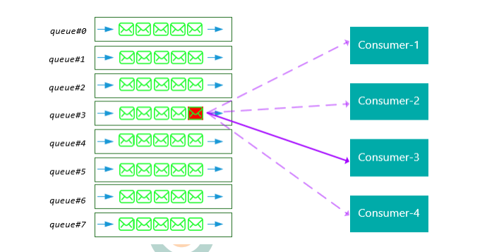

>集群消费模式下，相同的Consumer Group的每个Consumer实例平均分摊同一个Topic的消息。即每条消息只会被发送搭配ConsumerGroup中的某个Consumer

* 消息进度保存
    * 广播模式：消费进度保存在consumer端。因为广播模式下consumer group中每个consumer都会消费所有消息，但它们的消费进度是不同。
    所以consumer各自保存各自的消费进度。
    * 集群模式：消费进度保存在broker中。consumer group中的所有consumer共同消费同一个Topic中的消息，同一条消息只会被消费一次。
    消费进度会参与到了消费的负载均衡中，故消费进度是需要共享的。下图是broker中存放的各个Topic的各个Queue的消费进度。
    (这个文件在conf/consumerOffset.json)


#### Rebalance机制
>Rebalance机制讨论的前提是：集群消费。Rebalance即再均衡，指的是，将一个Topic下的多个Queue在同一个Consumer Group中的多个Consumer间
>进行重新分配的过程。

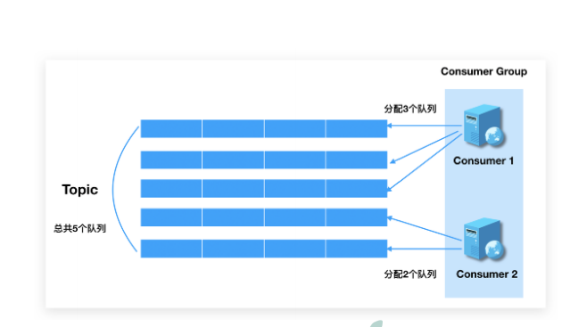


* rebalance的限制
>由于一个队列最多分配给一个消费者，因此当某个消费者组下的消费者实例数量大于队列的数量时，多余的消费者实例将分配不到任何队列。


* Rebalance危害
    > Rebalance的在提升消费能力的同时，也带来了新的问题
    * 消费暂停：在只有一个Consumer的时候，其负责消费所有的队列；在新增了一个Consumer之后会触发Rebalance的发生。此时原Consumer就需要
    暂停部分队列的小欸，等到这些队列分配给新的Consumer之后，这些暂替的消费的队列才能继续别消费。
    * 消费重复：Consumer在消费新分配给自己的队列的时候，必须接着之前Consumer提交的消费进度的offset继续消费。然后默认的情况下，offset是
    异步提交的，这个有你性导致提交到Broker的offset与Consumer实际消费的消息并不一直。这个不一致的差值可能会重复消费的消息。
    >同步提交：consumer提交了其消费完毕的一批消息的offset给broker后，需要等待broker的成功ACK。当收到ACK后，consumer才会继续获取并消
    >费下一批消息。在等待ACK期间，consumer是阻塞的。异步提交：consumer提交了其消费完毕的一批消息的offset给broker后，不需要等待broker
    >的成功ACK。consumer可以直接获取并消费下一批消息。对于一次性读取消息的数量，需要根据具体业务场景选择一个相对均衡的是很有必要的。
    >因为数量过大，系统性能提升了，但产生重复消费的消息数量可能会增加；数量过小，系统性能会下降，但被重复消费的消息数量可能会减少。
    * 消费突刺：由于Rebalance可能导致重复消费，如果需要重复消费的消息过多，或者因为Rebalance暂停过长从而导致积压了部分消息，那么可能会
    导致在Rebalance结束之后瞬间需要消费很多消息。


### 1.commitlog文件
### 1.commitlog文件
### 1.commitlog文件
    
    


