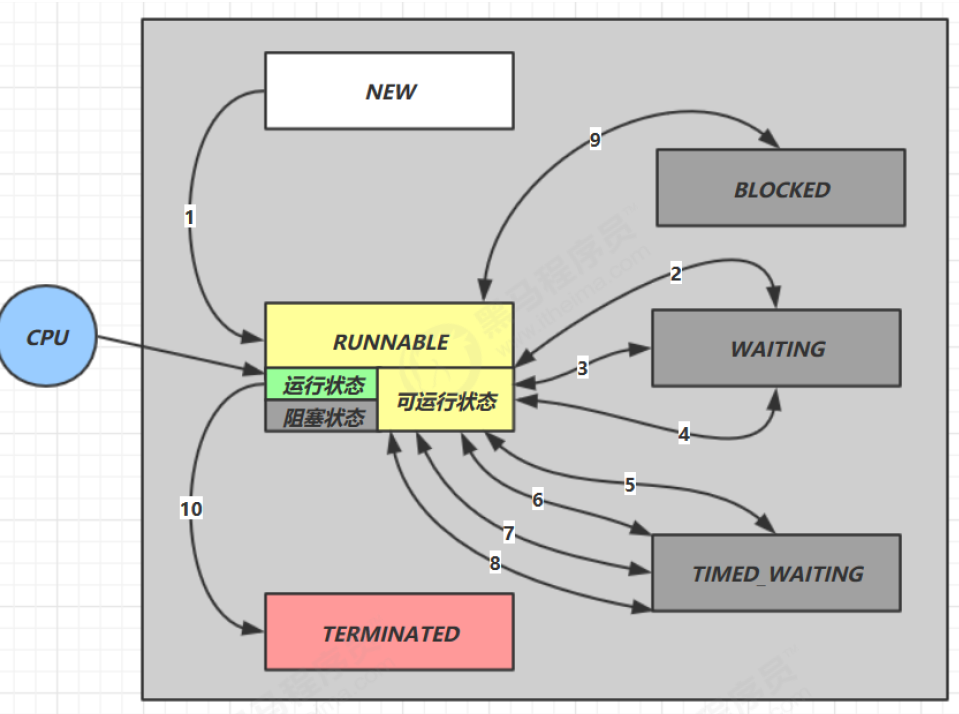

# 并发编程的使用和原理
## 线程的打断
```text
1. 如果线程的状态是处于sleep,wait,join状态，如果该线程被其他线程调用了interrupt(),那么这个线程的就会抛出一个InterruptedException，此时
线程的打断标记也会被清除，如果需要使用到被清除的打断标记，我们需要重新设置打断标记，确保下一次还能继续获取到打断标记。

2. 如果线程的是处于正常的运行的情况，其他线程对该正常运行的线程进行了打断，那么该线程的打断标是true，但是如果调用is

```


## 线程的状态
### 线程的五种状态
* 五种状态是从操作系统的层面上去说的,如下图所示:


* ［初始状态］仅仅是语言层面创建了线程对象，还未与操作系统线程进行关联
* ［可运行状态］（就绪状态）值该线程已经被创建（与操作系统的线程相关联了），可以由CPU来进行调度．
* ［运行状态］　指获取到CPU时间片运行中的状态，当CPU时间片用完了，会从［运行状态］转换到［可运行状态］，会导致线程上下文切换
* ［阻塞状态］１．如果调用了阻塞API，如BIO读取文件，这时线程实际不会使用到CPU，会导致线程上下文切换，进入［阻塞状态］
            ２．等BIO阻塞操作操作完毕，会由操作系统唤醒阻塞的线程，转换到［可运行状态］
            ３.　与［可运行状态］的区别是，对［阻塞状态］的线程来说只要它们一直不唤醒，调度器就一直不会考虑调度它们
* ［终止状态］表示线程已经执行完毕，生命周期已经结束了，不会转换为其他的状态。


### 线程的六种状态
* 这是从 Java API 层面来描述的



java.lang.Thread.State
```text
    public enum State {
        /**
         * Thread state for a thread which has not yet started.
         */
        NEW,

        /**
         * Thread state for a runnable thread.  A thread in the runnable
         * state is executing in the Java virtual machine but it may
         * be waiting for other resources from the operating system
         * such as processor.
         */
        RUNNABLE,

        /**
         * Thread state for a thread blocked waiting for a monitor lock.
         * A thread in the blocked state is waiting for a monitor lock
         * to enter a synchronized block/method or
         * reenter a synchronized block/method after calling
         * {@link Object#wait() Object.wait}.
         */
        BLOCKED,

        /**
         * Thread state for a waiting thread.
         * A thread is in the waiting state due to calling one of the
         * following methods:
         * <ul>
         *   <li>{@link Object#wait() Object.wait} with no timeout</li>
         *   <li>{@link #join() Thread.join} with no timeout</li>
         *   <li>{@link LockSupport#park() LockSupport.park}</li>
         * </ul>
         *
         * <p>A thread in the waiting state is waiting for another thread to
         * perform a particular action.
         *
         * For example, a thread that has called <tt>Object.wait()</tt>
         * on an object is waiting for another thread to call
         * <tt>Object.notify()</tt> or <tt>Object.notifyAll()</tt> on
         * that object. A thread that has called <tt>Thread.join()</tt>
         * is waiting for a specified thread to terminate.
         */
        WAITING,

        /**
         * Thread state for a waiting thread with a specified waiting time.
         * A thread is in the timed waiting state due to calling one of
         * the following methods with a specified positive waiting time:
         * <ul>
         *   <li>{@link #sleep Thread.sleep}</li>
         *   <li>{@link Object#wait(long) Object.wait} with timeout</li>
         *   <li>{@link #join(long) Thread.join} with timeout</li>
         *   <li>{@link LockSupport#parkNanos LockSupport.parkNanos}</li>
         *   <li>{@link LockSupport#parkUntil LockSupport.parkUntil}</li>
         * </ul>
         */
        TIMED_WAITING,

        /**
         * Thread state for a terminated thread.
         * The thread has completed execution.
         */
        TERMINATED;
    }
```

* NEW 线程刚被创建的时候，但是么有调用start()方法。

* RUNNABLE当调用了start()方法之后，注意Java API层面的RUNNABLE状态涵盖了操作系统层面的
[可运行状态][运行状态]和[阻塞状态](由于BIO导致的线程阻塞,在Java里面无法区分，仍然认为是可运行的)

* BLOCKED,WAITING,TIME_WAITING都是Java API层面的对[阻塞状态]的细分。

* TERMINATED 当线程代码运行结束的状态。

例子:
```text
package com.itdom;

import lombok.extern.slf4j.Slf4j;

@Slf4j(topic = "c.ThreadStatus")
public class ThreadStatus {
    public static void main(String[] args) {
        //new 状态
        Thread t1 = new Thread(() -> {
            log.debug("running...");
        }, "t1");
        //runnable
        Thread t2 = new Thread(() -> {
            while (true) {

            }

        }, "t2");

        t2.start();
        //teminated
        Thread t3 = new Thread(() -> {

            log.debug("running...");
        }, "t3");

        t3.start();

        //timed_waiting
        Thread t4 = new Thread(() -> {
            synchronized (ThreadStatus.class) {
                try {
                    Thread.sleep(1000000);
                } catch (InterruptedException e) {
                    e.printStackTrace();
                }
            }

        }, "t4");
        t4.start();

        //waiting 无限等待
        Thread t5 = new Thread(() -> {

            try {
                t2.join();
            } catch (InterruptedException e) {
                e.printStackTrace();
            }
        }, "t5");

        t5.start();

        /**
         * block
         */
        Thread t6 = new Thread(() -> {
            //无法获取得到锁
            synchronized (ThreadStatus.class) {
                try {
                    Thread.sleep(1000000);
                } catch (InterruptedException e) {
                    e.printStackTrace();
                }
            }
        }, "t6");

        t6.start();


        try {
            Thread.sleep(1000);
        } catch (InterruptedException e) {
            e.printStackTrace();
        }

        log.debug("t1 state {}", t1.getState());
        log.debug("t2 state {}", t2.getState());
        log.debug("t3 state {}", t3.getState());
        log.debug("t4 state {}", t4.getState());
        log.debug("t5 state {}", t5.getState());
        log.debug("t6 state {}", t6.getState());


    }


}
```


