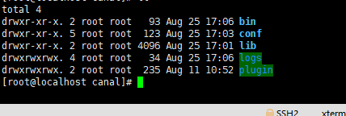
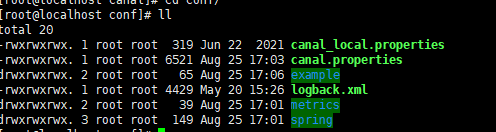

# Canal安装
在上一步安装的是MySQL8.0.x，canal最开始安装的是canal.deployer-1.1.5.tar.gz，但是程序里面无法实现对程序里面实现对mysql数据的变化的监听
为了解决这个问题安装了canal.deployer-1.1.6.tar.gz后实现了mysql的数据的变化的监控

## 安装


编辑以下的配置文件
-rwxrwxrwx. 1 root root 6521 Aug 25 17:03 canal.properties
drwxrwxrwx. 2 root root   65 Aug 25 17:06 example
修改的canal.properties部分核心配置文件
```shell script
# tcp bind ip
#canal的id
canal.id=2
# canal服务的断开
canal.port = 11111
# 服务端采用的是tcp模式，就是可以使用tcp传递mysql的变化给应用程序
canal.serverMode = tcp
```
example/instance核心配置项
```shell script
# position info
#配置mysql的ip和端口
canal.instance.master.address=192.168.1.195:3306
canal.instance.master.journal.name=
canal.instance.master.position=
canal.instance.master.timestamp=
canal.instance.master.gtid=
# username/password
#配置为canal新增的用户的用户名和密码
canal.instance.dbUsername=canal
canal.instance.dbPassword=Canal@123
canal.instance.connectionCharset = UTF-8

# mq config
# 配置监控的实例，可以监控多个mysql实例，此处只是配置可example
canal.mq.topic=example
```
配置好上述的基本配置之后就可以使用以下的命令启动
```shell script
./bin/startup.sh 
```


