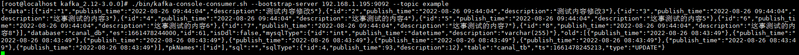

# 使用kafka实现对mysql数据变化的监听
使用TCP模式可以实现在应用程序监听到mysql数据的变化的数据的获取，使用kafka或者其他mq也同样可以实现对mysql数据变化的获取.

## 修改canal的配置
conf/canal.properties
````shell script
# tcp, kafka, rocketMQ, rabbitMQ, pulsarMQ
# 将canal的服务模式改成kafka，那么数据变化就会推送到kafka，
canal.serverMode = kafka
````
conf/example/instance.properties
```shell script

# mq config
# canal设置推送mysql数据变化的sql到kafka的topic
canal.mq.topic=example
```
其余的配置和tcp一样
修改完配置就可以启动
```shell script
./bin/restart.sh
```
## 安装zookeeper

```shell script
[root@localhost canal]# vim ../zookeeper/apache-zookeeper-3.8.0-bin/conf/zoo.cfg 
tickTime=2000
initLimit=10
syncLimit=5
# 自定义自己的数据存储路径
dataDir=/usr/local/zookeeper/zk_data/
clientPort=2181
admin.serverPort=9091
```
修改完成上述的zookeeper配置之后启动zookeeper
```shell script
./bin/zkServer.sh start
```

## 安装kafka
修改kafka的配置
config/server.properties 
````shell script
# 修改kafka的zookeeper注册中心
zookeeper.connect=127.0.0.1:2181
````
启动kafka
```shell script
./bin/kafka-server-start.sh -daemon config/server.properties
```

*　监听数变化

```shell script
./bin/kafka-console-consumer.sh --bootstrap-server 192.168.1.195:9092 --topic example
```


