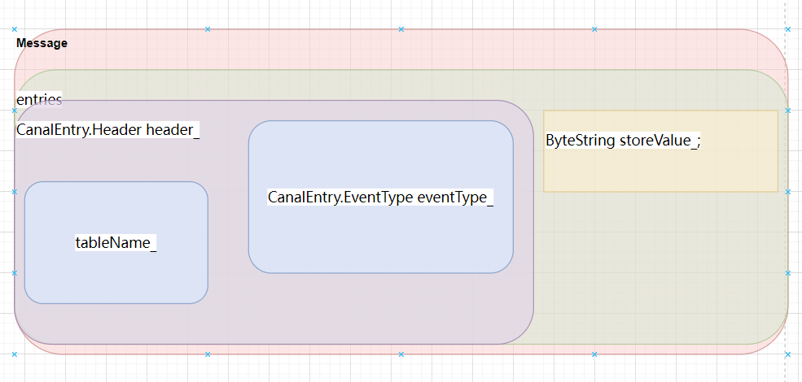

# 使用TCP实现对mysql数据变化的监听
## 引入依赖
```xml
        <dependency>
            <groupId>com.alibaba.otter</groupId>
            <artifactId>canal.client</artifactId>
            <version>1.1.0</version>
        </dependency>
```

## [编写程序](./src/main/java/com/itdom/canal/Demo.java)

```java
   CanalConnector canalConnector = CanalConnectors.newSingleConnector(new InetSocketAddress("192.168.1.195", 11111), "example", "", "");
        while (true) {
            //TODO连接
            canalConnector.connect();
            //TODO 订阅
            canalConnector.subscribe("canal_db.*");
            //TODO 获取数据
            Message message = canalConnector.get(1);
            List<Entry> entries = message.getEntries();
            if (entries.size() <= 0) {
                logger.info("没有获取到数据，休整一会。。。");
                try {
                    TimeUnit.SECONDS.sleep(1);
                } catch (InterruptedException e) {
                    e.printStackTrace();
                }
            } else {
                for (Entry entry : entries) {
                    //获取表名
                    String tableName = entry.getHeader().getTableName();
                    //获取类型
                    EntryType entryType = entry.getEntryType();
                    //获取序列化后的数据
                    ByteString storeValue = entry.getStoreValue();
                    if (EntryType.ROWDATA.equals(entryType)) {
                        //反序列化
                        RowChange rowChange = RowChange.parseFrom(storeValue);
                        EventType eventType = rowChange.getEventType();
                        List<RowData> rowDatasList = rowChange.getRowDatasList();
                        for (RowData rowData : rowDatasList) {
                            JSONObject before = new JSONObject();
                            List<Column> beforeColumnsList = rowData.getBeforeColumnsList();
                            for (Column column : beforeColumnsList) {
                                before.put(column.getName(), column.getValue());
                            }
                            List<Column> afterColumnsList = rowData.getAfterColumnsList();
                            JSONObject after = new JSONObject();
                            for (Column column : afterColumnsList) {
                                after.put(column.getName(), column.getValue());
                            }

                            logger.info("table:{},EventType:{},Before:{},After:{}", tableName, eventType, before, after);
                        }
                    } else {
                        logger.info("当前操作类型为:{}", entryType);
                    }
                }
            }
        }
```
### Message结构的剖析


[Message结构的剖析](./https://app.diagrams.net/#Hchenanddom%2FCharts%2Fmain%2Frepo%2Fcanal-client%E7%9A%84Message%E6%B6%88%E6%81%AF%E4%BD%93%E5%89%96%E6%9E%90.drawio)


