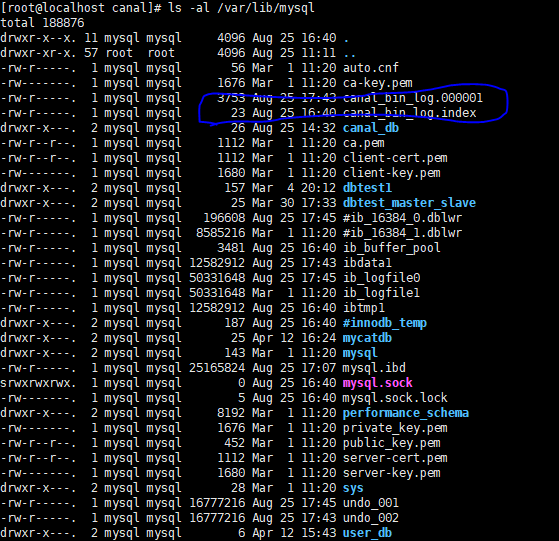

# mysql配置
修改mysql的配置文件/etc/my.cnf
```shell script
[mysqld]
#[必须]主服务器唯一ID
server-id=1
##[必须]启用二进制日志,指名路径。比如：自己本地的路径/log/mysqlbin
log-bin=canal_bin_log
#[可选]设置需要复制的数据库,默认全部记录。比如：binlog-do-db=atguigu_master_slave
binlog-do-db=canal_db
##[可选]设置binlog格式
#可以选择STATEMENT、row、mixed三种格h式，如果是Statement就是传递执行的sql，但是这种方式可能存在数据不一致的情况
# row就是将行记录下来，然后同步给从数据库，但是这个方式比较占用空间，但是，为了数据的正确性这个方式是值得推荐的
#mixed:混合模式，这个方式是比较号的，存在不一致性的情况使用row，如果只是普通的方式就使用Statement
binlog_format=row
```
修改好这些配置之后就需要重启mysql
```shell script
systemctl restart mysqld
```
此时就可以查看到/var/lib/mysql/目录下面多了

