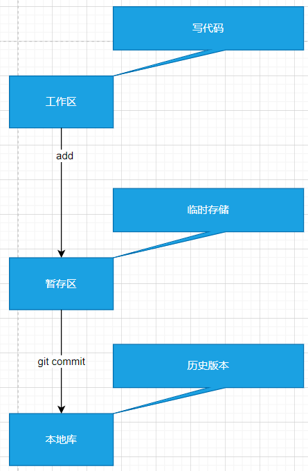

# 常用命令

| 命令名称                              | 作用 |
|-----------------------------------|--|
| git config --global user.name 用户名 | 设置用户签名 |
|git config --global user.email 邮箱|设置用户签名|
|git init|初始化本地库|
|git status|查看本地库的状态|
|git add 文件名|添加文件到暂存区|
|git commit -m "日志信息" 文件名字|提价本地库|
|git reflog|查看历史记录|
|git reset --hard 版本号|版本切换|

##使用git的步骤

* 设置用户的签名
```shell
git config --global user.name chendom
git config --global user.email 1233454@qq.com
```
配置了以上的用户信息之后就会在用户/用户名的目录下生成.gitconfig文件，里面会有设置的用户信息


* 初始化本地库
```shell
$ git init
Initialized empty Git repository in E:/book/gitdemo/.git/
```


* 查看本地库的状态
```shell
$ git status
On branch master

No commits yet

nothing to commit (create/copy files and use "git add" to track)
```

* 创建文件
```shell
$ vim demo.txt
$ git status
On branch master

No commits yet

Untracked files:
  (use "git add <file>..." to include in what will be committed)
        demo.txt

nothing added to commit but untracked files present (use "git add" to track)


```
* 将新的代码添加到暂存区
```shell
$ git add demo.txt
warning: LF will be replaced by CRLF in demo.txt.
The file will have its original line endings in your working directory
$ git status
On branch master

No commits yet

Changes to be committed:
  (use "git rm --cached <file>..." to unstage)
        new file:   demo.txt


```

* 删除暂存区的代码
```shell
$ git rm --cached demo.txt
rm 'demo.txt'
$ git status
On branch master

No commits yet

Untracked files:
  (use "git add <file>..." to include in what will be committed)
        demo.txt

nothing added to commit but untracked files present (use "git add" to track)
# 从新添加到暂存区域
$ git add demo.txt
warning: LF will be replaced by CRLF in demo.txt.
The file will have its original line endings in your working directory

```

* 提交到本地仓库
```shell
$ git commit -m "first commit" demo.txt
warning: LF will be replaced by CRLF in demo.txt.
The file will have its original line endings in your working directory
[master (root-commit) bc56526] first commit
 1 file changed, 17 insertions(+)
 create mode 100644 demo.txt
$ git status
On branch master
nothing to commit, working tree clean

```
* 查看修改的关联的日志
```shell
# 查看引用日志的
$ git reflog
bc56526 (HEAD -> master) HEAD@{0}: commit (initial): first commit
# 查看详细日志
$ git log
commit bc56526a71c99c87dd0b8fafe69cfdcfc8f72e31 (HEAD -> master)
Author: chenanddom <772571631@qq.com>
Date:   Mon Nov 28 23:11:48 2022 +0800

    first commit

```

* 回到历史版本
```shell
# 一般使用git reset --hard 版本号
$ git reset --hard bc56526
HEAD is now at bc56526 first commit

```

## git的工作机制




### Git和代码托管中心
代码托管中心是基于网络服务器的远程代码仓库，一般我们简单的称为远程库
* 局域网
    * GitLab
* 互联网
    * Gihub
    * Gitee


## Git分支操作

| 命令名称            | 作用               |
|-----------------|------------------|
| git branch 分支名称 | 创建分支             |
|git branch -v| 查看分支             |
|git checkout 分支名| 切换分支             |
|git merge 分支名| 把指定的分支合并到当前分支上   |

示例:
```shell
chendom@LAPTOP-FCVP44UK MINGW64 /e/book/gitdemo (master)
$ git commit -m "添加内容" demo.txt
[master aeb0f8d] 添加内容
 1 file changed, 1 insertion(+), 1 deletion(-)

chendom@LAPTOP-FCVP44UK MINGW64 /e/book/gitdemo (master)
$ git checkout hot-fix
Switched to branch 'hot-fix'

chendom@LAPTOP-FCVP44UK MINGW64 /e/book/gitdemo (hot-fix)
$ git status
On branch hot-fix
nothing to commit, working tree clean

chendom@LAPTOP-FCVP44UK MINGW64 /e/book/gitdemo (hot-fix)
$ vim demo.txt

chendom@LAPTOP-FCVP44UK MINGW64 /e/book/gitdemo (hot-fix)
$ git add demo.txt

chendom@LAPTOP-FCVP44UK MINGW64 /e/book/gitdemo (hot-fix)
$ git commit -m "hot-fix添加内容" demo.txt
[hot-fix 0998306] hot-fix添加内容
 1 file changed, 1 insertion(+), 1 deletion(-)
# 合并分支
$ git checkout master
Switched to branch 'master'

chendom@LAPTOP-FCVP44UK MINGW64 /e/book/gitdemo (master)
$ git merge hot-fix
Auto-merging demo.txt
CONFLICT (content): Merge conflict in demo.txt
Automatic merge failed; fix conflicts and then commit the result.
#冲突的内容
$ cat demo.txt
11111111111aaaaaaa
11111111111hot-fix
11111111111
11111111111
11111111111
11111111111
11111111111
11111111111
11111111111
11111111111
11111111111
# 当前分支的内容
<<<<<<< HEAD
11111111111
11111111111master add
=======
#合并的分支的内容
11111111111hot-fix add
11111111111
>>>>>>> hot-fix
#编解文件解决冲突
$ vim demo.txt
# 解决如果内添加到暂存区并提交还是不会成功合并
$ git reflog
aeb0f8d (HEAD -> master) HEAD@{0}: checkout: moving from hot-fix to master
0998306 (hot-fix) HEAD@{1}: commit: hot-fix添加内容
1a04cd4 HEAD@{2}: checkout: moving from master to hot-fix
aeb0f8d (HEAD -> master) HEAD@{3}: commit: 添加内容
1a04cd4 HEAD@{4}: checkout: moving from hot-fix to master
1a04cd4 HEAD@{5}: checkout: moving from master to hot-fix
1a04cd4 HEAD@{6}: merge hot-fix: Fast-forward
07d1639 HEAD@{7}: checkout: moving from hot-fix to master
1a04cd4 HEAD@{8}: commit: 热修复
07d1639 HEAD@{9}: checkout: moving from master to hot-fix
07d1639 HEAD@{10}: reset: moving to 07d1639
bc56526 HEAD@{11}: reset: moving to bc56526
07d1639 HEAD@{12}: commit: second commit
bc56526 HEAD@{13}: commit (initial): first commit
# 将修改好的文件添加到暂存区
$ git add demo.txt

$ git status
On branch master
All conflicts fixed but you are still merging.
  (use "git commit" to conclude merge)

Changes to be committed:
        modified:   demo.txt


# 提交版本管理
$ git commit -m "合并解决冲突" demo.txt
On branch master
nothing to commit, working tree clean

$ git status
On branch master
nothing to commit, working tree clean

$ cat demo.txt
11111111111aaaaaaa
11111111111hot-fix
11111111111
11111111111
11111111111
11111111111
11111111111
11111111111
11111111111
11111111111
11111111111
11111111111
11111111111hot-fix add
11111111111master add

$ git reflog
fdd0adc (HEAD -> master) HEAD@{0}: commit (merge): Merge branch 'hot-fix'
aeb0f8d HEAD@{1}: checkout: moving from hot-fix to master
0998306 (hot-fix) HEAD@{2}: commit: hot-fix添加内容
1a04cd4 HEAD@{3}: checkout: moving from master to hot-fix
aeb0f8d HEAD@{4}: commit: 添加内容
1a04cd4 HEAD@{5}: checkout: moving from hot-fix to master
1a04cd4 HEAD@{6}: checkout: moving from master to hot-fix
1a04cd4 HEAD@{7}: merge hot-fix: Fast-forward
07d1639 HEAD@{8}: checkout: moving from hot-fix to master
1a04cd4 HEAD@{9}: commit: 热修复
07d1639 HEAD@{10}: checkout: moving from master to hot-fix
07d1639 HEAD@{11}: reset: moving to 07d1639
bc56526 HEAD@{12}: reset: moving to bc56526
07d1639 HEAD@{13}: commit: second commit
bc56526 HEAD@{14}: commit (initial): first commit

```


