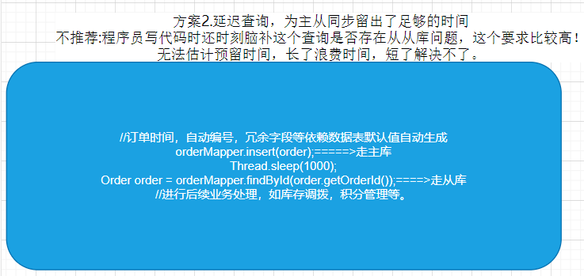
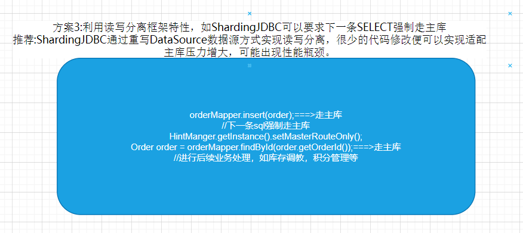
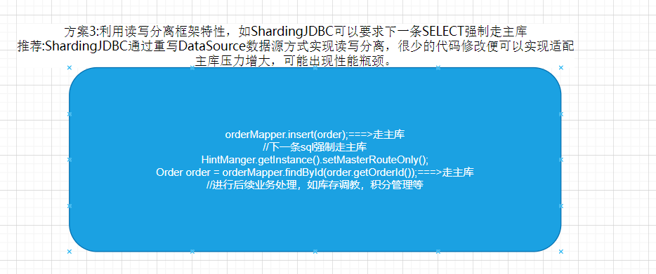
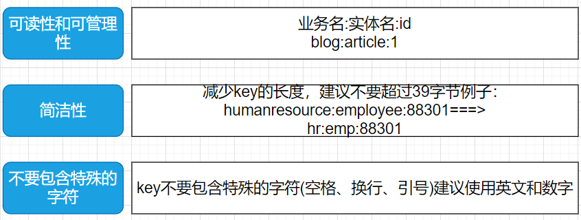
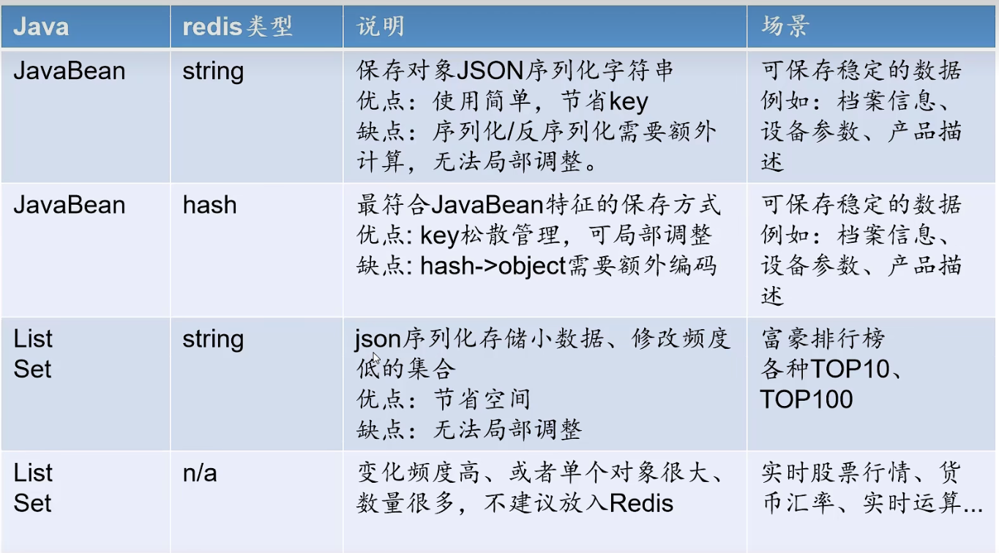
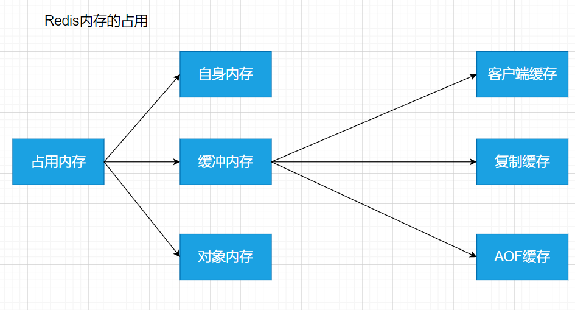
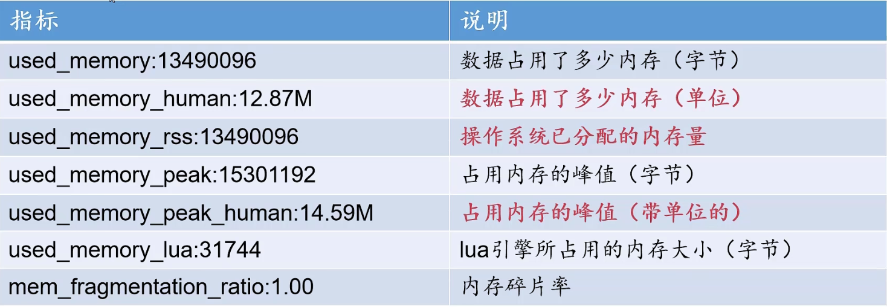

响应式系统：
1. 可响应能力
可响应能力是一个应用程序最重要的功能，在编程的时候，我们希望能够有一个高效，统一的格式，包括对错误的处理响应，
这一点在Web开发的过程中很常见

2. 高可用性
服务可能挂掉，无法提供服务。

3. 弹性机制
当需求增长的时候，分配的计算机资源也随之增长，当资源需求减少的时候，多分配的资源也随之回收，避免浪费

4. 消息驱动
系统之间使用异步消息通信，做到各个服务之间隔离和松耦合，可以轻松，灵活的扩展和维护系统。

5. 可扩展性机制file:/E:/book/practice/target/classes/com/itdom/HelloWorld.class
可以根据需求进行扩展，而不需要过多的修改什么东西

响应式开发的好处
1. 提高了程序的性能
2. 在多核机器上，提高了计算机资源的利用率。
3. 为异步编程提供了可维护的方案。
4. 提供了被压机制，也就是对计算机资源提供了过载保护的功能

双亲委派机制是什么.md
如何解决线上gc频繁的问题.md
--------------------------------------------------------------------------------------------------
MySQL索引选择行陷阱
就是因为使用了模糊查询之类的，如果查询的字段的区别行不到，重复率高达25以上，那么mysql的sql优化器
可能会出现全文索引的情况。
解决方案：
强制使用索引(有时会有奇效，以实际运行的效果为准)
explain select * from question force index(col) where col='A'

增加缓存，提高全表扫描的速度(需要很大的投入)
	innodb_buffer_pool_size=16G
	innodb_buffer_pool_instance=2
--------------------------------------------------------------------------------------------------
MQ消息中间件实现可靠行投递
发送阶段，遇到高延迟，Producer会多次重发消息，知道Broker ack却恶人，过程中Broker会字段去重 ,超时Producer
产生异常，应用对异常进行 捕获提示

存储阶段，Broker先刷盘在ack确认，即便ack失败消息不回丢失，多次重试直到Producer接收，会导致消息积压。

消费阶段，Broker向Consumer发数据，一段实践为接收，自动重发，直到Consumer Ack确认，Consumer注意幂等处理。	
	
	丢失数据的几个操作
	1. 异步刷盘(NSYNC_FLUSH),改成同步刷盘
	2. 存储介质损坏，建议才有RAID10或者分布式存储
	3. 不要启动自动ACK，RabbitMQ存在此问题
	4.避开都市区传说的ActiveMQ
	
--------------------------------------------------------------------------------------------------
为什么使用代理主键而不使用业务主键
    1. 业务主键浪费空间
    2. 业务主键五顺序，可能造成写如舒徐要更长的实践组织索引
    3. 如果在分库分表的时候，如果使用业务主键是字符串，无法直接进行取模运算，需要先转换成数字才能进行运算
--------------------------------------------------------------------------------------------------
JVM选项规则
* java -version标准选项，任何版本的JVM/任何平台都可以使用
* java -Xms10 非标准选项，部分版本标识
* java -XX:+PrintGCDetail 不稳定参数，不同的JVM有差异，随时可能会被移除
	* PS：+代表开启/-代表关闭
	
* 1.8+优先使用G1垃圾收集器，摆脱各种选项的烦恼
		java -jar -XX:+UseG1GC -Xms2G -Xmx2g -Xss256k -XX:MaxGPauseMillis=300 -Xloggc:/logs/gc.log -XX:+PrintGCTimeStamps -XX:PrintGCDetails test.jar
* -Xms与-Xmx设置相同，减少 内存交换
* 评估Xmx方法:第一次其实设置大一点，跟踪监控日志没调整为堆值*2~3即可
* 最多300好眠STW实践，200~500区间，增大可以减少GC次数，提高吞吐量
* -Xss126k/256k虚拟机栈空间一般128k就够用了，超过256考虑优化，不建议超过256k 
* G1一般不设置新生代的大小，G1新生代就是动态调整的	

-------------------------------------------------------------------------------------------------------
OOM的解决
先使用java的命令dump所有的对内存映射文件xx/hprof
将hprof文件到如visualVM 根据显示的概要情况可以找到未释放的对象
将可能存在未释放的对象进行GCROOT查看，就可以找到引用对象的地方。
然后根据引用对象的地方进行排查和分析，最后找到问题的根源。

-------------------------------------------------------------------------------------------------------
rabbitmq的六种模式
1. simple简单不是，一个生产者一个消费者
2. worker queue工作队列模式，一个生成者多个消费者，可以实现负载均衡
3. publish/subscribe 发布订阅模式，引入了交换机的角色，队列通过绑定交换机实现绑定具体类型的消息
4. routingkey 路由键模式也叫direct模式
5. topic模式，就是提高了路由键的模糊匹配的规则，方便操作
6. rpc模式，可以实现mq的同步调用，但是一般不使用。
-------------------------------------------------------------------------------------------------------
处理消息积压的问题
1. 开启更多的消费者示例，实现消费
2. 使用死信队列将把未能及时处理的消息延后消费

-------------------------------------------------------------------------------------------------------
Kafka队列为什么这么快

1. 磁盘顺序读写
2.  页缓存
3. 零拷贝
4. 批量操作

--------------------------------------------------------------------------------------------------------
CPU、内存，硬盘三大件、Mysql服务器的选择。
*　CPU
	* ６４位的CPU一定要工作在６４位系统下
	* 对于并发比较高的场景CPU的数量比频率更加重要（选择多核，频率相对低的的ｃｐｕ）
	* 对于CPU密集型的场景和复杂的SQL则频率越高越好

* 内存
	* 理想的选择是服务器内存大于数据总量
	* 内存频率越高处理熟读越快
	* 内存总量小要合理组织热点数据，保证内存覆盖
	* 内存堆写操作也有重要的性能影响

----------------------------------------------------------------------------------------------
动态通知的用push还是pull更合适？

push存在写扩散的问题，如果有大量的粉丝，就需要同一时间向消息队列写入大量的数据，瞬间写IO飙升。
* 写扩散
	* 设置上限，微信好友5000个
	* 限流策略，X分钟内完成消息发布
	* 优化存储策略，才有NOSQL或者大数据方案
	
pull模式存在同一时间大量的查询拉去数的情况。
* 度扩散
	* MQ削峰填谷，超长对抗i额直接拒绝
	* 增加轮询时间， 减少请求次数
	* 服务端增加缓存优化查询效率
	* 增加验证码，分散时间，减少机器人刷票
	

---------------------------------------------------------------------------------------------------
缓存一致性如何保障？先写库还是先写缓存？聊聊Cache Aside Pattern与延迟双删

更新缓，如果采用更新缓存的方式，会出现数据不一致的情况，如下图所示
[更新缓存出现的数据不一致的情况](https://app.diagrams.net/#Hchenanddom%2FCharts%2Fmain%2Frepo%2F%E6%95%B0%E6%8D%AE%E5%BA%93%E5%92%8C%E7%BC%93%E5%AD%98%E7%9A%84%E4%B8%80%E8%87%B4%E6%80%A7%E9%97%AE%E9%A2%98.drawio)

要保证缓存与数据库的一致性，最好的办法就是加分布式锁，但是那样并发性就会很差
Cache Aside Pattern +延迟双删 无锁方案只能在保证并发的前提下尽可能的减少不一致性的可能，这也是AP模式下BASE的一直技术

先更新库在删除缓存，然后在间隔几秒之后再删除缓存，避免多线程存在一笑短时间内导致的数据不一致。

-----------------------------------------------------------------------------------------------------------
秒杀方案的设计
[秒杀方案的设计](https://app.diagrams.net/#Hchenanddom%2FCharts%2Fmain%2Frepo%2F%E7%A7%92%E6%9D%80%E5%9C%BA%E6%99%AF%E7%9A%84%E9%81%BF%E5%85%8D%E8%B6%85%E5%8D%96%E7%9A%84%E6%96%B9%E6%A1%88%E8%AE%BE%E8%AE%A1.drawio)

1. 利用预减库存方式杜绝超卖
2. 利用Nginx+Lua在网关层面将无效请求阻挡
3. 利用MQ消息队列的限流特性保证MySQL不会被瞬间击垮
4. APP需要额外设计轮询机制查询订单状态
--------------------------------------------------------------------------------------------------------------
微服务架构的作用？
如果不使用微服务，服务内部的复杂度都将会对外暴露出来，例如ip是固定的，如果要动态的扩容就无法做到；除之外，服务新增的如果升级了功能，零一服务
如果已经依赖了该功能，那么这个服务也需要进行相应的修改并发布，使得服务和服务之间强耦合了。

但是微服务的定义是这样的:
所谓微服务架构风格是一种将单个应用程序开发为一组小型服务的方法，每个小服务运行在自己的进程中，
并以轻量级的机制(通常是HTTP RESTful API)的方式进行通信，这些服务围绕着业务能力所建立的，并
且可以由完全自动化的部署机构独立部署，这些服务的集中管理只有最低限度，可以用不同的编程语言编
写并使用不同的数据库存储技术。我们可以在微服务提供的组件时间堆服务之间的关系进行解耦，并且能够
对服务之间的调用关系有一个直观的数据进行查看。

--------------------------------------------------------------------------------------------------------------
RocketMQ的相关知识点，需要学习77

---------------------------------------------------------------------------------------------------------------
SpringCloud Contract锲约测试 需要学习 81

---------------------------------------------------------------------------------------------------------------
为什么MySQL执行计划使用了索引，SQL执行仍然很慢？

---------------------------------------------------------------------------------------------------------------
redis大key导致的请求变慢，分析的工具可以是rdb_bigkeys
./rdb_bigkeys --bytes 1024 --file bigkeys.csv --sep 0 --stored --threads 4 /home/redis/dump.rdb

原因:大key会导致key分布不均匀，使得结点的key也无法正常的进行分摊请求的压力，从而导致个别结点负载的压力会特别的大，
而无法以正常的响应速度响应请求。

---------------------------------------------------------------------------------------------------------------
Hash算法的数据库负载如何实现动态扩容？
使用Hash一致性算法,可以动态的加入mysql的代理结点，这个代理结点需要使用映射表来做好与物理结点的mysql做好映射。

---------------------------------------------------------------------------------------------------------------
ProxySQL实现MySQL服务器的代理，可以实现监控sql结点的监控的情况，并且可以分清楚哪个是主服务器，哪个是从服务器。

---------------------------------------------------------------------------------------------------------------
MySQL读写分离后，先写后查如何保障一致性？
方案1: 所有表记录必须自己设置，Order对象保存所有字段数据完整不依赖疏忽库机制，包括自增主键也是自己生成的。
不推荐:真的有必要让程序员理解并设置所有字段数据妈？

方案2.延迟查询，为主从同步留出了足够的时间
不推荐:程序员写代码时还时刻脑补这个查询是否存在从从库问题，这个要求比较高！
无法估计预留时间，长了浪费时间，短了解决不了。

方案3:利用读写分离框架特性，如ShardingJDBC可以要求下一条SELECT强制走主库
推荐:ShardingJDBC通过重写DataSource数据源方式实现读写分离，很少的代码修改便可以实现适配
主库压力增大，可能出现性能瓶颈。

方案4:采用MGR全同步复制，强一致性数据同步没完成主从同步之前，jdbc.insert()方法无法得到结果，
新项目推荐:无需该代码，真正的一致性方案
老项目不推荐，传统应用集群向MGR迁移成本高，风险大。

------------------------------------------------------------------------------------------------------------------------
什么不建议利用Docker部署MySQL数据库？
[docker部署mysql或者基础服务存在的问题](https://app.diagrams.net/#Hchenanddom%2FCharts%2Fmain%2Frepo%2Fdocker%E4%B8%8D%E9%80%82%E5%90%88%E4%BD%9C%E4%B8%BAMySQL%E9%83%A8%E7%BD%B2.drawio)

推荐的方式：
在特定的时间发布广告，使用虚拟机器的方式为基础服务开辟固定的资源，使得基础服务分配的资源可以得到保障。

------------------------------------------------------------------------------------------------------------------------
如何记录MySQL记录的变化的历史？
如何需要在每次修改都记录到另一个操作表里面，会比较麻烦，而且比较耗时，推荐使用MySQL+Canal，确保每个记录的变更都会在mysql的binlog有记录并同步到canal

------------------------------------------------------------------------------------------------------------------------
如何应对流量洪峰？
sentinel实现流控，避免后端服务被大流量压垮。
------------------------------------------------------------------------------------------------------------------------
SQL优化
可以使用expalin这个mysql自带的文本工具，也可以使用visual explain来实现对sql执行计划的可视化，对于开发人员比较友好直观。
system>const>eq_ref>ref>fulltext>ref_or_null>index_merge>unique_subquery>index_subquery>rang>index>all
------------------------------------------------------------------------------------------------------------------------
数据库使用基因法和倒排索引法可以提升数据库下查询的性能，但是基因法存在缺点：需要提前规划好结点数，否则后期扩展比较复杂，
倒排索引法法存在的缺点：需要占据大量的内存

------------------------------------------------------------------------------------------------------------------------
Redis在项目中设计规范。内存保障与安全选项

[Redis在项目中设计规范](https://app.diagrams.net/#Hchenanddom%2FCharts%2Fmain%2Frepo%2Fredis%E9%A1%B9%E7%9B%AE%E8%AE%BE%E8%AE%A1%E4%B8%AD%E7%9A%84%E8%A7%84%E8%8C%83.drawio)

* Java对象的存储方案 

* Redis安全建议
    * Redis不要在外网被访问，禁止:bind 0.0.0.0 ,bind 192.168.132.128
    * 更改Redis端口，不要使用6379.
    *　Redis使用非root启动
    * redis没有设置密码或者弱密码，不要与登录密码下相同。
    * 定期备份，save命令
    * 配置好Linux防火墙规则
    
* Rdis占用的内存      

* Redis内存统计info memory命令
    * used_memory:693888
    * used_memory_human:677.63K
    * used_memory_rss:656960
    * used_memory_rss_human:641.56K
    * used_memory_peak:693888
    * used_memory_peak_human:677.63K
    * total_system_memory:0
    * total_system_memory_human:0B
    * used_memory_lua:37888
    * used_memory_lua_human:37.00K
    * maxmemory:0
    * maxmemory_human:0B
    * maxmemory_policy:noeviction
    * mem_fragmentation_ratio:0.95
    * mem_allocator:jemalloc-3.6.0
    
    
* 设置内存上限制
    * 32为系统内存默认最大3GB
    * 64位操作系统默认最大可用内存
    * maxmemory 配置项用于设置最大内存
        * maxmemory 1GB
        * maxmemory 128mb
    * 一般预留30% 的内存(预期要占10GB，那么实际就需要申请为13GB)

* Redis内存回收的六种策略
    * noeviction:永不过期，返回错误(默认)
    * volatile-lru:在即将过期数据删除使用最少的key（推荐）
    * allkeys-lru:在所有数据中删除lru算法的key(推荐)
    * volatile-random:随机删除即将过期的key
    * allkeys-random:所有key随机删除
    * volatile-ttl:按道济时间顺序，删除即将过期的key.

------------------------------------------------------------------------------------------------------------------------
MySQL可以存储JSON，并且使用虚拟列实现对JSON文档对于的字段创建索引，实现高效的查询，虚拟列只允许查询不允许查找。

------------------------------------------------------------------------------------------------------------------------
keepalive+nginx实现高可用的网关。

------------------------------------------------------------------------------------------------------------------------
shareding-jdbc实现分库分表

------------------------------------------------------------------------------------------------------------------------
利用Elasticsearch的Completion Suggester实现搜索智能提示

------------------------------------------------------------------------------------------------------------------------
Docker的五种网络模式
1. bridge(桥接模式，也是默认的模式及)
特点：
隔离性好，会占用宿主机的端口，值照样一个真实IP，适用于多数场景。如果选择桥接模式，需要提前规划端口。

2. host(主机模式及)
隔离性最差，只占用真实的IP，会占用宿主机端口，会出现端口的冲突，性能是最好的(不需要宿主机进行转发)。
能够确认所有容器端口不冲突且默认都需要对外暴露时使用。

3. container
特点：
隔离性好，只占用一个真实IP，会阵营容器端口，性能比较差，开发网关应用可以考虑。

4. none
5. 自定义(Macvlan)
------------------------------------------------------------------------------------------------------------------------
MongoDB

优点:
*　Mongodb4.2.x以后支持事务，增加了对分片集群商多文档事务的支持，并且合并了对副本集商多文档事务的现有支持，为了在MongoDB4.2部署(副本集和分片集群)上使用事务，客户端必须使用为MongDB4.2更新的MongoDB驱动程序。
* REST风格与MongoDB BSON(二级制JSON)天然绑定，JSON模型只快速特性:
    * 数据库引擎只需要在一个存储区域读写
    * 反范式，无关联的组织极大优化查询速度
    * 程序API自然，开发快速。
*　弱约束，数据处理极为便利
    * 多形性:同一个集合种可以包含不同字段(类型)的文档对象
    * 动态性:线上修改数据模式，修改应用与数据库均无需下线
    * 数据治理：支持使用JSON Schema来规范数据模式。在保证模式灵活动态的前提下，提高数据治理能力。
* 基于分片处理海量数据
    * 需要的时候无缝扩展
    * 应用全透明
    * 多种数据分布策略
    * 轻松支持TB-PB数量级别
* 自带故障转移与读写分离
    * MongoDB基于Raft算法进行集群选举
            

缺点：

* 不支持SQL，需要摆脱传统MySQL的惯性思维(无法实现多表关联)
* 反范式设计，数据字典的调整称为软肋
* 空间预分配(当MongoDB的空间不足时会申请一块大的空间)
* 删除记录不释放空间，而实先标记为不可用
* 社区不温不火
* 不适用库存项目

------------------------------------------------------------------------------------------------------------------------
* HTTP2的主要特性：
    * 头部压缩
        使用到了静态表和动态表进行一个映射，节省传输。    
    * 双向流，多路复用
    * 二进制
    * 服务器推送
    

------------------------------------------------------------------------------------------------------------------------

------------------------------------------------------------------------------------------------------------------------

------------------------------------------------------------------------------------------------------------------------

------------------------------------------------------------------------------------------------------------------------

------------------------------------------------------------------------------------------------------------------------

------------------------------------------------------------------------------------------------------------------------

------------------------------------------------------------------------------------------------------------------------

------------------------------------------------------------------------------------------------------------------------

------------------------------------------------------------------------------------------------------------------------

------------------------------------------------------------------------------------------------------------------------

------------------------------------------------------------------------------------------------------------------------

------------------------------------------------------------------------------------------------------------------------

------------------------------------------------------------------------------------------------------------------------

------------------------------------------------------------------------------------------------------------------------

------------------------------------------------------------------------------------------------------------------------

